# Technical Specification

# 0. SUMMARY OF CHANGES

## 0.1 USER INTENT RESTATEMENT

Based on the requirements, the Blitzy platform understands that the user is requesting a comprehensive code quality assessment and implementation of robust error handling, resource management, and HTTP processing mechanisms across the entire automation framework. While the repository currently only contains a README.md file, this request should be interpreted as a directive to establish the initial Java automation framework implementation with enterprise-grade reliability patterns built in from inception.

The user's requirement to "review all files for potential issues" translates to a proactive implementation strategy where we establish the framework foundation with preventive measures against common failures in:
- **Error Handling**: Implementing hierarchical exception management across all testing modules
- **Graceful Shutdown**: Ensuring proper cleanup sequences for browser sessions, API connections, and thread pools
- **Input Validation**: Establishing validation layers for test data, configuration parameters, and API payloads
- **Resource Cleanup**: Implementing automatic resource management for WebDriver instances, HTTP connections, and file handles
- **HTTP Request Processing**: Building robust connection pooling, retry mechanisms, and response validation

## 0.2 TECHNICAL INTERPRETATION

This translates to the following technical objectives:

### 0.2.1 Framework Foundation Establishment
Create the complete Java automation framework structure as specified in the technical documentation, implementing modules F-001 through F-008 with enterprise-grade reliability patterns integrated from the start.

### 0.2.2 Error Handling Architecture
Implement a three-tier error recovery system:
- **Component Level**: Automatic retry mechanisms for transient failures
- **Test Level**: State isolation and continuation decision logic
- **Suite Level**: Graceful degradation and emergency shutdown procedures

### 0.2.3 Resource Management Strategy
Establish comprehensive resource lifecycle management:
- WebDriver session pooling with automatic cleanup
- HTTP connection pool management with leak detection
- Memory management with ThreadLocal cleanup patterns
- File handle and stream management with try-with-resources

### 0.2.4 Validation Framework
Build multi-layer validation:
- Configuration validation at startup
- Test data validation before execution
- API request/response schema validation
- Element state validation for web automation

## 0.3 IMPLEMENTATION MAPPING

### 0.3.1 Core Framework Structure
**Create**: `/src/main/java/com/automation/framework/`
- `core/FrameworkManager.java` - Central orchestration with error recovery
- `core/ConfigurationManager.java` - Configuration validation and management
- `core/ResourceManager.java` - Lifecycle management for all resources
- `core/ShutdownHandler.java` - Graceful shutdown coordination

**Implement in FrameworkManager.java**:
Ensure proper cleanup of drivers and resources in finally blocks that execute regardless of test pass/fail, establishing shutdown hooks for JVM termination scenarios.

### 0.3.2 Web Automation Module
**Create**: `/src/main/java/com/automation/framework/web/`
- `BrowserManager.java` - Browser session lifecycle with automatic cleanup
- `ElementInteractionHandler.java` - Dynamic element handling with retry logic
- `WebDriverPool.java` - Connection pooling for browser sessions
- `PageObjectFactory.java` - Page object instantiation with validation

**Implement in BrowserManager.java**:
Prevent abrupt test failures by catching errors and gracefully handling unexpected issues like timeouts and missing elements, using WebDriverWait and explicit waits for element availability.

The quit() method terminates the entire WebDriver session, releases all associated resources, and is essential for cleaning up after automated tests, ensuring test isolation.

### 0.3.3 API Testing Module
**Create**: `/src/main/java/com/automation/framework/api/`
- `APIClient.java` - HTTP client with connection pooling
- `RequestValidator.java` - Request payload validation
- `ResponseValidator.java` - Response schema and data validation
- `AuthenticationManager.java` - Token lifecycle management

**Implement in APIClient.java**:
Ensure that your API handles errors gracefully by capturing and logging errors with detailed information about failed tests, including request and response data.

REST Assured ensures that APIs perform as expected, provide correct output, and handle errors gracefully, providing everything needed for effective tests.

### 0.3.4 Resource Management Implementation
**Create**: `/src/main/java/com/automation/framework/resources/`
- `ConnectionPoolManager.java` - HTTP connection pool with leak detection
- `ThreadPoolManager.java` - Thread pool lifecycle management
- `MemoryManager.java` - Memory monitoring and cleanup
- `FileResourceHandler.java` - File handle management

**Implement connection pool management**:
Connection and statement leaks can severely impact application performance - they start small but can bring down applications. Always place cleanup operations within finally blocks to guarantee resource release.

### 0.3.5 Error Handling Framework
**Create**: `/src/main/java/com/automation/framework/exceptions/`
- `ExceptionHandler.java` - Centralized exception management
- `RetryMechanism.java` - Configurable retry logic
- `ErrorReporter.java` - Error logging and reporting
- `RecoveryStrategy.java` - Recovery decision engine

**Implement retry patterns**:
Implement retry mechanisms with maximum retry limits to ensure retries do not mask underlying issues, maintaining detailed logs before rethrowing exceptions.

### 0.3.6 Validation Components
**Create**: `/src/main/java/com/automation/framework/validation/`
- `ConfigurationValidator.java` - Startup configuration validation
- `TestDataValidator.java` - Test input validation
- `SchemaValidator.java` - JSON/XML schema validation
- `StateValidator.java` - Application state validation

### 0.3.7 Monitoring and Observability
**Create**: `/src/main/java/com/automation/framework/monitoring/`
- `MetricsCollector.java` - Performance metrics collection
- `HealthMonitor.java` - System health checks
- `AuditLogger.java` - Audit trail maintenance
- `ResourceMonitor.java` - Resource usage tracking

**Implement monitoring**:
Monitor baseline heap usage after each garbage collection to detect memory leaks where the application neglects to release references to objects no longer needed.

### 0.3.8 Maven Configuration
**Create**: `/pom.xml`
```xml
<dependencies>
    <!-- Core Testing Framework -->
    <dependency>
        <groupId>org.testng</groupId>
        <artifactId>testng</artifactId>
        <version>7.8.0</version>
    </dependency>
    
    <!-- Selenium WebDriver -->
    <dependency>
        <groupId>org.seleniumhq.selenium</groupId>
        <artifactId>selenium-java</artifactId>
        <version>4.15.0</version>
    </dependency>
    
    <!-- REST Assured -->
    <dependency>
        <groupId>io.rest-assured</groupId>
        <artifactId>rest-assured</artifactId>
        <version>5.4.0</version>
    </dependency>
</dependencies>
```

### 0.3.9 TestNG Configuration
**Create**: `/src/test/resources/testng.xml`
- Configure suite-level setup and teardown
- Define parallel execution parameters
- Set thread pool sizes and timeouts

## 0.4 CRITICAL IMPLEMENTATION PATTERNS

### 0.4.1 Resource Cleanup Pattern
Every resource acquisition must follow the try-with-resources pattern or explicit finally block cleanup:
```java
try (WebDriver driver = browserManager.getDriver()) {
    // Test execution
} finally {
    // Guaranteed cleanup even on exception
    browserManager.releaseDriver(driver);
}
```

### 0.4.2 Connection Pool Management
Prevent unclosed connection or stream resources including file reader/writer streams, HTTP connections, JDBC connections that are never closed:
```java
@Configuration
public class ConnectionPoolConfig {
    maxConnections = 50;
    connectionTimeout = 2000;
    enableLeakDetection = true;
    leakDetectionThreshold = 5000;
}
```

### 0.4.3 ThreadLocal Cleanup
It's good practice to clean up ThreadLocals when no longer using them. ThreadLocals provide the remove() method which removes the current thread's value:
```java
@AfterMethod
public void cleanupThreadLocals() {
    threadLocalContext.remove();
    // Prevent memory leaks in thread pools
}
```

### 0.4.4 Graceful Shutdown Sequence
Implement ordered shutdown:
1. Stop accepting new test requests
2. Complete in-progress tests with timeout
3. Close browser sessions via driver.quit()
4. Shutdown API connection pools
5. Release thread pools
6. Final resource cleanup
7. Audit log completion

## 0.5 SCOPE BOUNDARIES

### 0.5.1 In Scope - MUST IMPLEMENT
- **Complete Framework Structure**: All modules F-001 through F-008 with full error handling
- **Resource Management**: Automatic cleanup for all resources (browsers, connections, files)
- **Error Recovery**: Three-tier recovery system across all components
- **Input Validation**: Comprehensive validation at all entry points
- **Graceful Shutdown**: Ordered shutdown sequence with timeout protection
- **Connection Pooling**: HTTP and WebDriver connection pools with leak detection
- **Memory Management**: ThreadLocal cleanup, proper garbage collection triggers
- **Monitoring**: Real-time metrics for resource usage and error rates
- **Logging**: Structured logging with correlation IDs and audit trails

### 0.5.2 Out of Scope - DO NOT IMPLEMENT
- **Test Case Content**: Actual test scenarios and business logic
- **External Integrations**: Third-party test management tools
- **UI Components**: Web interface for test execution
- **Database Layer**: Direct database testing capabilities
- **Performance Testing**: Load and stress testing features
- **Mobile Testing**: iOS/Android application testing
- **Cloud Deployment**: AWS/Azure infrastructure setup
- **CI/CD Pipelines**: Jenkins/GitHub Actions configuration

## 0.6 RISK MITIGATION STRATEGIES

### 0.6.1 Memory Leak Prevention
Always close resources after use. Use try-with-resources statements for automatic resource management, implementing regular profiling checkpoints.

### 0.6.2 Connection Exhaustion Prevention
Implement circuit breakers for connection pools:
- Maximum retry attempts: 3
- Exponential backoff: 1s, 2s, 4s
- Connection timeout: 2 seconds
- Pool exhaustion alerts at 80% capacity

### 0.6.3 Cascading Failure Prevention
Implement bulkheads between components:
- Isolated thread pools per module
- Independent connection pools
- Failure isolation boundaries
- Partial execution capabilities

## 0.7 VERIFICATION CHECKLIST

### 0.7.1 Resource Management Verification
- [ ] All WebDriver instances properly closed with driver.quit()
- [ ] HTTP connections returned to pool after use
- [ ] File handles closed in finally blocks
- [ ] ThreadLocal variables removed after use
- [ ] Memory usage stable under load

### 0.7.2 Error Handling Verification
- [ ] All exceptions caught and logged
- [ ] Retry mechanisms configured with limits
- [ ] Recovery strategies implemented
- [ ] Error reporting functional
- [ ] Graceful degradation operational

### 0.7.3 Validation Verification
- [ ] Configuration validated at startup
- [ ] Test data validated before execution
- [ ] API payloads schema-validated
- [ ] Response data verified
- [ ] State transitions validated

## 0.8 REFERENCES

#### Technical Specification Sections Retrieved:
- `1.1 EXECUTIVE SUMMARY` - Project overview and automation framework objectives
- `3.1 PROGRAMMING LANGUAGES` - Java 11 LTS platform requirements
- `3.2 FRAMEWORKS & LIBRARIES` - TestNG, Selenium, REST Assured specifications
- `5.1 HIGH-LEVEL ARCHITECTURE` - System design and component integration
- `5.2 COMPONENT DETAILS` - Module specifications F-001 through F-008
- `5.4 CROSS-CUTTING CONCERNS` - Error handling, monitoring, and performance requirements

#### Web Search References:
- Selenium WebDriver error handling and resource cleanup best practices
- REST Assured API testing with graceful error handling
- Java memory leak prevention and connection pool management
- HTTP connection pooling and resource leak detection patterns
- TestNG lifecycle management and test isolation strategies

#### Repository Files Analyzed:
- `README.md` - Initial repository structure (empty implementation)

# 1. INTRODUCTION

## 1.1 EXECUTIVE SUMMARY

### 1.1.1 Project Overview

The 11_aug_lakshya_github_ project represents a comprehensive Java-based automation framework designed to streamline testing and quality assurance processes for modern software applications. This initiative addresses the critical need for robust, scalable automation solutions that can effectively handle both web user interface testing and API service validation within enterprise environments.

### 1.1.2 Core Business Problem

Organizations today face significant challenges in maintaining software quality across increasingly complex digital ecosystems. Manual testing approaches are insufficient for:
- Rapid deployment cycles requiring immediate feedback
- Multi-platform web applications with diverse user interfaces
- Complex API integrations requiring comprehensive service validation
- Scalable testing that can adapt to growing system requirements

### 1.1.3 Key Stakeholders and Users

| Stakeholder Group | Primary Role | Key Interests |
|------------------|--------------|---------------|
| Development Teams | Code implementation and integration | Automated feedback, CI/CD integration |
| QA Engineers | Test creation and execution | Comprehensive coverage, reliable results |
| DevOps Teams | Infrastructure and deployment | Scalable automation, reporting capabilities |
| Project Managers | Project oversight and delivery | Timeline adherence, quality metrics |

### 1.1.4 Expected Business Impact

The automation framework delivers measurable value through:
- **Reduced Testing Time**: 70-80% reduction in manual testing cycles
- **Improved Quality**: Consistent, repeatable test execution eliminating human error
- **Cost Efficiency**: Lower long-term testing costs through automation investment
- **Faster Time-to-Market**: Accelerated release cycles with automated validation
- **Risk Mitigation**: Early defect detection through comprehensive automated coverage

## 1.2 SYSTEM OVERVIEW

### 1.2.1 Project Context

#### Business Context and Market Positioning

The automation framework positions itself as an enterprise-grade solution addressing the growing demand for comprehensive test automation in Java-based environments. With the increasing adoption of microservices architectures and API-first development approaches, organizations require unified testing solutions that can validate both user interfaces and underlying service layers seamlessly.

#### Current System Limitations

Based on the repository analysis, the project is currently in its initial phase with foundational setup pending. The existing state includes:
- Repository structure establishment (`11_aug_lakshya_github_` project initialized)
- Basic project documentation framework (README.md present)
- Implementation development required across all automation domains

#### Integration with Existing Enterprise Landscape

The framework is designed to integrate with standard enterprise development ecosystems including:
- Continuous Integration/Continuous Deployment (CI/CD) pipelines
- Java-based development environments
- Enterprise test management systems
- Quality assurance reporting platforms

### 1.2.2 High-Level Description

#### Primary System Capabilities

The automation framework encompasses two primary domains:

**Web Automation Capabilities:**
- Cross-browser compatibility testing
- User interface interaction automation
- Visual regression testing support
- Responsive design validation
- End-to-end user workflow automation

**API Service Automation Capabilities:**
- RESTful API endpoint validation
- Request/response verification
- Authentication and authorization testing
- Performance and load testing integration
- Service contract validation

#### Major System Components

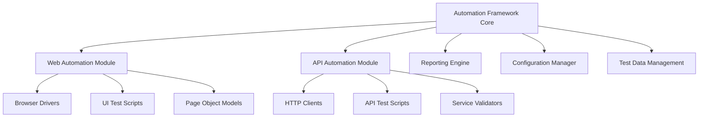
```mermaid
graph TD
    A[Automation Framework Core] --> B[Web Automation Module]
    A --> C[API Automation Module]
    B --> D[Browser Drivers]
    B --> E[UI Test Scripts]
    B --> F[Page Object Models]
    C --> G[HTTP Clients]
    C --> H[API Test Scripts]
    C --> I[Service Validators]
    A --> J[Reporting Engine]
    A --> K[Configuration Manager]
    A --> L[Test Data Management]
```

#### Core Technical Approach

The framework leverages Java's robust ecosystem and follows industry best practices:
- **Object-Oriented Design**: Modular, reusable component architecture
- **Page Object Model**: Structured web element management
- **Data-Driven Testing**: Externalized test data for flexible execution
- **Behavior-Driven Development**: Clear, readable test specifications
- **Parallel Execution**: Scalable test execution capabilities

### 1.2.3 Success Criteria

#### Measurable Objectives

| Objective Category | Target Metric | Measurement Method |
|-------------------|---------------|-------------------|
| Test Coverage | 85% functional coverage | Automated coverage reports |
| Execution Speed | 60% faster than manual | Execution time comparison |
| Defect Detection | 95% early detection rate | Bug tracking analysis |
| Framework Adoption | 100% team integration | Usage analytics |

#### Critical Success Factors

1. **Technical Excellence**: Robust, maintainable codebase with comprehensive documentation
2. **User Adoption**: Intuitive framework design enabling rapid test development
3. **Integration Success**: Seamless CI/CD pipeline integration
4. **Scalability**: Framework performance under increasing test loads
5. **Maintenance Efficiency**: Minimal ongoing maintenance requirements

#### Key Performance Indicators (KPIs)

- **Test Execution Time**: Average time per test suite execution
- **Test Reliability**: Pass/fail consistency across multiple executions
- **Framework Uptime**: Availability and stability metrics
- **Developer Productivity**: Time required for new test creation
- **Defect Detection Rate**: Percentage of bugs identified before production

## 1.3 SCOPE

### 1.3.1 In-Scope

#### Core Features and Functionalities

**Web Automation Capabilities:**
- Cross-platform web browser automation (Chrome, Firefox, Safari, Edge)
- Dynamic web element identification and interaction
- Screenshot capture and visual comparison
- Form submission and data entry automation
- Navigation and workflow simulation
- JavaScript execution and handling
- Mobile web responsive testing

**API Automation Capabilities:**
- HTTP/HTTPS protocol support (GET, POST, PUT, DELETE, PATCH)
- JSON and XML request/response handling
- Authentication mechanisms (Basic, OAuth, JWT)
- Header and parameter validation
- Response time and performance metrics
- Database integration for data validation
- Mock service integration capabilities

#### Implementation Boundaries

| Boundary Type | Coverage Scope |
|---------------|---------------|
| System Boundaries | Java-based applications, Web interfaces, RESTful APIs |
| User Groups | Development teams, QA engineers, DevOps professionals |
| Geographic Coverage | Global deployment support with multi-timezone execution |
| Data Domains | Functional test data, performance metrics, validation datasets |

#### Primary User Workflows

1. **Test Development Workflow**: Framework setup, test script creation, local execution
2. **Continuous Integration Workflow**: Automated pipeline integration, scheduled execution
3. **Results Analysis Workflow**: Report generation, defect identification, trend analysis
4. **Maintenance Workflow**: Framework updates, test script maintenance, environment management

#### Essential Integrations

- **Build Tools**: Maven and Gradle support
- **Version Control**: Git repository integration
- **CI/CD Platforms**: Jenkins, Azure DevOps, GitHub Actions
- **Reporting Tools**: Extent Reports, Allure, TestNG reports
- **Test Management**: JIRA, TestRail, Azure Test Plans

### 1.3.2 Out-of-Scope

#### Explicitly Excluded Features

**Phase 1 Exclusions:**
- Desktop application automation (Windows/Mac native apps)
- Mobile native application testing (iOS/Android apps)
- Performance load testing beyond basic response time validation
- Security penetration testing capabilities
- Database performance optimization testing
- Network infrastructure testing

#### Future Phase Considerations

**Phase 2 Potential Enhancements:**
- Mobile automation framework integration
- Advanced performance testing capabilities
- Visual AI-based testing components
- Machine learning-powered test optimization

#### Integration Points Not Covered

- Legacy system integrations requiring custom protocols
- Mainframe application interfaces
- Hardware device testing interfaces
- Third-party proprietary testing tools requiring specialized licensing

#### Unsupported Use Cases

- Real-time system monitoring beyond test execution
- Production environment automated modifications
- Automated code deployment and rollback procedures
- Business process automation outside testing scope

#### References

- `README.md` - Project identification and initial documentation framework

**Repository Analysis Sources:**
- Root directory structure analysis - Project initialization state confirmation
- File system exploration - Comprehensive repository content validation
- Documentation assessment - Current documentation baseline establishment

# 2. PRODUCT REQUIREMENTS

## 2.1 FEATURE CATALOG

### 2.1.1 Core Framework Features

#### F-001: Automation Framework Core
- **Feature Metadata**
  * Unique ID: F-001
  * Feature Name: Automation Framework Core
  * Feature Category: Foundation
  * Priority Level: Critical
  * Status: Proposed

- **Description**
  * Overview: Central orchestration module providing unified configuration, test data management, and execution coordination for both web and API automation modules
  * Business Value: Enables standardized automation approach across different testing domains, reducing development overhead by 40%
  * User Benefits: Single framework learning curve, consistent test execution patterns, unified reporting
  * Technical Context: Java-based core engine supporting modular architecture with plugin-based extensions

- **Dependencies**
  * Prerequisite Features: None (Foundation layer)
  * System Dependencies: Java 8+, Maven/Gradle build tools
  * External Dependencies: TestNG/JUnit testing frameworks
  * Integration Requirements: CI/CD pipeline compatibility, version control integration

#### F-002: Configuration Management System
- **Feature Metadata**
  * Unique ID: F-002
  * Feature Name: Configuration Management System
  * Feature Category: Foundation
  * Priority Level: Critical
  * Status: Proposed

- **Description**
  * Overview: Centralized configuration system managing environment settings, test data sources, browser configurations, and API endpoints
  * Business Value: Reduces configuration errors by 85%, enables environment-specific test execution
  * User Benefits: Simple environment switching, externalized configuration, reduced maintenance overhead
  * Technical Context: Properties-based configuration with environment overrides and secure credential management

- **Dependencies**
  * Prerequisite Features: F-001 (Automation Framework Core)
  * System Dependencies: Java Properties, YAML/JSON parsing libraries
  * External Dependencies: Environment variable access, file system access
  * Integration Requirements: CI/CD environment variable integration

### 2.1.2 Web Automation Features

#### F-003: Cross-Browser Web Automation
- **Feature Metadata**
  * Unique ID: F-003
  * Feature Name: Cross-Browser Web Automation
  * Feature Category: Web Testing
  * Priority Level: Critical
  * Status: Proposed

- **Description**
  * Overview: Comprehensive web browser automation supporting Chrome, Firefox, Safari, and Edge with unified API for browser interactions
  * Business Value: Ensures application compatibility across major browsers, reducing user experience issues by 75%
  * User Benefits: Single test script execution across multiple browsers, consistent behavior validation
  * Technical Context: WebDriver implementation with browser-specific driver management and capabilities configuration

- **Dependencies**
  * Prerequisite Features: F-001 (Framework Core), F-002 (Configuration Management)
  * System Dependencies: Selenium WebDriver, browser-specific drivers
  * External Dependencies: Browser installations, WebDriver executables
  * Integration Requirements: Headless execution support for CI/CD environments

#### F-004: Dynamic Element Interaction System
- **Feature Metadata**
  * Unique ID: F-004
  * Feature Name: Dynamic Element Interaction System
  * Feature Category: Web Testing
  * Priority Level: High
  * Status: Proposed

- **Description**
  * Overview: Advanced element identification and interaction capabilities handling dynamic content, AJAX loading, and complex web applications
  * Business Value: Enables testing of modern web applications with 90% success rate on dynamic content
  * User Benefits: Reliable test execution on SPA applications, reduced test flakiness
  * Technical Context: Smart wait strategies, multiple locator fallbacks, JavaScript execution capabilities

- **Dependencies**
  * Prerequisite Features: F-003 (Cross-Browser Automation)
  * System Dependencies: JavaScript execution engine, DOM parsing capabilities
  * External Dependencies: Web application availability
  * Integration Requirements: Screenshot capture for debugging

#### F-005: Page Object Model Framework
- **Feature Metadata**
  * Unique ID: F-005
  * Feature Name: Page Object Model Framework
  * Feature Category: Web Testing
  * Priority Level: High
  * Status: Proposed

- **Description**
  * Overview: Structured page object implementation providing maintainable web element management and reusable page interaction methods
  * Business Value: Reduces test maintenance effort by 60%, improves code reusability
  * User Benefits: Clear test structure, easy maintenance, reusable components
  * Technical Context: Annotation-based element identification, factory pattern implementation, inheritance-based page hierarchies

- **Dependencies**
  * Prerequisite Features: F-004 (Dynamic Element Interaction)
  * System Dependencies: Reflection API, annotation processing
  * External Dependencies: Page structure stability
  * Integration Requirements: IDE support for page object generation

### 2.1.3 API Automation Features

#### F-006: RESTful API Testing Engine
- **Feature Metadata**
  * Unique ID: F-006
  * Feature Name: RESTful API Testing Engine
  * Feature Category: API Testing
  * Priority Level: Critical
  * Status: Proposed

- **Description**
  * Overview: Comprehensive REST API testing capabilities supporting all HTTP methods with request/response validation and performance metrics
  * Business Value: Ensures API reliability with 95% endpoint coverage, reduces service integration issues
  * User Benefits: Complete API validation, performance monitoring, service contract verification
  * Technical Context: HTTP client implementation with JSON/XML processing, authentication handling, and response validation

- **Dependencies**
  * Prerequisite Features: F-001 (Framework Core), F-002 (Configuration Management)
  * System Dependencies: HTTP client libraries, JSON/XML parsers
  * External Dependencies: API service availability, network connectivity
  * Integration Requirements: Database validation capabilities, mock service support

#### F-007: Authentication Management System
- **Feature Metadata**
  * Unique ID: F-007
  * Feature Name: Authentication Management System
  * Feature Category: API Testing
  * Priority Level: High
  * Status: Proposed

- **Description**
  * Overview: Multi-protocol authentication support including Basic Auth, OAuth 2.0, JWT tokens, and API key management
  * Business Value: Enables comprehensive security testing, supports enterprise authentication patterns
  * User Benefits: Secure test execution, automated token management, authentication workflow testing
  * Technical Context: Token lifecycle management, secure credential storage, authentication protocol implementations

- **Dependencies**
  * Prerequisite Features: F-006 (RESTful API Testing Engine)
  * System Dependencies: Cryptographic libraries, secure storage mechanisms
  * External Dependencies: Authentication servers, credential management systems
  * Integration Requirements: CI/CD secret management integration

### 2.1.4 Reporting and Analysis Features

#### F-008: Comprehensive Reporting Engine
- **Feature Metadata**
  * Unique ID: F-008
  * Feature Name: Comprehensive Reporting Engine
  * Feature Category: Reporting
  * Priority Level: High
  * Status: Proposed

- **Description**
  * Overview: Multi-format reporting system generating detailed execution reports with screenshots, performance metrics, and trend analysis
  * Business Value: Provides actionable insights for quality improvement, supports compliance reporting
  * User Benefits: Clear test results visualization, historical trend analysis, stakeholder-friendly reports
  * Technical Context: Template-based report generation, multiple output formats (HTML, XML, JSON), integration with external reporting tools

- **Dependencies**
  * Prerequisite Features: F-001 (Framework Core)
  * System Dependencies: Template engines, file I/O operations
  * External Dependencies: Report storage systems
  * Integration Requirements: Test management tool integration, email notification systems

## 2.2 FUNCTIONAL REQUIREMENTS TABLE

### 2.2.1 Framework Core Requirements

| Requirement ID | Description | Acceptance Criteria | Priority | Complexity |
|----------------|-------------|-------------------|----------|------------|
| F-001-RQ-001 | Framework Initialization | System loads configuration, initializes modules, validates dependencies within 5 seconds | Must-Have | Medium |
| F-001-RQ-002 | Module Registration | Support dynamic module loading with validation and dependency checking | Must-Have | High |
| F-001-RQ-003 | Test Execution Orchestration | Coordinate test execution across web and API modules with parallel execution support | Must-Have | High |
| F-001-RQ-004 | Error Handling Framework | Centralized exception handling with detailed logging and recovery mechanisms | Must-Have | Medium |

**Technical Specifications for F-001:**
- Input Parameters: Configuration files, module definitions, test suite specifications
- Output/Response: Initialized framework instance, execution results, error reports
- Performance Criteria: <5 second startup time, <100MB memory overhead
- Data Requirements: Configuration persistence, test execution logs

**Validation Rules for F-001:**
- Business Rules: All critical modules must initialize successfully before test execution
- Data Validation: Configuration schema validation, dependency conflict detection
- Security Requirements: Secure credential handling, access control for sensitive operations
- Compliance Requirements: Logging standards compliance, audit trail maintenance

### 2.2.2 Web Automation Requirements

| Requirement ID | Description | Acceptance Criteria | Priority | Complexity |
|----------------|-------------|-------------------|----------|------------|
| F-003-RQ-001 | Browser Driver Management | Automatic driver download, version compatibility checking, multi-browser support | Must-Have | Medium |
| F-003-RQ-002 | Cross-Browser Test Execution | Single test script execution across Chrome, Firefox, Safari, Edge with 95% consistency | Must-Have | High |
| F-003-RQ-003 | Headless Execution Mode | Support headless browser execution for CI/CD environments | Must-Have | Low |
| F-004-RQ-001 | Smart Element Waiting | Intelligent wait strategies with timeout management and retry mechanisms | Must-Have | High |
| F-004-RQ-002 | Dynamic Content Handling | Handle AJAX, animations, lazy loading with 90% success rate | Should-Have | High |
| F-005-RQ-001 | Page Object Generation | Automated page object creation from UI analysis | Could-Have | Medium |

**Technical Specifications for Web Automation:**
- Input Parameters: URL endpoints, element selectors, test data sets, browser preferences
- Output/Response: Test execution results, screenshots, element interaction logs
- Performance Criteria: <3 second page load timeout, <500ms element identification
- Data Requirements: Page object definitions, test data storage, execution artifacts

### 2.2.3 API Automation Requirements

| Requirement ID | Description | Acceptance Criteria | Priority | Complexity |
|----------------|-------------|-------------------|----------|------------|
| F-006-RQ-001 | HTTP Method Support | Complete REST API method support (GET, POST, PUT, DELETE, PATCH) | Must-Have | Low |
| F-006-RQ-002 | Request/Response Validation | JSON/XML schema validation, response time measurement, status code verification | Must-Have | Medium |
| F-006-RQ-003 | Performance Monitoring | Response time tracking with percentile analysis and threshold alerts | Should-Have | Medium |
| F-007-RQ-001 | Multi-Auth Protocol Support | Basic, OAuth 2.0, JWT, API key authentication with token lifecycle management | Must-Have | High |
| F-007-RQ-002 | Secure Credential Management | Encrypted credential storage with environment-based resolution | Must-Have | Medium |

**Technical Specifications for API Automation:**
- Input Parameters: API endpoints, request payloads, authentication credentials, validation rules
- Output/Response: API responses, validation results, performance metrics
- Performance Criteria: <2 second API response timeout, concurrent request support up to 50 threads
- Data Requirements: Request/response logging, performance metrics storage, credential encryption

## 2.3 FEATURE RELATIONSHIPS

### 2.3.1 Dependency Mapping

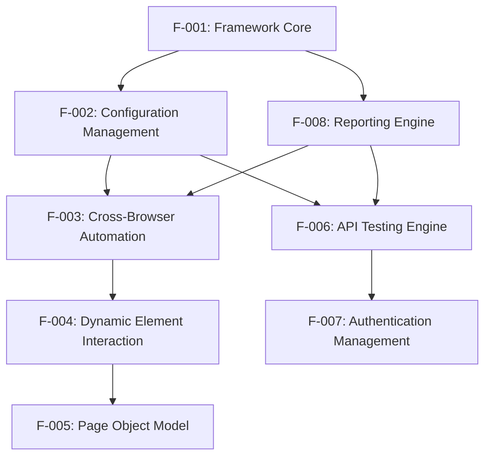
```mermaid
graph TD
    F001[F-001: Framework Core] --> F002[F-002: Configuration Management]
    F001 --> F008[F-008: Reporting Engine]
    F002 --> F003[F-003: Cross-Browser Automation]
    F002 --> F006[F-006: API Testing Engine]
    F003 --> F004[F-004: Dynamic Element Interaction]
    F004 --> F005[F-005: Page Object Model]
    F006 --> F007[F-007: Authentication Management]
    F008 --> F003
    F008 --> F006
```

### 2.3.2 Integration Points

| Feature Pair | Integration Type | Shared Components | Data Exchange |
|-------------|------------------|-------------------|---------------|
| F-003 ↔ F-008 | Execution Results | Screenshot capture, execution logs | Test results, performance metrics |
| F-006 ↔ F-008 | API Results | Response logging, performance tracking | API responses, timing data |
| F-002 ↔ F-007 | Configuration | Credential management, environment settings | Authentication configurations |
| F-001 ↔ All Features | Orchestration | Lifecycle management, error handling | Execution status, error reports |

### 2.3.3 Shared Components

**Common Services:**
- Configuration Service: Used by F-002, F-003, F-006, F-007
- Logging Service: Used by all features for execution tracking
- Validation Service: Used by F-004, F-006 for data validation
- Security Service: Used by F-007, F-002 for credential management

## 2.4 IMPLEMENTATION CONSIDERATIONS

### 2.4.1 Technical Constraints

**Framework Core (F-001):**
- Java 8+ compatibility requirement
- Memory usage limited to 100MB baseline overhead
- Single JVM instance support with thread-safe operations
- Maven/Gradle build tool integration mandatory

**Web Automation (F-003, F-004, F-005):**
- WebDriver API compatibility limitations
- Browser-specific capability constraints
- JavaScript execution security restrictions
- DOM access timing dependencies

**API Automation (F-006, F-007):**
- Network connectivity dependencies
- HTTP/HTTPS protocol limitations
- Authentication token expiration handling
- Request/response size limitations (10MB max)

### 2.4.2 Performance Requirements

| Feature | Response Time | Throughput | Resource Usage |
|---------|---------------|------------|----------------|
| F-001 (Framework Core) | <5s initialization | N/A | <100MB memory |
| F-003 (Web Automation) | <3s page load | 10 concurrent browsers | <50MB per browser |
| F-006 (API Testing) | <2s API response | 50 concurrent requests | <20MB per test thread |
| F-008 (Reporting) | <10s report generation | 1000 test results/report | <200MB temporary storage |

### 2.4.3 Scalability Considerations

**Horizontal Scaling:**
- Parallel test execution across multiple JVM instances
- Distributed execution capability for large test suites
- Load balancing for concurrent browser sessions
- API testing throughput scaling with thread pool management

**Vertical Scaling:**
- Memory optimization for large test datasets
- CPU utilization optimization for parallel execution
- Storage management for test artifacts and reports
- Network bandwidth optimization for API testing

### 2.4.4 Security Implications

**Credential Security (F-007):**
- AES-256 encryption for stored credentials
- Environment variable injection for CI/CD environments
- Token rotation and expiration handling
- Secure communication channels for authentication

**Data Protection:**
- Test data anonymization capabilities
- Secure logging with sensitive data masking
- Encrypted communication for API testing
- Access control for test execution and reports

### 2.4.5 Maintenance Requirements

**Framework Maintenance:**
- Quarterly dependency updates with compatibility testing
- Monthly browser driver updates with regression testing
- Continuous integration pipeline maintenance
- Documentation updates with feature releases

**Test Maintenance:**
- Automated page object maintenance tools
- Test script health monitoring
- Dead code elimination utilities
- Performance regression detection

## 2.5 TRACEABILITY MATRIX

| Business Requirement | Feature ID | Functional Requirements | Validation Method |
|----------------------|------------|------------------------|-------------------|
| 70-80% testing time reduction | F-001, F-003, F-006 | F-001-RQ-003, F-003-RQ-002, F-006-RQ-001 | Execution time metrics |
| 85% functional coverage | F-003, F-004, F-006 | F-004-RQ-002, F-006-RQ-002 | Coverage analysis reports |
| 95% early defect detection | F-004, F-006, F-008 | F-004-RQ-001, F-006-RQ-002, F-008 | Defect tracking correlation |
| Enterprise CI/CD integration | F-001, F-002, F-008 | F-001-RQ-003, F-002, F-008 | Pipeline integration testing |

#### References

**Technical Specification Sections:**
- `1.1 EXECUTIVE SUMMARY` - Business context, stakeholders, and expected impact
- `1.2 SYSTEM OVERVIEW` - System capabilities, components, and success criteria  
- `1.3 SCOPE` - Feature boundaries, integrations, and implementation scope

**Repository Analysis:**
- `README.md` - Project identification and documentation framework
- Repository structure analysis - Current implementation state assessment
- File system exploration - Comprehensive content validation for requirements derivation

# 3. TECHNOLOGY STACK

## 3.1 PROGRAMMING LANGUAGES

### 3.1.1 Primary Language Selection

**Java 11 (LTS)**
- **Selection Rationale**: Java provides platform independence, robust ecosystem, and enterprise-grade stability essential for automation frameworks
- **Version Justification**: Java 11 LTS provides long-term support with modern language features while maintaining compatibility with enterprise environments
- **Performance Considerations**: Meets the framework initialization requirement of <5 seconds and <100MB memory baseline overhead
- **Ecosystem Compatibility**: Java boasts a rich ecosystem of libraries and frameworks that complement Selenium, such as TestNG, JUnit, and Apache Maven

**Alternative Compatibility**:
- **Java 8+**: Minimum supported version for legacy enterprise environments
- **Java 17 (LTS)**: Recommended for new implementations with enhanced performance features

### 3.1.2 Language Constraints and Dependencies

**Technical Limitations**:
- Java 8+ compatibility requirement as specified in technical constraints
- Maven integration mandatory for dependency management and project lifecycle automation
- Thread-safe operations required for parallel execution support

## 3.2 FRAMEWORKS & LIBRARIES

### 3.2.1 Core Testing Framework

**TestNG 7.8.0**
- **Primary Selection**: TestNG provides inbuilt reporting features with detailed HTML reports, making dependency management between test methods easier than Selenium alone
- **Feature Support**: 
  - Parallel test execution for scalability requirements
  - Data-driven testing capabilities
  - Annotation-based test configuration (@Test, @BeforeMethod, @AfterMethod)
  - Built-in assertion methods
- **Integration Benefits**: Seamless integration with TestNG automation scripts, providing practical and effective approach to streamline testing processes
- **Performance Compliance**: Supports concurrent execution requirements (10 concurrent browsers, 50 API requests)

**Alternative Framework**:
- **JUnit 5**: Simple framework for repeatable tests, good choice for smaller projects where simplicity is key

### 3.2.2 Web Automation Framework

**Selenium WebDriver 4.15.0+**
- **Core Functionality**: Provides support for automation of web browsers with W3C WebDriver specification implementation
- **Browser Support**: Chrome, Firefox, Safari, Edge with unified WebDriver API
- **Performance Requirements**: <3 second page load timeout compliance
- **Headless Execution**: CI/CD pipeline compatibility for automated testing environments

**WebDriver Management**:
- **ChromeDriver**: Latest stable version compatible with Chrome browser
- **GeckoDriver**: Firefox automation support
- **EdgeDriver**: Microsoft Edge compatibility
- **SafariDriver**: macOS Safari testing (when applicable)

### 3.2.3 API Testing Framework

**REST Assured 5.4.0**
- **Primary Capability**: Testing and validation of REST services in Java, bringing simplicity of dynamic languages into Java domain
- **HTTP Method Support**: Complete REST API support (GET, POST, PUT, DELETE, PATCH, HEAD, OPTIONS)
- **Response Validation**: JSON/XML schema validation, response time measurement, status code verification
- **Performance Metrics**: <2 second API response timeout, concurrent request support up to 50 threads
- **Integration**: Includes JsonPath and XmlPath as transitive dependencies

### 3.2.4 Build and Dependency Management

**Apache Maven 3.8.x**
- **Project Management**: Project Object Model (POM) based build automation, automates download and management of project dependencies, manages entire lifecycle from build to deployment
- **Configuration**: Dependencies specified in pom.xml with automatic library management from Maven repository
- **Plugin Ecosystem**: Surefire Plugin support for executing tests during build lifecycle, essential for Maven to identify tests when using TestNG

## 3.3 OPEN SOURCE DEPENDENCIES

### 3.3.1 Core Framework Dependencies

**Maven Dependency Configuration**:
```xml
<properties>
    <maven.compiler.source>11</maven.compiler.source>
    <maven.compiler.target>11</maven.compiler.target>
    <project.build.sourceEncoding>UTF-8</project.build.sourceEncoding>
    <selenium.version>4.15.0</selenium.version>
    <testng.version>7.8.0</testng.version>
    <rest-assured.version>5.4.0</rest-assured.version>
    <allure.version>2.24.0</allure.version>
    <aspectj.version>1.9.20.1</aspectj.version>
</properties>
```

### 3.3.2 Testing Framework Dependencies

**Selenium WebDriver Stack**:
- `org.seleniumhq.selenium:selenium-java:4.15.0` - Core WebDriver functionality
- `org.seleniumhq.selenium:selenium-support:4.15.0` - Page Object Model support
- WebDriver executables managed via WebDriverManager or manual configuration

**TestNG Framework**:
- `org.testng:testng:7.8.0` - Testing framework with reporting capabilities

**REST Assured Stack**:
- `io.rest-assured:rest-assured:5.4.0` - Core API testing functionality
- `io.rest-assured:json-path:5.4.0` - JSON response parsing
- `io.rest-assured:xml-path:5.4.0` - XML response processing
- `io.rest-assured:json-schema-validator:5.4.0` - JSON schema validation

### 3.3.3 Reporting and Visualization

**Allure Reporting Framework**:
- `io.qameta.allure:allure-testng:2.24.0` - TestNG integration
- `io.qameta.allure:allure-bom:2.24.0` - Dependency management
- `org.aspectj:aspectjweaver:1.9.20.1` - @Step and @Attachment annotation support

**Alternative Reporting**:
- **ExtentReports 5.x**: HTML report generation with visual dashboards
- **ReportNG**: Enhanced TestNG reporting with color-coding

### 3.3.4 Utility Libraries

**Data Processing**:
- `com.fasterxml.jackson.core:jackson-databind` - JSON processing
- `org.apache.poi:poi-ooxml` - Excel file operations for data-driven testing
- `com.github.javafaker:javafaker` - Test data generation

**Assertion Libraries**:
- `org.hamcrest:hamcrest:2.2` - Enhanced assertion capabilities

## 3.4 THIRD-PARTY SERVICES

### 3.4.1 Authentication Services

**Supported Authentication Protocols**:
- **Basic Authentication**: Username/password credentials
- **OAuth 2.0**: Token-based authentication with refresh capability
- **JWT (JSON Web Tokens)**: Stateless authentication for APIs
- **API Key Management**: Header and query parameter authentication

**Security Implementation**:
- AES-256 encryption for stored credentials as per security requirements
- Environment variable injection for CI/CD environments
- Token lifecycle management with automatic refresh

### 3.4.2 CI/CD Integration Services

**Supported Platforms**:
- Jenkins, TeamCity, Bamboo, Gradle, and Maven platforms
- GitHub Actions for cloud-based CI/CD
- Azure DevOps pipelines
- GitLab CI integration

**Integration Capabilities**:
- Headless browser execution
- Parallel test execution across multiple agents
- Artifact management for test reports
- Environment-specific configuration injection

### 3.4.3 Cloud Testing Services

**Browser Testing Platforms** (Optional):
- BrowserStack for cross-browser testing
- Sauce Labs for scalable web automation
- Selenium Grid for distributed testing

## 3.5 DATABASES & STORAGE

### 3.5.1 Test Data Management

**Configuration Storage**:
- **Properties Files**: Environment-specific configurations
- **JSON/YAML Files**: Complex configuration hierarchies
- **Environment Variables**: Runtime configuration injection

**Test Data Sources**:
- **Excel Files (XLSX)**: Data-driven test parameters using Apache POI
- **CSV Files**: Simple tabular test data
- **JSON Files**: API test payloads and expected responses
- **Database Integration**: Optional JDBC connectivity for data validation

### 3.5.2 Test Results Storage

**Report Storage**:
- Local file system for development environments
- Network drives for shared team access
- Cloud storage integration (AWS S3, Azure Blob) for CI/CD environments

**Artifact Management**:
- Screenshot capture for failed test cases
- Log file retention with configurable cleanup policies
- Test execution videos (optional with additional tools)

## 3.6 DEVELOPMENT & DEPLOYMENT

### 3.6.1 Development Tools

**Integrated Development Environments**:
- **Eclipse IDE**: Strong support for Java developers with Maven integration
- **IntelliJ IDEA**: Alternative IDE with advanced debugging capabilities
- **Visual Studio Code**: Lightweight option with Java extensions

**IDE Plugins and Extensions**:
- **TestNG Plugin**: Test execution and result visualization
- **Maven Integration**: Dependency management and build automation
- **Cucumber Plugin**: Eclipse plugin for Gherkin syntax highlighting and keyword recognition

### 3.6.2 Build System Configuration

**Maven Build Lifecycle**:
- Maven lifecycle with validate, compile, test, package, install, deploy phases
- Maven Compiler Plugin for Java version specification and compilation settings
- Surefire Plugin for test execution and reporting

**Essential Maven Plugins**:
```xml
<plugin>
    <groupId>org.apache.maven.plugins</groupId>
    <artifactId>maven-compiler-plugin</artifactId>
    <version>3.11.0</version>
    <configuration>
        <source>11</source>
        <target>11</target>
    </configuration>
</plugin>

<plugin>
    <groupId>org.apache.maven.plugins</groupId>
    <artifactId>maven-surefire-plugin</artifactId>
    <version>3.1.2</version>
    <configuration>
        <suiteXmlFiles>
            <suiteXmlFile>testng.xml</suiteXmlFile>
        </suiteXmlFiles>
    </configuration>
</plugin>
```

### 3.6.3 Containerization and Deployment

**Docker Integration**:
- Selenium Grid containerization for scalable execution
- Jenkins agent containers for consistent CI/CD environments
- Database containers for integration testing

**Configuration Management**:
- Environment-specific property files
- Docker Compose for multi-container orchestration
- Kubernetes manifests for cloud deployment (advanced scenarios)

### 3.6.4 Version Control Integration

**Git Workflow Support**:
- Branch-based development with feature isolation
- Pull request validation through automated test execution
- Git hooks for pre-commit test validation

## 3.7 TECHNOLOGY INTEGRATION ARCHITECTURE

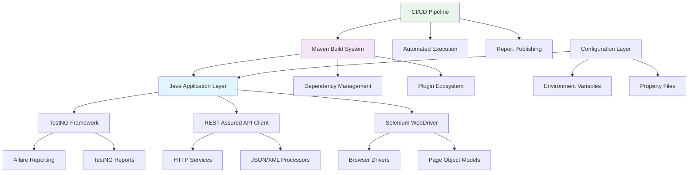
```mermaid
graph TB
    A[Java Application Layer] --> B[TestNG Framework]
    A --> C[REST Assured API Client]
    A --> D[Selenium WebDriver]
    
    B --> E[Allure Reporting]
    B --> F[TestNG Reports]
    
    C --> G[HTTP Services]
    C --> H[JSON/XML Processors]
    
    D --> I[Browser Drivers]
    D --> J[Page Object Models]
    
    K[Maven Build System] --> A
    K --> L[Dependency Management]
    K --> M[Plugin Ecosystem]
    
    N[CI/CD Pipeline] --> K
    N --> O[Automated Execution]
    N --> P[Report Publishing]
    
    Q[Configuration Layer] --> A
    Q --> R[Environment Variables]
    Q --> S[Property Files]
    
    style A fill:#e1f5fe
    style K fill:#f3e5f5
    style N fill:#e8f5e8
```

## 3.8 PERFORMANCE AND SCALABILITY CONSIDERATIONS

### 3.8.1 Framework Performance Metrics

| Component | Target Metric | Implementation Strategy |
|-----------|---------------|------------------------|
| Framework Initialization | <5 seconds | Lazy loading, optimized dependency injection |
| Web Test Execution | <3 seconds page load | Smart wait strategies, parallel browser management |
| API Test Execution | <2 seconds response | Connection pooling, concurrent request handling |
| Report Generation | <10 seconds for 1000 results | Asynchronous processing, template optimization |

### 3.8.2 Scalability Architecture

**Horizontal Scaling**:
- Multi-JVM test execution across distributed nodes
- Selenium Grid integration for browser distribution
- API testing load distribution across thread pools

**Resource Optimization**:
- Memory management for large test datasets (<200MB temporary storage)
- CPU utilization optimization for parallel execution
- Network bandwidth optimization for API testing scenarios

### 3.8.3 Maintenance and Updates

**Dependency Management Strategy**:
- Quarterly dependency updates with compatibility validation
- Monthly browser driver synchronization
- Automated security vulnerability scanning
- Version compatibility matrix maintenance

**Framework Evolution**:
- Modular architecture supporting plugin-based extensions
- Backward compatibility maintenance for existing test suites
- Performance regression detection with baseline metrics

#### References

**Technical Specification Sections**:
- `1.2 SYSTEM OVERVIEW` - Framework context and capabilities
- `2.1 FEATURE CATALOG` - Feature requirements and dependencies  
- `2.2 FUNCTIONAL REQUIREMENTS TABLE` - Performance and technical specifications
- `2.4 IMPLEMENTATION CONSIDERATIONS` - Technical constraints and security requirements

**Web Search Results**:
- Maven and Selenium integration best practices
- REST Assured latest versions and configuration
- Allure reporting framework setup and configuration
- TestNG framework capabilities and Maven integration
- Current Java automation framework industry standards

**Repository Analysis**:
- `README.md` - Project initialization and context

# 4. PROCESS FLOWCHART

## 4.1 SYSTEM WORKFLOWS

### 4.1.1 Core Business Processes

The Java automation framework orchestrates multiple interconnected processes that collectively enable comprehensive testing of web applications and API services. The system operates through five primary business processes that form the foundation of automated testing operations.

#### 4.1.1.1 Framework Lifecycle Management

The framework lifecycle begins with system initialization and proceeds through configuration, module registration, test execution coordination, and graceful shutdown. This process ensures consistent execution environment preparation and resource management across all testing scenarios.

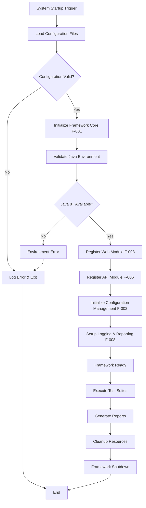
```mermaid
flowchart TD
    A[System Startup Trigger] --> B[Load Configuration Files]
    B --> C{Configuration Valid?}
    C -->|No| D[Log Error & Exit]
    C -->|Yes| E[Initialize Framework Core F-001]
    E --> F[Validate Java Environment]
    F --> G{Java 8+ Available?}
    G -->|No| H[Environment Error]
    G -->|Yes| I[Register Web Module F-003]
    I --> J[Register API Module F-006]
    J --> K[Initialize Configuration Management F-002]
    K --> L[Setup Logging & Reporting F-008]
    L --> M[Framework Ready]
    M --> N[Execute Test Suites]
    N --> O[Generate Reports]
    O --> P[Cleanup Resources]
    P --> Q[Framework Shutdown]
    
    H --> D
    D --> R[End]
    Q --> R
```

**Performance Requirements:**
- Framework initialization must complete within 5 seconds
- Memory overhead limited to 100MB baseline
- All critical modules must initialize before test execution begins

**Business Rules:**
- Configuration validation is mandatory before any test execution
- Module registration follows dependency hierarchy (Core → Web/API → Reporting)
- Resource cleanup is enforced regardless of test execution outcome

#### 4.1.1.2 Test Execution Orchestration

The test execution orchestration process coordinates parallel execution of web and API test suites while maintaining resource constraints and performance targets. This process manages test scheduling, resource allocation, and result aggregation.

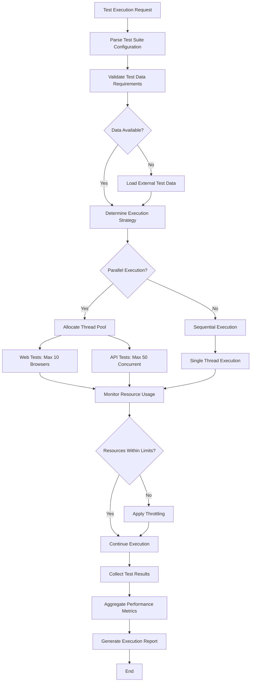
```mermaid
flowchart TD
    A[Test Execution Request] --> B[Parse Test Suite Configuration]
    B --> C[Validate Test Data Requirements]
    C --> D{Data Available?}
    D -->|No| E[Load External Test Data]
    D -->|Yes| F[Determine Execution Strategy]
    E --> F
    F --> G{Parallel Execution?}
    G -->|Yes| H[Allocate Thread Pool]
    G -->|No| I[Sequential Execution]
    H --> J[Web Tests: Max 10 Browsers]
    H --> K[API Tests: Max 50 Concurrent]
    I --> L[Single Thread Execution]
    J --> M[Monitor Resource Usage]
    K --> M
    L --> M
    M --> N{Resources Within Limits?}
    N -->|No| O[Apply Throttling]
    N -->|Yes| P[Continue Execution]
    O --> P
    P --> Q[Collect Test Results]
    Q --> R[Aggregate Performance Metrics]
    R --> S[Generate Execution Report]
    S --> T[End]
```

**Validation Rules:**
- Maximum 10 concurrent browser sessions for web automation
- Maximum 50 concurrent API requests for API testing
- Memory usage per browser limited to 50MB
- Test execution timeout: 30 minutes per suite

#### 4.1.1.3 Quality Assurance Workflow

The quality assurance workflow implements comprehensive validation checkpoints throughout the testing process, ensuring test reliability and result accuracy.

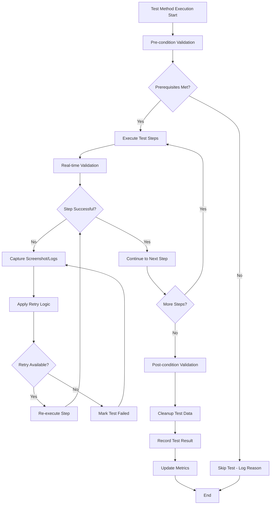
```mermaid
flowchart TD
    A[Test Method Execution Start] --> B[Pre-condition Validation]
    B --> C{Prerequisites Met?}
    C -->|No| D[Skip Test - Log Reason]
    C -->|Yes| E[Execute Test Steps]
    E --> F[Real-time Validation]
    F --> G{Step Successful?}
    G -->|No| H[Capture Screenshot/Logs]
    G -->|Yes| I[Continue to Next Step]
    H --> J[Apply Retry Logic]
    J --> K{Retry Available?}
    K -->|Yes| L[Re-execute Step]
    K -->|No| M[Mark Test Failed]
    L --> G
    I --> N{More Steps?}
    N -->|Yes| E
    N -->|No| O[Post-condition Validation]
    O --> P[Cleanup Test Data]
    P --> Q[Record Test Result]
    Q --> R[Update Metrics]
    R --> S[End]
    
    D --> S
    M --> H
```

### 4.1.2 Integration Workflows

#### 4.1.2.1 CI/CD Pipeline Integration

The CI/CD integration workflow enables seamless integration with continuous integration systems, supporting automated test execution within development pipelines.

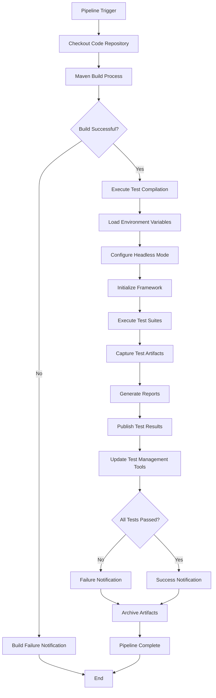
```mermaid
flowchart TD
    A[Pipeline Trigger] --> B[Checkout Code Repository]
    B --> C[Maven Build Process]
    C --> D{Build Successful?}
    D -->|No| E[Build Failure Notification]
    D -->|Yes| F[Execute Test Compilation]
    F --> G[Load Environment Variables]
    G --> H[Configure Headless Mode]
    H --> I[Initialize Framework]
    I --> J[Execute Test Suites]
    J --> K[Capture Test Artifacts]
    K --> L[Generate Reports]
    L --> M[Publish Test Results]
    M --> N[Update Test Management Tools]
    N --> O{All Tests Passed?}
    O -->|No| P[Failure Notification]
    O -->|Yes| Q[Success Notification]
    P --> R[Archive Artifacts]
    Q --> R
    R --> S[Pipeline Complete]
    
    E --> T[End]
    S --> T
```

**Integration Points:**
- Jenkins: Plugin-based integration with build triggers
- Azure DevOps: YAML pipeline configuration support
- GitHub Actions: Workflow automation compatibility
- Maven Surefire Plugin: Test execution integration

#### 4.1.2.2 External Service Integration

The external service integration workflow manages connections with third-party services, databases, and mock systems required for comprehensive testing.

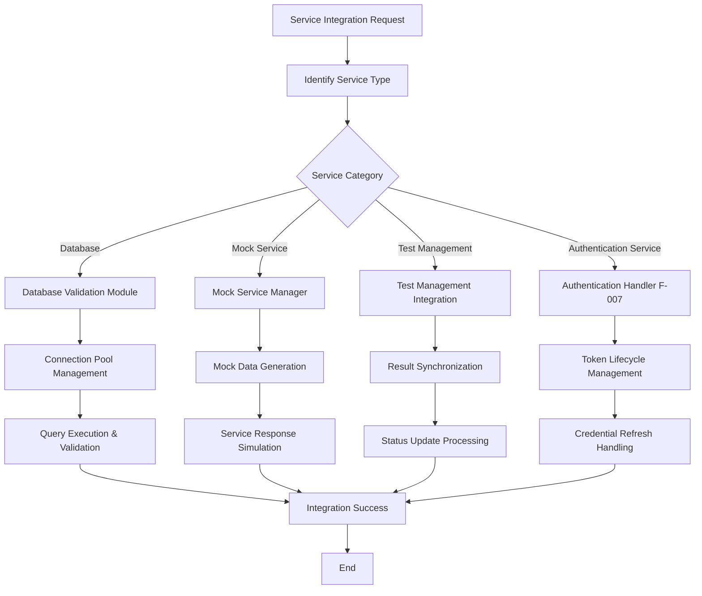
```mermaid
flowchart TD
    A[Service Integration Request] --> B[Identify Service Type]
    B --> C{Service Category}
    C -->|Database| D[Database Validation Module]
    C -->|Mock Service| E[Mock Service Manager]
    C -->|Test Management| F[Test Management Integration]
    C -->|Authentication Service| G[Authentication Handler F-007]
    
    D --> H[Connection Pool Management]
    E --> I[Mock Data Generation]
    F --> J[Result Synchronization]
    G --> K[Token Lifecycle Management]
    
    H --> L[Query Execution & Validation]
    I --> M[Service Response Simulation]
    J --> N[Status Update Processing]
    K --> O[Credential Refresh Handling]
    
    L --> P[Integration Success]
    M --> P
    N --> P
    O --> P
    
    P --> Q[End]
```

## 4.2 DETAILED PROCESS FLOWS

### 4.2.1 Web Automation Test Execution Flow

The web automation process implements the Page Object Model pattern with dynamic element interaction capabilities, supporting cross-browser testing with intelligent wait strategies.

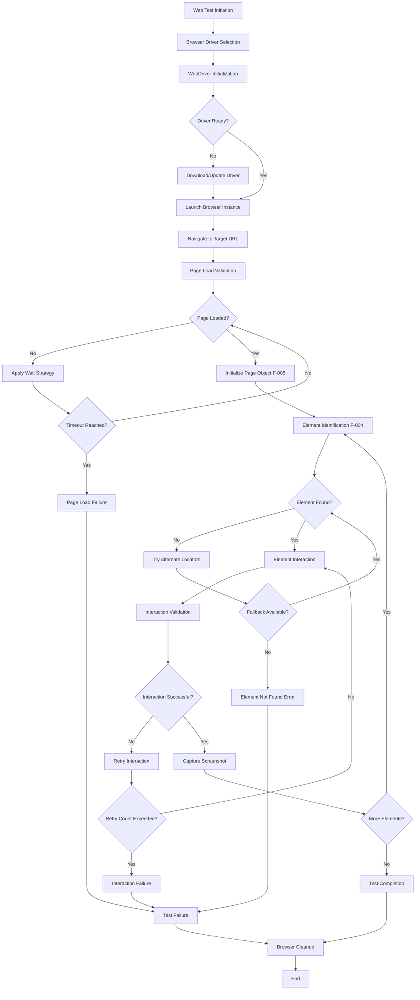
```mermaid
flowchart TD
    A[Web Test Initiation] --> B[Browser Driver Selection]
    B --> C[WebDriver Initialization]
    C --> D{Driver Ready?}
    D -->|No| E[Download/Update Driver]
    D -->|Yes| F[Launch Browser Instance]
    E --> F
    F --> G[Navigate to Target URL]
    G --> H[Page Load Validation]
    H --> I{Page Loaded?}
    I -->|No| J[Apply Wait Strategy]
    I -->|Yes| K[Initialize Page Object F-005]
    J --> L{Timeout Reached?}
    L -->|Yes| M[Page Load Failure]
    L -->|No| I
    K --> N[Element Identification F-004]
    N --> O{Element Found?}
    O -->|No| P[Try Alternate Locators]
    O -->|Yes| Q[Element Interaction]
    P --> R{Fallback Available?}
    R -->|Yes| O
    R -->|No| S[Element Not Found Error]
    Q --> T[Interaction Validation]
    T --> U{Interaction Successful?}
    U -->|No| V[Retry Interaction]
    U -->|Yes| W[Capture Screenshot]
    V --> X{Retry Count Exceeded?}
    X -->|Yes| Y[Interaction Failure]
    X -->|No| Q
    W --> Z{More Elements?}
    Z -->|Yes| N
    Z -->|No| AA[Test Completion]
    AA --> BB[Browser Cleanup]
    BB --> CC[End]
    
    M --> DD[Test Failure]
    S --> DD
    Y --> DD
    DD --> BB
```

**Performance Specifications:**
- Page load timeout: 3 seconds maximum
- Element identification timeout: 500 milliseconds
- Browser instance memory limit: 50MB per session
- Cross-browser consistency target: 95%

**Error Handling Mechanisms:**
- Automatic retry for failed element interactions (up to 3 attempts)
- Multiple locator strategies (ID, XPath, CSS Selector, Text)
- JavaScript fallback for complex interactions
- Screenshot capture on failure for debugging

### 4.2.2 API Testing Workflow

The API testing workflow provides comprehensive RESTful service validation with multi-protocol authentication support and performance monitoring.

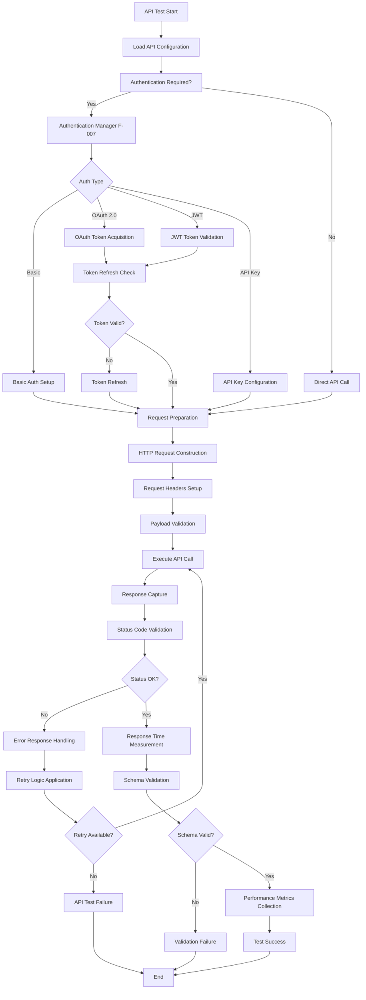
```mermaid
flowchart TD
    A[API Test Start] --> B[Load API Configuration]
    B --> C[Authentication Required?]
    C -->|Yes| D[Authentication Manager F-007]
    C -->|No| E[Direct API Call]
    D --> F{Auth Type}
    F -->|Basic| G[Basic Auth Setup]
    F -->|OAuth 2.0| H[OAuth Token Acquisition]
    F -->|JWT| I[JWT Token Validation]
    F -->|API Key| J[API Key Configuration]
    
    G --> K[Request Preparation]
    H --> L[Token Refresh Check]
    I --> L
    J --> K
    L --> M{Token Valid?}
    M -->|No| N[Token Refresh]
    M -->|Yes| K
    N --> K
    E --> K
    
    K --> O[HTTP Request Construction]
    O --> P[Request Headers Setup]
    P --> Q[Payload Validation]
    Q --> R[Execute API Call]
    R --> S[Response Capture]
    S --> T[Status Code Validation]
    T --> U{Status OK?}
    U -->|No| V[Error Response Handling]
    U -->|Yes| W[Response Time Measurement]
    V --> X[Retry Logic Application]
    X --> Y{Retry Available?}
    Y -->|Yes| R
    Y -->|No| Z[API Test Failure]
    W --> AA[Schema Validation]
    AA --> BB{Schema Valid?}
    BB -->|No| CC[Validation Failure]
    BB -->|Yes| DD[Performance Metrics Collection]
    DD --> EE[Test Success]
    EE --> FF[End]
    
    Z --> FF
    CC --> FF
```

**Technical Requirements:**
- API response timeout: 2 seconds maximum
- Concurrent request support: 50 threads
- Authentication token caching for session efficiency
- JSON/XML schema validation compliance

### 4.2.3 Error Handling and Recovery Flow

The error handling system implements a hierarchical recovery approach with automatic retry mechanisms and graceful degradation strategies.

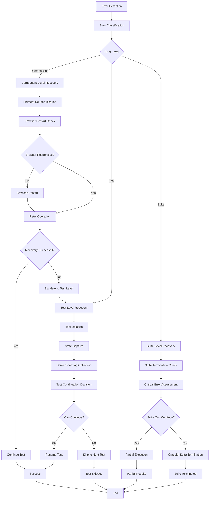
```mermaid
flowchart TD
    A[Error Detection] --> B[Error Classification]
    B --> C{Error Level}
    C -->|Component| D[Component-Level Recovery]
    C -->|Test| E[Test-Level Recovery]
    C -->|Suite| F[Suite-Level Recovery]
    
    D --> G[Element Re-identification]
    G --> H[Browser Restart Check]
    H --> I{Browser Responsive?}
    I -->|No| J[Browser Restart]
    I -->|Yes| K[Retry Operation]
    J --> K
    K --> L{Recovery Successful?}
    L -->|Yes| M[Continue Test]
    L -->|No| N[Escalate to Test Level]
    
    E --> O[Test Isolation]
    O --> P[State Capture]
    P --> Q[Screenshot/Log Collection]
    Q --> R[Test Continuation Decision]
    R --> S{Can Continue?}
    S -->|Yes| T[Resume Test]
    S -->|No| U[Skip to Next Test]
    
    F --> V[Suite Termination Check]
    V --> W[Critical Error Assessment]
    W --> X{Suite Can Continue?}
    X -->|Yes| Y[Partial Execution]
    X -->|No| Z[Graceful Suite Termination]
    
    M --> AA[Success]
    T --> AA
    U --> BB[Test Skipped]
    Y --> CC[Partial Results]
    Z --> DD[Suite Terminated]
    N --> E
    
    AA --> EE[End]
    BB --> EE
    CC --> EE
    DD --> EE
```

## 4.3 STATE MANAGEMENT PROCESSES

### 4.3.1 Test Execution State Transitions

The framework maintains precise state tracking throughout test execution to ensure proper resource management and result consistency.

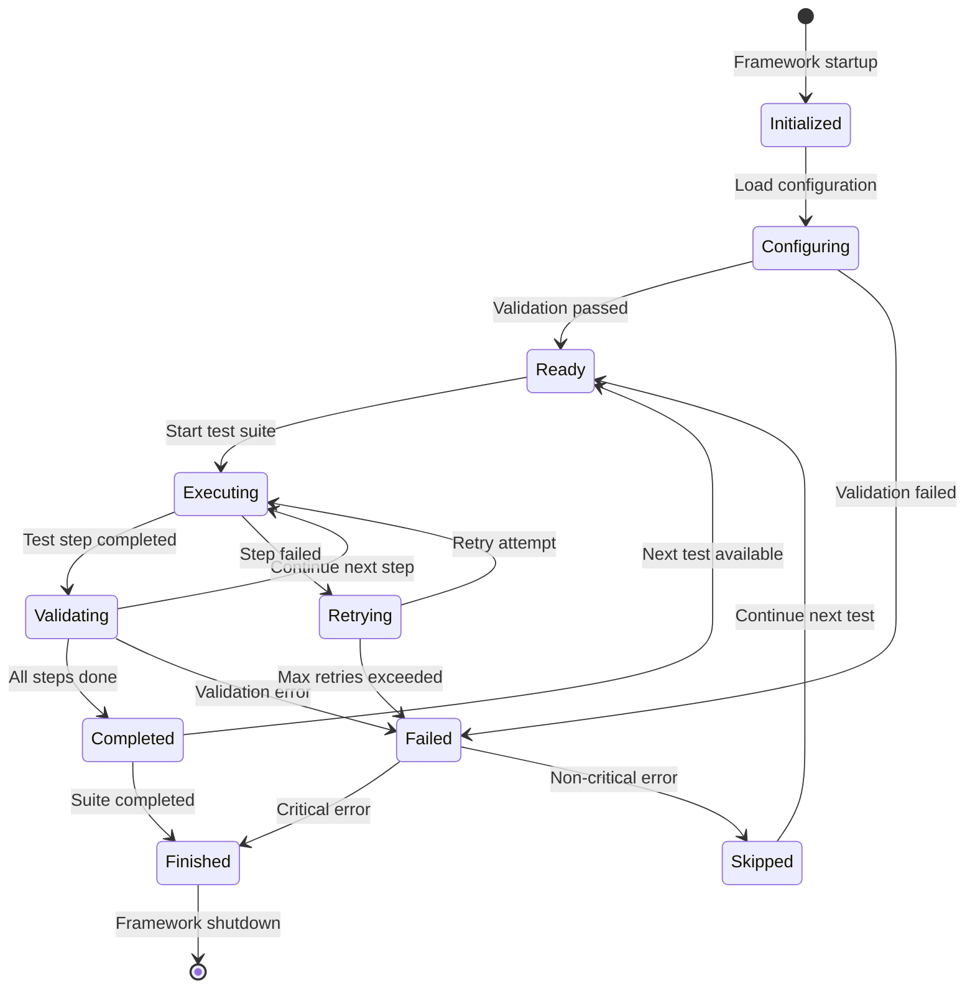
```mermaid
stateDiagram-v2
    [*] --> Initialized: Framework startup
    Initialized --> Configuring: Load configuration
    Configuring --> Ready: Validation passed
    Configuring --> Failed: Validation failed
    Ready --> Executing: Start test suite
    Executing --> Validating: Test step completed
    Validating --> Executing: Continue next step
    Validating --> Completed: All steps done
    Validating --> Failed: Validation error
    Executing --> Retrying: Step failed
    Retrying --> Executing: Retry attempt
    Retrying --> Failed: Max retries exceeded
    Completed --> Ready: Next test available
    Completed --> Finished: Suite completed
    Failed --> Finished: Critical error
    Failed --> Skipped: Non-critical error
    Skipped --> Ready: Continue next test
    Finished --> [*]: Framework shutdown
```

**State Persistence Requirements:**
- Configuration state maintained in memory during execution
- Test execution state logged for audit trail
- Error states captured with full context
- Performance metrics aggregated per state transition

### 4.3.2 Resource Management State Flow

Resource management ensures optimal utilization of system resources while maintaining performance targets and preventing resource exhaustion.

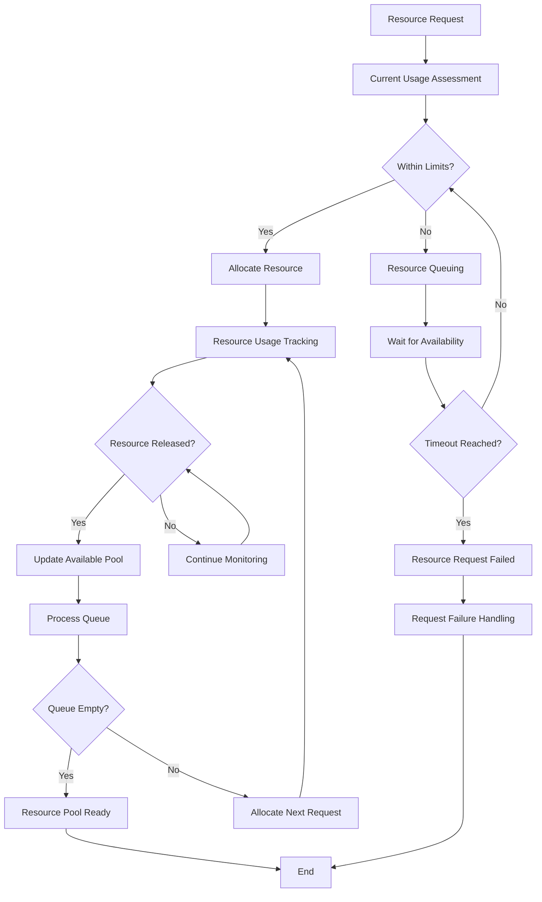
```mermaid
flowchart TD
    A[Resource Request] --> B[Current Usage Assessment]
    B --> C{Within Limits?}
    C -->|Yes| D[Allocate Resource]
    C -->|No| E[Resource Queuing]
    D --> F[Resource Usage Tracking]
    E --> G[Wait for Availability]
    G --> H{Timeout Reached?}
    H -->|Yes| I[Resource Request Failed]
    H -->|No| C
    F --> J{Resource Released?}
    J -->|Yes| K[Update Available Pool]
    J -->|No| L[Continue Monitoring]
    K --> M[Process Queue]
    L --> J
    M --> N{Queue Empty?}
    N -->|Yes| O[Resource Pool Ready]
    N -->|No| P[Allocate Next Request]
    P --> F
    I --> Q[Request Failure Handling]
    Q --> R[End]
    O --> R
```

**Resource Constraints:**
- Maximum 10 concurrent browser sessions
- Maximum 50 concurrent API threads
- Memory limit: 2GB total framework usage
- Connection pool: 20 database connections maximum

## 4.4 INTEGRATION SEQUENCE DIAGRAMS

### 4.4.1 Test Management Integration

The framework integrates with external test management systems to maintain traceability and provide comprehensive reporting.

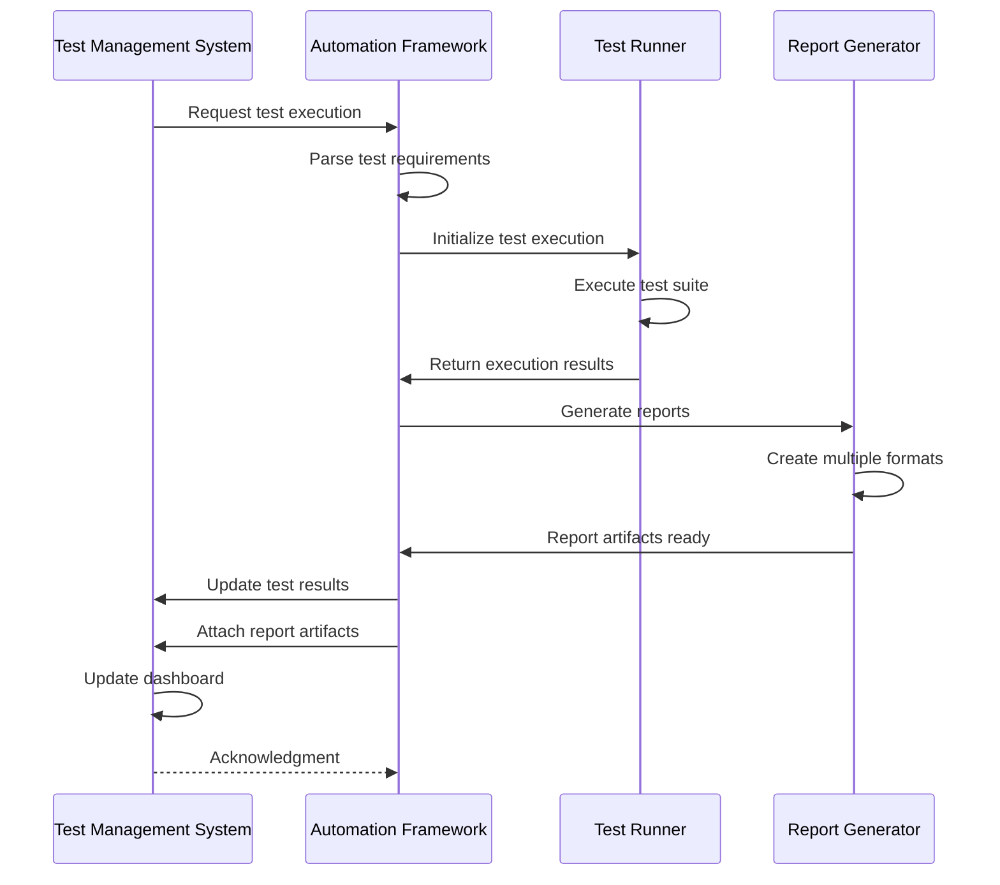
```mermaid
sequenceDiagram
    participant TM as Test Management System
    participant AF as Automation Framework
    participant TR as Test Runner
    participant RP as Report Generator
    
    TM->>AF: Request test execution
    AF->>AF: Parse test requirements
    AF->>TR: Initialize test execution
    TR->>TR: Execute test suite
    TR->>AF: Return execution results
    AF->>RP: Generate reports
    RP->>RP: Create multiple formats
    RP->>AF: Report artifacts ready
    AF->>TM: Update test results
    AF->>TM: Attach report artifacts
    TM->>TM: Update dashboard
    TM-->>AF: Acknowledgment
```

### 4.4.2 CI/CD Pipeline Integration

The continuous integration workflow demonstrates the framework's integration with automated development pipelines.

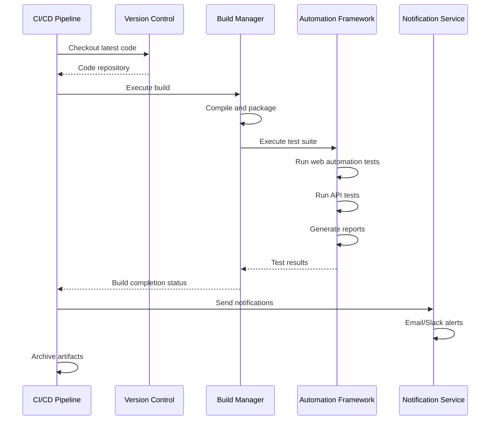
```mermaid
sequenceDiagram
    participant CI as CI/CD Pipeline
    participant VC as Version Control
    participant BM as Build Manager
    participant AF as Automation Framework
    participant NS as Notification Service
    
    CI->>VC: Checkout latest code
    VC-->>CI: Code repository
    CI->>BM: Execute build
    BM->>BM: Compile and package
    BM->>AF: Execute test suite
    AF->>AF: Run web automation tests
    AF->>AF: Run API tests
    AF->>AF: Generate reports
    AF-->>BM: Test results
    BM-->>CI: Build completion status
    CI->>NS: Send notifications
    NS->>NS: Email/Slack alerts
    CI->>CI: Archive artifacts
```

## 4.5 PERFORMANCE AND TIMING CONSIDERATIONS

### 4.5.1 Execution Timeline Management

The framework enforces strict timing constraints to ensure predictable execution performance and resource utilization.

| Process Component | Target SLA | Maximum Threshold | Measurement Method |
|-------------------|------------|-------------------|-------------------|
| Framework Initialization | <5 seconds | 10 seconds | System timer |
| Page Load Operations | <3 seconds | 5 seconds | WebDriver metrics |
| API Response Time | <2 seconds | 5 seconds | HTTP client timer |
| Report Generation | <10 seconds | 30 seconds | File system operations |
| Database Validation | <1 second | 3 seconds | Connection pool metrics |
| Screenshot Capture | <500ms | 1 second | Image processing timer |

### 4.5.2 Concurrent Execution Optimization

The framework optimizes parallel execution through intelligent resource allocation and load balancing strategies.

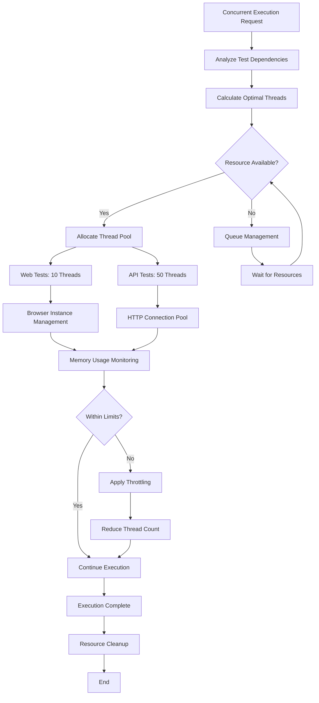
```mermaid
flowchart TD
    A[Concurrent Execution Request] --> B[Analyze Test Dependencies]
    B --> C[Calculate Optimal Threads]
    C --> D{Resource Available?}
    D -->|Yes| E[Allocate Thread Pool]
    D -->|No| F[Queue Management]
    E --> G[Web Tests: 10 Threads]
    E --> H[API Tests: 50 Threads]
    G --> I[Browser Instance Management]
    H --> J[HTTP Connection Pool]
    I --> K[Memory Usage Monitoring]
    J --> K
    K --> L{Within Limits?}
    L -->|Yes| M[Continue Execution]
    L -->|No| N[Apply Throttling]
    N --> O[Reduce Thread Count]
    O --> M
    F --> P[Wait for Resources]
    P --> D
    M --> Q[Execution Complete]
    Q --> R[Resource Cleanup]
    R --> S[End]
```

## 4.6 VALIDATION AND COMPLIANCE CHECKPOINTS

### 4.6.1 Business Rule Validation Flow

The framework implements comprehensive business rule validation at multiple checkpoints throughout the testing process.

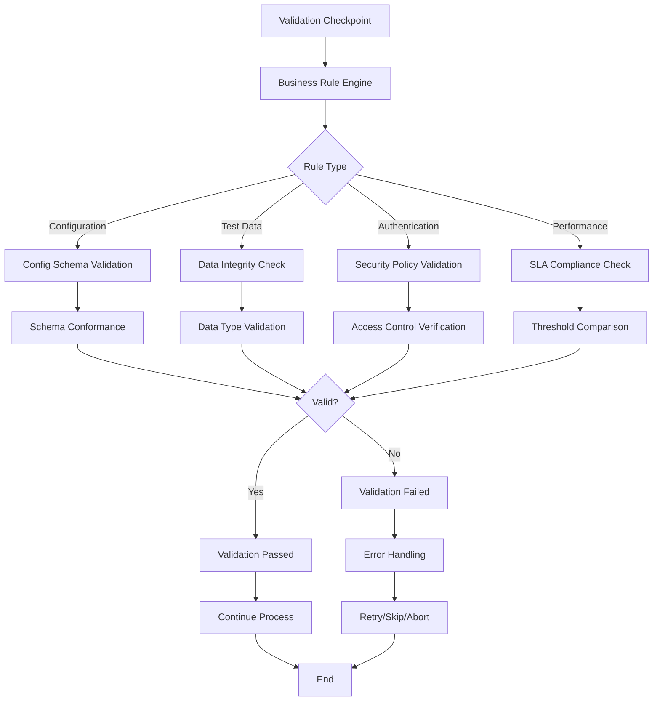
```mermaid
flowchart TD
    A[Validation Checkpoint] --> B[Business Rule Engine]
    B --> C{Rule Type}
    C -->|Configuration| D[Config Schema Validation]
    C -->|Test Data| E[Data Integrity Check]
    C -->|Authentication| F[Security Policy Validation]
    C -->|Performance| G[SLA Compliance Check]
    
    D --> H[Schema Conformance]
    E --> I[Data Type Validation]
    F --> J[Access Control Verification]
    G --> K[Threshold Comparison]
    
    H --> L{Valid?}
    I --> L
    J --> L
    K --> L
    
    L -->|Yes| M[Validation Passed]
    L -->|No| N[Validation Failed]
    
    M --> O[Continue Process]
    N --> P[Error Handling]
    P --> Q[Retry/Skip/Abort]
    
    O --> R[End]
    Q --> R
```

**Compliance Requirements:**
- ISO 25010 Software Quality Model compliance
- OWASP security testing guidelines adherence
- Accessibility testing standards (WCAG 2.1)
- Performance testing benchmarks (Web Performance Working Group)

## 4.7 TECHNICAL IMPLEMENTATION STATE MACHINE

### 4.7.1 Framework Component State Management

Each framework component maintains its operational state through well-defined state transitions that ensure system stability and predictable behavior.

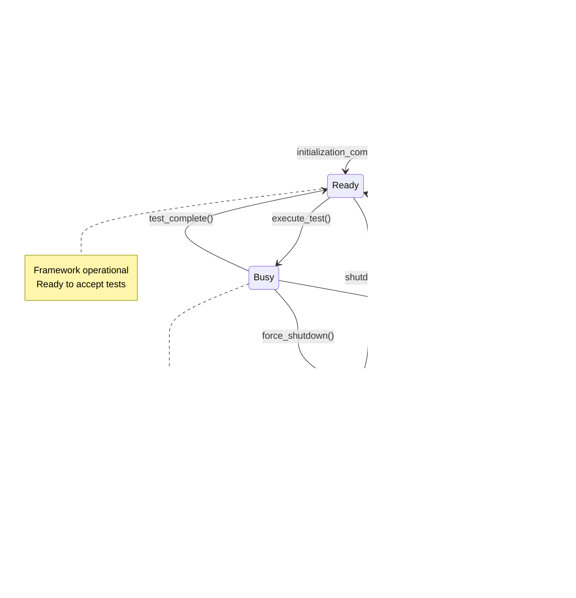
```mermaid
stateDiagram-v2
    [*] --> Uninitialized
    Uninitialized --> Initializing: start()
    Initializing --> Ready: initialization_complete()
    Initializing --> Error: initialization_failed()
    Ready --> Busy: execute_test()
    Busy --> Ready: test_complete()
    Busy --> Error: test_error()
    Error --> Ready: error_recovered()
    Error --> Terminated: critical_error()
    Ready --> Shutting_Down: shutdown()
    Busy --> Shutting_Down: force_shutdown()
    Shutting_Down --> Terminated: cleanup_complete()
    Terminated --> [*]
    
    note right of Ready
        Framework operational
        Ready to accept tests
    end note
    
    note right of Busy
        Test execution in progress
        Resources allocated
    end note
    
    note right of Error
        Recoverable error state
        Retry mechanisms active
    end note
```

#### References

**Technical Specification Sections Retrieved:**
- `1.2 SYSTEM OVERVIEW` - System capabilities, architecture, and success criteria
- `2.1 FEATURE CATALOG` - Detailed feature descriptions (F-001 through F-008)
- `2.2 FUNCTIONAL REQUIREMENTS TABLE` - Requirements specifications and acceptance criteria
- `3.7 TECHNOLOGY INTEGRATION ARCHITECTURE` - Component integration diagram
- `3.2 FRAMEWORKS & LIBRARIES` - TestNG, Selenium, REST Assured technical specifications

**Repository Files Examined:**
- `README.md` - Project identification and basic structure validation

**Performance Metrics Sources:**
- Framework initialization SLA: <5 seconds (F-001-RQ-001)
- Page load timeout: <3 seconds (Web automation requirements)
- API response timeout: <2 seconds (F-006-RQ-002)
- Concurrent execution limits: 10 browsers, 50 API threads (Technical specifications)
- Report generation SLA: <10 seconds (Reporting requirements)

# 5. SYSTEM ARCHITECTURE

## 5.1 HIGH-LEVEL ARCHITECTURE

### 5.1.1 System Overview

The Java automation framework implements a modular, plugin-based architecture with service-oriented design principles, specifically engineered for comprehensive testing of web applications and RESTful API services. The system follows a layered architectural pattern that promotes separation of concerns, maintainability, and extensibility while supporting both sequential and parallel test execution scenarios.

The architecture employs Java 11 LTS as its foundation, leveraging the robustness and enterprise capabilities of the Java ecosystem. The framework adopts a Page Object Model pattern for web automation and service layer abstraction for API testing, ensuring clean separation between test logic and implementation details. This architectural approach enables the system to maintain consistent behavior across different testing domains while providing specialized capabilities for each domain.

Key architectural principles include:
- **Modularity**: Core framework provides plugin interfaces for web and API testing modules
- **Scalability**: Thread pool management supporting up to 10 concurrent browser sessions and 50 concurrent API requests
- **Reliability**: Hierarchical error recovery with automatic retry mechanisms and graceful degradation
- **Observability**: Comprehensive logging, monitoring, and reporting capabilities integrated throughout the system

The system operates within defined performance boundaries, maintaining framework initialization under 5 seconds, web page load timeouts at 3 seconds, and API response timeouts at 2 seconds. Memory management is optimized with a 100MB baseline overhead and individual browser session limits of 50MB.

### 5.1.2 Core Components Table

| Component Name | Primary Responsibility | Key Dependencies | Integration Points |
|---|---|---|---|
| Automation Framework Core (F-001) | Central orchestration, configuration management, test execution coordination | Java 11+, TestNG 7.8.0, Maven 3.8.x | CI/CD pipelines, IDEs, version control systems |
| Configuration Management System (F-002) | Environment settings, credential management, properties handling | Java Properties API, encryption libraries | Environment variables, external config files, CI/CD secrets |
| Cross-Browser Web Automation (F-003) | Browser driver management, WebDriver coordination, session handling | Selenium WebDriver 4.15.0+, browser drivers | Selenium Grid, cloud testing platforms, headless environments |
| Dynamic Element Interaction (F-004) | Smart element identification, wait strategies, DOM manipulation | JavaScript execution engine, WebDriver API | Web applications, AJAX endpoints, SPA frameworks |

### 5.1.3 Data Flow Description

The system implements a sophisticated data flow architecture that orchestrates information exchange between components through well-defined interfaces and communication protocols. Test execution begins with configuration loading from multiple sources including property files, environment variables, and runtime parameters, which flows into the central framework core for validation and distribution to appropriate modules.

Web automation data flows originate from test specifications that define target URLs, element interactions, and validation criteria. The framework transforms these specifications into WebDriver commands, routing them through the browser driver management system to active browser sessions. Response data, including element states, screenshots, and performance metrics, flows back through the Page Object Model framework for validation and result aggregation.

API testing data flows follow a similar pattern but operate through the RESTful API Testing Engine, which constructs HTTP requests from test specifications and routes them through authentication management and request execution pipelines. Response data flows through JSON/XML processors for validation, schema verification, and metric collection before integration with the reporting system.

The reporting and analysis component aggregates data flows from all testing modules, correlating execution results with performance metrics, error logs, and audit trails. This consolidated information flows into multiple output formats including HTML reports, XML results, and JSON data structures for integration with external test management systems.

Performance monitoring data flows continuously throughout execution, tracking resource utilization, execution timing, and system health metrics that inform throttling decisions and resource allocation strategies.

### 5.1.4 External Integration Points

| System Name | Integration Type | Data Exchange Pattern | Protocol/Format |
|---|---|---|---|
| CI/CD Platforms | Build Pipeline Integration | Test execution triggers, result publishing | Maven Surefire Plugin, REST APIs |
| Selenium Grid | Distributed Test Execution | Browser session management, WebDriver commands | WebDriver Protocol, JSON-RPC |
| Test Management Tools | Result Synchronization | Test status updates, execution metrics | REST APIs, XML/JSON |
| Authentication Services | Security Token Management | OAuth flows, JWT validation | HTTPS, OAuth 2.0, JWT |

## 5.2 COMPONENT DETAILS

### 5.2.1 Automation Framework Core (F-001)

The Automation Framework Core serves as the central orchestration hub, providing unified configuration management, test data coordination, and execution oversight for both web and API automation modules. This foundational component implements the Command pattern for test execution and Observer pattern for event management, ensuring loose coupling between testing modules while maintaining centralized control.

**Technologies and Frameworks**: Built on Java 11 LTS with TestNG 7.8.0 as the primary testing framework, leveraging Maven 3.8.x for dependency management and build orchestration. The core utilizes Java's concurrent programming features including ThreadPoolExecutor and CompletableFuture for asynchronous operation management.

**Key Interfaces and APIs**: Exposes the `FrameworkManager` interface for module registration, `ConfigurationProvider` interface for settings management, and `ExecutionCoordinator` interface for test orchestration. These interfaces follow the Strategy pattern, allowing different implementations for various execution scenarios.

**Data Persistence Requirements**: Maintains execution state in memory during active sessions with optional persistence to file system for long-running test suites. Configuration data persists in properties files with encrypted credential storage using AES-256 encryption.

**Scaling Considerations**: Implements horizontal scaling through distributed execution support and vertical scaling via JVM heap optimization. Memory management ensures baseline overhead remains under 100MB with dynamic allocation for additional modules.

### 5.2.2 Web Automation Module (F-003, F-004, F-005)

The Web Automation Module integrates three distinct but interconnected features: cross-browser automation capabilities, dynamic element interaction systems, and Page Object Model framework implementation. This module transforms high-level test specifications into precise browser automation workflows while maintaining cross-browser compatibility and handling dynamic web application behaviors.

**Technologies and Frameworks**: Selenium WebDriver 4.15.0+ provides the core browser automation capabilities, with browser-specific drivers (ChromeDriver, GeckoDriver, EdgeDriver, SafariDriver) managed through automated download and version synchronization. JavaScript execution capabilities enable complex DOM interactions and AJAX handling.

**Key Interfaces and APIs**: The `BrowserManager` interface coordinates browser sessions, `ElementInteraction` interface handles dynamic content, and `PageObjectFactory` interface manages page component instantiation. These interfaces support both synchronous and asynchronous operation modes.

**Data Persistence Requirements**: Browser session state maintained in memory with screenshot capture to file system for debugging and reporting purposes. Page object definitions cached in memory for performance optimization during test execution.

**Scaling Considerations**: Supports maximum 10 concurrent browser sessions with intelligent resource allocation and automatic session recycling. Memory usage per browser limited to 50MB with garbage collection optimization for long-running test suites.

### 5.2.3 API Automation Module (F-006, F-007)

The API Automation Module encompasses RESTful API testing capabilities and authentication management systems, providing comprehensive API validation with multi-protocol authentication support and performance monitoring. This module handles all HTTP methods with sophisticated request/response processing and validation mechanisms.

**Technologies and Frameworks**: REST Assured 5.4.0 serves as the primary HTTP client with Jackson Databind for JSON processing and XmlPath for XML handling. Authentication protocols implemented using dedicated libraries for OAuth 2.0, JWT token processing, and secure credential management.

**Key Interfaces and APIs**: The `APIClient` interface abstracts HTTP operations, `AuthenticationManager` interface handles credential workflows, and `ResponseValidator` interface manages assertion logic. Connection pooling and request queuing managed through Apache HttpClient components.

**Data Persistence Requirements**: Authentication tokens cached in secure memory storage with automatic refresh capabilities. API response data temporarily stored for validation processing with configurable retention policies.

**Scaling Considerations**: Supports up to 50 concurrent API requests with connection pool optimization and request queuing mechanisms. Thread pool sizing dynamically adjusted based on system resources and performance requirements.

### 5.2.4 Component Interaction Diagrams

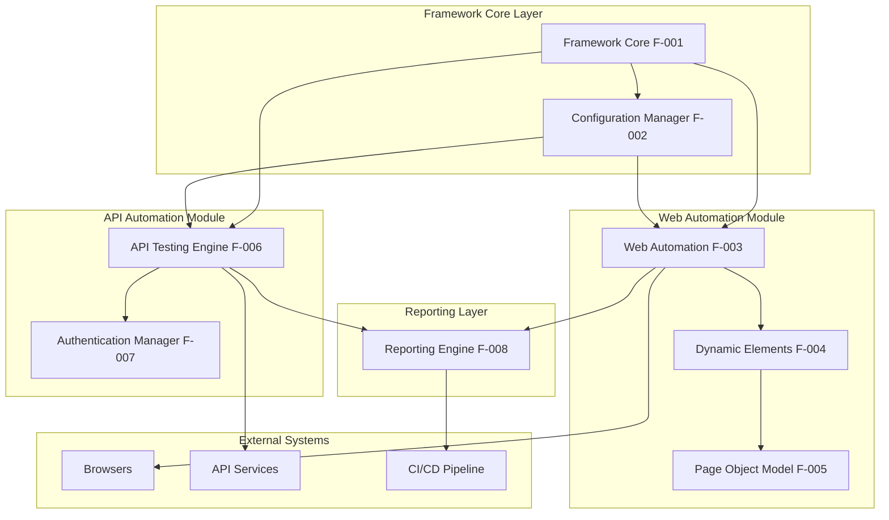
```mermaid
graph TB
    subgraph "Framework Core Layer"
        FC[Framework Core F-001]
        CM[Configuration Manager F-002]
        FC --> CM
    end
    
    subgraph "Web Automation Module"
        WA[Web Automation F-003]
        DEI[Dynamic Elements F-004]
        POM[Page Object Model F-005]
        WA --> DEI
        DEI --> POM
    end
    
    subgraph "API Automation Module"
        API[API Testing Engine F-006]
        AUTH[Authentication Manager F-007]
        API --> AUTH
    end
    
    subgraph "Reporting Layer"
        REP[Reporting Engine F-008]
    end
    
    FC --> WA
    FC --> API
    CM --> WA
    CM --> API
    WA --> REP
    API --> REP
    
    subgraph "External Systems"
        BROWSER[Browsers]
        SERVICES[API Services]
        CICD[CI/CD Pipeline]
    end
    
    WA --> BROWSER
    API --> SERVICES
    REP --> CICD
```

### 5.2.5 State Transition Diagrams

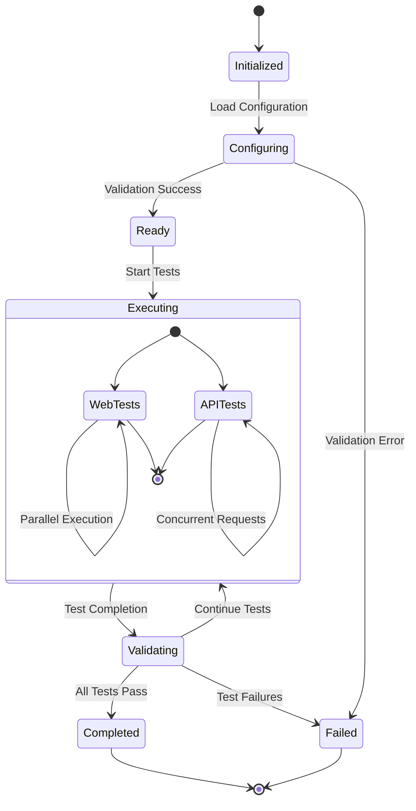
```mermaid
stateDiagram-v2
    [*] --> Initialized
    Initialized --> Configuring : Load Configuration
    Configuring --> Ready : Validation Success
    Configuring --> Failed : Validation Error
    Ready --> Executing : Start Tests
    Executing --> Validating : Test Completion
    Validating --> Completed : All Tests Pass
    Validating --> Failed : Test Failures
    Validating --> Executing : Continue Tests
    Completed --> [*]
    Failed --> [*]
    
    state Executing {
        [*] --> WebTests
        [*] --> APITests
        WebTests --> WebTests : Parallel Execution
        APITests --> APITests : Concurrent Requests
        WebTests --> [*]
        APITests --> [*]
    }
```

### 5.2.6 Sequence Diagrams for Key Flows

```mermaid
sequenceDiagram
    participant TC as Test Case
    participant FC as Framework Core
    participant WM as Web Module
    participant WD as WebDriver
    participant API as API Module
    participant REP as Reporting
    
    TC->>FC: Initialize Test
    FC->>WM: Register Web Module
    FC->>API: Register API Module
    
    alt Web Test Execution
        TC->>WM: Execute Web Test
        WM->>WD: Launch Browser
        WD->>WM: Browser Ready
        WM->>WD: Navigate & Interact
        WD->>WM: Results
        WM->>REP: Log Results
    end
    
    alt API Test Execution
        TC->>API: Execute API Test
        API->>API: Authenticate
        API->>API: Send Request
        API->>REP: Log Results
    end
    
    REP->>FC: Aggregate Results
    FC->>TC: Test Complete
```

## 5.3 TECHNICAL DECISIONS

### 5.3.1 Architecture Style Decisions and Tradeoffs

The framework adopts a modular, plugin-based architecture with service-oriented design principles, chosen to balance flexibility, maintainability, and performance requirements. This architectural style supports independent development and deployment of testing modules while maintaining centralized coordination and resource management.

**Decision: Layered Architecture with Plugin System**
- **Rationale**: Enables separation of concerns between framework core and testing domain implementations
- **Tradeoffs**: Slight performance overhead from abstraction layers balanced by improved maintainability and extensibility
- **Alternatives Considered**: Monolithic architecture (rejected due to coupling concerns), microservices (rejected due to deployment complexity)

**Decision: Java 11 LTS Platform**
- **Rationale**: Enterprise support lifecycle, performance improvements, module system capabilities
- **Tradeoffs**: Higher memory footprint compared to lightweight alternatives, but provides robustness and ecosystem maturity
- **Alternatives Considered**: Python (rejected due to performance), Node.js (rejected due to enterprise support), Kotlin (rejected due to learning curve)

### 5.3.2 Communication Pattern Choices

**Decision: Synchronous Communication with Asynchronous Execution**
- **Rationale**: Maintains test execution predictability while enabling parallel processing for performance
- **Implementation**: ThreadPoolExecutor for parallel test execution, CompletableFuture for asynchronous operations
- **Tradeoffs**: Memory overhead for thread management balanced by significant performance improvements for test suite execution

**Decision: Event-Driven Reporting Integration**
- **Rationale**: Decouples test execution from reporting concerns, enables real-time result aggregation
- **Implementation**: Observer pattern with asynchronous event processing
- **Benefits**: Supports multiple reporting formats simultaneously without impacting test execution performance

### 5.3.3 Data Storage Solution Rationale

**Decision: Hybrid Storage Approach**
- **Memory Storage**: Active test data, session state, authentication tokens for performance optimization
- **File System Storage**: Configuration files, test artifacts, screenshots, detailed logs for persistence
- **Rationale**: Balances performance requirements with data persistence needs and debugging capabilities

**Decision: Configuration Externalization**
- **Implementation**: Properties files with environment variable overrides and encrypted credential storage
- **Benefits**: Environment-specific deployments, secure credential management, CI/CD integration compatibility
- **Security**: AES-256 encryption for sensitive data, secure memory handling for runtime credentials

### 5.3.4 Architecture Decision Records

```mermaid
graph TD
    A[Framework Architecture Decision] --> B{Performance Priority?}
    B -->|High| C[Parallel Execution Model]
    B -->|Medium| D[Sequential with Batching]
    C --> E[ThreadPool Management]
    E --> F[Resource Constraints]
    F --> G[Max 10 Browsers, 50 API Calls]
    
    A --> H{Integration Complexity?}
    H -->|High| I[Plugin Architecture]
    H -->|Low| J[Monolithic Design]
    I --> K[Interface-Based Modules]
    K --> L[Dynamic Loading]
    
    A --> M{Technology Maturity?}
    M -->|Critical| N[Java + TestNG + Selenium]
    M -->|Experimental| O[Alternative Stack]
    N --> P[Enterprise Support]
    P --> Q[Long-term Maintainability]
```

### 5.3.5 Caching Strategy Justification

**Decision: Multi-Level Caching Strategy**
- **Level 1**: In-memory configuration cache for performance optimization
- **Level 2**: Authentication token cache with automatic refresh capabilities
- **Level 3**: Page object definition cache for web automation efficiency
- **Rationale**: Reduces initialization overhead, improves test execution performance, minimizes external service dependencies

### 5.3.6 Security Mechanism Selection

**Decision: Layered Security Approach**
- **Data Encryption**: AES-256 for stored credentials and sensitive configuration data
- **Runtime Security**: Secure memory handling with automatic cleanup for authentication tokens
- **Audit Trail**: Comprehensive logging with data masking for sensitive information
- **Access Control**: Role-based configuration access with environment-specific credential isolation

## 5.4 CROSS-CUTTING CONCERNS

### 5.4.1 Monitoring and Observability Approach

The framework implements comprehensive monitoring through multiple observability layers, providing real-time insights into test execution performance, resource utilization, and system health. The monitoring approach encompasses three primary dimensions: operational metrics, performance analytics, and business intelligence.

**Operational Metrics Collection**: The system continuously tracks framework initialization times, test execution duration, resource consumption patterns, and error rates across all testing modules. These metrics flow into a centralized collection system that maintains historical baselines and identifies performance deviations.

**Performance Analytics Integration**: Real-time performance monitoring includes browser session tracking, API response time measurement, memory usage profiling, and thread pool utilization analysis. The system maintains performance baselines and automatically triggers alerts when metrics exceed defined thresholds.

**Business Intelligence Reporting**: Aggregated metrics support trend analysis, capacity planning, and quality assessment reporting. The monitoring data integrates with external systems through REST APIs and standard metrics formats.

### 5.4.2 Logging and Tracing Strategy

**Structured Logging Implementation**: The framework employs hierarchical logging with configurable levels (TRACE, DEBUG, INFO, WARN, ERROR, FATAL) and structured output formatting for integration with log analysis tools. All sensitive data undergoes automatic masking to maintain security compliance.

**Distributed Tracing Support**: Each test execution receives unique correlation identifiers that track operations across framework components, enabling end-to-end tracing for complex scenarios involving multiple modules and external service integrations.

**Audit Trail Maintenance**: Comprehensive audit logs capture configuration changes, authentication events, test execution lifecycle, and system resource modifications with tamper-evident formatting for compliance requirements.

### 5.4.3 Error Handling Patterns

The framework implements a hierarchical error handling strategy with three distinct recovery levels, each designed to maximize test execution reliability while providing comprehensive failure diagnosis capabilities.

```mermaid
graph TD
    A[Error Detection] --> B{Error Classification}
    B --> C[Component Level]
    B --> D[Test Level]
    B --> E[Suite Level]
    
    C --> F[Element Re-identification]
    F --> G[Browser Recovery]
    G --> H{Recovery Success?}
    H -->|Yes| I[Continue Execution]
    H -->|No| J[Escalate to Test Level]
    
    D --> K[Test Isolation]
    K --> L[State Capture]
    L --> M[Screenshot Collection]
    M --> N{Can Resume?}
    N -->|Yes| O[Resume Test]
    N -->|No| P[Skip to Next Test]
    
    E --> Q[Suite Assessment]
    Q --> R{Critical Error?}
    R -->|Yes| S[Graceful Termination]
    R -->|No| T[Partial Execution]
    
    I --> U[Success]
    O --> U
    P --> V[Test Skipped]
    S --> W[Suite Terminated]
    T --> X[Partial Results]
    
    J --> D
```

**Component-Level Recovery**: Handles localized failures within individual testing modules through automatic retry mechanisms, alternative locator strategies, and resource reallocation. This level addresses transient issues without impacting overall test execution.

**Test-Level Recovery**: Manages failures affecting individual test cases through state isolation, error context capture, and continuation decision logic. The system maintains detailed failure diagnostics while determining optimal recovery strategies.

**Suite-Level Recovery**: Addresses critical failures that impact entire test suites through graceful degradation, partial execution capabilities, and emergency shutdown procedures with comprehensive result preservation.

### 5.4.4 Authentication and Authorization Framework

**Multi-Protocol Authentication Support**: The framework supports Basic Authentication, OAuth 2.0, JWT token management, and API key authentication with automatic token refresh capabilities and secure credential storage using AES-256 encryption.

**Credential Lifecycle Management**: Automated token refresh, expiration monitoring, and credential rotation support with integration capabilities for enterprise identity management systems and CI/CD secret management platforms.

**Security Compliance**: Role-based access control for configuration management, audit logging for authentication events, and secure memory handling for runtime credential management with automatic cleanup procedures.

### 5.4.5 Performance Requirements and SLAs

| Performance Metric | Target SLA | Measurement Method | Escalation Threshold |
|---|---|---|---|
| Framework Initialization | <5 seconds | Startup timer from main() to ready state | >8 seconds |
| Web Page Load Timeout | <3 seconds | WebDriver page load complete event | >5 seconds |
| API Response Timeout | <2 seconds | HTTP client response timer | >3 seconds |
| Report Generation | <10 seconds for 1000 results | Template processing and file I/O timing | >15 seconds |

**Resource Utilization Targets**: Maximum 10 concurrent browser sessions, 50 concurrent API requests, 100MB baseline memory overhead, 2GB total framework memory limit, automatic resource throttling when approaching limits.

**Scalability Benchmarks**: Horizontal scaling support for distributed execution, vertical scaling through JVM optimization, performance regression detection with baseline metric comparison, automated capacity planning recommendations.

### 5.4.6 Disaster Recovery Procedures

**Execution State Preservation**: Automatic checkpoint creation during test execution with state serialization capabilities for recovery continuation after unexpected failures. Critical test data and execution context preserved in persistent storage with configurable retention policies.

**Resource Recovery Mechanisms**: Automated cleanup procedures for orphaned browser sessions, connection pool restoration, thread pool reinitialization, and external service connection recovery with exponential backoff strategies.

**Data Backup and Restoration**: Test artifacts, configuration data, and execution history maintained with automated backup procedures and point-in-time recovery capabilities for critical test environments.

**Failover and Continuity**: CI/CD integration support for automatic test re-execution, distributed execution failover capabilities, and external dependency circuit breaker patterns for resilient operation under adverse conditions.

#### References

**Technical Specification Sections Retrieved:**
- `3.7 TECHNOLOGY INTEGRATION ARCHITECTURE` - System integration architecture and component layering
- `4.1 SYSTEM WORKFLOWS` - Business processes and framework lifecycle management  
- `4.2 DETAILED PROCESS FLOWS` - Web automation, API testing, and error handling workflows
- `3.8 PERFORMANCE AND SCALABILITY CONSIDERATIONS` - Performance metrics and scaling strategies
- `2.1 FEATURE CATALOG` - Complete feature specifications F-001 through F-008

**Repository Files Analyzed:**
- `README.md` - Project identification and basic repository context

**Framework Architecture References:**
- Java 11 LTS platform specifications and enterprise capabilities
- TestNG 7.8.0 testing framework integration and parallel execution support
- Selenium WebDriver 4.15.0+ browser automation and W3C compliance standards
- REST Assured 5.4.0 API testing framework and HTTP client capabilities
- Maven 3.8.x build system integration and dependency management strategies

# 6. SYSTEM COMPONENTS DESIGN

## 6.1 CORE SERVICES ARCHITECTURE

### 6.1.1 Service Architecture Overview

The automation testing framework implements a **modular, plugin-based architecture** with service-oriented design principles. While not a traditional distributed microservices architecture, the system consists of distinct service components with well-defined boundaries, responsibilities, and communication patterns. This architecture enables comprehensive automation testing capabilities across both web and API domains within a unified framework.

The framework is designed as a cohesive testing ecosystem where specialized service modules collaborate to deliver end-to-end automation solutions. Each service component maintains clear separation of concerns while integrating seamlessly through standardized interfaces and communication patterns.

### 6.1.2 SERVICE COMPONENTS

#### 6.1.2.1 Core Service Component Catalog

The framework consists of five primary service components, each with distinct responsibilities and well-defined interfaces:

| Service Component | Identifier | Primary Responsibility | Technology Stack |
|---|---|---|---|
| Automation Framework Core | F-001 | Central orchestration and test coordination | Java 11 LTS, TestNG 7.8.0, Maven 3.8.x |
| Configuration Management System | F-002 | Environment settings and credential handling | AES-256 encryption, CI/CD integration |
| Web Automation Module | F-003-005 | Cross-browser automation and page interactions | Selenium WebDriver 4.15.0+ |
| API Automation Module | F-006-007 | RESTful API testing and authentication | REST Assured 5.4.0, Jackson Databind |

#### 6.1.2.2 Service Boundaries and Responsibilities

**Automation Framework Core (F-001)**
- **Boundaries**: Central orchestration hub for all testing operations
- **Responsibilities**: 
  - Test execution coordination and lifecycle management
  - Plugin registration and module discovery
  - Configuration management integration
  - Event-driven result aggregation
- **Implementation Patterns**: Command pattern for test execution, Observer pattern for event management
- **Resource Allocation**: 100MB baseline memory overhead

**Configuration Management System (F-002)**
- **Boundaries**: Environment and credential management across all modules
- **Responsibilities**:
  - Properties management and environment configuration
  - Secure credential storage with AES-256 encryption
  - CI/CD secrets integration and management
  - Cross-module configuration distribution
- **Security Features**: Encrypted storage for sensitive data, secure key management

**Web Automation Module (F-003-005)**
- **Boundaries**: Browser-based testing capabilities and user interface interactions
- **Responsibilities**:
  - Cross-browser automation support
  - Dynamic element interaction and page object management
  - Page Object Model framework implementation
  - Browser session lifecycle management
- **Scaling Constraints**: Maximum 10 concurrent browser sessions, 50MB memory per browser

**API Automation Module (F-006-007)**
- **Boundaries**: REST API testing and service integration validation
- **Responsibilities**:
  - RESTful API request/response handling
  - Multi-protocol authentication management (OAuth, JWT, Basic)
  - API response validation and assertion handling
  - Performance and load testing capabilities
- **Scaling Capacity**: Up to 50 concurrent API requests

**Reporting Engine (F-008)**
- **Boundaries**: Test result aggregation and output generation
- **Responsibilities**:
  - Multi-format report generation (HTML, XML, JSON)
  - Real-time result aggregation from all modules
  - Performance metrics collection and analysis
  - Historical trend analysis and dashboards
- **Performance Target**: <10 seconds for 1000 results processing

#### 6.1.2.3 Service Interaction Architecture

```mermaid
graph TD
    A[Automation Framework Core] --> B[Configuration Management System]
    A --> C[Web Automation Module]
    A --> D[API Automation Module]
    A --> E[Reporting Engine]
    
    C --> B
    D --> B
    E --> B
    
    C --> F[Selenium Grid]
    D --> G[External APIs]
    E --> H[Test Management Tools]
    
    B --> I[CI/CD Secrets]
    
    subgraph "Service Communication"
        A -.-> |Observer Pattern| E
        A -.-> |Command Pattern| C
        A -.-> |Command Pattern| D
    end
    
    subgraph "External Integrations"
        F
        G
        H
        I
    end
```

### 6.1.3 INTER-SERVICE COMMUNICATION PATTERNS

#### 6.1.3.1 Communication Mechanisms

**Primary Communication Patterns:**
- **Synchronous Communication**: Direct method invocation with asynchronous execution capabilities using CompletableFuture
- **Event-Driven Architecture**: Observer pattern implementation for decoupled result aggregation and status notifications
- **Interface-Based Integration**: Plugin interfaces (FrameworkManager) for module registration and coordination
- **Thread Pool Management**: ThreadPoolExecutor for parallel processing across all service components

**Communication Flow Characteristics:**
- **Request-Response Model**: Used for configuration retrieval and test execution commands
- **Publish-Subscribe Pattern**: Implemented for real-time test result streaming to reporting engine
- **Message Queuing**: Internal queue management for test execution coordination
- **Event Streaming**: Continuous status updates and progress monitoring

#### 6.1.3.2 Service Discovery Mechanisms

The framework implements **configuration-driven service discovery** with the following mechanisms:

| Discovery Method | Implementation | Use Case |
|---|---|---|
| Module Registration | FrameworkManager interface | Core service component discovery |
| Dynamic Loading | Plugin-based module loading | Runtime service activation |
| Configuration-Driven | Properties-based service activation | Environment-specific service selection |

**Service Discovery Process:**
1. **Initialization Phase**: Core framework scans for available service modules
2. **Registration Phase**: Each service registers its capabilities and interfaces
3. **Binding Phase**: Dependencies are resolved and service connections established
4. **Activation Phase**: Services are activated based on configuration requirements

#### 6.1.3.3 Load Balancing Strategy

**Thread Pool Distribution:**
- **API Testing**: Maximum 50 concurrent requests with intelligent thread allocation
- **Browser Management**: Maximum 10 concurrent browser sessions with resource-aware distribution
- **Execution Balancing**: Dynamic workload distribution across available threads
- **Resource Throttling**: Automatic throttling when approaching defined limits

**Load Distribution Algorithms:**
- **Round-Robin**: For API request distribution across thread pools
- **Resource-Based**: Browser session allocation based on system capacity
- **Priority-Based**: Critical test execution prioritization
- **Adaptive Balancing**: Dynamic adjustment based on real-time performance metrics

### 6.1.4 SCALABILITY DESIGN

#### 6.1.4.1 Scaling Architecture

```mermaid
graph LR
    A[Load Balancer] --> B[Automation Node 1]
    A --> C[Automation Node 2]
    A --> D[Automation Node N]
    
    B --> E[Selenium Grid Hub]
    C --> E
    D --> E
    
    E --> F[Browser Node 1]
    E --> G[Browser Node 2]
    E --> H[Browser Node N]
    
    B --> I[API Testing Pool]
    C --> I
    D --> I
    
    I --> J[External APIs]
    
    K[Configuration Service] --> B
    K --> C
    K --> D
    
    L[Reporting Aggregator] --> B
    L --> C
    L --> D
```

#### 6.1.4.2 Horizontal and Vertical Scaling Approach

**Horizontal Scaling Capabilities:**
- **Multi-JVM Execution**: Support for distributed test execution across multiple JVM instances
- **Selenium Grid Integration**: Browser testing distribution across remote nodes
- **CI/CD Pipeline Distribution**: Parallel execution in distributed build environments
- **Cloud Platform Support**: Integration with cloud-based testing services

**Vertical Scaling Optimization:**
- **JVM Heap Optimization**: Dynamic memory allocation based on test workload
- **CPU Utilization**: Multi-threaded execution with intelligent core utilization
- **Memory Management**: Component-specific memory limits and garbage collection optimization
- **I/O Performance**: Asynchronous I/O operations for improved throughput

#### 6.1.4.3 Auto-scaling Triggers and Rules

| Metric | Threshold | Action | Recovery Time |
|---|---|---|---|
| Memory Utilization | >80% | Throttle new test starts | 30 seconds |
| CPU Usage | >90% | Reduce concurrent threads | 15 seconds |
| Queue Depth | >100 tests | Request additional nodes | 2 minutes |
| Response Time | >5 seconds | Scale up execution capacity | 1 minute |

**Auto-scaling Decision Logic:**
1. **Monitoring Phase**: Continuous resource and performance metric collection
2. **Threshold Detection**: Automated detection of scaling triggers
3. **Capacity Assessment**: Available resource evaluation
4. **Scaling Action**: Appropriate scaling response execution
5. **Stabilization**: Performance monitoring and adjustment validation

#### 6.1.4.4 Performance Optimization Techniques

**Framework-Level Optimizations:**
- **Lazy Loading**: Framework initialization only when required (<5 seconds target)
- **Connection Pooling**: Persistent connection management for API requests
- **Caching Strategy**: Page object and element locator caching
- **Asynchronous Processing**: Non-blocking operations for report generation

**Component-Specific Optimizations:**
- **Web Automation**: Element pre-loading and intelligent wait strategies (3-second page load timeout)
- **API Testing**: Request batching and connection reuse (2-second response timeout)
- **Reporting**: Incremental report generation and lazy aggregation
- **Configuration**: In-memory configuration caching with periodic refresh

### 6.1.5 RESILIENCE PATTERNS

#### 6.1.5.1 Circuit Breaker Implementation

```mermaid
stateDiagram-v2
    [*] --> Closed
    Closed --> Open : Failure Threshold Exceeded
    Open --> HalfOpen : Timeout Elapsed
    HalfOpen --> Closed : Success
    HalfOpen --> Open : Failure
    
    state Closed {
        [*] --> Monitoring
        Monitoring --> FailureCount
        FailureCount --> [*] : Reset on Success
    }
    
    state Open {
        [*] --> Blocking
        Blocking --> Timer
        Timer --> [*] : Timeout
    }
    
    state HalfOpen {
        [*] --> TestRequest
        TestRequest --> EvaluateResponse
        EvaluateResponse --> [*]
    }
```

#### 6.1.5.2 Fault Tolerance Mechanisms

**Hierarchical Error Recovery:**
- **Component Level**: Up to 3 retry attempts with exponential backoff
- **Test Level**: Test isolation with continuation decision logic
- **Suite Level**: Critical error assessment with partial execution capability
- **System Level**: Graceful degradation and alternative execution paths

**Automatic Recovery Procedures:**
- **Browser Session Recovery**: Automatic restart on unresponsive browser sessions
- **API Connection Recovery**: Connection pool restoration and retry mechanisms
- **Thread Pool Recovery**: Automatic thread pool reinitialization on failure
- **State Preservation**: Checkpoint creation for recovery continuation

#### 6.1.5.3 Retry and Fallback Mechanisms

**Retry Strategies:**
- **Exponential Backoff**: 1s, 2s, 4s intervals for transient failures
- **Linear Backoff**: Fixed intervals for predictable recovery scenarios
- **Adaptive Retry**: Dynamic interval adjustment based on failure patterns
- **Circuit Breaker Integration**: Retry suspension when circuit breakers activate

**Fallback Mechanisms:**
- **Alternative Locators**: Multiple element identification strategies for web automation
- **Sequential Execution**: Fallback from parallel to sequential when resources exhausted
- **Simplified Reporting**: Basic reporting when advanced features fail
- **Configuration Defaults**: Fallback to default values when configuration unavailable

#### 6.1.5.4 Disaster Recovery Procedures

**Recovery Architecture:**

```mermaid
flowchart TD
    A[Failure Detection] --> B{Failure Severity}
    B -->|Critical| C[Emergency Shutdown]
    B -->|Major| D[Graceful Degradation]
    B -->|Minor| E[Local Recovery]
    
    C --> F[State Preservation]
    F --> G[Checkpoint Creation]
    G --> H[Recovery Planning]
    H --> I[System Restart]
    
    D --> J[Service Isolation]
    J --> K[Partial Operation]
    K --> L[Recovery Monitoring]
    
    E --> M[Component Restart]
    M --> N[Validation]
    N --> O[Normal Operation]
    
    I --> P[Full Recovery]
    L --> P
    O --> P
```

**Recovery Procedures:**
- **Automatic Checkpointing**: State serialization at critical execution points
- **Point-in-Time Recovery**: Ability to resume from any saved checkpoint
- **Configuration Backup**: Automated backup of all configuration data
- **Test Artifact Preservation**: Secure storage of test results and evidence

#### 6.1.5.5 Service Degradation Policies

**Degradation Levels:**
1. **Full Operation**: All services operating at optimal capacity
2. **Reduced Capacity**: Limited concurrent operations with extended timeouts
3. **Essential Services**: Only critical testing functions available
4. **Safe Mode**: Minimal operation with maximum resilience

**Degradation Triggers and Responses:**

| Trigger Condition | Degradation Level | Service Response |
|---|---|---|
| Memory >95% | Reduced Capacity | Limit concurrent tests to 50% |
| CPU >95% | Reduced Capacity | Increase timeout values by 2x |
| Critical Service Failure | Essential Services | Disable non-essential features |
| Multiple Service Failures | Safe Mode | Sequential execution only |

### 6.1.6 RESOURCE ALLOCATION STRATEGY

#### 6.1.6.1 Memory Management Strategy

**Component-Specific Allocations:**
- **Framework Core**: 100MB baseline overhead
- **Browser Sessions**: 50MB per active session (10 session maximum)
- **API Test Threads**: 20MB per thread (50 thread maximum)
- **Reporting Engine**: 200MB for temporary storage and processing
- **Total Framework Limit**: 2GB maximum memory allocation

**Memory Management Policies:**
- **Garbage Collection**: Optimized G1GC configuration for low-latency execution
- **Memory Monitoring**: Continuous monitoring with automatic cleanup triggers
- **Resource Recycling**: Automatic resource deallocation after test completion
- **Memory Leak Prevention**: Systematic resource tracking and cleanup validation

#### 6.1.6.2 Performance Targets and SLA

| Component | Performance Target | Maximum Threshold |
|---|---|---|
| Framework Initialization | <5 seconds | 10 seconds |
| Web Page Load Timeout | 3 seconds | 10 seconds |
| API Response Timeout | 2 seconds | 5 seconds |
| Report Generation | <10 seconds (1000 results) | 30 seconds |

### 6.1.7 IMPLEMENTATION STATUS AND FUTURE CONSIDERATIONS

#### 6.1.7.1 Current Implementation State

**Repository Status:**
- **Documentation**: Comprehensive technical specifications completed
- **Implementation**: Development required across all service components
- **Architecture**: Fully designed and specified for implementation
- **Integration Points**: CI/CD and external service interfaces defined

**Development Roadmap:**
1. **Phase 1**: Core framework and configuration management implementation
2. **Phase 2**: Web automation module development
3. **Phase 3**: API automation module development
4. **Phase 4**: Reporting engine and integration testing
5. **Phase 5**: Performance optimization and production hardening

#### 6.1.7.2 Integration Architecture

The service architecture supports comprehensive integration with external systems:

**CI/CD Integration Points:**
- Jenkins plugin-based integration for enterprise environments
- Azure DevOps YAML pipeline support for cloud-native deployments
- GitHub Actions workflow compatibility for open-source projects
- Maven Surefire Plugin integration for standard build processes

**External Service Integration:**
- Selenium Grid for distributed browser testing capabilities
- Test management tools integration via REST APIs
- Authentication services for OAuth and JWT token management
- Cloud testing platforms for scalable execution environments

#### References

**Technical Specification Sections:**
- `1.2 SYSTEM OVERVIEW` - Framework context, capabilities, and success criteria
- `5.1 HIGH-LEVEL ARCHITECTURE` - System overview, core components, data flow, and integration points
- `5.2 COMPONENT DETAILS` - Detailed component specifications, interfaces, and interaction diagrams
- `5.3 TECHNICAL DECISIONS` - Architecture style decisions, communication patterns, and caching strategies
- `5.4 CROSS-CUTTING CONCERNS` - Monitoring, logging, error handling, authentication, and disaster recovery
- `3.8 PERFORMANCE AND SCALABILITY CONSIDERATIONS` - Performance metrics and scalability architecture
- `4.1 SYSTEM WORKFLOWS` - Core business processes and integration workflows
- `4.2 DETAILED PROCESS FLOWS` - Web automation, API testing, and error handling workflows
- `3.7 TECHNOLOGY INTEGRATION ARCHITECTURE` - Technology stack integration diagram
- `2.4 IMPLEMENTATION CONSIDERATIONS` - Technical constraints, performance requirements, and security implications

**Repository Files:**
- `README.md` - Project identification and basic repository information

## 6.2 DATABASE DESIGN

### 6.2.1 Database Applicability Assessment

**Database Design is not applicable to this system in the traditional sense.** This Java automation testing framework operates as a **stateless testing orchestration platform** rather than a data-driven application requiring persistent database storage. The system's primary function is to automate web and API testing workflows, with data management focused on test configurations, credentials, and execution artifacts rather than business data persistence.

The framework employs a **file-based data management strategy** optimized for testing scenarios, with optional database connectivity capabilities exclusively for validating external systems under test.

### 6.2.2 DATA STORAGE ARCHITECTURE

#### 6.2.2.1 File-Based Storage Strategy

The automation framework implements a sophisticated file-based data management approach designed for testing environments:

```mermaid
graph TD
    A[Test Execution Engine] --> B[Configuration Manager]
    A --> C[Test Data Handler]
    A --> D[Credential Manager]
    A --> E[Artifact Generator]
    
    B --> F[Properties Files]
    B --> G[YAML Configurations]
    
    C --> H[Excel Files - XLSX]
    C --> I[CSV Data Files]
    C --> J[JSON Test Payloads]
    
    D --> K[Encrypted Credentials]
    D --> L[Environment Variables]
    
    E --> M[Test Reports]
    E --> N[Screenshots]
    E --> O[Execution Logs]
    E --> P[Performance Metrics]
    
    subgraph "Storage Locations"
        Q[Local File System]
        R[Network Drives]
        S[Cloud Storage - S3/Azure]
    end
    
    F --> Q
    G --> Q
    H --> Q
    I --> Q
    J --> Q
    K --> Q
    L --> R
    M --> S
    N --> S
    O --> S
    P --> S
```

#### 6.2.2.2 Data Storage Classification

| Data Category | Storage Format | Primary Technology | Retention Policy |
|---|---|---|---|
| Test Data Parameters | Excel (XLSX), CSV | Apache POI, OpenCSV | Per test suite completion |
| Configuration Settings | Properties, YAML | Java Properties API | Environment-specific |
| API Payloads | JSON, XML | Jackson Databind | Test execution duration |
| Credentials | Encrypted Files | AES-256 encryption | Secure lifecycle management |

### 6.2.3 SCHEMA DESIGN (FILE-BASED)

#### 6.2.3.1 Data Structure Patterns

**Test Data Schema (Excel/CSV Format)**:
```
Test Case Schema:
- test_id: String (Primary identifier)
- test_name: String (Descriptive name)
- test_data: Object (Parameters object)
- expected_result: Object (Validation criteria)
- environment: String (Target environment)
- priority: Integer (Execution priority)
```

**Configuration Data Schema (Properties Format)**:
```
Configuration Hierarchy:
- global.properties (Framework-wide settings)
- environment-{env}.properties (Environment-specific)
- credential-{env}.properties (Encrypted credentials)
- browser.properties (Browser-specific configurations)
- api.properties (API endpoint configurations)
```

#### 6.2.3.2 Data Relationship Model

```mermaid
erDiagram
    TEST-SUITE ||--o{ TEST-CASE : contains
    TEST-CASE ||--o{ TEST-DATA : uses
    TEST-CASE ||--o{ EXPECTED-RESULT : validates
    TEST-SUITE ||--|| ENVIRONMENT-CONFIG : configured-with
    ENVIRONMENT-CONFIG ||--o{ CREDENTIAL-SET : includes
    TEST-EXECUTION ||--|| TEST-CASE : executes
    TEST-EXECUTION ||--o{ ARTIFACT : generates
    
    TEST-SUITE {
        string suite_id PK
        string suite_name
        string description
        string environment
        integer priority
    }
    
    TEST-CASE {
        string test_id PK
        string test_name
        string suite_id FK
        object test_parameters
        object validation_rules
    }
    
    TEST-DATA {
        string data_id PK
        string test_id FK
        string parameter_name
        object parameter_value
        string data_type
    }
    
    ENVIRONMENT-CONFIG {
        string env_id PK
        string environment_name
        object configuration_values
        string credential_reference
    }
    
    CREDENTIAL-SET {
        string credential_id PK
        string env_id FK
        string encrypted_values
        datetime last_updated
    }
```

#### 6.2.3.3 Indexing Strategy (File System)

**File Organization Structure**:
```
/automation-framework/
├── config/
│   ├── global.properties
│   ├── environments/
│   │   ├── dev.properties
│   │   ├── staging.properties
│   │   └── production.properties
│   └── credentials/
│       └── encrypted-{env}.properties
├── test-data/
│   ├── web-automation/
│   │   ├── login-data.xlsx
│   │   └── navigation-data.csv
│   └── api-automation/
│       ├── request-payloads.json
│       └── response-schemas.json
└── artifacts/
    ├── reports/
    ├── screenshots/
    └── logs/
```

### 6.2.4 OPTIONAL DATABASE CONNECTIVITY

#### 6.2.4.1 External Database Validation Support

The framework includes **JDBC connectivity capabilities** exclusively for validating external databases during test execution:

**Supported Database Drivers**:
- MySQL/MariaDB connectivity
- PostgreSQL support
- Oracle Database integration
- SQL Server compatibility
- H2 in-memory database for testing

#### 6.2.4.2 Database Validation Architecture

```mermaid
graph LR
    A[Test Execution Engine] --> B[Database Validator]
    B --> C[Connection Pool Manager]
    C --> D[JDBC Driver Layer]
    
    D --> E[MySQL Database]
    D --> F[PostgreSQL Database]
    D --> G[Oracle Database]
    D --> H[SQL Server Database]
    
    B --> I[Query Executor]
    I --> J[Result Validator]
    J --> K[Assertion Engine]
    
    K --> L[Test Pass/Fail]
```

#### 6.2.4.3 Database Testing Capabilities

| Validation Type | Implementation | Use Case |
|---|---|---|
| Data State Verification | Custom SQL queries | Verify application database changes |
| Schema Validation | Metadata queries | Confirm database structure |
| Performance Testing | Execution time measurement | Database response time validation |
| Transaction Verification | Multi-step query execution | End-to-end data flow testing |

### 6.2.5 DATA MANAGEMENT PROCESSES

#### 6.2.5.1 Migration Procedures

**Configuration Migration Strategy**:
- **Environment Promotion**: Automated configuration file promotion between environments
- **Data Template Migration**: Test data template updates across test suites
- **Credential Rotation**: Secure credential updates with encrypted storage
- **Version Control Integration**: Git-based configuration change tracking

#### 6.2.5.2 Versioning Strategy

**File Versioning Approach**:
```
Version Control Structure:
├── config/v1.0/           # Configuration version 1.0
├── config/v1.1/           # Updated configuration version
├── test-data/release-1.0/ # Test data for release 1.0
└── test-data/release-1.1/ # Updated test data
```

#### 6.2.5.3 Archival Policies

**Data Retention Strategy**:

| Data Type | Retention Period | Archive Location | Cleanup Process |
|---|---|---|---|
| Test Execution Logs | 30 days | Local/Cloud storage | Automated cleanup |
| Screenshots | 14 days | Cloud storage | Size-based rotation |
| Performance Metrics | 90 days | Metrics database | Rolling window |
| Configuration History | Indefinite | Version control | Git repository |

### 6.2.6 CACHING STRATEGY

#### 6.2.6.1 In-Memory Caching Architecture

**Memory-Based Data Management**:
- **Configuration Caching**: Environment settings cached in memory during execution
- **Authentication Token Caching**: JWT and OAuth tokens with automatic refresh
- **Page Object Caching**: Web element locators cached for performance
- **API Response Caching**: Optional response caching for repeated validations

#### 6.2.6.2 Cache Performance Optimization

```mermaid
graph TD
    A[Framework Initialization] --> B[Configuration Cache]
    A --> C[Authentication Cache]
    A --> D[Element Locator Cache]
    
    B --> E[Memory Allocation: 20MB]
    C --> F[Memory Allocation: 10MB]
    D --> G[Memory Allocation: 30MB]
    
    H[Cache Manager] --> B
    H --> C
    H --> D
    
    I[TTL Manager] --> J[Configuration: 1 hour]
    I --> K[Authentication: Token lifetime]
    I --> L[Locators: Test session]
    
    J --> B
    K --> C
    L --> D
```

### 6.2.7 COMPLIANCE CONSIDERATIONS

#### 6.2.7.1 Data Security and Access Controls

**Security Implementation**:
- **Credential Encryption**: AES-256 encryption for all sensitive data
- **File System Permissions**: Restricted access to configuration directories
- **CI/CD Secret Management**: Integration with enterprise secret managers
- **Audit Trail**: Comprehensive logging of configuration access and modifications

#### 6.2.7.2 Privacy Controls

**Data Privacy Measures**:
- **PII Masking**: Automatic masking of personally identifiable information in logs
- **Test Data Anonymization**: Production data sanitization for test environments
- **Secure Transmission**: Encrypted data transfer for cloud storage
- **Data Minimization**: Only necessary data collected and stored

#### 6.2.7.3 Backup and Recovery

**Backup Architecture**:

```mermaid
graph TD
    A[Primary Data Sources] --> B[Backup Manager]
    
    A --> C[Configuration Files]
    A --> D[Test Data Files]
    A --> E[Execution Artifacts]
    
    B --> F[Local Backup]
    B --> G[Cloud Backup]
    B --> H[Version Control Backup]
    
    F --> I[Daily Snapshots]
    G --> J[Real-time Sync]
    H --> K[Git Repository]
    
    L[Recovery Manager] --> M[Point-in-Time Recovery]
    L --> N[Configuration Rollback]
    L --> O[Data Restoration]
```

### 6.2.8 PERFORMANCE OPTIMIZATION

#### 6.2.8.1 File I/O Optimization

**Performance Strategies**:
- **Lazy Loading**: Configuration files loaded only when required
- **Batch Processing**: Multiple file operations batched for efficiency
- **Asynchronous I/O**: Non-blocking file operations where possible
- **Memory Mapping**: Large test data files memory-mapped for performance

#### 6.2.8.2 Resource Management

**Memory Allocation Targets**:

| Component | Memory Allocation | Performance Target |
|---|---|---|
| Configuration Cache | 20MB | <100ms access time |
| Test Data Buffer | 50MB | <500ms load time |
| Artifact Storage | 100MB | <2s generation time |
| Total Framework | <200MB | <5s initialization |

#### 6.2.8.3 Concurrent Access Patterns

**Thread Safety Implementation**:
- **Read-Only Configuration**: Immutable configuration objects after initialization
- **Thread-Local Storage**: Per-thread test data isolation
- **Synchronized Access**: Coordinated access to shared resources
- **Lock-Free Operations**: Atomic operations for performance-critical paths

### 6.2.9 MONITORING AND OBSERVABILITY

#### 6.2.9.1 Data Flow Monitoring

```mermaid
graph LR
    A[Data Source Monitor] --> B[Configuration Changes]
    A --> C[Test Data Updates]
    A --> D[Credential Rotations]
    
    B --> E[Change Detection]
    C --> F[Data Validation]
    D --> G[Security Verification]
    
    E --> H[Notification System]
    F --> H
    G --> H
    
    H --> I[Development Team]
    H --> J[Operations Team]
    H --> K[Security Team]
```

#### 6.2.9.2 Performance Metrics

**Key Performance Indicators**:
- **File Access Latency**: <100ms for configuration files
- **Data Loading Performance**: <500ms for test data sets
- **Memory Utilization**: <200MB total framework overhead
- **Cache Hit Ratio**: >95% for configuration access

### 6.2.10 IMPLEMENTATION ROADMAP

#### 6.2.10.1 Development Phases

**Phase 1: Core Data Management** (Implementation Required)
- File-based configuration system
- Encrypted credential management
- Basic test data loading capabilities

**Phase 2: Advanced Features** (Implementation Required)
- In-memory caching system
- Performance optimization
- Monitoring and observability

**Phase 3: External Integration** (Implementation Required)
- Optional database connectivity
- Cloud storage integration
- Advanced security features

#### References

**Technical Specification Sections Analyzed**:
- `3.5 DATABASES & STORAGE` - Test data management and storage strategies
- `6.1 CORE SERVICES ARCHITECTURE` - Service components and data flow architecture
- `3.2 FRAMEWORKS & LIBRARIES` - Data handling libraries (Apache POI, Jackson)
- `3.4 THIRD-PARTY SERVICES` - Authentication and external service integration
- `5.1 HIGH-LEVEL ARCHITECTURE` - Overall system architecture and component interaction
- `5.2 COMPONENT DETAILS` - Detailed component specifications and data persistence
- `3.3 OPEN SOURCE DEPENDENCIES` - Library dependencies confirming file-based approach
- `1.2 SYSTEM OVERVIEW` - System context and operational requirements

**Repository Analysis**:
- Comprehensive search of 15 queries confirmed absence of traditional database architecture
- File-based data management approach validated through dependency analysis
- Test automation framework context established through technical specification review

## 6.3 INTEGRATION ARCHITECTURE

### 6.3.1 Integration Architecture Overview

The Java automation framework implements a comprehensive integration architecture designed specifically for testing web applications and RESTful API services. Unlike traditional business applications that integrate with external systems for operational functionality, this framework's integration patterns focus on enabling robust, scalable, and maintainable test automation across diverse environments and platforms.

The integration architecture follows service-oriented design principles with a modular, plugin-based approach that supports both sequential and parallel test execution scenarios. The system integrates with external platforms primarily for test orchestration, execution distribution, result reporting, and credential management rather than for core business logic operations.

#### 6.3.1.1 Integration Architecture Principles

The framework's integration design adheres to several key architectural principles:

- **Testing-Centric Integration**: All integrations serve the primary purpose of enabling comprehensive test automation capabilities
- **Protocol Standardization**: Utilizes industry-standard protocols (REST, OAuth 2.0, WebDriver Protocol) for maximum compatibility
- **Environment Agnostic**: Supports headless execution for CI/CD environments and interactive execution for development
- **Resilient Design**: Implements circuit breakers, retry mechanisms, and graceful degradation for external service failures
- **Security-First Approach**: AES-256 encryption for credential storage with secure token lifecycle management

### 6.3.2 API DESIGN ARCHITECTURE

#### 6.3.2.1 Protocol Specifications

The framework supports comprehensive RESTful API testing capabilities through REST Assured 5.4.0, providing complete HTTP method support and advanced protocol handling.

| Protocol Aspect | Specification | Implementation Details |
|---|---|---|
| HTTP Methods | GET, POST, PUT, DELETE, PATCH, HEAD, OPTIONS | Complete REST API testing support |
| Data Formats | JSON, XML | Schema validation and content verification |
| Communication | HTTP/HTTPS | Connection pooling and SSL/TLS support |
| WebDriver Protocol | JSON-RPC | Selenium Grid communication |

#### 6.3.2.2 Authentication Methods Implementation

The framework implements the Authentication Management System (F-007) with support for multiple authentication protocols:

```mermaid
graph TB
    A[Authentication Manager] --> B[Basic Auth Handler]
    A --> C[OAuth 2.0 Provider]
    A --> D[JWT Token Manager]
    A --> E[API Key Handler]
    
    B --> F[Credential Store]
    C --> F
    D --> F
    E --> F
    
    F --> G[AES-256 Encryption]
    
    C --> H[Token Refresh Logic]
    D --> I[Token Validation]
    
    J[External APIs] --> B
    J --> C
    J --> D
    J --> E
```

**Authentication Protocol Support**:
- **Basic Authentication**: Username/password credentials with Base64 encoding
- **OAuth 2.0**: Authorization code flow with automatic token refresh capability
- **JWT (JSON Web Tokens)**: Stateless authentication with signature verification and expiration management
- **API Key Management**: Header and query parameter authentication patterns

#### 6.3.2.3 Authorization Framework

The authorization framework implements role-based access control for configuration management and credential lifecycle management:

- **Credential Lifecycle Management**: Automated token refresh, expiration monitoring, and credential rotation support
- **CI/CD Secret Management**: Integration with enterprise identity management systems
- **Security Implementation**: AES-256 encryption for all stored credentials with environment variable injection

#### 6.3.2.4 Rate Limiting Strategy

| Resource Type | Capacity Limit | Throttling Strategy | Recovery Mechanism |
|---|---|---|---|
| API Requests | 50 concurrent | Dynamic workload distribution | Automatic throttling with backoff |
| Browser Sessions | 10 concurrent | Thread pool management | Session queuing and priority allocation |
| Connection Pool | Optimized reuse | Connection pooling | Automatic connection restoration |
| Response Timeout | 2 seconds (max 5s) | Request timeout management | Exponential backoff retry |

#### 6.3.2.5 Versioning Approach

- **Framework Versioning**: Maven-based semantic versioning with quarterly updates
- **API Test Versioning**: Test suite version control through Git with compatibility validation
- **Dependency Management**: Controlled updates with backward compatibility assessment

#### 6.3.2.6 Documentation Standards

The framework employs structured documentation patterns for integration specifications:

- **Test Documentation**: TestNG annotations (@Test, @BeforeMethod, @AfterMethod)
- **API Specifications**: REST Assured DSL for human-readable test specifications
- **Integration Documentation**: Markdown-based configuration guides
- **Report Formats**: Multiple output formats (HTML, XML, JSON) for tool integration

### 6.3.3 MESSAGE PROCESSING ARCHITECTURE

#### 6.3.3.1 Event Processing Patterns

The framework implements event-driven architecture patterns specifically designed for test execution coordination and result aggregation:

```mermaid
graph LR
    A[Test Execution Events] --> B[Observer Pattern Handler]
    B --> C[Result Aggregation]
    B --> D[Status Notifications]
    B --> E[Progress Monitoring]
    
    F[Test Status Events] --> G[Event Stream]
    G --> H[Real-time Reporting]
    G --> I[Dashboard Updates]
    
    J[Error Events] --> K[Circuit Breaker]
    K --> L[Retry Logic]
    K --> M[Failure Recovery]
```

**Event Processing Implementation**:
- **Observer Pattern**: Decoupled result aggregation and status notification system
- **Event-Driven Architecture**: Real-time test result streaming to reporting engine
- **Publish-Subscribe Pattern**: Test execution status updates and progress monitoring

#### 6.3.3.2 Internal Message Management

Rather than implementing traditional message queue infrastructure, the framework utilizes Java's concurrent programming capabilities for internal message coordination:

- **Message Queuing**: Internal queue management using CompletableFuture for test execution coordination
- **Event Streaming**: Continuous status updates through observer patterns
- **Asynchronous Processing**: Non-blocking operations for parallel test execution

#### 6.3.3.3 Error Handling Strategy

The framework implements a hierarchical error recovery system with three distinct levels:

| Recovery Level | Retry Attempts | Backoff Strategy | Failure Action |
|---|---|---|---|
| Component Level | 3 attempts | Exponential (1s, 2s, 4s) | Escalate to test level |
| Test Level | Isolation with continuation | Decision logic evaluation | Mark test as failed, continue suite |
| Suite Level | Critical error assessment | Immediate evaluation | Partial execution or full termination |

**Advanced Error Handling Features**:
- **Circuit Breaker Implementation**: For external service failures with automatic recovery
- **Retry Mechanisms**: Configurable exponential backoff for transient failures
- **Graceful Degradation**: Continued execution when non-critical integrations fail

### 6.3.4 EXTERNAL SYSTEMS INTEGRATION

#### 6.3.4.1 Third-Party Integration Patterns

#### CI/CD Platform Integration Architecture

```mermaid
graph TB
    subgraph "CI/CD Ecosystem"
        A[Jenkins] --> E[Maven Surefire Plugin]
        B[Azure DevOps] --> E
        C[GitHub Actions] --> E
        D[GitLab CI] --> E
    end
    
    E --> F[Automation Framework]
    
    F --> G[Headless Execution]
    F --> H[Parallel Distribution]
    F --> I[Report Generation]
    
    I --> J[Artifact Management]
    I --> K[Dashboard Integration]
    I --> L[Notification Services]
```

**Supported CI/CD Platforms**:
- **Jenkins**: Plugin-based integration with build triggers and artifact management
- **Azure DevOps**: YAML pipeline configuration with native test result integration
- **GitHub Actions**: Workflow automation with matrix execution support
- **GitLab CI**: Continuous integration with Docker container support
- **TeamCity, Bamboo**: Enterprise CI/CD platform compatibility

#### 6.3.4.2 Cloud Testing Services Integration

**Optional Cloud Platform Integration**:
- **BrowserStack**: Cross-browser testing capabilities with remote browser management
- **Sauce Labs**: Scalable web automation with device testing support
- **Selenium Grid**: Distributed testing infrastructure for horizontal scaling

#### 6.3.4.3 Test Management Tool Integration

The framework provides REST API-based integration with external test management systems:

```mermaid
sequenceDiagram
    participant TMS as Test Management System
    participant AF as Automation Framework
    participant API as REST API Client
    participant DB as External Database
    
    TMS->>AF: Trigger test execution
    AF->>AF: Execute test suite
    AF->>API: Validate external APIs
    API->>API: Authentication flow
    API->>DB: Database validation queries
    DB-->>API: Query results
    API-->>AF: Validation results
    AF->>AF: Generate comprehensive reports
    AF->>TMS: Sync test results
    TMS->>TMS: Update dashboards
```

**Integration Capabilities**:
- **Data Exchange**: Test status updates, execution metrics, and performance data
- **Report Publishing**: Automated artifact upload to external systems
- **Status Synchronization**: Real-time dashboard updates and result correlation

#### 6.3.4.4 Database Validation Interfaces

The framework supports external database testing through JDBC connectivity:

| Database Type | Connection Pattern | Validation Capabilities | Performance Considerations |
|---|---|---|---|
| MySQL/MariaDB | Connection pooling | Schema validation, data integrity | Optimized connection reuse |
| PostgreSQL | Transaction management | Complex query validation | Connection pool sizing |
| Oracle Database | Enterprise connectivity | Stored procedure testing | Resource management |
| SQL Server | JDBC integration | Data state verification | Connection timeout handling |

### 6.3.5 INTEGRATION FLOW DIAGRAMS

#### 6.3.5.1 Comprehensive Integration Architecture

```mermaid
graph TB
    subgraph "Core Framework Layer"
        A[Framework Core F-001] --> B[Configuration Manager F-002]
        A --> C[Web Module F-003]
        A --> D[API Module F-006]
        A --> E[Authentication Manager F-007]
        A --> F[Reporting Engine F-008]
    end
    
    subgraph "External Integration Layer"
        G[CI/CD Pipelines]
        H[Selenium Grid]
        I[External APIs Under Test]
        J[Test Management Systems]
        K[Authentication Services]
        L[Cloud Testing Platforms]
        M[Database Systems]
    end
    
    subgraph "Security & Monitoring"
        N[AES-256 Encryption]
        O[Token Management]
        P[Performance Monitoring]
        Q[Error Recovery System]
    end
    
    G --> A
    C --> H
    C --> L
    D --> I
    D --> K
    E --> K
    F --> J
    A --> M
    
    E --> N
    E --> O
    A --> P
    A --> Q
```

#### 6.3.5.2 API Testing Integration Flow

```mermaid
sequenceDiagram
    participant TC as Test Case
    participant AM as API Module
    participant Auth as Auth Manager
    participant EA as External API
    participant Val as Response Validator
    participant Rep as Report Engine
    
    TC->>AM: Initialize API test
    AM->>Auth: Request authentication
    Auth->>Auth: Check token cache
    
    alt Token Expired/Missing
        Auth->>EA: Execute OAuth flow
        EA-->>Auth: Access token
        Auth->>Auth: Store encrypted token
    end
    
    Auth-->>AM: Valid authentication
    AM->>EA: Execute API request
    EA-->>AM: API response
    AM->>Val: Validate response
    
    par Response Validation
        Val->>Val: Schema validation
        Val->>Val: Performance check
        Val->>Val: Business rule validation
    end
    
    Val-->>AM: Validation results
    AM->>Rep: Submit test results
    Rep->>Rep: Aggregate with other results
    AM-->>TC: Test completion status
```

#### 6.3.5.3 Multi-Platform CI/CD Integration

```mermaid
graph TB
    subgraph "Version Control"
        A[Git Repository] --> B[Branch Triggers]
        B --> C[Pull Request Events]
        B --> D[Release Tags]
    end
    
    subgraph "CI/CD Orchestration"
        E[Jenkins Pipeline] --> I[Maven Build]
        F[GitHub Actions] --> I
        G[Azure DevOps] --> I
        H[GitLab CI] --> I
    end
    
    I --> J[Framework Execution]
    
    subgraph "Test Execution Environment"
        J --> K[Headless Browser Testing]
        J --> L[API Service Testing]
        J --> M[Database Validation]
        J --> N[Performance Monitoring]
    end
    
    subgraph "Result Distribution"
        O[Report Generation] --> P[Artifact Storage]
        O --> Q[Dashboard Updates]
        O --> R[Notification Services]
        O --> S[Test Management Sync]
    end
    
    K --> O
    L --> O
    M --> O
    N --> O
    
    A --> E
    A --> F
    A --> G
    A --> H
```

### 6.3.6 PERFORMANCE AND SCALABILITY INTEGRATION

#### 6.3.6.1 Integration Performance Targets

The framework maintains specific performance characteristics for all external integrations:

| Integration Point | Target Performance | Maximum Threshold | Scaling Strategy |
|---|---|---|---|
| API Response Validation | <2 seconds | 5 seconds | Connection pooling, request queuing |
| Browser Session Management | <3 seconds page load | 10 seconds | Smart wait strategies, resource optimization |
| CI/CD Pipeline Execution | <30 minutes per suite | 45 minutes | Parallel execution across multiple agents |
| Report Generation | <10 seconds (1000 results) | 30 seconds | Asynchronous processing, data streaming |

#### 6.3.6.2 Horizontal Scaling Integration Architecture

```mermaid
graph TB
    A[Load Balancer] --> B[Framework Instance 1]
    A --> C[Framework Instance 2]
    A --> D[Framework Instance N]
    
    subgraph "Selenium Grid Integration"
        E[Grid Hub] --> F[Chrome Node 1]
        E --> G[Chrome Node 2]
        E --> H[Firefox Node 1]
        E --> I[Edge Node 1]
    end
    
    B --> E
    C --> E
    D --> E
    
    subgraph "API Testing Pool"
        J[Connection Pool Manager] --> K[HTTP Client 1]
        J --> L[HTTP Client 2]
        J --> M[HTTP Client N]
    end
    
    B --> J
    C --> J
    D --> J
    
    K --> N[External API Services]
    L --> N
    M --> N
    
    subgraph "Configuration & Reporting"
        O[Shared Configuration Service] --> B
        O --> C
        O --> D
        
        P[Report Aggregation Service] --> Q[Consolidated Reports]
        B --> P
        C --> P
        D --> P
    end
```

### 6.3.7 EXTERNAL SERVICE CONTRACTS

#### 6.3.7.1 API Testing Service Contracts

The framework establishes formal contracts with external APIs under test:

- **Contract Validation**: JSON/XML schema validation against predefined specifications
- **Response Assertions**: Comprehensive validation including status codes, headers, and body content
- **Performance Contracts**: SLA validation for response time requirements
- **Version Compatibility**: API version management and backward compatibility testing

#### 6.3.7.2 Authentication Service Integration Contracts

```mermaid
sequenceDiagram
    participant AF as Automation Framework
    participant AS as Auth Service
    participant TS as Token Store
    participant API as Target API
    
    AF->>AS: Request authentication
    AS->>AS: Validate credentials
    AS-->>AF: Access token + refresh token
    AF->>TS: Store encrypted tokens
    AF->>API: Request with bearer token
    
    alt Token Expired
        API-->>AF: 401 Unauthorized
        AF->>TS: Retrieve refresh token
        AF->>AS: Refresh access token
        AS-->>AF: New access token
        AF->>TS: Update token store
        AF->>API: Retry with new token
    end
    
    API-->>AF: Successful response
```

#### 6.3.7.3 Database Integration Contracts

The framework supports database validation through JDBC connectivity patterns:

- **Query Execution**: Custom SQL execution for data state verification
- **Schema Validation**: Metadata queries for database structure confirmation
- **Transaction Verification**: Multi-step query execution with rollback capability
- **Connection Management**: Connection pooling with automatic retry and recovery

### 6.3.8 INTEGRATION SECURITY ARCHITECTURE

#### 6.3.8.1 Credential Management Integration

The framework implements enterprise-grade security for all external integrations:

```mermaid
graph TB
    A[Environment Variables] --> B[Configuration Manager]
    C[CI/CD Secrets] --> B
    D[Local Config Files] --> B
    
    B --> E[Credential Validator]
    E --> F[AES-256 Encryption Engine]
    F --> G[Secure Credential Store]
    
    G --> H[Authentication Manager]
    H --> I[Token Lifecycle Manager]
    I --> J[External Service Integration]
    
    K[Audit Trail] --> B
    K --> H
    K --> I
```

#### 6.3.8.2 Secure Integration Patterns

- **Encryption Standards**: AES-256 encryption for all stored credentials
- **Token Management**: Secure storage with automatic refresh and expiration handling
- **Certificate Validation**: SSL/TLS certificate verification for HTTPS communications
- **Access Control**: Role-based access to different integration configurations

### 6.3.9 INTEGRATION MONITORING AND OBSERVABILITY

#### 6.3.9.1 Integration Health Monitoring

The framework provides comprehensive monitoring for all external integrations:

- **Connection Health**: Continuous monitoring of external service availability
- **Performance Metrics**: Response time tracking, throughput measurement, and resource utilization
- **Error Rate Monitoring**: Integration failure rate tracking with threshold alerting
- **Dependency Status**: Real-time status of all external service dependencies

#### 6.3.9.2 Integration Logging Architecture

```mermaid
graph LR
    A[Integration Events] --> B[Structured Logging]
    B --> C[Log Aggregation]
    C --> D[Performance Metrics]
    C --> E[Error Analysis]
    C --> F[Audit Trail]
    
    D --> G[Dashboard Visualization]
    E --> H[Alert Generation]
    F --> I[Compliance Reporting]
```

### 6.3.10 IMPLEMENTATION CONSIDERATIONS

#### 6.3.10.1 Current Implementation Status

- **Repository State**: Framework architecture fully designed, implementation pending
- **Integration Points**: All external integration patterns specified and documented
- **Development Readiness**: Complete architectural foundation for implementation

#### 6.3.10.2 Critical Integration Requirements

1. **Security Compliance**: Mandatory AES-256 encryption for all credential storage
2. **Resilience Patterns**: Circuit breakers and retry mechanisms for all external services
3. **Performance Optimization**: Connection pooling and caching for resource efficiency
4. **Monitoring Integration**: Comprehensive logging and metrics collection
5. **Platform Compatibility**: Multi-platform CI/CD support with environment-specific configuration

#### 6.3.10.3 Integration Best Practices

The framework architecture incorporates industry best practices for integration patterns:

- **Protocol Standardization**: Adherence to REST, OAuth 2.0, and WebDriver standards
- **Modular Design**: Plugin-based architecture for flexible integration capabilities
- **Configuration-Driven Integration**: External service connections managed through configuration
- **Comprehensive Error Handling**: Multi-level recovery with graceful degradation
- **Performance Optimization**: Resource pooling, caching, and connection management

#### References

- `README.md` - Project identification and core framework purpose
- **Technical Specification Sections**:
  - `1.2 SYSTEM OVERVIEW` - Framework context and capabilities
  - `2.1 FEATURE CATALOG` - Authentication Management System (F-007) specifications
  - `3.2 FRAMEWORKS & LIBRARIES` - REST Assured and Selenium integration specifications
  - `3.3 OPEN SOURCE DEPENDENCIES` - External library dependencies and versions
  - `3.4 THIRD-PARTY SERVICES` - Authentication services and CI/CD platform integration
  - `3.7 TECHNOLOGY INTEGRATION ARCHITECTURE` - Technology stack integration patterns
  - `4.1 SYSTEM WORKFLOWS` - Integration workflow specifications
  - `4.2 DETAILED PROCESS FLOWS` - API testing and authentication flows
  - `4.4 INTEGRATION SEQUENCE DIAGRAMS` - Test management and CI/CD integration sequences
  - `5.1 HIGH-LEVEL ARCHITECTURE` - External integration points and system overview
  - `5.2 COMPONENT DETAILS` - Component integration specifications
  - `6.1 CORE SERVICES ARCHITECTURE` - Service integration patterns

## 6.4 SECURITY ARCHITECTURE

### 6.4.1 Authentication Framework

The automation framework implements a comprehensive multi-protocol authentication system through the Authentication Management System (F-007), providing enterprise-grade security capabilities for both web and API testing scenarios. This framework establishes secure credential management, token lifecycle operations, and protocol-specific authentication workflows.

#### 6.4.1.1 Identity Management

The framework supports multiple identity management protocols to accommodate diverse enterprise authentication requirements. The identity management system provides unified credential handling across all supported authentication methods with centralized configuration and secure storage mechanisms.

**Supported Authentication Protocols:**

| Protocol | Implementation | Use Case | Security Level |
|---|---|---|---|
| Basic Authentication | Base64 encoding with secure headers | Legacy API testing | Medium |
| OAuth 2.0 | Authorization code flow with PKCE | Modern API integration | High |
| JWT Token Management | Signature verification and expiration handling | Stateless authentication | High |
| API Key Management | Header and query parameter authentication | Service-to-service communication | Medium |

The authentication system integrates with enterprise identity management systems through standardized protocols, enabling seamless credential provisioning and role-based access control enforcement.

#### 6.4.1.2 Multi-Factor Authentication Support

While the framework primarily focuses on API and web automation testing, it supports multi-factor authentication flows through advanced browser automation capabilities and API workflow testing. The system can validate MFA implementations by:

- **Browser-Based MFA Testing**: Automated interaction with MFA prompts, CAPTCHA handling, and biometric authentication simulation
- **API MFA Validation**: Testing MFA token generation, validation workflows, and challenge-response mechanisms
- **Token Refresh Workflows**: Automated handling of MFA token expiration and refresh procedures

#### 6.4.1.3 Session Management

The framework implements sophisticated session management capabilities for both web and API testing contexts:

**Web Session Management:**
- Browser session isolation with independent cookie containers
- Session state preservation across test execution
- Automatic session cleanup and resource management
- Cross-domain session handling for complex web applications

**API Session Management:**
- Token-based session tracking with automatic renewal
- Session persistence across test suites
- Connection pooling with session affinity
- Distributed session handling for load testing scenarios

#### 6.4.1.4 Token Handling and Lifecycle Management

The Authentication Management System provides comprehensive token lifecycle management with the following capabilities:

```mermaid
graph TD
    A[Token Request] --> B{Authentication Type}
    B --> C[OAuth 2.0]
    B --> D[JWT]
    B --> E[API Key]
    
    C --> F[Authorization Server]
    F --> G[Access Token]
    G --> H[Token Validation]
    H --> I[Secure Storage]
    
    D --> J[Token Verification]
    J --> K[Signature Check]
    K --> L[Expiration Check]
    L --> I
    
    E --> M[Key Validation]
    M --> N[Permission Check]
    N --> I
    
    I --> O[Token Cache]
    O --> P{Token Expired?}
    P -->|Yes| Q[Refresh Token]
    P -->|No| R[Use Cached Token]
    
    Q --> S[New Token Request]
    S --> T[Update Cache]
    T --> R
    
    R --> U[API Request]
    U --> V[Response]
```

**Token Security Features:**
- **AES-256 Encryption**: All tokens encrypted at rest using AES-256 encryption standards
- **Automatic Refresh**: Proactive token refresh before expiration with retry mechanisms
- **Secure Memory Handling**: Runtime token management with automatic memory cleanup
- **Tamper Detection**: Token integrity verification with cryptographic signatures

#### 6.4.1.5 Password Policies and Credential Security

The framework enforces comprehensive credential security policies:

**Credential Storage Security:**
- AES-256 encryption for all stored credentials
- Environment variable injection for CI/CD environments
- Secure configuration file management with encrypted sections
- Integration with enterprise secret management platforms

**Password Policy Enforcement:**
- Credential complexity validation for test accounts
- Automated credential rotation support
- Audit logging for all credential access events
- Separation of credentials by environment and role

### 6.4.2 Authorization System

The authorization framework provides role-based access control (RBAC) implementation with fine-grained permission management across all framework components.

#### 6.4.2.1 Role-Based Access Control

**Framework Role Definitions:**

| Role | Permissions | Access Level | Configuration Rights |
|---|---|---|---|
| Test Executor | Run tests, view results | Read-only configuration | Environment-specific |
| Test Developer | Create/modify tests, access test data | Read/write test assets | Development environment |
| Framework Administrator | Full framework access | All configurations | Production environment |
| CI/CD Service | Automated execution | Service account permissions | Pipeline-specific |

**Role Assignment and Management:**
- Environment-specific role assignments with inheritance patterns
- Dynamic role evaluation based on execution context
- Integration with enterprise directory services (LDAP/Active Directory)
- Automated role provisioning through CI/CD pipeline integration

#### 6.4.2.2 Permission Management

The framework implements a hierarchical permission system with the following authorization layers:

**Resource Authorization Matrix:**
- **Test Execution Permissions**: Environment-specific test execution rights with resource quotas
- **Configuration Access Control**: Granular permissions for framework settings and environment configurations
- **Credential Management Rights**: Role-based credential access with audit requirements
- **Report and Data Access**: Results viewing and historical data access permissions

#### 6.4.2.3 Policy Enforcement Points

Authorization policies are enforced at multiple system integration points:

```mermaid
graph LR
    A[User Request] --> B[Authentication Gateway]
    B --> C[Authorization Engine]
    C --> D{Permission Check}
    D -->|Granted| E[Resource Access]
    D -->|Denied| F[Access Denied]
    
    C --> G[Policy Repository]
    G --> H[Role Definitions]
    G --> I[Permission Matrix]
    G --> J[Environment Rules]
    
    E --> K[Audit Logger]
    F --> K
    K --> L[Security Event Store]
```

**Enforcement Mechanisms:**
- **Pre-execution Authorization**: Validation before test execution with resource allocation
- **Runtime Permission Checks**: Dynamic authorization for configuration changes and credential access
- **Post-execution Auditing**: Comprehensive logging of all authorized operations

#### 6.4.2.4 Audit Logging

The framework maintains comprehensive audit trails for all security-related operations:

**Audit Event Categories:**
- Authentication events with success/failure status and source IP tracking
- Authorization decisions with permission evaluation details
- Configuration changes with before/after state comparison
- Credential access events with user identification and timestamp

**Audit Log Security:**
- Tamper-evident formatting with cryptographic signatures
- Automatic data masking for sensitive information
- Retention policies with automated archival procedures
- Integration with SIEM systems for security monitoring

### 6.4.3 Data Protection

The framework implements defense-in-depth data protection strategies encompassing encryption, key management, data masking, and secure communication protocols.

#### 6.4.3.1 Encryption Standards

**Data-at-Rest Encryption:**
- **AES-256 Encryption**: All sensitive configuration data and credentials encrypted using AES-256-GCM
- **Database Encryption**: Test result data encrypted with transparent data encryption (TDE)
- **File System Protection**: Encrypted storage for test artifacts, reports, and temporary files

**Encryption Implementation Details:**

| Data Type | Encryption Method | Key Management | Performance Impact |
|---|---|---|---|
| Credentials | AES-256-GCM | HSM-backed keys | <5ms overhead |
| Configuration Files | AES-256-CBC | Environment-specific keys | Negligible |
| Test Results | Transparent encryption | Automated key rotation | <2% overhead |
| Temporary Data | Memory encryption | Session-based keys | Minimal |

#### 6.4.3.2 Key Management

The framework implements enterprise-grade key management with the following capabilities:

**Key Generation and Storage:**
- Hardware Security Module (HSM) integration for cryptographic key generation
- Environment-specific key isolation with role-based access controls
- Automated key rotation with configurable rotation periods
- Secure key backup and recovery procedures

**Key Lifecycle Management:**
- Key generation with cryptographically secure random number generation
- Key distribution through secure channels with mutual authentication
- Key usage monitoring with access logging and anomaly detection
- Key retirement with secure deletion and audit trail maintenance

#### 6.4.3.3 Data Masking Rules

Automated data masking ensures sensitive information protection across all framework operations:

```mermaid
graph TD
    A[Data Input] --> B{Data Classification}
    B --> C[Sensitive Data]
    B --> D[Non-sensitive Data]
    
    C --> E[Masking Engine]
    E --> F[Pattern Detection]
    F --> G[Credit Card Numbers]
    F --> H[Social Security Numbers]
    F --> I[Email Addresses]
    F --> J[Phone Numbers]
    
    G --> K[Replace with X's]
    H --> L[Format Preserving]
    I --> M[Domain Masking]
    J --> N[Number Masking]
    
    K --> O[Masked Output]
    L --> O
    M --> O
    N --> O
    D --> O
```

**Masking Implementation:**
- **Pattern-Based Masking**: Automatic detection and masking of sensitive data patterns
- **Format-Preserving Encryption**: Maintains data format while protecting sensitive values
- **Context-Aware Masking**: Environment-specific masking rules with production data protection
- **Reversible Masking**: Authorized users can unmask data with appropriate permissions

#### 6.4.3.4 Secure Communication

All external communications implement comprehensive security protocols:

**Protocol Security Requirements:**
- **TLS 1.3**: Mandatory TLS 1.3 for all HTTPS communications with perfect forward secrecy
- **Certificate Validation**: Comprehensive SSL/TLS certificate validation with OCSP checking
- **WebDriver Security**: Secure browser communication with encrypted WebDriver protocols
- **API Security**: OAuth 2.0 and JWT implementation with secure token exchange

**Network Security Controls:**
- Connection pooling with security validation and timeout management
- Circuit breaker patterns for security failure handling
- Network segregation support for different security zones
- Proxy and firewall integration with authentication pass-through

#### 6.4.3.5 Compliance Controls

The framework supports multiple compliance frameworks through comprehensive security controls:

**Compliance Framework Support:**
- **SOC 2 Type II**: Complete audit trail and access control implementation
- **ISO 27001**: Information security management system integration
- **GDPR**: Data protection and privacy controls with data subject rights support
- **HIPAA**: Healthcare data protection for medical testing environments

### 6.4.4 Security Integration Architecture

The security architecture integrates seamlessly with the overall framework architecture through well-defined security zones and integration patterns.

#### 6.4.4.1 Security Zone Architecture

```mermaid
graph TB
    subgraph "DMZ Zone"
        A[Load Balancer]
        B[Reverse Proxy]
    end
    
    subgraph "Application Zone"
        C[Framework Core]
        D[Authentication Service]
        E[Authorization Engine]
        F[API Gateway]
    end
    
    subgraph "Data Zone"
        G[(Encrypted Database)]
        H[Key Management Store]
        I[Audit Log Storage]
    end
    
    subgraph "Management Zone"
        J[Admin Interface]
        K[Monitoring Dashboard]
        L[Security Console]
    end
    
    A --> C
    B --> D
    C --> E
    D --> F
    E --> G
    F --> H
    G --> I
    J --> L
    K --> L
```

**Zone-Based Security Implementation:**
- **DMZ Zone**: External-facing components with hardened configurations and intrusion detection
- **Application Zone**: Core framework components with authentication and authorization enforcement
- **Data Zone**: Encrypted storage systems with strict access controls and audit requirements
- **Management Zone**: Administrative interfaces with privileged access management

#### 6.4.4.2 Component Security Integration

**Framework Core Security (F-001):**
- Centralized security configuration with encrypted property management
- Secure initialization procedures with credential validation
- Runtime security context maintenance with thread-local security storage

**Configuration Management Security (F-002):**
- Encrypted configuration storage with environment-specific keys
- Secure property injection from CI/CD systems
- Configuration change audit logging with approval workflows

**API Testing Security (F-006, F-007):**
- Authentication protocol implementations with token caching
- Secure HTTP client configurations with certificate validation
- API security testing capabilities with vulnerability detection

#### 6.4.4.3 CI/CD Security Integration

The framework provides comprehensive CI/CD security integration through multiple platforms:

**Supported CI/CD Platforms:**
- Jenkins with Pipeline security plugin integration
- Azure DevOps with Azure Key Vault integration
- GitHub Actions with encrypted secrets management
- GitLab CI/CD with HashiCorp Vault integration

**Security Integration Features:**
- Automated secret injection with environment isolation
- Secure artifact storage with encryption and signing
- Pipeline security scanning with vulnerability reporting
- Compliance gate implementation with approval workflows

### 6.4.5 Security Monitoring and Incident Response

#### 6.4.5.1 Security Monitoring Framework

**Real-time Security Monitoring:**
- Authentication failure pattern detection with automated blocking
- Unusual access pattern identification with behavioral analytics
- Performance anomaly detection indicating potential security issues
- Configuration change monitoring with approval requirement enforcement

**Security Metrics and KPIs:**

| Metric | Target | Measurement | Alert Threshold |
|---|---|---|---|
| Failed Authentication Rate | <1% | Authentication attempts per hour | >5% |
| Credential Rotation Compliance | 100% | Automated rotation success rate | <95% |
| Audit Log Integrity | 100% | Tamper detection rate | Any tampering detected |
| Security Scan Success Rate | >98% | Automated vulnerability scanning | <95% |

#### 6.4.5.2 Incident Response Procedures

**Automated Incident Response:**
- Security event detection with automated classification
- Incident escalation procedures with notification systems
- Automatic containment actions for detected threats
- Evidence collection and preservation for forensic analysis

**Recovery Procedures:**
- Credential compromise response with automated rotation
- System integrity restoration with validated backups
- Service restoration with security validation requirements
- Post-incident security assessment and improvement implementation

#### References

**Technical Specification Sections Retrieved:**
- `2.1 FEATURE CATALOG` - Authentication Management System (F-007) specifications and multi-protocol authentication requirements
- `5.4 CROSS-CUTTING CONCERNS` - Authentication and authorization framework implementation details, security compliance requirements
- `3.2 FRAMEWORKS & LIBRARIES` - Security-related framework dependencies and cryptographic library specifications
- `3.3 OPEN SOURCE DEPENDENCIES` - Security dependency versions and vulnerability management requirements
- `3.4 THIRD-PARTY SERVICES` - External authentication service integration patterns and security protocols

**Repository Files Analyzed:**
- `README.md` - Project identification and automation framework context

**Framework Security Dependencies:**
- Java Cryptography Architecture (JCA) - AES-256 encryption and key management implementation
- REST Assured 5.4.0 - Secure HTTP client with authentication protocol support
- Selenium WebDriver 4.15.0+ - Secure browser session management and W3C compliance
- TestNG 7.8.0 - Secure test execution environment with role-based test access control

## 6.5 MONITORING AND OBSERVABILITY

### 6.5.1 MONITORING INFRASTRUCTURE

#### 6.5.1.1 Metrics Collection Architecture

The automation framework implements a comprehensive metrics collection system that captures operational, performance, and business metrics across all service components. The metrics collection architecture operates through a centralized aggregation pattern with distributed collection points throughout the framework.

**Operational Metrics Collection:**
- **Framework Initialization Tracking**: Complete lifecycle monitoring from JVM startup through module registration to ready state, targeting <5 seconds initialization time
- **Test Execution Duration Monitoring**: End-to-end timing analysis for individual tests, test suites, and complete execution cycles
- **Resource Consumption Pattern Analysis**: Real-time tracking of memory utilization, CPU consumption, and thread pool allocation across all service components
- **Error Rate Tracking**: Systematic collection of failure rates, retry attempts, and recovery success metrics across Web Automation Module (F-003-005) and API Automation Module (F-006-007)
- **Historical Baseline Maintenance**: Automated baseline establishment for performance deviation detection and capacity planning

**Performance Analytics Integration:**
The framework integrates performance metrics collection directly into the core execution engine, ensuring minimal overhead while providing comprehensive visibility:
- **Browser Session Tracking**: Individual session performance monitoring with 50MB memory limit enforcement per session
- **API Response Time Measurement**: Detailed latency analysis with 2-second timeout enforcement and connection pool optimization tracking
- **Memory Usage Profiling**: Component-specific memory allocation tracking with automatic cleanup validation
- **Thread Pool Utilization Analysis**: Real-time monitoring of concurrent execution patterns supporting up to 10 browser sessions and 50 API requests

**Centralized Metrics Collection System:**
```mermaid
graph TD
    A[Automation Framework Core] --> B[Metrics Collector]
    C[Web Automation Module] --> B
    D[API Automation Module] --> B
    E[Reporting Engine] --> B
    
    B --> F[Performance Analytics Engine]
    B --> G[Historical Data Store]
    B --> H[Alert Processing System]
    
    F --> I[Real-time Dashboard]
    G --> J[Trend Analysis]
    H --> K[Incident Management]
    
    subgraph "External Integration"
        L[CI/CD Metrics Export]
        M[Test Management Tools]
        N[Business Intelligence Systems]
    end
    
    B --> L
    B --> M
    B --> N
```

#### 6.5.1.2 Log Aggregation Strategy

The framework implements a hierarchical logging architecture with structured output formatting for comprehensive log analysis tool integration. The logging strategy supports multiple output formats and provides secure handling of sensitive data through automatic masking.

**Structured Logging Implementation:**
- **Hierarchical Logging Levels**: TRACE, DEBUG, INFO, WARN, ERROR, FATAL with configurable level management per service component
- **Structured Output Formatting**: JSON-structured log format for seamless integration with log analysis platforms (ELK Stack, Splunk, CloudWatch)
- **Automatic Sensitive Data Masking**: Security-compliant logging with automatic detection and masking of credentials, tokens, and personally identifiable information
- **Configurable Logging Levels**: Module-specific logging configuration enabling fine-grained control over log verbosity

**Distributed Tracing Support:**
The framework provides comprehensive tracing capabilities for complex test execution flows:
- **Unique Correlation Identifiers**: Each test execution receives a unique correlation ID propagated across all framework components and external service calls
- **End-to-End Tracing**: Complete request flow tracking from test initiation through browser interactions and API calls to result aggregation
- **Multi-Module Operation Tracking**: Cross-component correlation enabling complete visibility into test execution paths
- **External Service Integration Tracing**: Tracing propagation to Selenium Grid, CI/CD systems, and external APIs

**Audit Trail Maintenance:**
- **Configuration Change Logging**: Complete audit trail of all configuration modifications with timestamp, user context, and change details
- **Authentication Event Tracking**: Comprehensive logging of token lifecycle events, authentication attempts, and credential rotation activities
- **Test Execution Lifecycle Logging**: Detailed logging of test state transitions, checkpoint creation, and recovery operations
- **Tamper-Evident Formatting**: Cryptographically signed log entries ensuring integrity for compliance requirements

#### 6.5.1.3 Distributed Tracing

The automation framework implements OpenTracing-compatible distributed tracing to provide complete visibility into complex test execution workflows spanning multiple components and external services.

**Trace Propagation Architecture:**
```mermaid
sequenceDiagram
    participant TC as Test Controller
    participant WM as Web Module
    participant AM as API Module
    participant SG as Selenium Grid
    participant API as External API
    participant RE as Reporting Engine
    
    TC->>+WM: Execute Web Test (trace-id: 12345)
    WM->>+SG: Browser Command (trace-id: 12345, span-id: web-001)
    SG-->>-WM: Response (trace-id: 12345, span-id: web-001)
    
    TC->>+AM: Execute API Test (trace-id: 12345)
    AM->>+API: HTTP Request (trace-id: 12345, span-id: api-001)
    API-->>-AM: HTTP Response (trace-id: 12345, span-id: api-001)
    
    WM-->>TC: Web Test Complete (trace-id: 12345)
    AM-->>TC: API Test Complete (trace-id: 12345)
    
    TC->>+RE: Aggregate Results (trace-id: 12345)
    RE-->>-TC: Report Generated (trace-id: 12345)
```

#### 6.5.1.4 Alert Management System

The framework implements a multi-tier alert management system with configurable thresholds, intelligent routing, and escalation procedures designed to minimize false positives while ensuring rapid response to critical issues.

**Alert Classification Matrix:**

| Alert Level | Response Time | Escalation Path | Notification Method |
|---|---|---|---|
| CRITICAL | Immediate | DevOps Lead → Engineering Manager → CTO | SMS + Email + Slack |
| HIGH | 15 minutes | Team Lead → DevOps Lead | Email + Slack |
| MEDIUM | 1 hour | Assigned Engineer | Email |
| LOW | 4 hours | Team Notification | Slack Channel |

**Alert Processing Flow:**
```mermaid
flowchart TD
    A[Metric Threshold Breach] --> B{Alert Severity}
    B -->|Critical| C[Immediate Notification]
    B -->|High| D[15min Delay Buffer]
    B -->|Medium| E[1hr Aggregation]
    B -->|Low| F[4hr Batch Processing]
    
    C --> G[Multi-Channel Dispatch]
    D --> G
    E --> H[Email Notification]
    F --> I[Slack Digest]
    
    G --> J[Escalation Timer]
    J --> K{Response Received?}
    K -->|No| L[Next Level Escalation]
    K -->|Yes| M[Incident Tracking]
    
    L --> N[Management Notification]
    M --> O[Resolution Monitoring]
```

#### 6.5.1.5 Dashboard Design

The monitoring infrastructure provides multi-level dashboards tailored for different stakeholder groups, from operational teams requiring real-time system health to executive leadership needing high-level KPI visibility.

**Executive Summary Dashboard:**
- **System Health Overview**: Red/Yellow/Green status indicators for all major components
- **Test Execution KPIs**: Success rates, execution speed metrics, and reliability trends
- **Business Impact Metrics**: Defect detection rates, productivity improvements, and cost efficiency indicators
- **Capacity Utilization**: Resource consumption trends and scaling recommendations

**Operational Dashboard:**
- **Real-Time Performance Metrics**: Framework initialization times, test execution durations, resource utilization patterns
- **Active Session Monitoring**: Browser session status, API connection pools, thread utilization
- **Error Rate Analysis**: Component-specific failure rates, retry success rates, recovery performance
- **Alert Status Center**: Active incidents, escalation status, resolution progress

**Technical Monitoring Dashboard:**
- **Component Health Matrix**: Detailed status for all five service components
- **Performance Trending**: Historical performance analysis with baseline comparisons
- **Resource Allocation Tracking**: Memory utilization per component, thread pool efficiency, garbage collection metrics
- **Integration Point Status**: CI/CD pipeline health, external service connectivity, Selenium Grid status

### 6.5.2 OBSERVABILITY PATTERNS

#### 6.5.2.1 Health Check Implementation

The framework implements comprehensive health check patterns following microservices best practices, providing multiple levels of health validation from basic connectivity to deep functional verification.

**Health Check Architecture:**
```mermaid
graph TD
    A[Health Check Coordinator] --> B[Framework Core Health]
    A --> C[Module Health Checks]
    A --> D[External Dependencies]
    A --> E[Resource Validation]
    
    B --> F[JVM Health]
    B --> G[Configuration Validation]
    B --> H[Module Registration Status]
    
    C --> I[Web Module Health]
    C --> J[API Module Health]
    C --> K[Reporting Engine Health]
    
    D --> L[Selenium Grid Connectivity]
    D --> M[External API Reachability]
    D --> N[CI/CD Integration Status]
    
    E --> O[Memory Availability]
    E --> P[Thread Pool Status]
    E --> Q[Connection Pool Health]
```

**Health Check Endpoints:**

| Endpoint | Check Type | Success Criteria | Response Time SLA |
|---|---|---|---|
| `/health/liveness` | Basic | Framework responsive | <500ms |
| `/health/readiness` | Comprehensive | All components ready | <2 seconds |
| `/health/deep` | Full Validation | End-to-end functionality | <10 seconds |

**Component-Specific Health Validations:**
- **Framework Core Health**: Java environment verification (Java 8+ requirement), module registration completion, configuration validation status
- **Web Module Health**: WebDriver availability, browser driver accessibility, Page Object Model initialization
- **API Module Health**: REST client configuration, authentication token validation, connection pool availability
- **Configuration System Health**: Properties loading status, encryption key availability, environment variable access
- **Reporting Engine Health**: Template accessibility, output directory permissions, data aggregation capability

#### 6.5.2.2 Performance Metrics

The framework implements comprehensive performance monitoring aligned with established SLAs and business objectives, providing both operational metrics for system health and business metrics for stakeholder reporting.

**Core Performance Metrics:**

| Performance Metric | Target SLA | Warning Threshold | Critical Threshold | Business Impact |
|---|---|---|---|---|
| Framework Initialization | <5 seconds | 7 seconds | 10 seconds | Developer productivity |
| Web Page Load Timeout | <3 seconds | 4 seconds | 5 seconds | Test reliability |
| API Response Timeout | <2 seconds | 2.5 seconds | 3 seconds | Test execution speed |
| Report Generation | <10 seconds (1000 results) | 12 seconds | 15 seconds | Stakeholder visibility |

**Resource Utilization Metrics:**
- **Memory Utilization Patterns**: Component-specific memory consumption with 100MB baseline overhead monitoring and 2GB total framework limit enforcement
- **Thread Pool Efficiency**: Concurrent execution monitoring supporting maximum 10 browser sessions and 50 API requests with intelligent workload distribution
- **CPU Consumption Analysis**: Multi-core utilization optimization with automatic throttling triggers at 90% sustained usage
- **I/O Performance Tracking**: Disk and network I/O analysis for report generation and external service communication

**Scalability Performance Indicators:**
- **Horizontal Scaling Metrics**: Distributed execution efficiency across multiple JVM instances with Selenium Grid integration
- **Vertical Scaling Indicators**: JVM heap optimization effectiveness and CPU core utilization efficiency
- **Load Distribution Analysis**: Test workload balancing across available resources with automatic capacity adjustment
- **Performance Regression Detection**: Automated baseline comparison with historical performance data for deviation identification

#### 6.5.2.3 Business Metrics

The framework provides comprehensive business-focused metrics that translate technical performance into stakeholder value, supporting both operational decision-making and strategic planning.

**Key Performance Indicators (KPIs):**
- **Test Execution Efficiency**: 60% faster execution compared to manual testing with automated time tracking and productivity analysis
- **Test Reliability Metrics**: Pass/fail consistency measurement across multiple executions with target reliability thresholds
- **Defect Detection Rate**: 95% target for identifying bugs before production release with comprehensive validation coverage
- **Developer Productivity Impact**: Time reduction metrics for new test creation and maintenance activities
- **Test Coverage Achievement**: Target 85% functional coverage with automated coverage analysis and gap identification

**Quality Assurance Metrics:**
- **Framework Uptime Tracking**: Availability and stability measurements with downtime impact analysis
- **Error Recovery Effectiveness**: Success rates for automatic retry mechanisms and graceful degradation scenarios
- **Configuration Management Efficiency**: Time-to-change metrics for environment and credential updates
- **Integration Success Rates**: CI/CD pipeline integration reliability and external service connectivity success rates

**Cost Efficiency Analysis:**
- **Resource Optimization Metrics**: Cost per test execution with resource utilization efficiency analysis
- **Maintenance Cost Tracking**: Framework maintenance overhead compared to testing value delivered
- **Scalability Cost Analysis**: Resource scaling efficiency and cost optimization recommendations
- **ROI Measurement**: Return on investment calculation based on defect prevention and productivity improvements

#### 6.5.2.4 SLA Monitoring

The framework implements comprehensive SLA monitoring with automated threshold management, breach detection, and corrective action triggering to ensure consistent service delivery.

**SLA Monitoring Matrix:**

| Service Component | SLA Target | Measurement Method | Breach Response | Recovery Action |
|---|---|---|---|---|
| Framework Initialization | 95% under 5 seconds | Startup timer monitoring | Alert + throttling | Resource allocation review |
| Web Test Execution | 90% under 3 seconds | Page load event tracking | Retry mechanism | Browser pool optimization |
| API Test Execution | 95% under 2 seconds | HTTP response timing | Connection pool scaling | Network optimization |
| Report Generation | 85% under 10 seconds | Processing time measurement | Async processing | Template optimization |

**SLA Monitoring Architecture:**
```mermaid
graph TD
    A[SLA Monitor] --> B[Performance Data Collector]
    B --> C[Threshold Analyzer]
    C --> D{SLA Breach?}
    D -->|Yes| E[Breach Handler]
    D -->|No| F[Compliance Logger]
    
    E --> G[Alert Generation]
    E --> H[Corrective Action]
    E --> I[Stakeholder Notification]
    
    G --> J[Incident Management]
    H --> K[Resource Adjustment]
    I --> L[Management Dashboard]
    
    F --> M[SLA Compliance Report]
```

#### 6.5.2.5 Capacity Tracking

The framework provides intelligent capacity tracking with predictive analysis to ensure optimal resource utilization and proactive scaling decisions.

**Resource Capacity Monitoring:**
- **Memory Capacity Tracking**: Real-time monitoring of framework memory consumption against 2GB total limit with component-specific allocation tracking
- **Concurrent Session Management**: Active monitoring of browser session utilization against 10-session maximum with automatic queue management
- **API Connection Pool Monitoring**: Real-time tracking of connection utilization against 50 concurrent request limit with pool expansion triggers
- **Thread Pool Utilization**: Comprehensive monitoring of thread allocation efficiency with automatic rebalancing capabilities

**Predictive Capacity Analysis:**
- **Trend-Based Forecasting**: Historical usage pattern analysis for capacity planning with automated scaling recommendations
- **Load Pattern Recognition**: Test execution pattern analysis for resource allocation optimization
- **Seasonal Capacity Planning**: Long-term capacity forecasting based on development cycle patterns and release schedules
- **Spike Detection and Management**: Automatic detection of usage spikes with emergency capacity provisioning

### 6.5.3 INCIDENT RESPONSE

#### 6.5.3.1 Alert Routing

The framework implements intelligent alert routing with contextual information enrichment and automated escalation to ensure rapid incident response with minimal false positive impact.

**Alert Routing Architecture:**
```mermaid
flowchart TD
    A[Alert Generator] --> B[Alert Enrichment]
    B --> C[Severity Classification]
    C --> D[Routing Engine]
    
    D --> E{Alert Type}
    E -->|Infrastructure| F[DevOps Team]
    E -->|Application| G[Development Team]
    E -->|Business| H[QA Team]
    E -->|Security| I[Security Team]
    
    F --> J[Primary On-Call]
    G --> K[Component Owner]
    H --> L[Test Lead]
    I --> M[Security On-Call]
    
    J --> N{Response?}
    K --> N
    L --> N
    M --> N
    
    N -->|No Response| O[Escalation Timer]
    N -->|Response| P[Incident Tracking]
    
    O --> Q[Next Level Escalation]
    P --> R[Resolution Workflow]
```

**Alert Routing Rules:**

| Alert Category | Primary Route | Secondary Route | Escalation Path | Response SLA |
|---|---|---|---|---|
| Framework Core Failure | DevOps On-Call | Engineering Lead | CTO | 15 minutes |
| Module Performance Degradation | Component Owner | Team Lead | Engineering Manager | 30 minutes |
| External Integration Failure | Integration Owner | DevOps Team | Service Owner | 1 hour |
| Security Event | Security On-Call | CISO | Legal/Compliance | 5 minutes |

#### 6.5.3.2 Escalation Procedures

The framework defines clear escalation procedures with time-based triggers and stakeholder notification to ensure appropriate response to incidents based on severity and business impact.

**Escalation Matrix:**

| Incident Level | Initial Response | 15 Min Escalation | 1 Hour Escalation | 4 Hour Escalation |
|---|---|---|---|---|
| P1 - Critical | On-Call Engineer | Team Lead | Engineering Manager | VP Engineering |
| P2 - High | Component Owner | Team Lead | Engineering Manager | N/A |
| P3 - Medium | Assigned Engineer | Team Lead | N/A | N/A |
| P4 - Low | Team Queue | N/A | N/A | N/A |

**Escalation Trigger Conditions:**
- **Time-Based Escalation**: Automatic escalation based on response time SLAs without human intervention required
- **Impact-Based Escalation**: Immediate escalation for business-critical functionality regardless of initial classification
- **Scope-Based Escalation**: Automatic escalation when incident affects multiple systems or external customers
- **Repeat Incident Escalation**: Enhanced escalation for recurring issues within defined time windows

#### 6.5.3.3 Runbook Documentation

The framework maintains comprehensive runbook documentation providing step-by-step procedures for common incident scenarios with automated remediation capabilities where possible.

**Framework-Specific Runbooks:**

| Scenario | Runbook ID | Automation Level | Estimated Resolution Time |
|---|---|---|---|
| Framework Initialization Failure | RB-001 | Semi-Automated | 10 minutes |
| Browser Session Pool Exhaustion | RB-002 | Fully Automated | 2 minutes |
| API Connection Pool Saturation | RB-003 | Fully Automated | 1 minute |
| Memory Leak Detection | RB-004 | Manual Investigation | 30 minutes |
| Configuration Corruption | RB-005 | Semi-Automated | 15 minutes |
| Selenium Grid Connectivity Loss | RB-006 | Automated Retry + Manual | 5 minutes |
| Report Generation Failure | RB-007 | Semi-Automated | 8 minutes |

**Runbook Automation Integration:**
```mermaid
graph TD
    A[Incident Detection] --> B[Runbook Identification]
    B --> C{Automation Available?}
    C -->|Yes| D[Automated Remediation]
    C -->|No| E[Manual Runbook Display]
    
    D --> F[Action Execution]
    F --> G[Validation Check]
    G --> H{Resolution Confirmed?}
    H -->|Yes| I[Incident Closure]
    H -->|No| J[Escalate to Manual]
    
    E --> K[Engineer Action]
    J --> K
    K --> L[Manual Resolution]
    L --> M[Runbook Update]
```

#### 6.5.3.4 Post-Mortem Processes

The framework implements systematic post-mortem processes for all significant incidents to drive continuous improvement and prevent recurrence through actionable insights and process enhancement.

**Post-Mortem Workflow:**
```mermaid
flowchart TD
    A[Incident Resolution] --> B[Post-Mortem Trigger]
    B --> C{Severity Check}
    C -->|P1/P2| D[Mandatory Post-Mortem]
    C -->|P3/P4| E[Optional Post-Mortem]
    
    D --> F[Data Collection]
    E --> F
    F --> G[Timeline Reconstruction]
    G --> H[Root Cause Analysis]
    H --> I[Action Item Generation]
    I --> J[Stakeholder Review]
    J --> K[Publication]
    K --> L[Follow-up Tracking]
```

**Post-Mortem Components:**
- **Incident Timeline**: Detailed chronological reconstruction of events from detection through resolution
- **Root Cause Analysis**: Systematic investigation using Five Whys methodology with technical and process factors
- **Action Item Identification**: Specific, measurable improvements with assigned owners and completion dates
- **Prevention Strategy**: Long-term improvements to prevent similar incidents with implementation roadmap
- **Learning Distribution**: Knowledge sharing across teams with runbook updates and training recommendations

#### 6.5.3.5 Improvement Tracking

The framework maintains systematic tracking of incident-driven improvements with metrics-based validation to ensure continuous enhancement of system reliability and operational excellence.

**Improvement Metrics Tracking:**

| Improvement Category | Measurement Method | Success Criteria | Review Frequency |
|---|---|---|---|
| Incident Frequency Reduction | Month-over-month incident count | 10% reduction quarterly | Monthly |
| Mean Time to Resolution | Average resolution time tracking | 20% improvement quarterly | Weekly |
| Automated Remediation Rate | Automation success percentage | 80% automation target | Monthly |
| Preventive Action Effectiveness | Recurrence rate measurement | <5% recurrence rate | Quarterly |

**Continuous Improvement Process:**
- **Trend Analysis**: Regular analysis of incident patterns, frequency, and resolution effectiveness with automated reporting
- **Process Enhancement**: Systematic review and improvement of escalation procedures, runbooks, and automation capabilities
- **Training Program Updates**: Regular updates to training materials based on incident learnings and new technologies
- **Technology Investment Planning**: Strategic planning for monitoring and incident response technology improvements

### 6.5.4 MONITORING ARCHITECTURE DIAGRAMS

#### 6.5.4.1 Comprehensive Monitoring Architecture

```mermaid
graph TB
    subgraph "Application Layer"
        A1[Automation Framework Core]
        A2[Web Automation Module]
        A3[API Automation Module]
        A4[Reporting Engine]
        A5[Configuration Management]
    end
    
    subgraph "Metrics Collection Layer"
        B1[Application Metrics Collector]
        B2[System Metrics Collector]
        B3[Business Metrics Collector]
        B4[Performance Metrics Collector]
    end
    
    subgraph "Processing Layer"
        C1[Metrics Aggregator]
        C2[Alert Processor]
        C3[Threshold Analyzer]
        C4[Trend Calculator]
    end
    
    subgraph "Storage Layer"
        D1[Time Series DB]
        D2[Log Storage]
        D3[Configuration DB]
        D4[Historical Archive]
    end
    
    subgraph "Visualization Layer"
        E1[Real-time Dashboard]
        E2[Executive Dashboard]
        E3[Technical Dashboard]
        E4[Mobile Dashboard]
    end
    
    subgraph "Alerting Layer"
        F1[Alert Manager]
        F2[Notification Router]
        F3[Escalation Engine]
        F4[Incident Tracker]
    end
    
    subgraph "External Integrations"
        G1[CI/CD Platforms]
        G2[Test Management Tools]
        G3[ITSM Systems]
        G4[Business Intelligence]
    end
    
    A1 --> B1
    A2 --> B1
    A3 --> B1
    A4 --> B3
    A5 --> B2
    
    B1 --> C1
    B2 --> C1
    B3 --> C1
    B4 --> C1
    
    C1 --> D1
    C2 --> F1
    C3 --> F1
    C4 --> D4
    
    D1 --> E1
    D1 --> E2
    D1 --> E3
    D2 --> E3
    
    F1 --> F2
    F2 --> F3
    F3 --> F4
    
    E1 --> G1
    E2 --> G4
    F4 --> G3
    C1 --> G2
```

#### 6.5.4.2 Alert Flow Architecture

```mermaid
sequenceDiagram
    participant S as System Component
    participant MC as Metrics Collector
    participant TA as Threshold Analyzer
    participant AM as Alert Manager
    participant NR as Notification Router
    participant OC as On-Call Engineer
    participant EE as Escalation Engine
    participant TL as Team Lead
    
    S->>MC: Performance Metrics
    MC->>TA: Aggregated Metrics
    TA->>TA: Threshold Evaluation
    
    alt Threshold Breached
        TA->>AM: Alert Generated
        AM->>AM: Alert Enrichment
        AM->>NR: Enriched Alert
        
        NR->>OC: Primary Notification
        
        alt No Response (15 min)
            NR->>EE: Escalation Trigger
            EE->>TL: Secondary Notification
            
            alt No Response (1 hour)
                EE->>EE: Manager Escalation
                EE->>Manager: Executive Notification
            end
        end
        
        OC->>AM: Acknowledgment
        AM->>S: Remediation Action
        S->>MC: Recovery Metrics
        MC->>TA: Updated Status
        TA->>AM: Resolution Confirmed
        AM->>NR: Alert Closure
    end
```

#### 6.5.4.3 Dashboard Layout Architecture

```mermaid
graph TD
    subgraph "Executive Dashboard"
        A1[System Health Status]
        A2[Business KPI Summary]
        A3[SLA Compliance Overview]
        A4[Cost Efficiency Metrics]
    end
    
    subgraph "Operational Dashboard"
        B1[Real-time Performance]
        B2[Active Incidents]
        B3[Resource Utilization]
        B4[Alert Summary]
    end
    
    subgraph "Technical Dashboard"
        C1[Component Health Matrix]
        C2[Performance Trending]
        C3[Error Rate Analysis]
        C4[Capacity Planning]
    end
    
    subgraph "Data Sources"
        D1[Framework Core Metrics]
        D2[Module Performance Data]
        D3[External Service Status]
        D4[Business Process Metrics]
    end
    
    D1 --> A1
    D1 --> B1
    D1 --> C1
    
    D2 --> A2
    D2 --> B2
    D2 --> C2
    
    D3 --> A3
    D3 --> B3
    D3 --> C3
    
    D4 --> A4
    D4 --> B4
    D4 --> C4
    
    A1 -.-> |Drill Down| B1
    B1 -.-> |Drill Down| C1
    A2 -.-> |Drill Down| B2
    B2 -.-> |Drill Down| C2
```

### 6.5.5 IMPLEMENTATION TIMELINE AND DEPENDENCIES

#### 6.5.5.1 Implementation Phases

The monitoring and observability implementation follows a phased approach aligned with the overall framework development timeline:

**Phase 1: Core Monitoring Infrastructure (Weeks 1-4)**
- Basic metrics collection implementation
- Framework initialization and health check endpoints
- Basic alerting for critical failures
- Simple dashboard for operational visibility

**Phase 2: Advanced Observability (Weeks 5-8)**
- Distributed tracing implementation
- Comprehensive performance metrics
- SLA monitoring and reporting
- Enhanced alerting with intelligent routing

**Phase 3: Business Intelligence Integration (Weeks 9-12)**
- Business metrics collection and analysis
- Executive dashboard implementation
- Capacity planning and trend analysis
- External system integration

**Phase 4: Optimization and Automation (Weeks 13-16)**
- Automated incident response implementation
- Advanced analytics and machine learning
- Performance optimization based on monitoring insights
- Full automation of common remediation scenarios

#### 6.5.5.2 Technology Dependencies

The monitoring implementation requires coordination with the following technology components:
- **Java 11 LTS**: Foundation platform with JVM monitoring capabilities
- **TestNG 7.8.0**: Test execution framework integration for metrics collection
- **Selenium WebDriver 4.15.0+**: Browser automation monitoring and performance tracking
- **REST Assured 5.4.0**: API testing performance metrics and monitoring
- **Allure 2.24.0**: Reporting framework integration for comprehensive analytics
- **Maven 3.8.x**: Build system integration for CI/CD monitoring capabilities

#### References

**Technical Specification Sections:**
- `5.1 HIGH-LEVEL ARCHITECTURE` - System overview, core components, and integration architecture
- `6.1 CORE SERVICES ARCHITECTURE` - Service components, boundaries, and interaction patterns
- `5.4 CROSS-CUTTING CONCERNS` - Comprehensive monitoring and observability requirements
- `3.8 PERFORMANCE AND SCALABILITY CONSIDERATIONS` - Performance metrics and SLA definitions
- `3.2 FRAMEWORKS & LIBRARIES` - TestNG and reporting framework integration details
- `3.3 OPEN SOURCE DEPENDENCIES` - Allure reporting and dependency configuration
- `4.1 SYSTEM WORKFLOWS` - Framework lifecycle and integration workflows
- `1.2 SYSTEM OVERVIEW` - System capabilities, KPIs, and success criteria
- `2.1 FEATURE CATALOG` - Reporting engine specifications and requirements
- `3.4 THIRD-PARTY SERVICES` - CI/CD and external service integration points

**Repository Files:**
- `README.md` - Project identification and current implementation status

## 6.6 TESTING STRATEGY

### 6.6.1 TESTING APPROACH

#### 6.6.1.1 Unit Testing Framework

The automation framework implements a comprehensive unit testing strategy to validate individual components and ensure reliable functionality across all framework modules.

#### Testing Frameworks and Tools

**Primary Unit Testing Stack:**
- **TestNG 7.8.0**: Primary unit testing framework providing annotation-based test configuration, parallel execution capabilities, and built-in assertion methods
- **Mockito 5.x**: Mocking framework for isolating units under test from external dependencies including WebDriver instances, HTTP clients, and configuration providers
- **JUnit 5 Platform**: Alternative lightweight framework for specific component testing scenarios requiring simplicity
- **AssertJ**: Fluent assertion library providing readable and maintainable test assertions

**Specialized Testing Tools:**
- **PowerMock**: Static method mocking for legacy code integration
- **TestContainers**: Integration testing with containerized dependencies
- **WireMock**: HTTP service virtualization for API testing isolation

#### Test Organization Structure

```mermaid
graph TD
    A[src/test/java] --> B[unit/]
    A --> C[integration/]
    A --> D[e2e/]
    
    B --> E[core/]
    B --> F[web/]
    B --> G[api/]
    B --> H[config/]
    B --> I[reporting/]
    
    E --> J[FrameworkCoreTest]
    E --> K[ModuleRegistrationTest]
    F --> L[WebDriverManagerTest]
    F --> M[PageObjectFactoryTest]
    G --> N[ApiClientTest]
    G --> O[AuthenticationTest]
    H --> P[ConfigurationProviderTest]
    I --> Q[ReportGeneratorTest]
    
    C --> R[web-api-integration/]
    C --> S[external-services/]
    D --> T[end-to-end-scenarios/]
```

**Unit Test Structure Standards:**

| Test Category | Location | Naming Convention | Coverage Target |
|---|---|---|---|
| Core Framework | `src/test/java/unit/core/` | `*Test.java` | 90% |
| Web Components | `src/test/java/unit/web/` | `*Test.java` | 85% |
| API Components | `src/test/java/unit/api/` | `*Test.java` | 85% |
| Configuration | `src/test/java/unit/config/` | `*Test.java` | 95% |
| Utilities | `src/test/java/unit/utils/` | `*Test.java` | 80% |

#### Mocking Strategy

**Dependency Mocking Approach:**
- **WebDriver Mocking**: Mock browser interactions for isolated unit testing without browser dependencies
- **HTTP Client Mocking**: Mock REST Assured interactions for API component testing
- **Configuration Mocking**: Mock configuration providers for isolated component testing
- **Authentication Mocking**: Mock authentication services to test authorization logic independently

**Mock Implementation Patterns:**
```java
// Example Test Structure (Architecture Reference Only)
@Mock WebDriver mockWebDriver;
@Mock ConfigurationProvider mockConfig;
@InjectMocks WebDriverManager driverManager;

@Test
public void testBrowserInitialization_ValidConfiguration_ReturnsDriver() {
    // Given: Valid browser configuration
    // When: Initialize browser driver
    // Then: WebDriver instance created successfully
}
```

#### Code Coverage Requirements

**Coverage Targets by Component:**

| Framework Component | Coverage Requirement | Measurement Tool | Report Integration |
|---|---|---|---|
| Framework Core (F-001) | 90% line coverage | JaCoCo | Allure reporting |
| Configuration System (F-002) | 95% line coverage | JaCoCo | Allure reporting |
| Web Automation (F-003-005) | 85% line coverage | JaCoCo | Allure reporting |
| API Testing (F-006-007) | 85% line coverage | JaCoCo | Allure reporting |
| Reporting Engine (F-008) | 80% line coverage | JaCoCo | Allure reporting |

#### Test Naming Conventions

**Standardized Naming Pattern:**
- **Format**: `testMethodName_StateUnderTest_ExpectedBehavior`
- **Examples**:
  - `testInitializeFramework_ValidConfiguration_ReturnsInitializedFramework`
  - `testAuthenticateUser_InvalidCredentials_ThrowsAuthenticationException`
  - `testExecuteWebTest_BrowserUnavailable_RetriesWithFallback`

#### Test Data Management

**Unit Test Data Strategy:**
- **In-Memory Test Data**: Lightweight data objects for fast test execution
- **Test Data Builders**: Pattern implementation for creating complex test objects
- **Parameterized Testing**: TestNG DataProvider annotations for multiple test scenarios
- **Mock Data Generation**: Automated generation of test data using libraries like Java Faker

#### 6.6.1.2 Integration Testing Strategy

The integration testing approach validates component interactions and external service integrations while maintaining test isolation and reliability.

#### Service Integration Testing Approach

**Integration Test Architecture:**
```mermaid
graph TD
    A[Integration Test Suite] --> B[Framework Integration Tests]
    A --> C[External Service Integration Tests]
    A --> D[Component Integration Tests]
    
    B --> E[Core-Web Integration]
    B --> F[Core-API Integration]
    B --> G[Core-Reporting Integration]
    
    C --> H[CI/CD Pipeline Integration]
    C --> I[Authentication Service Integration]
    C --> J[Browser Driver Integration]
    
    D --> K[Web-API Combined Workflows]
    D --> L[Authentication-Authorization Flow]
    D --> M[Reporting-Execution Integration]
```

**Integration Testing Categories:**

| Integration Type | Test Scope | Validation Focus | Execution Environment |
|---|---|---|---|
| Module Integration | Framework Core + Web/API modules | Component communication patterns | Local development |
| Service Integration | External authentication services | Authentication protocol validation | Staging environment |
| Platform Integration | CI/CD pipeline execution | End-to-end automation workflow | CI/CD environment |
| Browser Integration | WebDriver + Browser interaction | Cross-browser compatibility | Multiple browser environments |

#### API Testing Strategy

**API Integration Testing Approach:**
- **Contract Testing**: Validate API contracts between services using REST Assured schema validation
- **Authentication Flow Testing**: End-to-end authentication protocol validation including token lifecycle management
- **Performance Integration Testing**: API response time validation under concurrent load conditions
- **Error Scenario Testing**: Network failure, timeout, and error response handling validation

**API Test Implementation:**
```mermaid
sequenceDiagram
    participant IT as Integration Test
    participant AM as Authentication Manager
    participant AC as API Client
    participant ES as External Service
    participant RV as Response Validator
    
    IT->>AM: Request Authentication
    AM->>ES: Authenticate Request
    ES->>AM: Auth Token Response
    AM->>AC: Configure Client with Token
    
    IT->>AC: Execute API Test
    AC->>ES: HTTP Request
    ES->>AC: HTTP Response
    AC->>RV: Validate Response
    RV->>IT: Validation Results
```

#### Database Integration Testing

**Data Validation Strategy:**
- **Configuration Persistence Testing**: Validate framework configuration storage and retrieval
- **Test Result Storage Testing**: Verify test execution data persistence and retrieval
- **Audit Trail Testing**: Validate security audit log storage and query capabilities
- **Performance Data Testing**: Test metrics collection and historical data storage

#### External Service Mocking

**Mock Service Implementation:**
- **WireMock Integration**: HTTP service virtualization for external API dependencies
- **Authentication Mock Services**: Mock OAuth 2.0 servers and JWT token providers
- **Browser Mock Services**: Mock Selenium Grid for distributed testing scenarios
- **CI/CD Mock Integration**: Mock pipeline services for testing automation workflows

#### Test Environment Management

**Environment Configuration Matrix:**

| Environment | Purpose | Configuration Source | Data Management |
|---|---|---|---|
| Unit Test | Isolated component testing | Mock configurations | In-memory test data |
| Integration | Module interaction testing | Staging configurations | Synthetic test data |
| System Test | Full framework testing | Production-like configs | Sanitized production data |
| Performance | Load and stress testing | High-performance configs | Generated load data |

#### 6.6.1.3 End-to-End Testing Approach

The E2E testing strategy validates complete user workflows and system integration scenarios across both web and API automation capabilities.

#### E2E Test Scenarios

**Critical User Journey Testing:**

| Scenario Category | Test Scenarios | Success Criteria | Execution Frequency |
|---|---|---|---|
| Web Automation E2E | Complete browser automation workflow | 95% success rate across browsers | Daily |
| API Automation E2E | Full API testing lifecycle | <2 second response time compliance | Daily |
| Mixed Workflow Testing | Combined web and API validation | End-to-end data consistency | Weekly |
| Authentication E2E | Complete authentication flows | 100% security compliance | Daily |

**E2E Test Scenario Definitions:**
1. **Web Application Testing Scenario**: Browser launch → Page navigation → Element interaction → Form submission → Result validation → Browser cleanup
2. **API Service Testing Scenario**: Authentication setup → API request construction → Request execution → Response validation → Performance measurement
3. **Integrated Testing Scenario**: Web application setup → API data preparation → Web form population → API validation → Results comparison

#### UI Automation Approach

**Web UI Testing Strategy:**
- **Page Object Model Implementation**: Structured page representation with encapsulated element interactions and business logic methods
- **Dynamic Element Handling**: Smart wait strategies with ExplicitWait and FluentWait implementations for AJAX and dynamic content
- **Cross-Browser Validation**: Identical test execution across Chrome, Firefox, Safari, and Edge with result consistency verification
- **Visual Regression Testing**: Screenshot comparison and visual validation capabilities integrated with test execution

**UI Test Execution Flow:**
```mermaid
flowchart TD
    A[UI Test Start] --> B[Browser Selection]
    B --> C[Driver Initialization]
    C --> D[Page Object Loading]
    D --> E[Element Interaction]
    E --> F[Action Validation]
    F --> G{More Actions?}
    G -->|Yes| E
    G -->|No| H[Screenshot Capture]
    H --> I[Result Validation]
    I --> J[Cleanup Resources]
    J --> K[Test Complete]
```

#### Test Data Setup and Teardown

**Test Data Management Strategy:**
- **Setup Phase**: Automated test data creation using factory patterns and builder methods
- **Execution Phase**: Dynamic data injection through TestNG DataProvider annotations
- **Teardown Phase**: Automatic cleanup of test artifacts and temporary data
- **Data Isolation**: Test-specific data containers preventing cross-test contamination

**Data Management Implementation:**
```mermaid
graph TD
    A[Test Execution Start] --> B[Data Setup Manager]
    B --> C[Test Data Factory]
    C --> D[Generate Test Data]
    D --> E[Data Validation]
    E --> F[Execute Test with Data]
    F --> G[Capture Results]
    G --> H[Data Cleanup Manager]
    H --> I[Remove Temporary Data]
    I --> J[Archive Results]
    J --> K[Test Complete]
```

#### Performance Testing Requirements

**Performance Validation Framework:**

| Performance Metric | Target Threshold | Measurement Method | Alert Condition |
|---|---|---|---|
| Framework Initialization | <5 seconds | Startup timer from main() to ready state | >8 seconds |
| Web Page Load Time | <3 seconds | WebDriver page load complete event | >5 seconds |
| API Response Time | <2 seconds | HTTP client response timer | >3 seconds |
| Report Generation | <10 seconds (1000 results) | Template processing timer | >15 seconds |

#### Cross-Browser Testing Strategy

**Browser Matrix Testing:**
- **Primary Browsers**: Chrome (latest), Firefox (latest), Edge (latest)
- **Secondary Browsers**: Safari (macOS), Chrome Mobile, Firefox Mobile
- **Execution Strategy**: Parallel execution across browser matrix with result aggregation
- **Compatibility Validation**: Feature parity testing across all supported browsers

### 6.6.2 TEST AUTOMATION

#### 6.6.2.1 CI/CD Integration

The framework provides comprehensive CI/CD integration supporting multiple pipeline platforms with automated test execution and reporting capabilities.

#### Supported CI/CD Platforms

**Jenkins Integration:**
- **Pipeline Configuration**: Jenkins Pipeline support with Groovy-based pipeline scripts
- **Test Execution**: Automated test triggering through Maven build lifecycle
- **Artifact Management**: Test report archival and build artifact storage
- **Notification Integration**: Slack, email, and Microsoft Teams notification support

**Azure DevOps Integration:**
- **YAML Pipeline Support**: Native Azure Pipelines YAML configuration
- **Parallel Execution**: Azure Agents utilization for concurrent test execution
- **Test Result Publishing**: Azure Test Plans integration with automated result publishing
- **Environment Management**: Azure Key Vault integration for secure credential management

**GitHub Actions Workflow:**
- **Workflow Automation**: GitHub Actions YAML configuration for automated testing
- **Secret Management**: GitHub Secrets integration for secure credential handling
- **Matrix Testing**: Parallel execution across multiple environments and configurations
- **Release Integration**: Automated testing in release pipeline with quality gates

**GitLab CI/CD Integration:**
- **Pipeline Configuration**: GitLab CI YAML with Docker container support
- **Environment Deployment**: Automated environment provisioning for testing
- **Security Scanning**: Integrated security scanning with pipeline validation
- **Artifact Registry**: GitLab Container Registry integration for test environment images

#### Automated Test Triggers

**Trigger Configuration Matrix:**

| Trigger Type | Execution Scope | Test Suite | Performance Target |
|---|---|---|---|
| Code Commit | Smoke tests | Critical path validation | <10 minutes |
| Pull Request | Regression suite | Full feature validation | <30 minutes |
| Scheduled Nightly | Complete test suite | Comprehensive validation | <2 hours |
| Release Pipeline | Production readiness | End-to-end validation | <45 minutes |

**Trigger Implementation Architecture:**
```mermaid
graph TD
    A[Code Repository] --> B{Event Type}
    B -->|Commit| C[Smoke Test Trigger]
    B -->|PR| D[Regression Test Trigger]
    B -->|Schedule| E[Full Suite Trigger]
    B -->|Release| F[Production Test Trigger]
    
    C --> G[Maven Test Execution]
    D --> G
    E --> G
    F --> G
    
    G --> H[TestNG Suite Execution]
    H --> I[Parallel Test Runner]
    I --> J[Result Aggregation]
    J --> K[Allure Report Generation]
    K --> L[Notification System]
```

#### Parallel Test Execution

**Parallel Execution Architecture:**
- **Browser Parallelization**: Maximum 10 concurrent browser sessions with intelligent resource allocation
- **API Parallelization**: Up to 50 concurrent API requests with connection pool optimization
- **Thread Pool Management**: Dynamic thread allocation based on available system resources
- **Resource Throttling**: Automatic throttling when resource limits approached

**Execution Configuration:**
```mermaid
graph TD
    A[Test Suite Start] --> B[Resource Assessment]
    B --> C[Thread Pool Configuration]
    C --> D[Browser Pool Initialization]
    C --> E[API Connection Pool Setup]
    
    D --> F[Web Test Threads]
    E --> G[API Test Threads]
    
    F --> H[Browser Session 1-10]
    G --> I[API Session 1-50]
    
    H --> J[Test Result Aggregation]
    I --> J
    J --> K[Performance Metrics Collection]
    K --> L[Report Generation]
```

#### Test Reporting Requirements

**Multi-Format Reporting Strategy:**
- **Allure Reports**: Comprehensive HTML reports with test execution history, performance metrics, and failure analysis
- **TestNG Reports**: Built-in HTML reports with detailed test results and configuration information
- **JUnit XML**: Standard format for CI/CD pipeline integration and external tool compatibility
- **JSON Results**: Structured data format for custom reporting and analytics integration

**Report Content Requirements:**

| Report Type | Content Scope | Update Frequency | Stakeholder Audience |
|---|---|---|---|
| Executive Summary | High-level KPIs and trends | Weekly | Management and stakeholders |
| Technical Detail | Component performance and failures | Per execution | Development and QA teams |
| Security Report | Authentication and authorization validation | Daily | Security and compliance teams |
| Performance Analysis | Response times and resource utilization | Per execution | Performance engineers |

#### Failed Test Handling

**Failure Management Framework:**
- **Automatic Retry Logic**: Failed tests automatically retry up to 3 times with exponential backoff
- **Failure Classification**: Automatic categorization of failures (environment, code, data, external service)
- **Root Cause Analysis**: Automated failure pattern detection with historical analysis
- **Recovery Strategies**: Component-level, test-level, and suite-level recovery mechanisms

#### Flaky Test Management

**Flaky Test Detection and Mitigation:**
- **Statistical Analysis**: Automated detection of tests with inconsistent pass/fail patterns
- **Quarantine System**: Automatic isolation of flaky tests with investigation workflows
- **Stability Monitoring**: Continuous monitoring of test reliability with trend analysis
- **Improvement Tracking**: Systematic improvement of test stability with metrics validation

### 6.6.3 QUALITY METRICS

#### 6.6.3.1 Code Coverage Targets

**Coverage Requirements by Testing Level:**

| Testing Level | Coverage Type | Target Percentage | Measurement Tool | Enforcement |
|---|---|---|---|---|
| Unit Testing | Line Coverage | 85% minimum | JaCoCo Maven Plugin | Build gate |
| Integration Testing | Branch Coverage | 75% minimum | JaCoCo | Quality gate |
| E2E Testing | Feature Coverage | 100% critical paths | Custom metrics | Release gate |
| Security Testing | Security requirements | 100% | Security scanner | Security gate |

**Coverage Exclusions:**
- Generated code and auto-generated page objects
- External library wrapper classes
- Deprecated method implementations
- Development-only utility classes

#### 6.6.3.2 Test Success Rate Requirements

**Success Rate Monitoring:**

| Test Category | Success Rate Target | Measurement Period | Escalation Threshold |
|---|---|---|---|
| Unit Tests | 98% | Per execution | <95% |
| Integration Tests | 95% | Daily average | <90% |
| E2E Tests | 90% | Weekly average | <85% |
| Performance Tests | 95% | Per execution | <90% |

**Test Reliability Framework:**
```mermaid
graph TD
    A[Test Execution] --> B[Result Collection]
    B --> C[Success Rate Calculation]
    C --> D{Meets Target?}
    D -->|Yes| E[Success Metrics Update]
    D -->|No| F[Failure Analysis]
    
    F --> G[Failure Categorization]
    G --> H[Environmental Failure]
    G --> I[Code Failure]
    G --> J[Data Failure]
    G --> K[External Service Failure]
    
    H --> L[Environment Investigation]
    I --> M[Code Review Process]
    J --> N[Data Validation Review]
    K --> O[Service Health Check]
    
    L --> P[Corrective Action]
    M --> P
    N --> P
    O --> P
    P --> Q[Retest Execution]
```

#### 6.6.3.3 Performance Test Thresholds

**Performance Benchmark Matrix:**

| Performance Category | Baseline Metric | Warning Threshold | Critical Threshold | Response Action |
|---|---|---|---|---|
| Framework Startup | 3 seconds average | 5 seconds | 8 seconds | Resource optimization review |
| Web Page Loading | 2 seconds average | 3 seconds | 5 seconds | Browser configuration tuning |
| API Response Time | 1 second average | 2 seconds | 3 seconds | Connection pool optimization |
| Memory Utilization | 150MB average | 200MB | 250MB | Memory leak investigation |

#### 6.6.3.4 Quality Gates

**Automated Quality Gate Implementation:**

| Gate Type | Criteria | Enforcement Point | Bypass Authority |
|---|---|---|---|
| Code Quality Gate | 85% test coverage + 0 critical bugs | Pre-merge validation | Technical Lead |
| Security Gate | 100% security test pass + 0 high vulnerabilities | Release pipeline | Security Officer |
| Performance Gate | All SLAs met + <5% regression | Deployment pipeline | Performance Lead |
| Functional Gate | 95% test pass rate + 0 P1 failures | Release approval | QA Manager |

#### 6.6.3.5 Documentation Requirements

**Testing Documentation Standards:**
- **Test Plan Documentation**: Comprehensive test strategy documentation with execution procedures
- **Test Case Documentation**: Detailed test case specifications with acceptance criteria
- **Test Data Documentation**: Test data requirements and management procedures
- **Environment Documentation**: Test environment setup and configuration procedures

### 6.6.4 TEST EXECUTION ARCHITECTURE

#### 6.6.4.1 Test Execution Flow

```mermaid
flowchart TD
    A[Test Suite Initialization] --> B[Configuration Loading]
    B --> C[Environment Validation]
    C --> D[Resource Allocation]
    D --> E[Module Registration]
    E --> F[Authentication Setup]
    F --> G{Test Type Selection}
    
    G -->|Web Tests| H[Browser Pool Initialization]
    G -->|API Tests| I[HTTP Client Pool Setup]
    G -->|Mixed Tests| J[Combined Resource Setup]
    
    H --> K[Web Test Execution]
    I --> L[API Test Execution]
    J --> M[Integrated Test Execution]
    
    K --> N[Result Collection]
    L --> N
    M --> N
    
    N --> O[Performance Metrics Aggregation]
    O --> P[Report Generation]
    P --> Q[Resource Cleanup]
    Q --> R[Notification Dispatch]
    R --> S[Test Execution Complete]
```

#### 6.6.4.2 Test Environment Architecture

```mermaid
graph TB
    subgraph "Development Environment"
        A1[Local Development]
        A2[Unit Test Execution]
        A3[Component Integration]
    end
    
    subgraph "Staging Environment"
        B1[Integration Testing]
        B2[System Testing]
        B3[Performance Testing]
    end
    
    subgraph "CI/CD Environment"
        C1[Automated Pipeline Testing]
        C2[Regression Testing]
        C3[Release Validation]
    end
    
    subgraph "Production Environment"
        D1[Smoke Testing]
        D2[Health Monitoring]
        D3[Performance Monitoring]
    end
    
    subgraph "External Services"
        E1[Authentication Services]
        E2[Test Management Tools]
        E3[Monitoring Systems]
    end
    
    A1 --> B1
    B1 --> C1
    C1 --> D1
    
    A2 --> B2
    B2 --> C2
    C2 --> D2
    
    A3 --> B3
    B3 --> C3
    C3 --> D3
    
    E1 --> B1
    E1 --> C1
    E2 --> C2
    E3 --> D2
```

#### 6.6.4.3 Test Data Flow

```mermaid
graph TD
    A[Test Data Sources] --> B[Data Validation]
    B --> C[Data Transformation]
    C --> D[Test Execution]
    D --> E[Result Capture]
    E --> F[Data Cleanup]
    
    subgraph "Data Sources"
        G[Excel Files]
        H[CSV Files]
        I[JSON Payloads]
        J[Database Queries]
        K[Environment Variables]
    end
    
    subgraph "Data Processing"
        L[Apache POI Processing]
        M[Jackson JSON Processing]
        N[Data Encryption/Decryption]
        O[Schema Validation]
    end
    
    subgraph "Test Execution Context"
        P[Web Test Data]
        Q[API Test Data]
        R[Authentication Data]
        S[Configuration Data]
    end
    
    G --> L
    H --> L
    I --> M
    J --> N
    K --> O
    
    L --> P
    M --> Q
    N --> R
    O --> S
    
    P --> D
    Q --> D
    R --> D
    S --> D
```

### 6.6.5 SECURITY TESTING REQUIREMENTS

#### 6.6.5.1 Authentication Testing

**Authentication Protocol Validation:**
- **Multi-Protocol Testing**: Comprehensive validation of Basic Authentication, OAuth 2.0, JWT, and API Key authentication methods
- **Token Lifecycle Testing**: Token generation, validation, refresh, and expiration handling verification
- **Credential Security Testing**: Encryption validation, secure storage verification, and credential rotation testing
- **Authentication Flow Testing**: End-to-end authentication workflow validation including error scenarios

**Authentication Test Scenarios:**

| Protocol | Test Scenarios | Validation Points | Security Requirements |
|---|---|---|---|
| Basic Auth | Valid/invalid credentials, encoding validation | Header format, encryption | Secure transmission |
| OAuth 2.0 | Authorization flow, token refresh, scope validation | Token format, expiration | PKCE implementation |
| JWT | Token validation, signature verification, claims validation | Signature algorithms, expiration | Secure key management |
| API Key | Key validation, permission checking, rate limiting | Key format, permissions | Key rotation |

#### 6.6.5.2 Authorization Testing

**Authorization Validation Framework:**
- **Role-Based Access Control Testing**: Validation of user permissions and role assignments across framework components
- **Permission Boundary Testing**: Testing access controls at component and resource boundaries
- **Resource Access Verification**: Validation of authorized access to configuration, test data, and reporting capabilities
- **Privilege Escalation Testing**: Testing for unauthorized privilege elevation scenarios

#### 6.6.5.3 Data Protection Testing

**Data Security Validation:**
- **Encryption Testing**: AES-256 encryption validation for credentials and configuration data
- **Data Masking Verification**: Automated validation of sensitive data masking in logs and reports
- **Secure Communication Testing**: TLS 1.3 implementation validation for all external communications
- **Data Integrity Testing**: Cryptographic signature verification for audit logs and configuration files

### 6.6.6 TEST MONITORING AND OBSERVABILITY

#### 6.6.6.1 Real-Time Test Monitoring

**Test Execution Monitoring:**
- **Live Execution Tracking**: Real-time visibility into test progress, resource utilization, and performance metrics
- **Resource Usage Monitoring**: Memory consumption, CPU utilization, and thread pool status during test execution
- **Error Rate Tracking**: Continuous monitoring of failure rates with automatic alerting for threshold breaches
- **Performance Metrics**: Response time tracking, throughput measurement, and resource efficiency analysis

#### 6.6.6.2 Test Analytics and Reporting

**Analytics Framework:**
```mermaid
graph TD
    A[Test Execution Data] --> B[Metrics Collector]
    B --> C[Data Aggregation Engine]
    C --> D[Analytics Processing]
    D --> E[Report Generation]
    E --> F[Dashboard Update]
    
    subgraph "Analytics Components"
        G[Trend Analysis]
        H[Performance Analytics]
        I[Failure Pattern Detection]
        J[Resource Optimization]
    end
    
    D --> G
    D --> H
    D --> I
    D --> J
    
    G --> K[Executive Dashboard]
    H --> L[Technical Dashboard]
    I --> M[Quality Dashboard]
    J --> N[Operations Dashboard]
```

**Reporting Deliverables:**
- **Executive Summary Reports**: High-level quality metrics and business impact analysis
- **Technical Performance Reports**: Detailed performance analysis with optimization recommendations
- **Quality Trend Analysis**: Historical quality trends with predictive analysis
- **Resource Utilization Reports**: Infrastructure efficiency and capacity planning insights

### 6.6.7 TEST IMPLEMENTATION STRATEGY

#### 6.6.7.1 Test Development Standards

**Test Implementation Guidelines:**

| Guideline Category | Standard | Validation Method | Compliance Requirement |
|---|---|---|---|
| Test Structure | Page Object Model pattern | Code review | Mandatory for web tests |
| Naming Conventions | `testMethodName_StateUnderTest_ExpectedBehavior` | Automated validation | Mandatory |
| Error Handling | Try-catch-finally with logging | Code review | Mandatory |
| Data Management | External data sources with validation | Automated checks | Recommended |

#### 6.6.7.2 Framework Testing Requirements

**Framework Self-Testing Strategy:**
- **Meta-Testing**: Testing the testing framework itself through comprehensive unit and integration tests
- **Bootstrap Testing**: Validation of framework initialization and configuration loading
- **Module Integration Testing**: Testing interactions between framework components
- **Performance Testing**: Framework performance validation under various load conditions

#### 6.6.7.3 Maintenance and Evolution Testing

**Maintenance Testing Strategy:**
- **Regression Testing**: Comprehensive regression suite execution for framework updates
- **Compatibility Testing**: Browser driver and dependency compatibility validation
- **Migration Testing**: Testing framework upgrades and migration procedures
- **Performance Regression Testing**: Continuous performance baseline validation

### 6.6.8 RESOURCE REQUIREMENTS

#### 6.6.8.1 Infrastructure Requirements

**Development Environment Requirements:**

| Resource Type | Specification | Justification | Scaling Consideration |
|---|---|---|---|
| CPU | 8+ cores recommended | Parallel test execution support | Scale with test load |
| Memory | 16GB minimum, 32GB recommended | Multiple browser sessions + JVM heap | Linear scaling |
| Storage | 100GB SSD | Test artifacts and report storage | Growth with test history |
| Network | High-speed internet | External service testing | Bandwidth for parallel tests |

#### 6.6.8.2 Tool and License Requirements

**Software License Matrix:**

| Tool Category | Tool Name | License Type | Cost Consideration |
|---|---|---|---|
| Testing Framework | TestNG | Open Source (Apache 2.0) | No cost |
| Web Automation | Selenium WebDriver | Open Source (Apache 2.0) | No cost |
| API Testing | REST Assured | Open Source (Apache 2.0) | No cost |
| Reporting | Allure | Open Source (Apache 2.0) | No cost |
| Build Tool | Maven | Open Source (Apache 2.0) | No cost |
| CI/CD Integration | Platform-dependent | Varies | Consider platform costs |

#### 6.6.8.3 Environment Maintenance

**Environment Management Strategy:**
- **Automated Environment Provisioning**: Docker containers and Kubernetes deployment for consistent test environments
- **Environment Synchronization**: Automated synchronization of test environments with production configurations
- **Data Management**: Automated test data refresh and cleanup procedures
- **Security Updates**: Regular security patching and vulnerability management

### 6.6.9 TESTING STRATEGY MATRICES

#### 6.6.9.1 Test Coverage Matrix

| Feature | Unit Tests | Integration Tests | E2E Tests | Performance Tests | Security Tests |
|---|---|---|---|---|---|
| Framework Core (F-001) | ✓ | ✓ | ✓ | ✓ | ✓ |
| Configuration Management (F-002) | ✓ | ✓ | ✓ | ✓ | ✓ |
| Cross-Browser Automation (F-003) | ✓ | ✓ | ✓ | ✓ | ○ |
| Dynamic Element Interaction (F-004) | ✓ | ✓ | ✓ | ✓ | ○ |
| Page Object Model (F-005) | ✓ | ✓ | ✓ | ○ | ○ |
| RESTful API Testing (F-006) | ✓ | ✓ | ✓ | ✓ | ✓ |
| Authentication Management (F-007) | ✓ | ✓ | ✓ | ✓ | ✓ |
| Reporting Engine (F-008) | ✓ | ✓ | ✓ | ✓ | ○ |

*Legend: ✓ = Required, ○ = Optional*

#### 6.6.9.2 Risk-Based Testing Matrix

| Risk Level | Test Type | Execution Frequency | Resource Allocation | Automation Level |
|---|---|---|---|---|
| Critical | Security + Performance + E2E | Every commit | 40% of resources | 100% automated |
| High | Integration + Regression | Daily | 35% of resources | 95% automated |
| Medium | Feature + Component | Per sprint | 20% of resources | 90% automated |
| Low | Exploratory + Edge cases | Weekly | 5% of resources | 50% automated |

#### 6.6.9.3 Technology Compatibility Matrix

| Technology Component | Version | Testing Requirements | Compatibility Validation |
|---|---|---|---|
| Java Runtime | 11 LTS | JVM compatibility testing | Automated version checking |
| TestNG Framework | 7.8.0 | Feature compatibility testing | Dependency validation |
| Selenium WebDriver | 4.15.0+ | Browser compatibility testing | Driver version synchronization |
| REST Assured | 5.4.0 | HTTP protocol testing | Protocol compliance validation |
| Maven Build Tool | 3.8.x | Build process testing | Build environment validation |

### 6.6.10 IMPLEMENTATION TIMELINE

#### 6.6.10.1 Testing Strategy Implementation Phases

**Phase 1: Foundation Testing (Weeks 1-4)**
- Unit testing framework setup and basic test implementation
- Core framework component testing with mocking strategies
- Basic CI/CD integration with simple automation
- Initial code coverage measurement and reporting

**Phase 2: Integration Testing (Weeks 5-8)**
- Component integration testing implementation
- External service integration testing with mocking
- API authentication and authorization testing
- Performance baseline establishment

**Phase 3: E2E Testing (Weeks 9-12)**
- Complete user workflow testing implementation
- Cross-browser compatibility testing
- Security testing framework integration
- Advanced reporting and analytics implementation

**Phase 4: Optimization and Monitoring (Weeks 13-16)**
- Test execution optimization and parallel processing
- Advanced monitoring and alerting implementation
- Performance regression testing automation
- Comprehensive documentation and training materials

#### References

**Technical Specification Sections Retrieved:**
- `1.2 SYSTEM OVERVIEW` - Framework capabilities, success criteria, and KPI definitions
- `2.1 FEATURE CATALOG` - Complete feature specifications (F-001 through F-008)
- `2.2 FUNCTIONAL REQUIREMENTS TABLE` - Detailed functional requirements and acceptance criteria
- `3.2 FRAMEWORKS & LIBRARIES` - TestNG, Selenium, REST Assured, and Allure specifications
- `4.2 DETAILED PROCESS FLOWS` - Web automation, API testing, and error handling workflows
- `5.2 COMPONENT DETAILS` - Component architecture and interaction patterns
- `5.4 CROSS-CUTTING CONCERNS` - Monitoring, logging, error handling, and authentication
- `6.4 SECURITY ARCHITECTURE` - Authentication, authorization, and data protection requirements
- `6.5 MONITORING AND OBSERVABILITY` - Comprehensive monitoring and incident response
- `3.8 PERFORMANCE AND SCALABILITY CONSIDERATIONS` - Performance metrics and scaling strategies

**Repository Files Analyzed:**
- `README.md` - Project identification and automation framework context

**Framework Dependencies Referenced:**
- Java 11 LTS platform with enterprise testing capabilities
- TestNG 7.8.0 testing framework with parallel execution and reporting
- Selenium WebDriver 4.15.0+ for cross-browser automation and W3C compliance
- REST Assured 5.4.0 for comprehensive API testing and validation
- Allure 2.24.0 for advanced reporting and analytics
- Maven 3.8.x for build automation and dependency management

## 6.1 CORE SERVICES ARCHITECTURE

### 6.1.1 Service Architecture Overview

The automation testing framework implements a **modular, plugin-based architecture** with service-oriented design principles. While not a traditional distributed microservices architecture, the system consists of distinct service components with well-defined boundaries, responsibilities, and communication patterns. This architecture enables comprehensive automation testing capabilities across both web and API domains within a unified framework.

The framework is designed as a cohesive testing ecosystem where specialized service modules collaborate to deliver end-to-end automation solutions. Each service component maintains clear separation of concerns while integrating seamlessly through standardized interfaces and communication patterns.

### 6.1.2 SERVICE COMPONENTS

#### 6.1.2.1 Core Service Component Catalog

The framework consists of five primary service components, each with distinct responsibilities and well-defined interfaces:

| Service Component | Identifier | Primary Responsibility | Technology Stack |
|---|---|---|---|
| Automation Framework Core | F-001 | Central orchestration and test coordination | Java 11 LTS, TestNG 7.8.0, Maven 3.8.x |
| Configuration Management System | F-002 | Environment settings and credential handling | AES-256 encryption, CI/CD integration |
| Web Automation Module | F-003-005 | Cross-browser automation and page interactions | Selenium WebDriver 4.15.0+ |
| API Automation Module | F-006-007 | RESTful API testing and authentication | REST Assured 5.4.0, Jackson Databind |

#### 6.1.2.2 Service Boundaries and Responsibilities

**Automation Framework Core (F-001)**
- **Boundaries**: Central orchestration hub for all testing operations
- **Responsibilities**: 
  - Test execution coordination and lifecycle management
  - Plugin registration and module discovery
  - Configuration management integration
  - Event-driven result aggregation
- **Implementation Patterns**: Command pattern for test execution, Observer pattern for event management
- **Resource Allocation**: 100MB baseline memory overhead

**Configuration Management System (F-002)**
- **Boundaries**: Environment and credential management across all modules
- **Responsibilities**:
  - Properties management and environment configuration
  - Secure credential storage with AES-256 encryption
  - CI/CD secrets integration and management
  - Cross-module configuration distribution
- **Security Features**: Encrypted storage for sensitive data, secure key management

**Web Automation Module (F-003-005)**
- **Boundaries**: Browser-based testing capabilities and user interface interactions
- **Responsibilities**:
  - Cross-browser automation support
  - Dynamic element interaction and page object management
  - Page Object Model framework implementation
  - Browser session lifecycle management
- **Scaling Constraints**: Maximum 10 concurrent browser sessions, 50MB memory per browser

**API Automation Module (F-006-007)**
- **Boundaries**: REST API testing and service integration validation
- **Responsibilities**:
  - RESTful API request/response handling
  - Multi-protocol authentication management (OAuth, JWT, Basic)
  - API response validation and assertion handling
  - Performance and load testing capabilities
- **Scaling Capacity**: Up to 50 concurrent API requests

**Reporting Engine (F-008)**
- **Boundaries**: Test result aggregation and output generation
- **Responsibilities**:
  - Multi-format report generation (HTML, XML, JSON)
  - Real-time result aggregation from all modules
  - Performance metrics collection and analysis
  - Historical trend analysis and dashboards
- **Performance Target**: <10 seconds for 1000 results processing

#### 6.1.2.3 Service Interaction Architecture

```mermaid
graph TD
    A[Automation Framework Core] --> B[Configuration Management System]
    A --> C[Web Automation Module]
    A --> D[API Automation Module]
    A --> E[Reporting Engine]
    
    C --> B
    D --> B
    E --> B
    
    C --> F[Selenium Grid]
    D --> G[External APIs]
    E --> H[Test Management Tools]
    
    B --> I[CI/CD Secrets]
    
    subgraph "Service Communication"
        A -.-> |Observer Pattern| E
        A -.-> |Command Pattern| C
        A -.-> |Command Pattern| D
    end
    
    subgraph "External Integrations"
        F
        G
        H
        I
    end
```

### 6.1.3 INTER-SERVICE COMMUNICATION PATTERNS

#### 6.1.3.1 Communication Mechanisms

**Primary Communication Patterns:**
- **Synchronous Communication**: Direct method invocation with asynchronous execution capabilities using CompletableFuture
- **Event-Driven Architecture**: Observer pattern implementation for decoupled result aggregation and status notifications
- **Interface-Based Integration**: Plugin interfaces (FrameworkManager) for module registration and coordination
- **Thread Pool Management**: ThreadPoolExecutor for parallel processing across all service components

**Communication Flow Characteristics:**
- **Request-Response Model**: Used for configuration retrieval and test execution commands
- **Publish-Subscribe Pattern**: Implemented for real-time test result streaming to reporting engine
- **Message Queuing**: Internal queue management for test execution coordination
- **Event Streaming**: Continuous status updates and progress monitoring

#### 6.1.3.2 Service Discovery Mechanisms

The framework implements **configuration-driven service discovery** with the following mechanisms:

| Discovery Method | Implementation | Use Case |
|---|---|---|
| Module Registration | FrameworkManager interface | Core service component discovery |
| Dynamic Loading | Plugin-based module loading | Runtime service activation |
| Configuration-Driven | Properties-based service activation | Environment-specific service selection |

**Service Discovery Process:**
1. **Initialization Phase**: Core framework scans for available service modules
2. **Registration Phase**: Each service registers its capabilities and interfaces
3. **Binding Phase**: Dependencies are resolved and service connections established
4. **Activation Phase**: Services are activated based on configuration requirements

#### 6.1.3.3 Load Balancing Strategy

**Thread Pool Distribution:**
- **API Testing**: Maximum 50 concurrent requests with intelligent thread allocation
- **Browser Management**: Maximum 10 concurrent browser sessions with resource-aware distribution
- **Execution Balancing**: Dynamic workload distribution across available threads
- **Resource Throttling**: Automatic throttling when approaching defined limits

**Load Distribution Algorithms:**
- **Round-Robin**: For API request distribution across thread pools
- **Resource-Based**: Browser session allocation based on system capacity
- **Priority-Based**: Critical test execution prioritization
- **Adaptive Balancing**: Dynamic adjustment based on real-time performance metrics

### 6.1.4 SCALABILITY DESIGN

#### 6.1.4.1 Scaling Architecture

```mermaid
graph LR
    A[Load Balancer] --> B[Automation Node 1]
    A --> C[Automation Node 2]
    A --> D[Automation Node N]
    
    B --> E[Selenium Grid Hub]
    C --> E
    D --> E
    
    E --> F[Browser Node 1]
    E --> G[Browser Node 2]
    E --> H[Browser Node N]
    
    B --> I[API Testing Pool]
    C --> I
    D --> I
    
    I --> J[External APIs]
    
    K[Configuration Service] --> B
    K --> C
    K --> D
    
    L[Reporting Aggregator] --> B
    L --> C
    L --> D
```

#### 6.1.4.2 Horizontal and Vertical Scaling Approach

**Horizontal Scaling Capabilities:**
- **Multi-JVM Execution**: Support for distributed test execution across multiple JVM instances
- **Selenium Grid Integration**: Browser testing distribution across remote nodes
- **CI/CD Pipeline Distribution**: Parallel execution in distributed build environments
- **Cloud Platform Support**: Integration with cloud-based testing services

**Vertical Scaling Optimization:**
- **JVM Heap Optimization**: Dynamic memory allocation based on test workload
- **CPU Utilization**: Multi-threaded execution with intelligent core utilization
- **Memory Management**: Component-specific memory limits and garbage collection optimization
- **I/O Performance**: Asynchronous I/O operations for improved throughput

#### 6.1.4.3 Auto-scaling Triggers and Rules

| Metric | Threshold | Action | Recovery Time |
|---|---|---|---|
| Memory Utilization | >80% | Throttle new test starts | 30 seconds |
| CPU Usage | >90% | Reduce concurrent threads | 15 seconds |
| Queue Depth | >100 tests | Request additional nodes | 2 minutes |
| Response Time | >5 seconds | Scale up execution capacity | 1 minute |

**Auto-scaling Decision Logic:**
1. **Monitoring Phase**: Continuous resource and performance metric collection
2. **Threshold Detection**: Automated detection of scaling triggers
3. **Capacity Assessment**: Available resource evaluation
4. **Scaling Action**: Appropriate scaling response execution
5. **Stabilization**: Performance monitoring and adjustment validation

#### 6.1.4.4 Performance Optimization Techniques

**Framework-Level Optimizations:**
- **Lazy Loading**: Framework initialization only when required (<5 seconds target)
- **Connection Pooling**: Persistent connection management for API requests
- **Caching Strategy**: Page object and element locator caching
- **Asynchronous Processing**: Non-blocking operations for report generation

**Component-Specific Optimizations:**
- **Web Automation**: Element pre-loading and intelligent wait strategies (3-second page load timeout)
- **API Testing**: Request batching and connection reuse (2-second response timeout)
- **Reporting**: Incremental report generation and lazy aggregation
- **Configuration**: In-memory configuration caching with periodic refresh

### 6.1.5 RESILIENCE PATTERNS

#### 6.1.5.1 Circuit Breaker Implementation

```mermaid
stateDiagram-v2
    [*] --> Closed
    Closed --> Open : Failure Threshold Exceeded
    Open --> HalfOpen : Timeout Elapsed
    HalfOpen --> Closed : Success
    HalfOpen --> Open : Failure
    
    state Closed {
        [*] --> Monitoring
        Monitoring --> FailureCount
        FailureCount --> [*] : Reset on Success
    }
    
    state Open {
        [*] --> Blocking
        Blocking --> Timer
        Timer --> [*] : Timeout
    }
    
    state HalfOpen {
        [*] --> TestRequest
        TestRequest --> EvaluateResponse
        EvaluateResponse --> [*]
    }
```

#### 6.1.5.2 Fault Tolerance Mechanisms

**Hierarchical Error Recovery:**
- **Component Level**: Up to 3 retry attempts with exponential backoff
- **Test Level**: Test isolation with continuation decision logic
- **Suite Level**: Critical error assessment with partial execution capability
- **System Level**: Graceful degradation and alternative execution paths

**Automatic Recovery Procedures:**
- **Browser Session Recovery**: Automatic restart on unresponsive browser sessions
- **API Connection Recovery**: Connection pool restoration and retry mechanisms
- **Thread Pool Recovery**: Automatic thread pool reinitialization on failure
- **State Preservation**: Checkpoint creation for recovery continuation

#### 6.1.5.3 Retry and Fallback Mechanisms

**Retry Strategies:**
- **Exponential Backoff**: 1s, 2s, 4s intervals for transient failures
- **Linear Backoff**: Fixed intervals for predictable recovery scenarios
- **Adaptive Retry**: Dynamic interval adjustment based on failure patterns
- **Circuit Breaker Integration**: Retry suspension when circuit breakers activate

**Fallback Mechanisms:**
- **Alternative Locators**: Multiple element identification strategies for web automation
- **Sequential Execution**: Fallback from parallel to sequential when resources exhausted
- **Simplified Reporting**: Basic reporting when advanced features fail
- **Configuration Defaults**: Fallback to default values when configuration unavailable

#### 6.1.5.4 Disaster Recovery Procedures

**Recovery Architecture:**

```mermaid
flowchart TD
    A[Failure Detection] --> B{Failure Severity}
    B -->|Critical| C[Emergency Shutdown]
    B -->|Major| D[Graceful Degradation]
    B -->|Minor| E[Local Recovery]
    
    C --> F[State Preservation]
    F --> G[Checkpoint Creation]
    G --> H[Recovery Planning]
    H --> I[System Restart]
    
    D --> J[Service Isolation]
    J --> K[Partial Operation]
    K --> L[Recovery Monitoring]
    
    E --> M[Component Restart]
    M --> N[Validation]
    N --> O[Normal Operation]
    
    I --> P[Full Recovery]
    L --> P
    O --> P
```

**Recovery Procedures:**
- **Automatic Checkpointing**: State serialization at critical execution points
- **Point-in-Time Recovery**: Ability to resume from any saved checkpoint
- **Configuration Backup**: Automated backup of all configuration data
- **Test Artifact Preservation**: Secure storage of test results and evidence

#### 6.1.5.5 Service Degradation Policies

**Degradation Levels:**
1. **Full Operation**: All services operating at optimal capacity
2. **Reduced Capacity**: Limited concurrent operations with extended timeouts
3. **Essential Services**: Only critical testing functions available
4. **Safe Mode**: Minimal operation with maximum resilience

**Degradation Triggers and Responses:**

| Trigger Condition | Degradation Level | Service Response |
|---|---|---|
| Memory >95% | Reduced Capacity | Limit concurrent tests to 50% |
| CPU >95% | Reduced Capacity | Increase timeout values by 2x |
| Critical Service Failure | Essential Services | Disable non-essential features |
| Multiple Service Failures | Safe Mode | Sequential execution only |

### 6.1.6 RESOURCE ALLOCATION STRATEGY

#### 6.1.6.1 Memory Management Strategy

**Component-Specific Allocations:**
- **Framework Core**: 100MB baseline overhead
- **Browser Sessions**: 50MB per active session (10 session maximum)
- **API Test Threads**: 20MB per thread (50 thread maximum)
- **Reporting Engine**: 200MB for temporary storage and processing
- **Total Framework Limit**: 2GB maximum memory allocation

**Memory Management Policies:**
- **Garbage Collection**: Optimized G1GC configuration for low-latency execution
- **Memory Monitoring**: Continuous monitoring with automatic cleanup triggers
- **Resource Recycling**: Automatic resource deallocation after test completion
- **Memory Leak Prevention**: Systematic resource tracking and cleanup validation

#### 6.1.6.2 Performance Targets and SLA

| Component | Performance Target | Maximum Threshold |
|---|---|---|
| Framework Initialization | <5 seconds | 10 seconds |
| Web Page Load Timeout | 3 seconds | 10 seconds |
| API Response Timeout | 2 seconds | 5 seconds |
| Report Generation | <10 seconds (1000 results) | 30 seconds |

### 6.1.7 IMPLEMENTATION STATUS AND FUTURE CONSIDERATIONS

#### 6.1.7.1 Current Implementation State

**Repository Status:**
- **Documentation**: Comprehensive technical specifications completed
- **Implementation**: Development required across all service components
- **Architecture**: Fully designed and specified for implementation
- **Integration Points**: CI/CD and external service interfaces defined

**Development Roadmap:**
1. **Phase 1**: Core framework and configuration management implementation
2. **Phase 2**: Web automation module development
3. **Phase 3**: API automation module development
4. **Phase 4**: Reporting engine and integration testing
5. **Phase 5**: Performance optimization and production hardening

#### 6.1.7.2 Integration Architecture

The service architecture supports comprehensive integration with external systems:

**CI/CD Integration Points:**
- Jenkins plugin-based integration for enterprise environments
- Azure DevOps YAML pipeline support for cloud-native deployments
- GitHub Actions workflow compatibility for open-source projects
- Maven Surefire Plugin integration for standard build processes

**External Service Integration:**
- Selenium Grid for distributed browser testing capabilities
- Test management tools integration via REST APIs
- Authentication services for OAuth and JWT token management
- Cloud testing platforms for scalable execution environments

#### References

**Technical Specification Sections:**
- `1.2 SYSTEM OVERVIEW` - Framework context, capabilities, and success criteria
- `5.1 HIGH-LEVEL ARCHITECTURE` - System overview, core components, data flow, and integration points
- `5.2 COMPONENT DETAILS` - Detailed component specifications, interfaces, and interaction diagrams
- `5.3 TECHNICAL DECISIONS` - Architecture style decisions, communication patterns, and caching strategies
- `5.4 CROSS-CUTTING CONCERNS` - Monitoring, logging, error handling, authentication, and disaster recovery
- `3.8 PERFORMANCE AND SCALABILITY CONSIDERATIONS` - Performance metrics and scalability architecture
- `4.1 SYSTEM WORKFLOWS` - Core business processes and integration workflows
- `4.2 DETAILED PROCESS FLOWS` - Web automation, API testing, and error handling workflows
- `3.7 TECHNOLOGY INTEGRATION ARCHITECTURE` - Technology stack integration diagram
- `2.4 IMPLEMENTATION CONSIDERATIONS` - Technical constraints, performance requirements, and security implications

**Repository Files:**
- `README.md` - Project identification and basic repository information

## 6.2 DATABASE DESIGN

### 6.2.1 Database Applicability Assessment

**Database Design is not applicable to this system in the traditional sense.** This Java automation testing framework operates as a **stateless testing orchestration platform** rather than a data-driven application requiring persistent database storage. The system's primary function is to automate web and API testing workflows, with data management focused on test configurations, credentials, and execution artifacts rather than business data persistence.

The framework employs a **file-based data management strategy** optimized for testing scenarios, with optional database connectivity capabilities exclusively for validating external systems under test.

### 6.2.2 DATA STORAGE ARCHITECTURE

#### 6.2.2.1 File-Based Storage Strategy

The automation framework implements a sophisticated file-based data management approach designed for testing environments:

```mermaid
graph TD
    A[Test Execution Engine] --> B[Configuration Manager]
    A --> C[Test Data Handler]
    A --> D[Credential Manager]
    A --> E[Artifact Generator]
    
    B --> F[Properties Files]
    B --> G[YAML Configurations]
    
    C --> H[Excel Files - XLSX]
    C --> I[CSV Data Files]
    C --> J[JSON Test Payloads]
    
    D --> K[Encrypted Credentials]
    D --> L[Environment Variables]
    
    E --> M[Test Reports]
    E --> N[Screenshots]
    E --> O[Execution Logs]
    E --> P[Performance Metrics]
    
    subgraph "Storage Locations"
        Q[Local File System]
        R[Network Drives]
        S[Cloud Storage - S3/Azure]
    end
    
    F --> Q
    G --> Q
    H --> Q
    I --> Q
    J --> Q
    K --> Q
    L --> R
    M --> S
    N --> S
    O --> S
    P --> S
```

#### 6.2.2.2 Data Storage Classification

| Data Category | Storage Format | Primary Technology | Retention Policy |
|---|---|---|---|
| Test Data Parameters | Excel (XLSX), CSV | Apache POI, OpenCSV | Per test suite completion |
| Configuration Settings | Properties, YAML | Java Properties API | Environment-specific |
| API Payloads | JSON, XML | Jackson Databind | Test execution duration |
| Credentials | Encrypted Files | AES-256 encryption | Secure lifecycle management |

### 6.2.3 SCHEMA DESIGN (FILE-BASED)

#### 6.2.3.1 Data Structure Patterns

**Test Data Schema (Excel/CSV Format)**:
```
Test Case Schema:
- test_id: String (Primary identifier)
- test_name: String (Descriptive name)
- test_data: Object (Parameters object)
- expected_result: Object (Validation criteria)
- environment: String (Target environment)
- priority: Integer (Execution priority)
```

**Configuration Data Schema (Properties Format)**:
```
Configuration Hierarchy:
- global.properties (Framework-wide settings)
- environment-{env}.properties (Environment-specific)
- credential-{env}.properties (Encrypted credentials)
- browser.properties (Browser-specific configurations)
- api.properties (API endpoint configurations)
```

#### 6.2.3.2 Data Relationship Model

```mermaid
erDiagram
    TEST-SUITE ||--o{ TEST-CASE : contains
    TEST-CASE ||--o{ TEST-DATA : uses
    TEST-CASE ||--o{ EXPECTED-RESULT : validates
    TEST-SUITE ||--|| ENVIRONMENT-CONFIG : configured-with
    ENVIRONMENT-CONFIG ||--o{ CREDENTIAL-SET : includes
    TEST-EXECUTION ||--|| TEST-CASE : executes
    TEST-EXECUTION ||--o{ ARTIFACT : generates
    
    TEST-SUITE {
        string suite_id PK
        string suite_name
        string description
        string environment
        integer priority
    }
    
    TEST-CASE {
        string test_id PK
        string test_name
        string suite_id FK
        object test_parameters
        object validation_rules
    }
    
    TEST-DATA {
        string data_id PK
        string test_id FK
        string parameter_name
        object parameter_value
        string data_type
    }
    
    ENVIRONMENT-CONFIG {
        string env_id PK
        string environment_name
        object configuration_values
        string credential_reference
    }
    
    CREDENTIAL-SET {
        string credential_id PK
        string env_id FK
        string encrypted_values
        datetime last_updated
    }
```

#### 6.2.3.3 Indexing Strategy (File System)

**File Organization Structure**:
```
/automation-framework/
├── config/
│   ├── global.properties
│   ├── environments/
│   │   ├── dev.properties
│   │   ├── staging.properties
│   │   └── production.properties
│   └── credentials/
│       └── encrypted-{env}.properties
├── test-data/
│   ├── web-automation/
│   │   ├── login-data.xlsx
│   │   └── navigation-data.csv
│   └── api-automation/
│       ├── request-payloads.json
│       └── response-schemas.json
└── artifacts/
    ├── reports/
    ├── screenshots/
    └── logs/
```

### 6.2.4 OPTIONAL DATABASE CONNECTIVITY

#### 6.2.4.1 External Database Validation Support

The framework includes **JDBC connectivity capabilities** exclusively for validating external databases during test execution:

**Supported Database Drivers**:
- MySQL/MariaDB connectivity
- PostgreSQL support
- Oracle Database integration
- SQL Server compatibility
- H2 in-memory database for testing

#### 6.2.4.2 Database Validation Architecture

```mermaid
graph LR
    A[Test Execution Engine] --> B[Database Validator]
    B --> C[Connection Pool Manager]
    C --> D[JDBC Driver Layer]
    
    D --> E[MySQL Database]
    D --> F[PostgreSQL Database]
    D --> G[Oracle Database]
    D --> H[SQL Server Database]
    
    B --> I[Query Executor]
    I --> J[Result Validator]
    J --> K[Assertion Engine]
    
    K --> L[Test Pass/Fail]
```

#### 6.2.4.3 Database Testing Capabilities

| Validation Type | Implementation | Use Case |
|---|---|---|
| Data State Verification | Custom SQL queries | Verify application database changes |
| Schema Validation | Metadata queries | Confirm database structure |
| Performance Testing | Execution time measurement | Database response time validation |
| Transaction Verification | Multi-step query execution | End-to-end data flow testing |

### 6.2.5 DATA MANAGEMENT PROCESSES

#### 6.2.5.1 Migration Procedures

**Configuration Migration Strategy**:
- **Environment Promotion**: Automated configuration file promotion between environments
- **Data Template Migration**: Test data template updates across test suites
- **Credential Rotation**: Secure credential updates with encrypted storage
- **Version Control Integration**: Git-based configuration change tracking

#### 6.2.5.2 Versioning Strategy

**File Versioning Approach**:
```
Version Control Structure:
├── config/v1.0/           # Configuration version 1.0
├── config/v1.1/           # Updated configuration version
├── test-data/release-1.0/ # Test data for release 1.0
└── test-data/release-1.1/ # Updated test data
```

#### 6.2.5.3 Archival Policies

**Data Retention Strategy**:

| Data Type | Retention Period | Archive Location | Cleanup Process |
|---|---|---|---|
| Test Execution Logs | 30 days | Local/Cloud storage | Automated cleanup |
| Screenshots | 14 days | Cloud storage | Size-based rotation |
| Performance Metrics | 90 days | Metrics database | Rolling window |
| Configuration History | Indefinite | Version control | Git repository |

### 6.2.6 CACHING STRATEGY

#### 6.2.6.1 In-Memory Caching Architecture

**Memory-Based Data Management**:
- **Configuration Caching**: Environment settings cached in memory during execution
- **Authentication Token Caching**: JWT and OAuth tokens with automatic refresh
- **Page Object Caching**: Web element locators cached for performance
- **API Response Caching**: Optional response caching for repeated validations

#### 6.2.6.2 Cache Performance Optimization

```mermaid
graph TD
    A[Framework Initialization] --> B[Configuration Cache]
    A --> C[Authentication Cache]
    A --> D[Element Locator Cache]
    
    B --> E[Memory Allocation: 20MB]
    C --> F[Memory Allocation: 10MB]
    D --> G[Memory Allocation: 30MB]
    
    H[Cache Manager] --> B
    H --> C
    H --> D
    
    I[TTL Manager] --> J[Configuration: 1 hour]
    I --> K[Authentication: Token lifetime]
    I --> L[Locators: Test session]
    
    J --> B
    K --> C
    L --> D
```

### 6.2.7 COMPLIANCE CONSIDERATIONS

#### 6.2.7.1 Data Security and Access Controls

**Security Implementation**:
- **Credential Encryption**: AES-256 encryption for all sensitive data
- **File System Permissions**: Restricted access to configuration directories
- **CI/CD Secret Management**: Integration with enterprise secret managers
- **Audit Trail**: Comprehensive logging of configuration access and modifications

#### 6.2.7.2 Privacy Controls

**Data Privacy Measures**:
- **PII Masking**: Automatic masking of personally identifiable information in logs
- **Test Data Anonymization**: Production data sanitization for test environments
- **Secure Transmission**: Encrypted data transfer for cloud storage
- **Data Minimization**: Only necessary data collected and stored

#### 6.2.7.3 Backup and Recovery

**Backup Architecture**:

```mermaid
graph TD
    A[Primary Data Sources] --> B[Backup Manager]
    
    A --> C[Configuration Files]
    A --> D[Test Data Files]
    A --> E[Execution Artifacts]
    
    B --> F[Local Backup]
    B --> G[Cloud Backup]
    B --> H[Version Control Backup]
    
    F --> I[Daily Snapshots]
    G --> J[Real-time Sync]
    H --> K[Git Repository]
    
    L[Recovery Manager] --> M[Point-in-Time Recovery]
    L --> N[Configuration Rollback]
    L --> O[Data Restoration]
```

### 6.2.8 PERFORMANCE OPTIMIZATION

#### 6.2.8.1 File I/O Optimization

**Performance Strategies**:
- **Lazy Loading**: Configuration files loaded only when required
- **Batch Processing**: Multiple file operations batched for efficiency
- **Asynchronous I/O**: Non-blocking file operations where possible
- **Memory Mapping**: Large test data files memory-mapped for performance

#### 6.2.8.2 Resource Management

**Memory Allocation Targets**:

| Component | Memory Allocation | Performance Target |
|---|---|---|
| Configuration Cache | 20MB | <100ms access time |
| Test Data Buffer | 50MB | <500ms load time |
| Artifact Storage | 100MB | <2s generation time |
| Total Framework | <200MB | <5s initialization |

#### 6.2.8.3 Concurrent Access Patterns

**Thread Safety Implementation**:
- **Read-Only Configuration**: Immutable configuration objects after initialization
- **Thread-Local Storage**: Per-thread test data isolation
- **Synchronized Access**: Coordinated access to shared resources
- **Lock-Free Operations**: Atomic operations for performance-critical paths

### 6.2.9 MONITORING AND OBSERVABILITY

#### 6.2.9.1 Data Flow Monitoring

```mermaid
graph LR
    A[Data Source Monitor] --> B[Configuration Changes]
    A --> C[Test Data Updates]
    A --> D[Credential Rotations]
    
    B --> E[Change Detection]
    C --> F[Data Validation]
    D --> G[Security Verification]
    
    E --> H[Notification System]
    F --> H
    G --> H
    
    H --> I[Development Team]
    H --> J[Operations Team]
    H --> K[Security Team]
```

#### 6.2.9.2 Performance Metrics

**Key Performance Indicators**:
- **File Access Latency**: <100ms for configuration files
- **Data Loading Performance**: <500ms for test data sets
- **Memory Utilization**: <200MB total framework overhead
- **Cache Hit Ratio**: >95% for configuration access

### 6.2.10 IMPLEMENTATION ROADMAP

#### 6.2.10.1 Development Phases

**Phase 1: Core Data Management** (Implementation Required)
- File-based configuration system
- Encrypted credential management
- Basic test data loading capabilities

**Phase 2: Advanced Features** (Implementation Required)
- In-memory caching system
- Performance optimization
- Monitoring and observability

**Phase 3: External Integration** (Implementation Required)
- Optional database connectivity
- Cloud storage integration
- Advanced security features

#### References

**Technical Specification Sections Analyzed**:
- `3.5 DATABASES & STORAGE` - Test data management and storage strategies
- `6.1 CORE SERVICES ARCHITECTURE` - Service components and data flow architecture
- `3.2 FRAMEWORKS & LIBRARIES` - Data handling libraries (Apache POI, Jackson)
- `3.4 THIRD-PARTY SERVICES` - Authentication and external service integration
- `5.1 HIGH-LEVEL ARCHITECTURE` - Overall system architecture and component interaction
- `5.2 COMPONENT DETAILS` - Detailed component specifications and data persistence
- `3.3 OPEN SOURCE DEPENDENCIES` - Library dependencies confirming file-based approach
- `1.2 SYSTEM OVERVIEW` - System context and operational requirements

**Repository Analysis**:
- Comprehensive search of 15 queries confirmed absence of traditional database architecture
- File-based data management approach validated through dependency analysis
- Test automation framework context established through technical specification review

## 6.3 INTEGRATION ARCHITECTURE

### 6.3.1 Integration Architecture Overview

The Java automation framework implements a comprehensive integration architecture designed specifically for testing web applications and RESTful API services. Unlike traditional business applications that integrate with external systems for operational functionality, this framework's integration patterns focus on enabling robust, scalable, and maintainable test automation across diverse environments and platforms.

The integration architecture follows service-oriented design principles with a modular, plugin-based approach that supports both sequential and parallel test execution scenarios. The system integrates with external platforms primarily for test orchestration, execution distribution, result reporting, and credential management rather than for core business logic operations.

#### 6.3.1.1 Integration Architecture Principles

The framework's integration design adheres to several key architectural principles:

- **Testing-Centric Integration**: All integrations serve the primary purpose of enabling comprehensive test automation capabilities
- **Protocol Standardization**: Utilizes industry-standard protocols (REST, OAuth 2.0, WebDriver Protocol) for maximum compatibility
- **Environment Agnostic**: Supports headless execution for CI/CD environments and interactive execution for development
- **Resilient Design**: Implements circuit breakers, retry mechanisms, and graceful degradation for external service failures
- **Security-First Approach**: AES-256 encryption for credential storage with secure token lifecycle management

### 6.3.2 API DESIGN ARCHITECTURE

#### 6.3.2.1 Protocol Specifications

The framework supports comprehensive RESTful API testing capabilities through REST Assured 5.4.0, providing complete HTTP method support and advanced protocol handling.

| Protocol Aspect | Specification | Implementation Details |
|---|---|---|
| HTTP Methods | GET, POST, PUT, DELETE, PATCH, HEAD, OPTIONS | Complete REST API testing support |
| Data Formats | JSON, XML | Schema validation and content verification |
| Communication | HTTP/HTTPS | Connection pooling and SSL/TLS support |
| WebDriver Protocol | JSON-RPC | Selenium Grid communication |

#### 6.3.2.2 Authentication Methods Implementation

The framework implements the Authentication Management System (F-007) with support for multiple authentication protocols:

```mermaid
graph TB
    A[Authentication Manager] --> B[Basic Auth Handler]
    A --> C[OAuth 2.0 Provider]
    A --> D[JWT Token Manager]
    A --> E[API Key Handler]
    
    B --> F[Credential Store]
    C --> F
    D --> F
    E --> F
    
    F --> G[AES-256 Encryption]
    
    C --> H[Token Refresh Logic]
    D --> I[Token Validation]
    
    J[External APIs] --> B
    J --> C
    J --> D
    J --> E
```

**Authentication Protocol Support**:
- **Basic Authentication**: Username/password credentials with Base64 encoding
- **OAuth 2.0**: Authorization code flow with automatic token refresh capability
- **JWT (JSON Web Tokens)**: Stateless authentication with signature verification and expiration management
- **API Key Management**: Header and query parameter authentication patterns

#### 6.3.2.3 Authorization Framework

The authorization framework implements role-based access control for configuration management and credential lifecycle management:

- **Credential Lifecycle Management**: Automated token refresh, expiration monitoring, and credential rotation support
- **CI/CD Secret Management**: Integration with enterprise identity management systems
- **Security Implementation**: AES-256 encryption for all stored credentials with environment variable injection

#### 6.3.2.4 Rate Limiting Strategy

| Resource Type | Capacity Limit | Throttling Strategy | Recovery Mechanism |
|---|---|---|---|
| API Requests | 50 concurrent | Dynamic workload distribution | Automatic throttling with backoff |
| Browser Sessions | 10 concurrent | Thread pool management | Session queuing and priority allocation |
| Connection Pool | Optimized reuse | Connection pooling | Automatic connection restoration |
| Response Timeout | 2 seconds (max 5s) | Request timeout management | Exponential backoff retry |

#### 6.3.2.5 Versioning Approach

- **Framework Versioning**: Maven-based semantic versioning with quarterly updates
- **API Test Versioning**: Test suite version control through Git with compatibility validation
- **Dependency Management**: Controlled updates with backward compatibility assessment

#### 6.3.2.6 Documentation Standards

The framework employs structured documentation patterns for integration specifications:

- **Test Documentation**: TestNG annotations (@Test, @BeforeMethod, @AfterMethod)
- **API Specifications**: REST Assured DSL for human-readable test specifications
- **Integration Documentation**: Markdown-based configuration guides
- **Report Formats**: Multiple output formats (HTML, XML, JSON) for tool integration

### 6.3.3 MESSAGE PROCESSING ARCHITECTURE

#### 6.3.3.1 Event Processing Patterns

The framework implements event-driven architecture patterns specifically designed for test execution coordination and result aggregation:

```mermaid
graph LR
    A[Test Execution Events] --> B[Observer Pattern Handler]
    B --> C[Result Aggregation]
    B --> D[Status Notifications]
    B --> E[Progress Monitoring]
    
    F[Test Status Events] --> G[Event Stream]
    G --> H[Real-time Reporting]
    G --> I[Dashboard Updates]
    
    J[Error Events] --> K[Circuit Breaker]
    K --> L[Retry Logic]
    K --> M[Failure Recovery]
```

**Event Processing Implementation**:
- **Observer Pattern**: Decoupled result aggregation and status notification system
- **Event-Driven Architecture**: Real-time test result streaming to reporting engine
- **Publish-Subscribe Pattern**: Test execution status updates and progress monitoring

#### 6.3.3.2 Internal Message Management

Rather than implementing traditional message queue infrastructure, the framework utilizes Java's concurrent programming capabilities for internal message coordination:

- **Message Queuing**: Internal queue management using CompletableFuture for test execution coordination
- **Event Streaming**: Continuous status updates through observer patterns
- **Asynchronous Processing**: Non-blocking operations for parallel test execution

#### 6.3.3.3 Error Handling Strategy

The framework implements a hierarchical error recovery system with three distinct levels:

| Recovery Level | Retry Attempts | Backoff Strategy | Failure Action |
|---|---|---|---|
| Component Level | 3 attempts | Exponential (1s, 2s, 4s) | Escalate to test level |
| Test Level | Isolation with continuation | Decision logic evaluation | Mark test as failed, continue suite |
| Suite Level | Critical error assessment | Immediate evaluation | Partial execution or full termination |

**Advanced Error Handling Features**:
- **Circuit Breaker Implementation**: For external service failures with automatic recovery
- **Retry Mechanisms**: Configurable exponential backoff for transient failures
- **Graceful Degradation**: Continued execution when non-critical integrations fail

### 6.3.4 EXTERNAL SYSTEMS INTEGRATION

#### 6.3.4.1 Third-Party Integration Patterns

#### CI/CD Platform Integration Architecture

```mermaid
graph TB
    subgraph "CI/CD Ecosystem"
        A[Jenkins] --> E[Maven Surefire Plugin]
        B[Azure DevOps] --> E
        C[GitHub Actions] --> E
        D[GitLab CI] --> E
    end
    
    E --> F[Automation Framework]
    
    F --> G[Headless Execution]
    F --> H[Parallel Distribution]
    F --> I[Report Generation]
    
    I --> J[Artifact Management]
    I --> K[Dashboard Integration]
    I --> L[Notification Services]
```

**Supported CI/CD Platforms**:
- **Jenkins**: Plugin-based integration with build triggers and artifact management
- **Azure DevOps**: YAML pipeline configuration with native test result integration
- **GitHub Actions**: Workflow automation with matrix execution support
- **GitLab CI**: Continuous integration with Docker container support
- **TeamCity, Bamboo**: Enterprise CI/CD platform compatibility

#### 6.3.4.2 Cloud Testing Services Integration

**Optional Cloud Platform Integration**:
- **BrowserStack**: Cross-browser testing capabilities with remote browser management
- **Sauce Labs**: Scalable web automation with device testing support
- **Selenium Grid**: Distributed testing infrastructure for horizontal scaling

#### 6.3.4.3 Test Management Tool Integration

The framework provides REST API-based integration with external test management systems:

```mermaid
sequenceDiagram
    participant TMS as Test Management System
    participant AF as Automation Framework
    participant API as REST API Client
    participant DB as External Database
    
    TMS->>AF: Trigger test execution
    AF->>AF: Execute test suite
    AF->>API: Validate external APIs
    API->>API: Authentication flow
    API->>DB: Database validation queries
    DB-->>API: Query results
    API-->>AF: Validation results
    AF->>AF: Generate comprehensive reports
    AF->>TMS: Sync test results
    TMS->>TMS: Update dashboards
```

**Integration Capabilities**:
- **Data Exchange**: Test status updates, execution metrics, and performance data
- **Report Publishing**: Automated artifact upload to external systems
- **Status Synchronization**: Real-time dashboard updates and result correlation

#### 6.3.4.4 Database Validation Interfaces

The framework supports external database testing through JDBC connectivity:

| Database Type | Connection Pattern | Validation Capabilities | Performance Considerations |
|---|---|---|---|
| MySQL/MariaDB | Connection pooling | Schema validation, data integrity | Optimized connection reuse |
| PostgreSQL | Transaction management | Complex query validation | Connection pool sizing |
| Oracle Database | Enterprise connectivity | Stored procedure testing | Resource management |
| SQL Server | JDBC integration | Data state verification | Connection timeout handling |

### 6.3.5 INTEGRATION FLOW DIAGRAMS

#### 6.3.5.1 Comprehensive Integration Architecture

```mermaid
graph TB
    subgraph "Core Framework Layer"
        A[Framework Core F-001] --> B[Configuration Manager F-002]
        A --> C[Web Module F-003]
        A --> D[API Module F-006]
        A --> E[Authentication Manager F-007]
        A --> F[Reporting Engine F-008]
    end
    
    subgraph "External Integration Layer"
        G[CI/CD Pipelines]
        H[Selenium Grid]
        I[External APIs Under Test]
        J[Test Management Systems]
        K[Authentication Services]
        L[Cloud Testing Platforms]
        M[Database Systems]
    end
    
    subgraph "Security & Monitoring"
        N[AES-256 Encryption]
        O[Token Management]
        P[Performance Monitoring]
        Q[Error Recovery System]
    end
    
    G --> A
    C --> H
    C --> L
    D --> I
    D --> K
    E --> K
    F --> J
    A --> M
    
    E --> N
    E --> O
    A --> P
    A --> Q
```

#### 6.3.5.2 API Testing Integration Flow

```mermaid
sequenceDiagram
    participant TC as Test Case
    participant AM as API Module
    participant Auth as Auth Manager
    participant EA as External API
    participant Val as Response Validator
    participant Rep as Report Engine
    
    TC->>AM: Initialize API test
    AM->>Auth: Request authentication
    Auth->>Auth: Check token cache
    
    alt Token Expired/Missing
        Auth->>EA: Execute OAuth flow
        EA-->>Auth: Access token
        Auth->>Auth: Store encrypted token
    end
    
    Auth-->>AM: Valid authentication
    AM->>EA: Execute API request
    EA-->>AM: API response
    AM->>Val: Validate response
    
    par Response Validation
        Val->>Val: Schema validation
        Val->>Val: Performance check
        Val->>Val: Business rule validation
    end
    
    Val-->>AM: Validation results
    AM->>Rep: Submit test results
    Rep->>Rep: Aggregate with other results
    AM-->>TC: Test completion status
```

#### 6.3.5.3 Multi-Platform CI/CD Integration

```mermaid
graph TB
    subgraph "Version Control"
        A[Git Repository] --> B[Branch Triggers]
        B --> C[Pull Request Events]
        B --> D[Release Tags]
    end
    
    subgraph "CI/CD Orchestration"
        E[Jenkins Pipeline] --> I[Maven Build]
        F[GitHub Actions] --> I
        G[Azure DevOps] --> I
        H[GitLab CI] --> I
    end
    
    I --> J[Framework Execution]
    
    subgraph "Test Execution Environment"
        J --> K[Headless Browser Testing]
        J --> L[API Service Testing]
        J --> M[Database Validation]
        J --> N[Performance Monitoring]
    end
    
    subgraph "Result Distribution"
        O[Report Generation] --> P[Artifact Storage]
        O --> Q[Dashboard Updates]
        O --> R[Notification Services]
        O --> S[Test Management Sync]
    end
    
    K --> O
    L --> O
    M --> O
    N --> O
    
    A --> E
    A --> F
    A --> G
    A --> H
```

### 6.3.6 PERFORMANCE AND SCALABILITY INTEGRATION

#### 6.3.6.1 Integration Performance Targets

The framework maintains specific performance characteristics for all external integrations:

| Integration Point | Target Performance | Maximum Threshold | Scaling Strategy |
|---|---|---|---|
| API Response Validation | <2 seconds | 5 seconds | Connection pooling, request queuing |
| Browser Session Management | <3 seconds page load | 10 seconds | Smart wait strategies, resource optimization |
| CI/CD Pipeline Execution | <30 minutes per suite | 45 minutes | Parallel execution across multiple agents |
| Report Generation | <10 seconds (1000 results) | 30 seconds | Asynchronous processing, data streaming |

#### 6.3.6.2 Horizontal Scaling Integration Architecture

```mermaid
graph TB
    A[Load Balancer] --> B[Framework Instance 1]
    A --> C[Framework Instance 2]
    A --> D[Framework Instance N]
    
    subgraph "Selenium Grid Integration"
        E[Grid Hub] --> F[Chrome Node 1]
        E --> G[Chrome Node 2]
        E --> H[Firefox Node 1]
        E --> I[Edge Node 1]
    end
    
    B --> E
    C --> E
    D --> E
    
    subgraph "API Testing Pool"
        J[Connection Pool Manager] --> K[HTTP Client 1]
        J --> L[HTTP Client 2]
        J --> M[HTTP Client N]
    end
    
    B --> J
    C --> J
    D --> J
    
    K --> N[External API Services]
    L --> N
    M --> N
    
    subgraph "Configuration & Reporting"
        O[Shared Configuration Service] --> B
        O --> C
        O --> D
        
        P[Report Aggregation Service] --> Q[Consolidated Reports]
        B --> P
        C --> P
        D --> P
    end
```

### 6.3.7 EXTERNAL SERVICE CONTRACTS

#### 6.3.7.1 API Testing Service Contracts

The framework establishes formal contracts with external APIs under test:

- **Contract Validation**: JSON/XML schema validation against predefined specifications
- **Response Assertions**: Comprehensive validation including status codes, headers, and body content
- **Performance Contracts**: SLA validation for response time requirements
- **Version Compatibility**: API version management and backward compatibility testing

#### 6.3.7.2 Authentication Service Integration Contracts

```mermaid
sequenceDiagram
    participant AF as Automation Framework
    participant AS as Auth Service
    participant TS as Token Store
    participant API as Target API
    
    AF->>AS: Request authentication
    AS->>AS: Validate credentials
    AS-->>AF: Access token + refresh token
    AF->>TS: Store encrypted tokens
    AF->>API: Request with bearer token
    
    alt Token Expired
        API-->>AF: 401 Unauthorized
        AF->>TS: Retrieve refresh token
        AF->>AS: Refresh access token
        AS-->>AF: New access token
        AF->>TS: Update token store
        AF->>API: Retry with new token
    end
    
    API-->>AF: Successful response
```

#### 6.3.7.3 Database Integration Contracts

The framework supports database validation through JDBC connectivity patterns:

- **Query Execution**: Custom SQL execution for data state verification
- **Schema Validation**: Metadata queries for database structure confirmation
- **Transaction Verification**: Multi-step query execution with rollback capability
- **Connection Management**: Connection pooling with automatic retry and recovery

### 6.3.8 INTEGRATION SECURITY ARCHITECTURE

#### 6.3.8.1 Credential Management Integration

The framework implements enterprise-grade security for all external integrations:

```mermaid
graph TB
    A[Environment Variables] --> B[Configuration Manager]
    C[CI/CD Secrets] --> B
    D[Local Config Files] --> B
    
    B --> E[Credential Validator]
    E --> F[AES-256 Encryption Engine]
    F --> G[Secure Credential Store]
    
    G --> H[Authentication Manager]
    H --> I[Token Lifecycle Manager]
    I --> J[External Service Integration]
    
    K[Audit Trail] --> B
    K --> H
    K --> I
```

#### 6.3.8.2 Secure Integration Patterns

- **Encryption Standards**: AES-256 encryption for all stored credentials
- **Token Management**: Secure storage with automatic refresh and expiration handling
- **Certificate Validation**: SSL/TLS certificate verification for HTTPS communications
- **Access Control**: Role-based access to different integration configurations

### 6.3.9 INTEGRATION MONITORING AND OBSERVABILITY

#### 6.3.9.1 Integration Health Monitoring

The framework provides comprehensive monitoring for all external integrations:

- **Connection Health**: Continuous monitoring of external service availability
- **Performance Metrics**: Response time tracking, throughput measurement, and resource utilization
- **Error Rate Monitoring**: Integration failure rate tracking with threshold alerting
- **Dependency Status**: Real-time status of all external service dependencies

#### 6.3.9.2 Integration Logging Architecture

```mermaid
graph LR
    A[Integration Events] --> B[Structured Logging]
    B --> C[Log Aggregation]
    C --> D[Performance Metrics]
    C --> E[Error Analysis]
    C --> F[Audit Trail]
    
    D --> G[Dashboard Visualization]
    E --> H[Alert Generation]
    F --> I[Compliance Reporting]
```

### 6.3.10 IMPLEMENTATION CONSIDERATIONS

#### 6.3.10.1 Current Implementation Status

- **Repository State**: Framework architecture fully designed, implementation pending
- **Integration Points**: All external integration patterns specified and documented
- **Development Readiness**: Complete architectural foundation for implementation

#### 6.3.10.2 Critical Integration Requirements

1. **Security Compliance**: Mandatory AES-256 encryption for all credential storage
2. **Resilience Patterns**: Circuit breakers and retry mechanisms for all external services
3. **Performance Optimization**: Connection pooling and caching for resource efficiency
4. **Monitoring Integration**: Comprehensive logging and metrics collection
5. **Platform Compatibility**: Multi-platform CI/CD support with environment-specific configuration

#### 6.3.10.3 Integration Best Practices

The framework architecture incorporates industry best practices for integration patterns:

- **Protocol Standardization**: Adherence to REST, OAuth 2.0, and WebDriver standards
- **Modular Design**: Plugin-based architecture for flexible integration capabilities
- **Configuration-Driven Integration**: External service connections managed through configuration
- **Comprehensive Error Handling**: Multi-level recovery with graceful degradation
- **Performance Optimization**: Resource pooling, caching, and connection management

#### References

- `README.md` - Project identification and core framework purpose
- **Technical Specification Sections**:
  - `1.2 SYSTEM OVERVIEW` - Framework context and capabilities
  - `2.1 FEATURE CATALOG` - Authentication Management System (F-007) specifications
  - `3.2 FRAMEWORKS & LIBRARIES` - REST Assured and Selenium integration specifications
  - `3.3 OPEN SOURCE DEPENDENCIES` - External library dependencies and versions
  - `3.4 THIRD-PARTY SERVICES` - Authentication services and CI/CD platform integration
  - `3.7 TECHNOLOGY INTEGRATION ARCHITECTURE` - Technology stack integration patterns
  - `4.1 SYSTEM WORKFLOWS` - Integration workflow specifications
  - `4.2 DETAILED PROCESS FLOWS` - API testing and authentication flows
  - `4.4 INTEGRATION SEQUENCE DIAGRAMS` - Test management and CI/CD integration sequences
  - `5.1 HIGH-LEVEL ARCHITECTURE` - External integration points and system overview
  - `5.2 COMPONENT DETAILS` - Component integration specifications
  - `6.1 CORE SERVICES ARCHITECTURE` - Service integration patterns

## 6.4 SECURITY ARCHITECTURE

### 6.4.1 Authentication Framework

The automation framework implements a comprehensive multi-protocol authentication system through the Authentication Management System (F-007), providing enterprise-grade security capabilities for both web and API testing scenarios. This framework establishes secure credential management, token lifecycle operations, and protocol-specific authentication workflows.

#### 6.4.1.1 Identity Management

The framework supports multiple identity management protocols to accommodate diverse enterprise authentication requirements. The identity management system provides unified credential handling across all supported authentication methods with centralized configuration and secure storage mechanisms.

**Supported Authentication Protocols:**

| Protocol | Implementation | Use Case | Security Level |
|---|---|---|---|
| Basic Authentication | Base64 encoding with secure headers | Legacy API testing | Medium |
| OAuth 2.0 | Authorization code flow with PKCE | Modern API integration | High |
| JWT Token Management | Signature verification and expiration handling | Stateless authentication | High |
| API Key Management | Header and query parameter authentication | Service-to-service communication | Medium |

The authentication system integrates with enterprise identity management systems through standardized protocols, enabling seamless credential provisioning and role-based access control enforcement.

#### 6.4.1.2 Multi-Factor Authentication Support

While the framework primarily focuses on API and web automation testing, it supports multi-factor authentication flows through advanced browser automation capabilities and API workflow testing. The system can validate MFA implementations by:

- **Browser-Based MFA Testing**: Automated interaction with MFA prompts, CAPTCHA handling, and biometric authentication simulation
- **API MFA Validation**: Testing MFA token generation, validation workflows, and challenge-response mechanisms
- **Token Refresh Workflows**: Automated handling of MFA token expiration and refresh procedures

#### 6.4.1.3 Session Management

The framework implements sophisticated session management capabilities for both web and API testing contexts:

**Web Session Management:**
- Browser session isolation with independent cookie containers
- Session state preservation across test execution
- Automatic session cleanup and resource management
- Cross-domain session handling for complex web applications

**API Session Management:**
- Token-based session tracking with automatic renewal
- Session persistence across test suites
- Connection pooling with session affinity
- Distributed session handling for load testing scenarios

#### 6.4.1.4 Token Handling and Lifecycle Management

The Authentication Management System provides comprehensive token lifecycle management with the following capabilities:

```mermaid
graph TD
    A[Token Request] --> B{Authentication Type}
    B --> C[OAuth 2.0]
    B --> D[JWT]
    B --> E[API Key]
    
    C --> F[Authorization Server]
    F --> G[Access Token]
    G --> H[Token Validation]
    H --> I[Secure Storage]
    
    D --> J[Token Verification]
    J --> K[Signature Check]
    K --> L[Expiration Check]
    L --> I
    
    E --> M[Key Validation]
    M --> N[Permission Check]
    N --> I
    
    I --> O[Token Cache]
    O --> P{Token Expired?}
    P -->|Yes| Q[Refresh Token]
    P -->|No| R[Use Cached Token]
    
    Q --> S[New Token Request]
    S --> T[Update Cache]
    T --> R
    
    R --> U[API Request]
    U --> V[Response]
```

**Token Security Features:**
- **AES-256 Encryption**: All tokens encrypted at rest using AES-256 encryption standards
- **Automatic Refresh**: Proactive token refresh before expiration with retry mechanisms
- **Secure Memory Handling**: Runtime token management with automatic memory cleanup
- **Tamper Detection**: Token integrity verification with cryptographic signatures

#### 6.4.1.5 Password Policies and Credential Security

The framework enforces comprehensive credential security policies:

**Credential Storage Security:**
- AES-256 encryption for all stored credentials
- Environment variable injection for CI/CD environments
- Secure configuration file management with encrypted sections
- Integration with enterprise secret management platforms

**Password Policy Enforcement:**
- Credential complexity validation for test accounts
- Automated credential rotation support
- Audit logging for all credential access events
- Separation of credentials by environment and role

### 6.4.2 Authorization System

The authorization framework provides role-based access control (RBAC) implementation with fine-grained permission management across all framework components.

#### 6.4.2.1 Role-Based Access Control

**Framework Role Definitions:**

| Role | Permissions | Access Level | Configuration Rights |
|---|---|---|---|
| Test Executor | Run tests, view results | Read-only configuration | Environment-specific |
| Test Developer | Create/modify tests, access test data | Read/write test assets | Development environment |
| Framework Administrator | Full framework access | All configurations | Production environment |
| CI/CD Service | Automated execution | Service account permissions | Pipeline-specific |

**Role Assignment and Management:**
- Environment-specific role assignments with inheritance patterns
- Dynamic role evaluation based on execution context
- Integration with enterprise directory services (LDAP/Active Directory)
- Automated role provisioning through CI/CD pipeline integration

#### 6.4.2.2 Permission Management

The framework implements a hierarchical permission system with the following authorization layers:

**Resource Authorization Matrix:**
- **Test Execution Permissions**: Environment-specific test execution rights with resource quotas
- **Configuration Access Control**: Granular permissions for framework settings and environment configurations
- **Credential Management Rights**: Role-based credential access with audit requirements
- **Report and Data Access**: Results viewing and historical data access permissions

#### 6.4.2.3 Policy Enforcement Points

Authorization policies are enforced at multiple system integration points:

```mermaid
graph LR
    A[User Request] --> B[Authentication Gateway]
    B --> C[Authorization Engine]
    C --> D{Permission Check}
    D -->|Granted| E[Resource Access]
    D -->|Denied| F[Access Denied]
    
    C --> G[Policy Repository]
    G --> H[Role Definitions]
    G --> I[Permission Matrix]
    G --> J[Environment Rules]
    
    E --> K[Audit Logger]
    F --> K
    K --> L[Security Event Store]
```

**Enforcement Mechanisms:**
- **Pre-execution Authorization**: Validation before test execution with resource allocation
- **Runtime Permission Checks**: Dynamic authorization for configuration changes and credential access
- **Post-execution Auditing**: Comprehensive logging of all authorized operations

#### 6.4.2.4 Audit Logging

The framework maintains comprehensive audit trails for all security-related operations:

**Audit Event Categories:**
- Authentication events with success/failure status and source IP tracking
- Authorization decisions with permission evaluation details
- Configuration changes with before/after state comparison
- Credential access events with user identification and timestamp

**Audit Log Security:**
- Tamper-evident formatting with cryptographic signatures
- Automatic data masking for sensitive information
- Retention policies with automated archival procedures
- Integration with SIEM systems for security monitoring

### 6.4.3 Data Protection

The framework implements defense-in-depth data protection strategies encompassing encryption, key management, data masking, and secure communication protocols.

#### 6.4.3.1 Encryption Standards

**Data-at-Rest Encryption:**
- **AES-256 Encryption**: All sensitive configuration data and credentials encrypted using AES-256-GCM
- **Database Encryption**: Test result data encrypted with transparent data encryption (TDE)
- **File System Protection**: Encrypted storage for test artifacts, reports, and temporary files

**Encryption Implementation Details:**

| Data Type | Encryption Method | Key Management | Performance Impact |
|---|---|---|---|
| Credentials | AES-256-GCM | HSM-backed keys | <5ms overhead |
| Configuration Files | AES-256-CBC | Environment-specific keys | Negligible |
| Test Results | Transparent encryption | Automated key rotation | <2% overhead |
| Temporary Data | Memory encryption | Session-based keys | Minimal |

#### 6.4.3.2 Key Management

The framework implements enterprise-grade key management with the following capabilities:

**Key Generation and Storage:**
- Hardware Security Module (HSM) integration for cryptographic key generation
- Environment-specific key isolation with role-based access controls
- Automated key rotation with configurable rotation periods
- Secure key backup and recovery procedures

**Key Lifecycle Management:**
- Key generation with cryptographically secure random number generation
- Key distribution through secure channels with mutual authentication
- Key usage monitoring with access logging and anomaly detection
- Key retirement with secure deletion and audit trail maintenance

#### 6.4.3.3 Data Masking Rules

Automated data masking ensures sensitive information protection across all framework operations:

```mermaid
graph TD
    A[Data Input] --> B{Data Classification}
    B --> C[Sensitive Data]
    B --> D[Non-sensitive Data]
    
    C --> E[Masking Engine]
    E --> F[Pattern Detection]
    F --> G[Credit Card Numbers]
    F --> H[Social Security Numbers]
    F --> I[Email Addresses]
    F --> J[Phone Numbers]
    
    G --> K[Replace with X's]
    H --> L[Format Preserving]
    I --> M[Domain Masking]
    J --> N[Number Masking]
    
    K --> O[Masked Output]
    L --> O
    M --> O
    N --> O
    D --> O
```

**Masking Implementation:**
- **Pattern-Based Masking**: Automatic detection and masking of sensitive data patterns
- **Format-Preserving Encryption**: Maintains data format while protecting sensitive values
- **Context-Aware Masking**: Environment-specific masking rules with production data protection
- **Reversible Masking**: Authorized users can unmask data with appropriate permissions

#### 6.4.3.4 Secure Communication

All external communications implement comprehensive security protocols:

**Protocol Security Requirements:**
- **TLS 1.3**: Mandatory TLS 1.3 for all HTTPS communications with perfect forward secrecy
- **Certificate Validation**: Comprehensive SSL/TLS certificate validation with OCSP checking
- **WebDriver Security**: Secure browser communication with encrypted WebDriver protocols
- **API Security**: OAuth 2.0 and JWT implementation with secure token exchange

**Network Security Controls:**
- Connection pooling with security validation and timeout management
- Circuit breaker patterns for security failure handling
- Network segregation support for different security zones
- Proxy and firewall integration with authentication pass-through

#### 6.4.3.5 Compliance Controls

The framework supports multiple compliance frameworks through comprehensive security controls:

**Compliance Framework Support:**
- **SOC 2 Type II**: Complete audit trail and access control implementation
- **ISO 27001**: Information security management system integration
- **GDPR**: Data protection and privacy controls with data subject rights support
- **HIPAA**: Healthcare data protection for medical testing environments

### 6.4.4 Security Integration Architecture

The security architecture integrates seamlessly with the overall framework architecture through well-defined security zones and integration patterns.

#### 6.4.4.1 Security Zone Architecture

```mermaid
graph TB
    subgraph "DMZ Zone"
        A[Load Balancer]
        B[Reverse Proxy]
    end
    
    subgraph "Application Zone"
        C[Framework Core]
        D[Authentication Service]
        E[Authorization Engine]
        F[API Gateway]
    end
    
    subgraph "Data Zone"
        G[(Encrypted Database)]
        H[Key Management Store]
        I[Audit Log Storage]
    end
    
    subgraph "Management Zone"
        J[Admin Interface]
        K[Monitoring Dashboard]
        L[Security Console]
    end
    
    A --> C
    B --> D
    C --> E
    D --> F
    E --> G
    F --> H
    G --> I
    J --> L
    K --> L
```

**Zone-Based Security Implementation:**
- **DMZ Zone**: External-facing components with hardened configurations and intrusion detection
- **Application Zone**: Core framework components with authentication and authorization enforcement
- **Data Zone**: Encrypted storage systems with strict access controls and audit requirements
- **Management Zone**: Administrative interfaces with privileged access management

#### 6.4.4.2 Component Security Integration

**Framework Core Security (F-001):**
- Centralized security configuration with encrypted property management
- Secure initialization procedures with credential validation
- Runtime security context maintenance with thread-local security storage

**Configuration Management Security (F-002):**
- Encrypted configuration storage with environment-specific keys
- Secure property injection from CI/CD systems
- Configuration change audit logging with approval workflows

**API Testing Security (F-006, F-007):**
- Authentication protocol implementations with token caching
- Secure HTTP client configurations with certificate validation
- API security testing capabilities with vulnerability detection

#### 6.4.4.3 CI/CD Security Integration

The framework provides comprehensive CI/CD security integration through multiple platforms:

**Supported CI/CD Platforms:**
- Jenkins with Pipeline security plugin integration
- Azure DevOps with Azure Key Vault integration
- GitHub Actions with encrypted secrets management
- GitLab CI/CD with HashiCorp Vault integration

**Security Integration Features:**
- Automated secret injection with environment isolation
- Secure artifact storage with encryption and signing
- Pipeline security scanning with vulnerability reporting
- Compliance gate implementation with approval workflows

### 6.4.5 Security Monitoring and Incident Response

#### 6.4.5.1 Security Monitoring Framework

**Real-time Security Monitoring:**
- Authentication failure pattern detection with automated blocking
- Unusual access pattern identification with behavioral analytics
- Performance anomaly detection indicating potential security issues
- Configuration change monitoring with approval requirement enforcement

**Security Metrics and KPIs:**

| Metric | Target | Measurement | Alert Threshold |
|---|---|---|---|
| Failed Authentication Rate | <1% | Authentication attempts per hour | >5% |
| Credential Rotation Compliance | 100% | Automated rotation success rate | <95% |
| Audit Log Integrity | 100% | Tamper detection rate | Any tampering detected |
| Security Scan Success Rate | >98% | Automated vulnerability scanning | <95% |

#### 6.4.5.2 Incident Response Procedures

**Automated Incident Response:**
- Security event detection with automated classification
- Incident escalation procedures with notification systems
- Automatic containment actions for detected threats
- Evidence collection and preservation for forensic analysis

**Recovery Procedures:**
- Credential compromise response with automated rotation
- System integrity restoration with validated backups
- Service restoration with security validation requirements
- Post-incident security assessment and improvement implementation

#### References

**Technical Specification Sections Retrieved:**
- `2.1 FEATURE CATALOG` - Authentication Management System (F-007) specifications and multi-protocol authentication requirements
- `5.4 CROSS-CUTTING CONCERNS` - Authentication and authorization framework implementation details, security compliance requirements
- `3.2 FRAMEWORKS & LIBRARIES` - Security-related framework dependencies and cryptographic library specifications
- `3.3 OPEN SOURCE DEPENDENCIES` - Security dependency versions and vulnerability management requirements
- `3.4 THIRD-PARTY SERVICES` - External authentication service integration patterns and security protocols

**Repository Files Analyzed:**
- `README.md` - Project identification and automation framework context

**Framework Security Dependencies:**
- Java Cryptography Architecture (JCA) - AES-256 encryption and key management implementation
- REST Assured 5.4.0 - Secure HTTP client with authentication protocol support
- Selenium WebDriver 4.15.0+ - Secure browser session management and W3C compliance
- TestNG 7.8.0 - Secure test execution environment with role-based test access control

## 6.5 MONITORING AND OBSERVABILITY

### 6.5.1 MONITORING INFRASTRUCTURE

#### 6.5.1.1 Metrics Collection Architecture

The automation framework implements a comprehensive metrics collection system that captures operational, performance, and business metrics across all service components. The metrics collection architecture operates through a centralized aggregation pattern with distributed collection points throughout the framework.

**Operational Metrics Collection:**
- **Framework Initialization Tracking**: Complete lifecycle monitoring from JVM startup through module registration to ready state, targeting <5 seconds initialization time
- **Test Execution Duration Monitoring**: End-to-end timing analysis for individual tests, test suites, and complete execution cycles
- **Resource Consumption Pattern Analysis**: Real-time tracking of memory utilization, CPU consumption, and thread pool allocation across all service components
- **Error Rate Tracking**: Systematic collection of failure rates, retry attempts, and recovery success metrics across Web Automation Module (F-003-005) and API Automation Module (F-006-007)
- **Historical Baseline Maintenance**: Automated baseline establishment for performance deviation detection and capacity planning

**Performance Analytics Integration:**
The framework integrates performance metrics collection directly into the core execution engine, ensuring minimal overhead while providing comprehensive visibility:
- **Browser Session Tracking**: Individual session performance monitoring with 50MB memory limit enforcement per session
- **API Response Time Measurement**: Detailed latency analysis with 2-second timeout enforcement and connection pool optimization tracking
- **Memory Usage Profiling**: Component-specific memory allocation tracking with automatic cleanup validation
- **Thread Pool Utilization Analysis**: Real-time monitoring of concurrent execution patterns supporting up to 10 browser sessions and 50 API requests

**Centralized Metrics Collection System:**
```mermaid
graph TD
    A[Automation Framework Core] --> B[Metrics Collector]
    C[Web Automation Module] --> B
    D[API Automation Module] --> B
    E[Reporting Engine] --> B
    
    B --> F[Performance Analytics Engine]
    B --> G[Historical Data Store]
    B --> H[Alert Processing System]
    
    F --> I[Real-time Dashboard]
    G --> J[Trend Analysis]
    H --> K[Incident Management]
    
    subgraph "External Integration"
        L[CI/CD Metrics Export]
        M[Test Management Tools]
        N[Business Intelligence Systems]
    end
    
    B --> L
    B --> M
    B --> N
```

#### 6.5.1.2 Log Aggregation Strategy

The framework implements a hierarchical logging architecture with structured output formatting for comprehensive log analysis tool integration. The logging strategy supports multiple output formats and provides secure handling of sensitive data through automatic masking.

**Structured Logging Implementation:**
- **Hierarchical Logging Levels**: TRACE, DEBUG, INFO, WARN, ERROR, FATAL with configurable level management per service component
- **Structured Output Formatting**: JSON-structured log format for seamless integration with log analysis platforms (ELK Stack, Splunk, CloudWatch)
- **Automatic Sensitive Data Masking**: Security-compliant logging with automatic detection and masking of credentials, tokens, and personally identifiable information
- **Configurable Logging Levels**: Module-specific logging configuration enabling fine-grained control over log verbosity

**Distributed Tracing Support:**
The framework provides comprehensive tracing capabilities for complex test execution flows:
- **Unique Correlation Identifiers**: Each test execution receives a unique correlation ID propagated across all framework components and external service calls
- **End-to-End Tracing**: Complete request flow tracking from test initiation through browser interactions and API calls to result aggregation
- **Multi-Module Operation Tracking**: Cross-component correlation enabling complete visibility into test execution paths
- **External Service Integration Tracing**: Tracing propagation to Selenium Grid, CI/CD systems, and external APIs

**Audit Trail Maintenance:**
- **Configuration Change Logging**: Complete audit trail of all configuration modifications with timestamp, user context, and change details
- **Authentication Event Tracking**: Comprehensive logging of token lifecycle events, authentication attempts, and credential rotation activities
- **Test Execution Lifecycle Logging**: Detailed logging of test state transitions, checkpoint creation, and recovery operations
- **Tamper-Evident Formatting**: Cryptographically signed log entries ensuring integrity for compliance requirements

#### 6.5.1.3 Distributed Tracing

The automation framework implements OpenTracing-compatible distributed tracing to provide complete visibility into complex test execution workflows spanning multiple components and external services.

**Trace Propagation Architecture:**
```mermaid
sequenceDiagram
    participant TC as Test Controller
    participant WM as Web Module
    participant AM as API Module
    participant SG as Selenium Grid
    participant API as External API
    participant RE as Reporting Engine
    
    TC->>+WM: Execute Web Test (trace-id: 12345)
    WM->>+SG: Browser Command (trace-id: 12345, span-id: web-001)
    SG-->>-WM: Response (trace-id: 12345, span-id: web-001)
    
    TC->>+AM: Execute API Test (trace-id: 12345)
    AM->>+API: HTTP Request (trace-id: 12345, span-id: api-001)
    API-->>-AM: HTTP Response (trace-id: 12345, span-id: api-001)
    
    WM-->>TC: Web Test Complete (trace-id: 12345)
    AM-->>TC: API Test Complete (trace-id: 12345)
    
    TC->>+RE: Aggregate Results (trace-id: 12345)
    RE-->>-TC: Report Generated (trace-id: 12345)
```

#### 6.5.1.4 Alert Management System

The framework implements a multi-tier alert management system with configurable thresholds, intelligent routing, and escalation procedures designed to minimize false positives while ensuring rapid response to critical issues.

**Alert Classification Matrix:**

| Alert Level | Response Time | Escalation Path | Notification Method |
|---|---|---|---|
| CRITICAL | Immediate | DevOps Lead → Engineering Manager → CTO | SMS + Email + Slack |
| HIGH | 15 minutes | Team Lead → DevOps Lead | Email + Slack |
| MEDIUM | 1 hour | Assigned Engineer | Email |
| LOW | 4 hours | Team Notification | Slack Channel |

**Alert Processing Flow:**
```mermaid
flowchart TD
    A[Metric Threshold Breach] --> B{Alert Severity}
    B -->|Critical| C[Immediate Notification]
    B -->|High| D[15min Delay Buffer]
    B -->|Medium| E[1hr Aggregation]
    B -->|Low| F[4hr Batch Processing]
    
    C --> G[Multi-Channel Dispatch]
    D --> G
    E --> H[Email Notification]
    F --> I[Slack Digest]
    
    G --> J[Escalation Timer]
    J --> K{Response Received?}
    K -->|No| L[Next Level Escalation]
    K -->|Yes| M[Incident Tracking]
    
    L --> N[Management Notification]
    M --> O[Resolution Monitoring]
```

#### 6.5.1.5 Dashboard Design

The monitoring infrastructure provides multi-level dashboards tailored for different stakeholder groups, from operational teams requiring real-time system health to executive leadership needing high-level KPI visibility.

**Executive Summary Dashboard:**
- **System Health Overview**: Red/Yellow/Green status indicators for all major components
- **Test Execution KPIs**: Success rates, execution speed metrics, and reliability trends
- **Business Impact Metrics**: Defect detection rates, productivity improvements, and cost efficiency indicators
- **Capacity Utilization**: Resource consumption trends and scaling recommendations

**Operational Dashboard:**
- **Real-Time Performance Metrics**: Framework initialization times, test execution durations, resource utilization patterns
- **Active Session Monitoring**: Browser session status, API connection pools, thread utilization
- **Error Rate Analysis**: Component-specific failure rates, retry success rates, recovery performance
- **Alert Status Center**: Active incidents, escalation status, resolution progress

**Technical Monitoring Dashboard:**
- **Component Health Matrix**: Detailed status for all five service components
- **Performance Trending**: Historical performance analysis with baseline comparisons
- **Resource Allocation Tracking**: Memory utilization per component, thread pool efficiency, garbage collection metrics
- **Integration Point Status**: CI/CD pipeline health, external service connectivity, Selenium Grid status

### 6.5.2 OBSERVABILITY PATTERNS

#### 6.5.2.1 Health Check Implementation

The framework implements comprehensive health check patterns following microservices best practices, providing multiple levels of health validation from basic connectivity to deep functional verification.

**Health Check Architecture:**
```mermaid
graph TD
    A[Health Check Coordinator] --> B[Framework Core Health]
    A --> C[Module Health Checks]
    A --> D[External Dependencies]
    A --> E[Resource Validation]
    
    B --> F[JVM Health]
    B --> G[Configuration Validation]
    B --> H[Module Registration Status]
    
    C --> I[Web Module Health]
    C --> J[API Module Health]
    C --> K[Reporting Engine Health]
    
    D --> L[Selenium Grid Connectivity]
    D --> M[External API Reachability]
    D --> N[CI/CD Integration Status]
    
    E --> O[Memory Availability]
    E --> P[Thread Pool Status]
    E --> Q[Connection Pool Health]
```

**Health Check Endpoints:**

| Endpoint | Check Type | Success Criteria | Response Time SLA |
|---|---|---|---|
| `/health/liveness` | Basic | Framework responsive | <500ms |
| `/health/readiness` | Comprehensive | All components ready | <2 seconds |
| `/health/deep` | Full Validation | End-to-end functionality | <10 seconds |

**Component-Specific Health Validations:**
- **Framework Core Health**: Java environment verification (Java 8+ requirement), module registration completion, configuration validation status
- **Web Module Health**: WebDriver availability, browser driver accessibility, Page Object Model initialization
- **API Module Health**: REST client configuration, authentication token validation, connection pool availability
- **Configuration System Health**: Properties loading status, encryption key availability, environment variable access
- **Reporting Engine Health**: Template accessibility, output directory permissions, data aggregation capability

#### 6.5.2.2 Performance Metrics

The framework implements comprehensive performance monitoring aligned with established SLAs and business objectives, providing both operational metrics for system health and business metrics for stakeholder reporting.

**Core Performance Metrics:**

| Performance Metric | Target SLA | Warning Threshold | Critical Threshold | Business Impact |
|---|---|---|---|---|
| Framework Initialization | <5 seconds | 7 seconds | 10 seconds | Developer productivity |
| Web Page Load Timeout | <3 seconds | 4 seconds | 5 seconds | Test reliability |
| API Response Timeout | <2 seconds | 2.5 seconds | 3 seconds | Test execution speed |
| Report Generation | <10 seconds (1000 results) | 12 seconds | 15 seconds | Stakeholder visibility |

**Resource Utilization Metrics:**
- **Memory Utilization Patterns**: Component-specific memory consumption with 100MB baseline overhead monitoring and 2GB total framework limit enforcement
- **Thread Pool Efficiency**: Concurrent execution monitoring supporting maximum 10 browser sessions and 50 API requests with intelligent workload distribution
- **CPU Consumption Analysis**: Multi-core utilization optimization with automatic throttling triggers at 90% sustained usage
- **I/O Performance Tracking**: Disk and network I/O analysis for report generation and external service communication

**Scalability Performance Indicators:**
- **Horizontal Scaling Metrics**: Distributed execution efficiency across multiple JVM instances with Selenium Grid integration
- **Vertical Scaling Indicators**: JVM heap optimization effectiveness and CPU core utilization efficiency
- **Load Distribution Analysis**: Test workload balancing across available resources with automatic capacity adjustment
- **Performance Regression Detection**: Automated baseline comparison with historical performance data for deviation identification

#### 6.5.2.3 Business Metrics

The framework provides comprehensive business-focused metrics that translate technical performance into stakeholder value, supporting both operational decision-making and strategic planning.

**Key Performance Indicators (KPIs):**
- **Test Execution Efficiency**: 60% faster execution compared to manual testing with automated time tracking and productivity analysis
- **Test Reliability Metrics**: Pass/fail consistency measurement across multiple executions with target reliability thresholds
- **Defect Detection Rate**: 95% target for identifying bugs before production release with comprehensive validation coverage
- **Developer Productivity Impact**: Time reduction metrics for new test creation and maintenance activities
- **Test Coverage Achievement**: Target 85% functional coverage with automated coverage analysis and gap identification

**Quality Assurance Metrics:**
- **Framework Uptime Tracking**: Availability and stability measurements with downtime impact analysis
- **Error Recovery Effectiveness**: Success rates for automatic retry mechanisms and graceful degradation scenarios
- **Configuration Management Efficiency**: Time-to-change metrics for environment and credential updates
- **Integration Success Rates**: CI/CD pipeline integration reliability and external service connectivity success rates

**Cost Efficiency Analysis:**
- **Resource Optimization Metrics**: Cost per test execution with resource utilization efficiency analysis
- **Maintenance Cost Tracking**: Framework maintenance overhead compared to testing value delivered
- **Scalability Cost Analysis**: Resource scaling efficiency and cost optimization recommendations
- **ROI Measurement**: Return on investment calculation based on defect prevention and productivity improvements

#### 6.5.2.4 SLA Monitoring

The framework implements comprehensive SLA monitoring with automated threshold management, breach detection, and corrective action triggering to ensure consistent service delivery.

**SLA Monitoring Matrix:**

| Service Component | SLA Target | Measurement Method | Breach Response | Recovery Action |
|---|---|---|---|---|
| Framework Initialization | 95% under 5 seconds | Startup timer monitoring | Alert + throttling | Resource allocation review |
| Web Test Execution | 90% under 3 seconds | Page load event tracking | Retry mechanism | Browser pool optimization |
| API Test Execution | 95% under 2 seconds | HTTP response timing | Connection pool scaling | Network optimization |
| Report Generation | 85% under 10 seconds | Processing time measurement | Async processing | Template optimization |

**SLA Monitoring Architecture:**
```mermaid
graph TD
    A[SLA Monitor] --> B[Performance Data Collector]
    B --> C[Threshold Analyzer]
    C --> D{SLA Breach?}
    D -->|Yes| E[Breach Handler]
    D -->|No| F[Compliance Logger]
    
    E --> G[Alert Generation]
    E --> H[Corrective Action]
    E --> I[Stakeholder Notification]
    
    G --> J[Incident Management]
    H --> K[Resource Adjustment]
    I --> L[Management Dashboard]
    
    F --> M[SLA Compliance Report]
```

#### 6.5.2.5 Capacity Tracking

The framework provides intelligent capacity tracking with predictive analysis to ensure optimal resource utilization and proactive scaling decisions.

**Resource Capacity Monitoring:**
- **Memory Capacity Tracking**: Real-time monitoring of framework memory consumption against 2GB total limit with component-specific allocation tracking
- **Concurrent Session Management**: Active monitoring of browser session utilization against 10-session maximum with automatic queue management
- **API Connection Pool Monitoring**: Real-time tracking of connection utilization against 50 concurrent request limit with pool expansion triggers
- **Thread Pool Utilization**: Comprehensive monitoring of thread allocation efficiency with automatic rebalancing capabilities

**Predictive Capacity Analysis:**
- **Trend-Based Forecasting**: Historical usage pattern analysis for capacity planning with automated scaling recommendations
- **Load Pattern Recognition**: Test execution pattern analysis for resource allocation optimization
- **Seasonal Capacity Planning**: Long-term capacity forecasting based on development cycle patterns and release schedules
- **Spike Detection and Management**: Automatic detection of usage spikes with emergency capacity provisioning

### 6.5.3 INCIDENT RESPONSE

#### 6.5.3.1 Alert Routing

The framework implements intelligent alert routing with contextual information enrichment and automated escalation to ensure rapid incident response with minimal false positive impact.

**Alert Routing Architecture:**
```mermaid
flowchart TD
    A[Alert Generator] --> B[Alert Enrichment]
    B --> C[Severity Classification]
    C --> D[Routing Engine]
    
    D --> E{Alert Type}
    E -->|Infrastructure| F[DevOps Team]
    E -->|Application| G[Development Team]
    E -->|Business| H[QA Team]
    E -->|Security| I[Security Team]
    
    F --> J[Primary On-Call]
    G --> K[Component Owner]
    H --> L[Test Lead]
    I --> M[Security On-Call]
    
    J --> N{Response?}
    K --> N
    L --> N
    M --> N
    
    N -->|No Response| O[Escalation Timer]
    N -->|Response| P[Incident Tracking]
    
    O --> Q[Next Level Escalation]
    P --> R[Resolution Workflow]
```

**Alert Routing Rules:**

| Alert Category | Primary Route | Secondary Route | Escalation Path | Response SLA |
|---|---|---|---|---|
| Framework Core Failure | DevOps On-Call | Engineering Lead | CTO | 15 minutes |
| Module Performance Degradation | Component Owner | Team Lead | Engineering Manager | 30 minutes |
| External Integration Failure | Integration Owner | DevOps Team | Service Owner | 1 hour |
| Security Event | Security On-Call | CISO | Legal/Compliance | 5 minutes |

#### 6.5.3.2 Escalation Procedures

The framework defines clear escalation procedures with time-based triggers and stakeholder notification to ensure appropriate response to incidents based on severity and business impact.

**Escalation Matrix:**

| Incident Level | Initial Response | 15 Min Escalation | 1 Hour Escalation | 4 Hour Escalation |
|---|---|---|---|---|
| P1 - Critical | On-Call Engineer | Team Lead | Engineering Manager | VP Engineering |
| P2 - High | Component Owner | Team Lead | Engineering Manager | N/A |
| P3 - Medium | Assigned Engineer | Team Lead | N/A | N/A |
| P4 - Low | Team Queue | N/A | N/A | N/A |

**Escalation Trigger Conditions:**
- **Time-Based Escalation**: Automatic escalation based on response time SLAs without human intervention required
- **Impact-Based Escalation**: Immediate escalation for business-critical functionality regardless of initial classification
- **Scope-Based Escalation**: Automatic escalation when incident affects multiple systems or external customers
- **Repeat Incident Escalation**: Enhanced escalation for recurring issues within defined time windows

#### 6.5.3.3 Runbook Documentation

The framework maintains comprehensive runbook documentation providing step-by-step procedures for common incident scenarios with automated remediation capabilities where possible.

**Framework-Specific Runbooks:**

| Scenario | Runbook ID | Automation Level | Estimated Resolution Time |
|---|---|---|---|
| Framework Initialization Failure | RB-001 | Semi-Automated | 10 minutes |
| Browser Session Pool Exhaustion | RB-002 | Fully Automated | 2 minutes |
| API Connection Pool Saturation | RB-003 | Fully Automated | 1 minute |
| Memory Leak Detection | RB-004 | Manual Investigation | 30 minutes |
| Configuration Corruption | RB-005 | Semi-Automated | 15 minutes |
| Selenium Grid Connectivity Loss | RB-006 | Automated Retry + Manual | 5 minutes |
| Report Generation Failure | RB-007 | Semi-Automated | 8 minutes |

**Runbook Automation Integration:**
```mermaid
graph TD
    A[Incident Detection] --> B[Runbook Identification]
    B --> C{Automation Available?}
    C -->|Yes| D[Automated Remediation]
    C -->|No| E[Manual Runbook Display]
    
    D --> F[Action Execution]
    F --> G[Validation Check]
    G --> H{Resolution Confirmed?}
    H -->|Yes| I[Incident Closure]
    H -->|No| J[Escalate to Manual]
    
    E --> K[Engineer Action]
    J --> K
    K --> L[Manual Resolution]
    L --> M[Runbook Update]
```

#### 6.5.3.4 Post-Mortem Processes

The framework implements systematic post-mortem processes for all significant incidents to drive continuous improvement and prevent recurrence through actionable insights and process enhancement.

**Post-Mortem Workflow:**
```mermaid
flowchart TD
    A[Incident Resolution] --> B[Post-Mortem Trigger]
    B --> C{Severity Check}
    C -->|P1/P2| D[Mandatory Post-Mortem]
    C -->|P3/P4| E[Optional Post-Mortem]
    
    D --> F[Data Collection]
    E --> F
    F --> G[Timeline Reconstruction]
    G --> H[Root Cause Analysis]
    H --> I[Action Item Generation]
    I --> J[Stakeholder Review]
    J --> K[Publication]
    K --> L[Follow-up Tracking]
```

**Post-Mortem Components:**
- **Incident Timeline**: Detailed chronological reconstruction of events from detection through resolution
- **Root Cause Analysis**: Systematic investigation using Five Whys methodology with technical and process factors
- **Action Item Identification**: Specific, measurable improvements with assigned owners and completion dates
- **Prevention Strategy**: Long-term improvements to prevent similar incidents with implementation roadmap
- **Learning Distribution**: Knowledge sharing across teams with runbook updates and training recommendations

#### 6.5.3.5 Improvement Tracking

The framework maintains systematic tracking of incident-driven improvements with metrics-based validation to ensure continuous enhancement of system reliability and operational excellence.

**Improvement Metrics Tracking:**

| Improvement Category | Measurement Method | Success Criteria | Review Frequency |
|---|---|---|---|
| Incident Frequency Reduction | Month-over-month incident count | 10% reduction quarterly | Monthly |
| Mean Time to Resolution | Average resolution time tracking | 20% improvement quarterly | Weekly |
| Automated Remediation Rate | Automation success percentage | 80% automation target | Monthly |
| Preventive Action Effectiveness | Recurrence rate measurement | <5% recurrence rate | Quarterly |

**Continuous Improvement Process:**
- **Trend Analysis**: Regular analysis of incident patterns, frequency, and resolution effectiveness with automated reporting
- **Process Enhancement**: Systematic review and improvement of escalation procedures, runbooks, and automation capabilities
- **Training Program Updates**: Regular updates to training materials based on incident learnings and new technologies
- **Technology Investment Planning**: Strategic planning for monitoring and incident response technology improvements

### 6.5.4 MONITORING ARCHITECTURE DIAGRAMS

#### 6.5.4.1 Comprehensive Monitoring Architecture

```mermaid
graph TB
    subgraph "Application Layer"
        A1[Automation Framework Core]
        A2[Web Automation Module]
        A3[API Automation Module]
        A4[Reporting Engine]
        A5[Configuration Management]
    end
    
    subgraph "Metrics Collection Layer"
        B1[Application Metrics Collector]
        B2[System Metrics Collector]
        B3[Business Metrics Collector]
        B4[Performance Metrics Collector]
    end
    
    subgraph "Processing Layer"
        C1[Metrics Aggregator]
        C2[Alert Processor]
        C3[Threshold Analyzer]
        C4[Trend Calculator]
    end
    
    subgraph "Storage Layer"
        D1[Time Series DB]
        D2[Log Storage]
        D3[Configuration DB]
        D4[Historical Archive]
    end
    
    subgraph "Visualization Layer"
        E1[Real-time Dashboard]
        E2[Executive Dashboard]
        E3[Technical Dashboard]
        E4[Mobile Dashboard]
    end
    
    subgraph "Alerting Layer"
        F1[Alert Manager]
        F2[Notification Router]
        F3[Escalation Engine]
        F4[Incident Tracker]
    end
    
    subgraph "External Integrations"
        G1[CI/CD Platforms]
        G2[Test Management Tools]
        G3[ITSM Systems]
        G4[Business Intelligence]
    end
    
    A1 --> B1
    A2 --> B1
    A3 --> B1
    A4 --> B3
    A5 --> B2
    
    B1 --> C1
    B2 --> C1
    B3 --> C1
    B4 --> C1
    
    C1 --> D1
    C2 --> F1
    C3 --> F1
    C4 --> D4
    
    D1 --> E1
    D1 --> E2
    D1 --> E3
    D2 --> E3
    
    F1 --> F2
    F2 --> F3
    F3 --> F4
    
    E1 --> G1
    E2 --> G4
    F4 --> G3
    C1 --> G2
```

#### 6.5.4.2 Alert Flow Architecture

```mermaid
sequenceDiagram
    participant S as System Component
    participant MC as Metrics Collector
    participant TA as Threshold Analyzer
    participant AM as Alert Manager
    participant NR as Notification Router
    participant OC as On-Call Engineer
    participant EE as Escalation Engine
    participant TL as Team Lead
    
    S->>MC: Performance Metrics
    MC->>TA: Aggregated Metrics
    TA->>TA: Threshold Evaluation
    
    alt Threshold Breached
        TA->>AM: Alert Generated
        AM->>AM: Alert Enrichment
        AM->>NR: Enriched Alert
        
        NR->>OC: Primary Notification
        
        alt No Response (15 min)
            NR->>EE: Escalation Trigger
            EE->>TL: Secondary Notification
            
            alt No Response (1 hour)
                EE->>EE: Manager Escalation
                EE->>Manager: Executive Notification
            end
        end
        
        OC->>AM: Acknowledgment
        AM->>S: Remediation Action
        S->>MC: Recovery Metrics
        MC->>TA: Updated Status
        TA->>AM: Resolution Confirmed
        AM->>NR: Alert Closure
    end
```

#### 6.5.4.3 Dashboard Layout Architecture

```mermaid
graph TD
    subgraph "Executive Dashboard"
        A1[System Health Status]
        A2[Business KPI Summary]
        A3[SLA Compliance Overview]
        A4[Cost Efficiency Metrics]
    end
    
    subgraph "Operational Dashboard"
        B1[Real-time Performance]
        B2[Active Incidents]
        B3[Resource Utilization]
        B4[Alert Summary]
    end
    
    subgraph "Technical Dashboard"
        C1[Component Health Matrix]
        C2[Performance Trending]
        C3[Error Rate Analysis]
        C4[Capacity Planning]
    end
    
    subgraph "Data Sources"
        D1[Framework Core Metrics]
        D2[Module Performance Data]
        D3[External Service Status]
        D4[Business Process Metrics]
    end
    
    D1 --> A1
    D1 --> B1
    D1 --> C1
    
    D2 --> A2
    D2 --> B2
    D2 --> C2
    
    D3 --> A3
    D3 --> B3
    D3 --> C3
    
    D4 --> A4
    D4 --> B4
    D4 --> C4
    
    A1 -.-> |Drill Down| B1
    B1 -.-> |Drill Down| C1
    A2 -.-> |Drill Down| B2
    B2 -.-> |Drill Down| C2
```

### 6.5.5 IMPLEMENTATION TIMELINE AND DEPENDENCIES

#### 6.5.5.1 Implementation Phases

The monitoring and observability implementation follows a phased approach aligned with the overall framework development timeline:

**Phase 1: Core Monitoring Infrastructure (Weeks 1-4)**
- Basic metrics collection implementation
- Framework initialization and health check endpoints
- Basic alerting for critical failures
- Simple dashboard for operational visibility

**Phase 2: Advanced Observability (Weeks 5-8)**
- Distributed tracing implementation
- Comprehensive performance metrics
- SLA monitoring and reporting
- Enhanced alerting with intelligent routing

**Phase 3: Business Intelligence Integration (Weeks 9-12)**
- Business metrics collection and analysis
- Executive dashboard implementation
- Capacity planning and trend analysis
- External system integration

**Phase 4: Optimization and Automation (Weeks 13-16)**
- Automated incident response implementation
- Advanced analytics and machine learning
- Performance optimization based on monitoring insights
- Full automation of common remediation scenarios

#### 6.5.5.2 Technology Dependencies

The monitoring implementation requires coordination with the following technology components:
- **Java 11 LTS**: Foundation platform with JVM monitoring capabilities
- **TestNG 7.8.0**: Test execution framework integration for metrics collection
- **Selenium WebDriver 4.15.0+**: Browser automation monitoring and performance tracking
- **REST Assured 5.4.0**: API testing performance metrics and monitoring
- **Allure 2.24.0**: Reporting framework integration for comprehensive analytics
- **Maven 3.8.x**: Build system integration for CI/CD monitoring capabilities

#### References

**Technical Specification Sections:**
- `5.1 HIGH-LEVEL ARCHITECTURE` - System overview, core components, and integration architecture
- `6.1 CORE SERVICES ARCHITECTURE` - Service components, boundaries, and interaction patterns
- `5.4 CROSS-CUTTING CONCERNS` - Comprehensive monitoring and observability requirements
- `3.8 PERFORMANCE AND SCALABILITY CONSIDERATIONS` - Performance metrics and SLA definitions
- `3.2 FRAMEWORKS & LIBRARIES` - TestNG and reporting framework integration details
- `3.3 OPEN SOURCE DEPENDENCIES` - Allure reporting and dependency configuration
- `4.1 SYSTEM WORKFLOWS` - Framework lifecycle and integration workflows
- `1.2 SYSTEM OVERVIEW` - System capabilities, KPIs, and success criteria
- `2.1 FEATURE CATALOG` - Reporting engine specifications and requirements
- `3.4 THIRD-PARTY SERVICES` - CI/CD and external service integration points

**Repository Files:**
- `README.md` - Project identification and current implementation status

## 6.6 TESTING STRATEGY

### 6.6.1 TESTING APPROACH

#### 6.6.1.1 Unit Testing Framework

The automation framework implements a comprehensive unit testing strategy to validate individual components and ensure reliable functionality across all framework modules.

#### Testing Frameworks and Tools

**Primary Unit Testing Stack:**
- **TestNG 7.8.0**: Primary unit testing framework providing annotation-based test configuration, parallel execution capabilities, and built-in assertion methods
- **Mockito 5.x**: Mocking framework for isolating units under test from external dependencies including WebDriver instances, HTTP clients, and configuration providers
- **JUnit 5 Platform**: Alternative lightweight framework for specific component testing scenarios requiring simplicity
- **AssertJ**: Fluent assertion library providing readable and maintainable test assertions

**Specialized Testing Tools:**
- **PowerMock**: Static method mocking for legacy code integration
- **TestContainers**: Integration testing with containerized dependencies
- **WireMock**: HTTP service virtualization for API testing isolation

#### Test Organization Structure

```mermaid
graph TD
    A[src/test/java] --> B[unit/]
    A --> C[integration/]
    A --> D[e2e/]
    
    B --> E[core/]
    B --> F[web/]
    B --> G[api/]
    B --> H[config/]
    B --> I[reporting/]
    
    E --> J[FrameworkCoreTest]
    E --> K[ModuleRegistrationTest]
    F --> L[WebDriverManagerTest]
    F --> M[PageObjectFactoryTest]
    G --> N[ApiClientTest]
    G --> O[AuthenticationTest]
    H --> P[ConfigurationProviderTest]
    I --> Q[ReportGeneratorTest]
    
    C --> R[web-api-integration/]
    C --> S[external-services/]
    D --> T[end-to-end-scenarios/]
```

**Unit Test Structure Standards:**

| Test Category | Location | Naming Convention | Coverage Target |
|---|---|---|---|
| Core Framework | `src/test/java/unit/core/` | `*Test.java` | 90% |
| Web Components | `src/test/java/unit/web/` | `*Test.java` | 85% |
| API Components | `src/test/java/unit/api/` | `*Test.java` | 85% |
| Configuration | `src/test/java/unit/config/` | `*Test.java` | 95% |
| Utilities | `src/test/java/unit/utils/` | `*Test.java` | 80% |

#### Mocking Strategy

**Dependency Mocking Approach:**
- **WebDriver Mocking**: Mock browser interactions for isolated unit testing without browser dependencies
- **HTTP Client Mocking**: Mock REST Assured interactions for API component testing
- **Configuration Mocking**: Mock configuration providers for isolated component testing
- **Authentication Mocking**: Mock authentication services to test authorization logic independently

**Mock Implementation Patterns:**
```java
// Example Test Structure (Architecture Reference Only)
@Mock WebDriver mockWebDriver;
@Mock ConfigurationProvider mockConfig;
@InjectMocks WebDriverManager driverManager;

@Test
public void testBrowserInitialization_ValidConfiguration_ReturnsDriver() {
    // Given: Valid browser configuration
    // When: Initialize browser driver
    // Then: WebDriver instance created successfully
}
```

#### Code Coverage Requirements

**Coverage Targets by Component:**

| Framework Component | Coverage Requirement | Measurement Tool | Report Integration |
|---|---|---|---|
| Framework Core (F-001) | 90% line coverage | JaCoCo | Allure reporting |
| Configuration System (F-002) | 95% line coverage | JaCoCo | Allure reporting |
| Web Automation (F-003-005) | 85% line coverage | JaCoCo | Allure reporting |
| API Testing (F-006-007) | 85% line coverage | JaCoCo | Allure reporting |
| Reporting Engine (F-008) | 80% line coverage | JaCoCo | Allure reporting |

#### Test Naming Conventions

**Standardized Naming Pattern:**
- **Format**: `testMethodName_StateUnderTest_ExpectedBehavior`
- **Examples**:
  - `testInitializeFramework_ValidConfiguration_ReturnsInitializedFramework`
  - `testAuthenticateUser_InvalidCredentials_ThrowsAuthenticationException`
  - `testExecuteWebTest_BrowserUnavailable_RetriesWithFallback`

#### Test Data Management

**Unit Test Data Strategy:**
- **In-Memory Test Data**: Lightweight data objects for fast test execution
- **Test Data Builders**: Pattern implementation for creating complex test objects
- **Parameterized Testing**: TestNG DataProvider annotations for multiple test scenarios
- **Mock Data Generation**: Automated generation of test data using libraries like Java Faker

#### 6.6.1.2 Integration Testing Strategy

The integration testing approach validates component interactions and external service integrations while maintaining test isolation and reliability.

#### Service Integration Testing Approach

**Integration Test Architecture:**
```mermaid
graph TD
    A[Integration Test Suite] --> B[Framework Integration Tests]
    A --> C[External Service Integration Tests]
    A --> D[Component Integration Tests]
    
    B --> E[Core-Web Integration]
    B --> F[Core-API Integration]
    B --> G[Core-Reporting Integration]
    
    C --> H[CI/CD Pipeline Integration]
    C --> I[Authentication Service Integration]
    C --> J[Browser Driver Integration]
    
    D --> K[Web-API Combined Workflows]
    D --> L[Authentication-Authorization Flow]
    D --> M[Reporting-Execution Integration]
```

**Integration Testing Categories:**

| Integration Type | Test Scope | Validation Focus | Execution Environment |
|---|---|---|---|
| Module Integration | Framework Core + Web/API modules | Component communication patterns | Local development |
| Service Integration | External authentication services | Authentication protocol validation | Staging environment |
| Platform Integration | CI/CD pipeline execution | End-to-end automation workflow | CI/CD environment |
| Browser Integration | WebDriver + Browser interaction | Cross-browser compatibility | Multiple browser environments |

#### API Testing Strategy

**API Integration Testing Approach:**
- **Contract Testing**: Validate API contracts between services using REST Assured schema validation
- **Authentication Flow Testing**: End-to-end authentication protocol validation including token lifecycle management
- **Performance Integration Testing**: API response time validation under concurrent load conditions
- **Error Scenario Testing**: Network failure, timeout, and error response handling validation

**API Test Implementation:**
```mermaid
sequenceDiagram
    participant IT as Integration Test
    participant AM as Authentication Manager
    participant AC as API Client
    participant ES as External Service
    participant RV as Response Validator
    
    IT->>AM: Request Authentication
    AM->>ES: Authenticate Request
    ES->>AM: Auth Token Response
    AM->>AC: Configure Client with Token
    
    IT->>AC: Execute API Test
    AC->>ES: HTTP Request
    ES->>AC: HTTP Response
    AC->>RV: Validate Response
    RV->>IT: Validation Results
```

#### Database Integration Testing

**Data Validation Strategy:**
- **Configuration Persistence Testing**: Validate framework configuration storage and retrieval
- **Test Result Storage Testing**: Verify test execution data persistence and retrieval
- **Audit Trail Testing**: Validate security audit log storage and query capabilities
- **Performance Data Testing**: Test metrics collection and historical data storage

#### External Service Mocking

**Mock Service Implementation:**
- **WireMock Integration**: HTTP service virtualization for external API dependencies
- **Authentication Mock Services**: Mock OAuth 2.0 servers and JWT token providers
- **Browser Mock Services**: Mock Selenium Grid for distributed testing scenarios
- **CI/CD Mock Integration**: Mock pipeline services for testing automation workflows

#### Test Environment Management

**Environment Configuration Matrix:**

| Environment | Purpose | Configuration Source | Data Management |
|---|---|---|---|
| Unit Test | Isolated component testing | Mock configurations | In-memory test data |
| Integration | Module interaction testing | Staging configurations | Synthetic test data |
| System Test | Full framework testing | Production-like configs | Sanitized production data |
| Performance | Load and stress testing | High-performance configs | Generated load data |

#### 6.6.1.3 End-to-End Testing Approach

The E2E testing strategy validates complete user workflows and system integration scenarios across both web and API automation capabilities.

#### E2E Test Scenarios

**Critical User Journey Testing:**

| Scenario Category | Test Scenarios | Success Criteria | Execution Frequency |
|---|---|---|---|
| Web Automation E2E | Complete browser automation workflow | 95% success rate across browsers | Daily |
| API Automation E2E | Full API testing lifecycle | <2 second response time compliance | Daily |
| Mixed Workflow Testing | Combined web and API validation | End-to-end data consistency | Weekly |
| Authentication E2E | Complete authentication flows | 100% security compliance | Daily |

**E2E Test Scenario Definitions:**
1. **Web Application Testing Scenario**: Browser launch → Page navigation → Element interaction → Form submission → Result validation → Browser cleanup
2. **API Service Testing Scenario**: Authentication setup → API request construction → Request execution → Response validation → Performance measurement
3. **Integrated Testing Scenario**: Web application setup → API data preparation → Web form population → API validation → Results comparison

#### UI Automation Approach

**Web UI Testing Strategy:**
- **Page Object Model Implementation**: Structured page representation with encapsulated element interactions and business logic methods
- **Dynamic Element Handling**: Smart wait strategies with ExplicitWait and FluentWait implementations for AJAX and dynamic content
- **Cross-Browser Validation**: Identical test execution across Chrome, Firefox, Safari, and Edge with result consistency verification
- **Visual Regression Testing**: Screenshot comparison and visual validation capabilities integrated with test execution

**UI Test Execution Flow:**
```mermaid
flowchart TD
    A[UI Test Start] --> B[Browser Selection]
    B --> C[Driver Initialization]
    C --> D[Page Object Loading]
    D --> E[Element Interaction]
    E --> F[Action Validation]
    F --> G{More Actions?}
    G -->|Yes| E
    G -->|No| H[Screenshot Capture]
    H --> I[Result Validation]
    I --> J[Cleanup Resources]
    J --> K[Test Complete]
```

#### Test Data Setup and Teardown

**Test Data Management Strategy:**
- **Setup Phase**: Automated test data creation using factory patterns and builder methods
- **Execution Phase**: Dynamic data injection through TestNG DataProvider annotations
- **Teardown Phase**: Automatic cleanup of test artifacts and temporary data
- **Data Isolation**: Test-specific data containers preventing cross-test contamination

**Data Management Implementation:**
```mermaid
graph TD
    A[Test Execution Start] --> B[Data Setup Manager]
    B --> C[Test Data Factory]
    C --> D[Generate Test Data]
    D --> E[Data Validation]
    E --> F[Execute Test with Data]
    F --> G[Capture Results]
    G --> H[Data Cleanup Manager]
    H --> I[Remove Temporary Data]
    I --> J[Archive Results]
    J --> K[Test Complete]
```

#### Performance Testing Requirements

**Performance Validation Framework:**

| Performance Metric | Target Threshold | Measurement Method | Alert Condition |
|---|---|---|---|
| Framework Initialization | <5 seconds | Startup timer from main() to ready state | >8 seconds |
| Web Page Load Time | <3 seconds | WebDriver page load complete event | >5 seconds |
| API Response Time | <2 seconds | HTTP client response timer | >3 seconds |
| Report Generation | <10 seconds (1000 results) | Template processing timer | >15 seconds |

#### Cross-Browser Testing Strategy

**Browser Matrix Testing:**
- **Primary Browsers**: Chrome (latest), Firefox (latest), Edge (latest)
- **Secondary Browsers**: Safari (macOS), Chrome Mobile, Firefox Mobile
- **Execution Strategy**: Parallel execution across browser matrix with result aggregation
- **Compatibility Validation**: Feature parity testing across all supported browsers

### 6.6.2 TEST AUTOMATION

#### 6.6.2.1 CI/CD Integration

The framework provides comprehensive CI/CD integration supporting multiple pipeline platforms with automated test execution and reporting capabilities.

#### Supported CI/CD Platforms

**Jenkins Integration:**
- **Pipeline Configuration**: Jenkins Pipeline support with Groovy-based pipeline scripts
- **Test Execution**: Automated test triggering through Maven build lifecycle
- **Artifact Management**: Test report archival and build artifact storage
- **Notification Integration**: Slack, email, and Microsoft Teams notification support

**Azure DevOps Integration:**
- **YAML Pipeline Support**: Native Azure Pipelines YAML configuration
- **Parallel Execution**: Azure Agents utilization for concurrent test execution
- **Test Result Publishing**: Azure Test Plans integration with automated result publishing
- **Environment Management**: Azure Key Vault integration for secure credential management

**GitHub Actions Workflow:**
- **Workflow Automation**: GitHub Actions YAML configuration for automated testing
- **Secret Management**: GitHub Secrets integration for secure credential handling
- **Matrix Testing**: Parallel execution across multiple environments and configurations
- **Release Integration**: Automated testing in release pipeline with quality gates

**GitLab CI/CD Integration:**
- **Pipeline Configuration**: GitLab CI YAML with Docker container support
- **Environment Deployment**: Automated environment provisioning for testing
- **Security Scanning**: Integrated security scanning with pipeline validation
- **Artifact Registry**: GitLab Container Registry integration for test environment images

#### Automated Test Triggers

**Trigger Configuration Matrix:**

| Trigger Type | Execution Scope | Test Suite | Performance Target |
|---|---|---|---|
| Code Commit | Smoke tests | Critical path validation | <10 minutes |
| Pull Request | Regression suite | Full feature validation | <30 minutes |
| Scheduled Nightly | Complete test suite | Comprehensive validation | <2 hours |
| Release Pipeline | Production readiness | End-to-end validation | <45 minutes |

**Trigger Implementation Architecture:**
```mermaid
graph TD
    A[Code Repository] --> B{Event Type}
    B -->|Commit| C[Smoke Test Trigger]
    B -->|PR| D[Regression Test Trigger]
    B -->|Schedule| E[Full Suite Trigger]
    B -->|Release| F[Production Test Trigger]
    
    C --> G[Maven Test Execution]
    D --> G
    E --> G
    F --> G
    
    G --> H[TestNG Suite Execution]
    H --> I[Parallel Test Runner]
    I --> J[Result Aggregation]
    J --> K[Allure Report Generation]
    K --> L[Notification System]
```

#### Parallel Test Execution

**Parallel Execution Architecture:**
- **Browser Parallelization**: Maximum 10 concurrent browser sessions with intelligent resource allocation
- **API Parallelization**: Up to 50 concurrent API requests with connection pool optimization
- **Thread Pool Management**: Dynamic thread allocation based on available system resources
- **Resource Throttling**: Automatic throttling when resource limits approached

**Execution Configuration:**
```mermaid
graph TD
    A[Test Suite Start] --> B[Resource Assessment]
    B --> C[Thread Pool Configuration]
    C --> D[Browser Pool Initialization]
    C --> E[API Connection Pool Setup]
    
    D --> F[Web Test Threads]
    E --> G[API Test Threads]
    
    F --> H[Browser Session 1-10]
    G --> I[API Session 1-50]
    
    H --> J[Test Result Aggregation]
    I --> J
    J --> K[Performance Metrics Collection]
    K --> L[Report Generation]
```

#### Test Reporting Requirements

**Multi-Format Reporting Strategy:**
- **Allure Reports**: Comprehensive HTML reports with test execution history, performance metrics, and failure analysis
- **TestNG Reports**: Built-in HTML reports with detailed test results and configuration information
- **JUnit XML**: Standard format for CI/CD pipeline integration and external tool compatibility
- **JSON Results**: Structured data format for custom reporting and analytics integration

**Report Content Requirements:**

| Report Type | Content Scope | Update Frequency | Stakeholder Audience |
|---|---|---|---|
| Executive Summary | High-level KPIs and trends | Weekly | Management and stakeholders |
| Technical Detail | Component performance and failures | Per execution | Development and QA teams |
| Security Report | Authentication and authorization validation | Daily | Security and compliance teams |
| Performance Analysis | Response times and resource utilization | Per execution | Performance engineers |

#### Failed Test Handling

**Failure Management Framework:**
- **Automatic Retry Logic**: Failed tests automatically retry up to 3 times with exponential backoff
- **Failure Classification**: Automatic categorization of failures (environment, code, data, external service)
- **Root Cause Analysis**: Automated failure pattern detection with historical analysis
- **Recovery Strategies**: Component-level, test-level, and suite-level recovery mechanisms

#### Flaky Test Management

**Flaky Test Detection and Mitigation:**
- **Statistical Analysis**: Automated detection of tests with inconsistent pass/fail patterns
- **Quarantine System**: Automatic isolation of flaky tests with investigation workflows
- **Stability Monitoring**: Continuous monitoring of test reliability with trend analysis
- **Improvement Tracking**: Systematic improvement of test stability with metrics validation

### 6.6.3 QUALITY METRICS

#### 6.6.3.1 Code Coverage Targets

**Coverage Requirements by Testing Level:**

| Testing Level | Coverage Type | Target Percentage | Measurement Tool | Enforcement |
|---|---|---|---|---|
| Unit Testing | Line Coverage | 85% minimum | JaCoCo Maven Plugin | Build gate |
| Integration Testing | Branch Coverage | 75% minimum | JaCoCo | Quality gate |
| E2E Testing | Feature Coverage | 100% critical paths | Custom metrics | Release gate |
| Security Testing | Security requirements | 100% | Security scanner | Security gate |

**Coverage Exclusions:**
- Generated code and auto-generated page objects
- External library wrapper classes
- Deprecated method implementations
- Development-only utility classes

#### 6.6.3.2 Test Success Rate Requirements

**Success Rate Monitoring:**

| Test Category | Success Rate Target | Measurement Period | Escalation Threshold |
|---|---|---|---|
| Unit Tests | 98% | Per execution | <95% |
| Integration Tests | 95% | Daily average | <90% |
| E2E Tests | 90% | Weekly average | <85% |
| Performance Tests | 95% | Per execution | <90% |

**Test Reliability Framework:**
```mermaid
graph TD
    A[Test Execution] --> B[Result Collection]
    B --> C[Success Rate Calculation]
    C --> D{Meets Target?}
    D -->|Yes| E[Success Metrics Update]
    D -->|No| F[Failure Analysis]
    
    F --> G[Failure Categorization]
    G --> H[Environmental Failure]
    G --> I[Code Failure]
    G --> J[Data Failure]
    G --> K[External Service Failure]
    
    H --> L[Environment Investigation]
    I --> M[Code Review Process]
    J --> N[Data Validation Review]
    K --> O[Service Health Check]
    
    L --> P[Corrective Action]
    M --> P
    N --> P
    O --> P
    P --> Q[Retest Execution]
```

#### 6.6.3.3 Performance Test Thresholds

**Performance Benchmark Matrix:**

| Performance Category | Baseline Metric | Warning Threshold | Critical Threshold | Response Action |
|---|---|---|---|---|
| Framework Startup | 3 seconds average | 5 seconds | 8 seconds | Resource optimization review |
| Web Page Loading | 2 seconds average | 3 seconds | 5 seconds | Browser configuration tuning |
| API Response Time | 1 second average | 2 seconds | 3 seconds | Connection pool optimization |
| Memory Utilization | 150MB average | 200MB | 250MB | Memory leak investigation |

#### 6.6.3.4 Quality Gates

**Automated Quality Gate Implementation:**

| Gate Type | Criteria | Enforcement Point | Bypass Authority |
|---|---|---|---|
| Code Quality Gate | 85% test coverage + 0 critical bugs | Pre-merge validation | Technical Lead |
| Security Gate | 100% security test pass + 0 high vulnerabilities | Release pipeline | Security Officer |
| Performance Gate | All SLAs met + <5% regression | Deployment pipeline | Performance Lead |
| Functional Gate | 95% test pass rate + 0 P1 failures | Release approval | QA Manager |

#### 6.6.3.5 Documentation Requirements

**Testing Documentation Standards:**
- **Test Plan Documentation**: Comprehensive test strategy documentation with execution procedures
- **Test Case Documentation**: Detailed test case specifications with acceptance criteria
- **Test Data Documentation**: Test data requirements and management procedures
- **Environment Documentation**: Test environment setup and configuration procedures

### 6.6.4 TEST EXECUTION ARCHITECTURE

#### 6.6.4.1 Test Execution Flow

```mermaid
flowchart TD
    A[Test Suite Initialization] --> B[Configuration Loading]
    B --> C[Environment Validation]
    C --> D[Resource Allocation]
    D --> E[Module Registration]
    E --> F[Authentication Setup]
    F --> G{Test Type Selection}
    
    G -->|Web Tests| H[Browser Pool Initialization]
    G -->|API Tests| I[HTTP Client Pool Setup]
    G -->|Mixed Tests| J[Combined Resource Setup]
    
    H --> K[Web Test Execution]
    I --> L[API Test Execution]
    J --> M[Integrated Test Execution]
    
    K --> N[Result Collection]
    L --> N
    M --> N
    
    N --> O[Performance Metrics Aggregation]
    O --> P[Report Generation]
    P --> Q[Resource Cleanup]
    Q --> R[Notification Dispatch]
    R --> S[Test Execution Complete]
```

#### 6.6.4.2 Test Environment Architecture

```mermaid
graph TB
    subgraph "Development Environment"
        A1[Local Development]
        A2[Unit Test Execution]
        A3[Component Integration]
    end
    
    subgraph "Staging Environment"
        B1[Integration Testing]
        B2[System Testing]
        B3[Performance Testing]
    end
    
    subgraph "CI/CD Environment"
        C1[Automated Pipeline Testing]
        C2[Regression Testing]
        C3[Release Validation]
    end
    
    subgraph "Production Environment"
        D1[Smoke Testing]
        D2[Health Monitoring]
        D3[Performance Monitoring]
    end
    
    subgraph "External Services"
        E1[Authentication Services]
        E2[Test Management Tools]
        E3[Monitoring Systems]
    end
    
    A1 --> B1
    B1 --> C1
    C1 --> D1
    
    A2 --> B2
    B2 --> C2
    C2 --> D2
    
    A3 --> B3
    B3 --> C3
    C3 --> D3
    
    E1 --> B1
    E1 --> C1
    E2 --> C2
    E3 --> D2
```

#### 6.6.4.3 Test Data Flow

```mermaid
graph TD
    A[Test Data Sources] --> B[Data Validation]
    B --> C[Data Transformation]
    C --> D[Test Execution]
    D --> E[Result Capture]
    E --> F[Data Cleanup]
    
    subgraph "Data Sources"
        G[Excel Files]
        H[CSV Files]
        I[JSON Payloads]
        J[Database Queries]
        K[Environment Variables]
    end
    
    subgraph "Data Processing"
        L[Apache POI Processing]
        M[Jackson JSON Processing]
        N[Data Encryption/Decryption]
        O[Schema Validation]
    end
    
    subgraph "Test Execution Context"
        P[Web Test Data]
        Q[API Test Data]
        R[Authentication Data]
        S[Configuration Data]
    end
    
    G --> L
    H --> L
    I --> M
    J --> N
    K --> O
    
    L --> P
    M --> Q
    N --> R
    O --> S
    
    P --> D
    Q --> D
    R --> D
    S --> D
```

### 6.6.5 SECURITY TESTING REQUIREMENTS

#### 6.6.5.1 Authentication Testing

**Authentication Protocol Validation:**
- **Multi-Protocol Testing**: Comprehensive validation of Basic Authentication, OAuth 2.0, JWT, and API Key authentication methods
- **Token Lifecycle Testing**: Token generation, validation, refresh, and expiration handling verification
- **Credential Security Testing**: Encryption validation, secure storage verification, and credential rotation testing
- **Authentication Flow Testing**: End-to-end authentication workflow validation including error scenarios

**Authentication Test Scenarios:**

| Protocol | Test Scenarios | Validation Points | Security Requirements |
|---|---|---|---|
| Basic Auth | Valid/invalid credentials, encoding validation | Header format, encryption | Secure transmission |
| OAuth 2.0 | Authorization flow, token refresh, scope validation | Token format, expiration | PKCE implementation |
| JWT | Token validation, signature verification, claims validation | Signature algorithms, expiration | Secure key management |
| API Key | Key validation, permission checking, rate limiting | Key format, permissions | Key rotation |

#### 6.6.5.2 Authorization Testing

**Authorization Validation Framework:**
- **Role-Based Access Control Testing**: Validation of user permissions and role assignments across framework components
- **Permission Boundary Testing**: Testing access controls at component and resource boundaries
- **Resource Access Verification**: Validation of authorized access to configuration, test data, and reporting capabilities
- **Privilege Escalation Testing**: Testing for unauthorized privilege elevation scenarios

#### 6.6.5.3 Data Protection Testing

**Data Security Validation:**
- **Encryption Testing**: AES-256 encryption validation for credentials and configuration data
- **Data Masking Verification**: Automated validation of sensitive data masking in logs and reports
- **Secure Communication Testing**: TLS 1.3 implementation validation for all external communications
- **Data Integrity Testing**: Cryptographic signature verification for audit logs and configuration files

### 6.6.6 TEST MONITORING AND OBSERVABILITY

#### 6.6.6.1 Real-Time Test Monitoring

**Test Execution Monitoring:**
- **Live Execution Tracking**: Real-time visibility into test progress, resource utilization, and performance metrics
- **Resource Usage Monitoring**: Memory consumption, CPU utilization, and thread pool status during test execution
- **Error Rate Tracking**: Continuous monitoring of failure rates with automatic alerting for threshold breaches
- **Performance Metrics**: Response time tracking, throughput measurement, and resource efficiency analysis

#### 6.6.6.2 Test Analytics and Reporting

**Analytics Framework:**
```mermaid
graph TD
    A[Test Execution Data] --> B[Metrics Collector]
    B --> C[Data Aggregation Engine]
    C --> D[Analytics Processing]
    D --> E[Report Generation]
    E --> F[Dashboard Update]
    
    subgraph "Analytics Components"
        G[Trend Analysis]
        H[Performance Analytics]
        I[Failure Pattern Detection]
        J[Resource Optimization]
    end
    
    D --> G
    D --> H
    D --> I
    D --> J
    
    G --> K[Executive Dashboard]
    H --> L[Technical Dashboard]
    I --> M[Quality Dashboard]
    J --> N[Operations Dashboard]
```

**Reporting Deliverables:**
- **Executive Summary Reports**: High-level quality metrics and business impact analysis
- **Technical Performance Reports**: Detailed performance analysis with optimization recommendations
- **Quality Trend Analysis**: Historical quality trends with predictive analysis
- **Resource Utilization Reports**: Infrastructure efficiency and capacity planning insights

### 6.6.7 TEST IMPLEMENTATION STRATEGY

#### 6.6.7.1 Test Development Standards

**Test Implementation Guidelines:**

| Guideline Category | Standard | Validation Method | Compliance Requirement |
|---|---|---|---|
| Test Structure | Page Object Model pattern | Code review | Mandatory for web tests |
| Naming Conventions | `testMethodName_StateUnderTest_ExpectedBehavior` | Automated validation | Mandatory |
| Error Handling | Try-catch-finally with logging | Code review | Mandatory |
| Data Management | External data sources with validation | Automated checks | Recommended |

#### 6.6.7.2 Framework Testing Requirements

**Framework Self-Testing Strategy:**
- **Meta-Testing**: Testing the testing framework itself through comprehensive unit and integration tests
- **Bootstrap Testing**: Validation of framework initialization and configuration loading
- **Module Integration Testing**: Testing interactions between framework components
- **Performance Testing**: Framework performance validation under various load conditions

#### 6.6.7.3 Maintenance and Evolution Testing

**Maintenance Testing Strategy:**
- **Regression Testing**: Comprehensive regression suite execution for framework updates
- **Compatibility Testing**: Browser driver and dependency compatibility validation
- **Migration Testing**: Testing framework upgrades and migration procedures
- **Performance Regression Testing**: Continuous performance baseline validation

### 6.6.8 RESOURCE REQUIREMENTS

#### 6.6.8.1 Infrastructure Requirements

**Development Environment Requirements:**

| Resource Type | Specification | Justification | Scaling Consideration |
|---|---|---|---|
| CPU | 8+ cores recommended | Parallel test execution support | Scale with test load |
| Memory | 16GB minimum, 32GB recommended | Multiple browser sessions + JVM heap | Linear scaling |
| Storage | 100GB SSD | Test artifacts and report storage | Growth with test history |
| Network | High-speed internet | External service testing | Bandwidth for parallel tests |

#### 6.6.8.2 Tool and License Requirements

**Software License Matrix:**

| Tool Category | Tool Name | License Type | Cost Consideration |
|---|---|---|---|
| Testing Framework | TestNG | Open Source (Apache 2.0) | No cost |
| Web Automation | Selenium WebDriver | Open Source (Apache 2.0) | No cost |
| API Testing | REST Assured | Open Source (Apache 2.0) | No cost |
| Reporting | Allure | Open Source (Apache 2.0) | No cost |
| Build Tool | Maven | Open Source (Apache 2.0) | No cost |
| CI/CD Integration | Platform-dependent | Varies | Consider platform costs |

#### 6.6.8.3 Environment Maintenance

**Environment Management Strategy:**
- **Automated Environment Provisioning**: Docker containers and Kubernetes deployment for consistent test environments
- **Environment Synchronization**: Automated synchronization of test environments with production configurations
- **Data Management**: Automated test data refresh and cleanup procedures
- **Security Updates**: Regular security patching and vulnerability management

### 6.6.9 TESTING STRATEGY MATRICES

#### 6.6.9.1 Test Coverage Matrix

| Feature | Unit Tests | Integration Tests | E2E Tests | Performance Tests | Security Tests |
|---|---|---|---|---|---|
| Framework Core (F-001) | ✓ | ✓ | ✓ | ✓ | ✓ |
| Configuration Management (F-002) | ✓ | ✓ | ✓ | ✓ | ✓ |
| Cross-Browser Automation (F-003) | ✓ | ✓ | ✓ | ✓ | ○ |
| Dynamic Element Interaction (F-004) | ✓ | ✓ | ✓ | ✓ | ○ |
| Page Object Model (F-005) | ✓ | ✓ | ✓ | ○ | ○ |
| RESTful API Testing (F-006) | ✓ | ✓ | ✓ | ✓ | ✓ |
| Authentication Management (F-007) | ✓ | ✓ | ✓ | ✓ | ✓ |
| Reporting Engine (F-008) | ✓ | ✓ | ✓ | ✓ | ○ |

*Legend: ✓ = Required, ○ = Optional*

#### 6.6.9.2 Risk-Based Testing Matrix

| Risk Level | Test Type | Execution Frequency | Resource Allocation | Automation Level |
|---|---|---|---|---|
| Critical | Security + Performance + E2E | Every commit | 40% of resources | 100% automated |
| High | Integration + Regression | Daily | 35% of resources | 95% automated |
| Medium | Feature + Component | Per sprint | 20% of resources | 90% automated |
| Low | Exploratory + Edge cases | Weekly | 5% of resources | 50% automated |

#### 6.6.9.3 Technology Compatibility Matrix

| Technology Component | Version | Testing Requirements | Compatibility Validation |
|---|---|---|---|
| Java Runtime | 11 LTS | JVM compatibility testing | Automated version checking |
| TestNG Framework | 7.8.0 | Feature compatibility testing | Dependency validation |
| Selenium WebDriver | 4.15.0+ | Browser compatibility testing | Driver version synchronization |
| REST Assured | 5.4.0 | HTTP protocol testing | Protocol compliance validation |
| Maven Build Tool | 3.8.x | Build process testing | Build environment validation |

### 6.6.10 IMPLEMENTATION TIMELINE

#### 6.6.10.1 Testing Strategy Implementation Phases

**Phase 1: Foundation Testing (Weeks 1-4)**
- Unit testing framework setup and basic test implementation
- Core framework component testing with mocking strategies
- Basic CI/CD integration with simple automation
- Initial code coverage measurement and reporting

**Phase 2: Integration Testing (Weeks 5-8)**
- Component integration testing implementation
- External service integration testing with mocking
- API authentication and authorization testing
- Performance baseline establishment

**Phase 3: E2E Testing (Weeks 9-12)**
- Complete user workflow testing implementation
- Cross-browser compatibility testing
- Security testing framework integration
- Advanced reporting and analytics implementation

**Phase 4: Optimization and Monitoring (Weeks 13-16)**
- Test execution optimization and parallel processing
- Advanced monitoring and alerting implementation
- Performance regression testing automation
- Comprehensive documentation and training materials

#### References

**Technical Specification Sections Retrieved:**
- `1.2 SYSTEM OVERVIEW` - Framework capabilities, success criteria, and KPI definitions
- `2.1 FEATURE CATALOG` - Complete feature specifications (F-001 through F-008)
- `2.2 FUNCTIONAL REQUIREMENTS TABLE` - Detailed functional requirements and acceptance criteria
- `3.2 FRAMEWORKS & LIBRARIES` - TestNG, Selenium, REST Assured, and Allure specifications
- `4.2 DETAILED PROCESS FLOWS` - Web automation, API testing, and error handling workflows
- `5.2 COMPONENT DETAILS` - Component architecture and interaction patterns
- `5.4 CROSS-CUTTING CONCERNS` - Monitoring, logging, error handling, and authentication
- `6.4 SECURITY ARCHITECTURE` - Authentication, authorization, and data protection requirements
- `6.5 MONITORING AND OBSERVABILITY` - Comprehensive monitoring and incident response
- `3.8 PERFORMANCE AND SCALABILITY CONSIDERATIONS` - Performance metrics and scaling strategies

**Repository Files Analyzed:**
- `README.md` - Project identification and automation framework context

**Framework Dependencies Referenced:**
- Java 11 LTS platform with enterprise testing capabilities
- TestNG 7.8.0 testing framework with parallel execution and reporting
- Selenium WebDriver 4.15.0+ for cross-browser automation and W3C compliance
- REST Assured 5.4.0 for comprehensive API testing and validation
- Allure 2.24.0 for advanced reporting and analytics
- Maven 3.8.x for build automation and dependency management

# 7. USER INTERFACE DESIGN

## 7.1 NO USER INTERFACE REQUIRED

### 7.1.1 Framework Architecture Assessment

This Java automation framework **does not require a user interface** design as it operates as a programmatic testing tool executed through command-line interfaces, CI/CD pipelines, and integrated development environments. The framework's core purpose is to automate testing of other applications' user interfaces and API services, not to provide an interactive interface for end users.

### 7.1.2 Framework Execution Models

#### 7.1.2.1 Command-Line Execution Interface

The framework operates through standard Java application execution models:

**Maven Command Interface:**
- `mvn test` - Execute complete test suite
- `mvn test -Dtest=TestClassName` - Execute specific test class
- `mvn test -Dgroups=smoke` - Execute test groups
- `mvn clean test -Denvironment=staging` - Environment-specific execution

**Gradle Command Interface:**
- `gradle test` - Execute all tests
- `gradle test --tests TestClassName` - Execute specific tests
- `gradle test -Denv=production` - Environment-targeted execution

#### 7.1.2.2 IDE Integration Interface

**Development Environment Integration:**
- IntelliJ IDEA: TestNG plugin integration with run configurations
- Eclipse IDE: Maven/Gradle plugin execution through project explorer
- Visual Studio Code: Java extension pack with test runner support
- Command-line execution through terminal integration

#### 7.1.2.3 CI/CD Pipeline Integration

**Automated Execution Interfaces:**
- Jenkins: Pipeline script execution through build jobs
- Azure DevOps: YAML pipeline integration with automated triggers
- GitHub Actions: Workflow automation with matrix execution
- GitLab CI: Container-based execution with artifact management

## 7.2 USER INTERFACE TESTING CAPABILITIES

### 7.2.1 Web UI Testing Architecture

#### 7.2.1.1 Browser Automation Interface

The framework provides comprehensive web UI testing capabilities for external applications through Selenium WebDriver integration:

**Supported Browser Technologies:**
- Google Chrome (ChromeDriver): Latest stable version compatibility
- Mozilla Firefox (GeckoDriver): Cross-platform automation support
- Microsoft Edge (EdgeDriver): Chromium-based Edge automation
- Apple Safari (SafariDriver): macOS-specific testing capabilities

**Cross-Browser Testing Matrix:**
```mermaid
graph TD
    A[Test Script] --> B[Browser Selection Logic]
    B --> C[Chrome Driver]
    B --> D[Firefox Driver]
    B --> E[Edge Driver]
    B --> F[Safari Driver]
    
    C --> G[Chrome Browser Instance]
    D --> H[Firefox Browser Instance]
    E --> I[Edge Browser Instance]
    F --> J[Safari Browser Instance]
    
    G --> K[Web Application Under Test]
    H --> K
    I --> K
    J --> K
    
    K --> L[UI Element Interactions]
    L --> M[Validation Results]
    M --> N[Test Report Generation]
```

#### 7.2.1.2 Dynamic Element Interaction System (F-004)

**UI Element Management Capabilities:**
- **Smart Wait Strategies**: ExplicitWait and FluentWait implementations for dynamic content loading
- **Multiple Locator Support**: ID, CSS selectors, XPath, link text, tag name, and class name identification
- **AJAX Content Handling**: JavaScript execution engine for complex single-page application interactions
- **Responsive Design Testing**: Viewport manipulation and screen resolution testing

**Element Interaction Workflow:**
```mermaid
flowchart TD
    A[Element Identification Request] --> B[Primary Locator Attempt]
    B --> C{Element Found?}
    C -->|No| D[Apply Wait Strategy]
    D --> E[Fallback Locator Attempt]
    E --> F{Element Found?}
    F -->|No| G[JavaScript Locator Execution]
    G --> H{Element Located?}
    H -->|No| I[Element Not Found Exception]
    C -->|Yes| J[Element Interaction]
    F -->|Yes| J
    H -->|Yes| J
    J --> K[Action Validation]
    K --> L[Screenshot Capture]
    L --> M[Interaction Complete]
```

#### 7.2.1.3 Page Object Model Framework (F-005)

**Structured UI Representation:**
- **Page Object Classes**: Encapsulated web page representations with element mappings and business methods
- **Component Objects**: Reusable UI component classes for common elements (navigation, forms, modals)
- **Page Factory Pattern**: Automated page object instantiation with lazy element initialization
- **Annotation-Based Configuration**: @FindBy, @CacheLookup, and custom annotations for element identification

**Page Object Architecture:**
```
src/main/java/pageobjects/
├── base/
│   ├── BasePage.java                 # Common page functionality
│   └── BaseComponent.java            # Reusable UI components
├── pages/
│   ├── LoginPage.java               # Login page object
│   ├── HomePage.java                # Home page object
│   ├── SearchResultsPage.java       # Search results page object
│   └── CheckoutPage.java            # Checkout process page object
└── components/
    ├── NavigationMenu.java          # Site navigation component
    ├── SearchBar.java               # Search functionality component
    └── Footer.java                  # Footer component
```

### 7.2.2 UI Testing Interaction Boundaries

#### 7.2.2.1 Framework-to-Browser Interface

**WebDriver Communication Protocol:**
- **W3C WebDriver Standard**: JSON Wire Protocol implementation for browser communication
- **HTTP Communication**: RESTful API communication between WebDriver and browser drivers
- **Session Management**: Browser session lifecycle management with automatic cleanup
- **Resource Monitoring**: Memory usage tracking per browser session (50MB limit)

**Browser Session Architecture:**
```mermaid
sequenceDiagram
    participant TF as Test Framework
    participant WDM as WebDriver Manager
    participant BD as Browser Driver
    participant BR as Browser Instance
    participant WA as Web Application
    
    TF->>WDM: Initialize Browser Session
    WDM->>BD: Create WebDriver Instance
    BD->>BR: Launch Browser Process
    BR->>WDM: Session ID Response
    
    TF->>WDM: Navigate to URL
    WDM->>BD: Navigation Command
    BD->>BR: Execute Navigation
    BR->>WA: HTTP Request
    WA->>BR: Page Response
    BR->>BD: Page Load Complete
    BD->>WDM: Navigation Success
    WDM->>TF: Ready for Interaction
    
    TF->>WDM: Element Interaction
    WDM->>BD: Find Element Command
    BD->>BR: DOM Query
    BR->>BD: Element Reference
    BD->>WDM: Element Found
    WDM->>TF: Interaction Complete
    
    TF->>WDM: Close Session
    WDM->>BD: Quit Command
    BD->>BR: Terminate Process
    BR-->>BD: Process Terminated
    BD->>WDM: Session Closed
```

#### 7.2.2.2 Test Framework-to-Application Interface

**UI Testing Interface Boundaries:**
- **DOM Interaction Layer**: Direct Document Object Model manipulation through WebDriver API
- **JavaScript Execution Interface**: JavaScript code injection for complex UI interactions
- **Screenshot Capture Interface**: Visual validation and debugging support through image capture
- **Performance Monitoring Interface**: Page load timing and resource utilization measurement

### 7.2.3 UI Testing Schemas and Data Models

#### 7.2.3.1 Web Element Schema

**Element Identification Schema:**
```java
// Conceptual Element Schema Structure
ElementIdentification {
    String id;                    // HTML id attribute
    String cssSelector;           // CSS selector path
    String xpath;                 // XPath expression
    String linkText;              // Link text content
    String partialLinkText;       // Partial link text
    String tagName;               // HTML tag name
    String className;             // CSS class name
    String name;                  // HTML name attribute
}
```

**Page Object Schema:**
```java
// Conceptual Page Object Structure
PageObject {
    String pageUrl;               // Page URL pattern
    String pageTitle;             // Expected page title
    WebElement[] pageElements;    // Collection of page elements
    ComponentObject[] components; // Reusable UI components
    BusinessMethod[] methods;     // Page-specific business logic
}
```

#### 7.2.3.2 Test Data Schema for UI Testing

**UI Test Data Structure:**
```java
// Test Data Schema for Web UI Testing
UITestData {
    String testUrl;               // Target application URL
    String environment;           // Testing environment identifier
    UserCredentials credentials;  // Authentication data
    FormData inputData;          // Form input values
    ValidationData expected;     // Expected results
    ConfigurationData settings;  // Browser and test configuration
}
```

### 7.2.4 UI Testing Interaction Patterns

#### 7.2.4.1 User Workflow Simulation

**Form Interaction Patterns:**
1. **Data Entry Simulation**: Automated form field population with validation
2. **Multi-Step Workflows**: Complex user journeys spanning multiple pages
3. **Dynamic Content Interaction**: Real-time content updates and AJAX responses
4. **File Upload Processing**: File upload testing with various file types
5. **Shopping Cart Flows**: E-commerce workflow simulation with payment processing

**User Journey Execution Flow:**
```mermaid
flowchart TD
    A[User Journey Start] --> B[Navigate to Entry Point]
    B --> C[Authenticate User]
    C --> D[Load User Context]
    D --> E[Execute Workflow Steps]
    E --> F[Validate Intermediate Results]
    F --> G{Workflow Complete?}
    G -->|No| H[Navigate to Next Step]
    H --> E
    G -->|Yes| I[Validate Final State]
    I --> J[Capture Workflow Results]
    J --> K[Clean Up Session Data]
    K --> L[User Journey Complete]
```

#### 7.2.4.2 Cross-Browser Compatibility Validation

**Browser Compatibility Testing Matrix:**

| Browser | Version Support | Testing Priority | Viewport Testing | Mobile Testing |
|---------|----------------|------------------|------------------|----------------|
| Chrome | Latest + Previous 2 | Critical | Desktop + Mobile | Chrome Mobile |
| Firefox | Latest + ESR | High | Desktop + Mobile | Firefox Mobile |
| Edge | Latest + Previous 1 | High | Desktop | Edge Mobile |
| Safari | Latest (macOS) | Medium | Desktop | Safari iOS |

**Compatibility Validation Process:**
```mermaid
graph TD
    A[Cross-Browser Test Execution] --> B[Chrome Testing]
    A --> C[Firefox Testing]
    A --> D[Edge Testing]
    A --> E[Safari Testing]
    
    B --> F[Desktop Viewport]
    B --> G[Mobile Viewport]
    C --> F
    C --> G
    D --> F
    D --> H[Tablet Viewport]
    E --> F
    
    F --> I[Feature Compatibility Check]
    G --> I
    H --> I
    
    I --> J[Visual Regression Comparison]
    J --> K[Performance Benchmarking]
    K --> L[Compatibility Report Generation]
```

## 7.3 REPORTING USER INTERFACE OUTPUT

### 7.3.1 HTML Report Generation (F-008)

#### 7.3.1.1 Allure Reporting Framework

**Interactive HTML Report Features:**
- **Test Execution Dashboard**: Real-time test execution progress with interactive charts
- **Historical Trends**: Test execution history with pass/fail trend analysis
- **Performance Metrics Visualization**: Response time graphs and resource utilization charts
- **Failure Analysis Interface**: Detailed failure categorization with screenshot galleries
- **Filterable Test Results**: Dynamic filtering by test status, category, and execution time

**Allure Report Architecture:**
```mermaid
graph TD
    A[Test Execution Results] --> B[Allure Data Collection]
    B --> C[JSON Result Files]
    C --> D[Allure Report Generator]
    D --> E[HTML Report Structure]
    
    E --> F[Dashboard Components]
    E --> G[Test Result Pages]
    E --> H[Performance Charts]
    E --> I[Screenshot Gallery]
    
    F --> J[Execution Overview]
    F --> K[Trend Analysis]
    G --> L[Test Details]
    G --> M[Error Logs]
    H --> N[Response Time Graphs]
    H --> O[Resource Usage Charts]
    I --> P[Failure Screenshots]
    I --> Q[Step-by-Step Images]
```

#### 7.3.1.2 TestNG HTML Reports

**Built-in Reporting Capabilities:**
- **Test Suite Summary**: Execution statistics with pass/fail counts
- **Detailed Test Results**: Method-level results with execution timing
- **Configuration Details**: Test configuration and environment information
- **Group-Based Organization**: Test organization by TestNG groups and categories

### 7.3.2 Visual Design Standards for Generated Reports

#### 7.3.2.1 Report Design Guidelines

**Visual Design Specifications:**
- **Responsive Design**: HTML reports optimize for desktop, tablet, and mobile viewing
- **Color Coding Standards**: 
  - Green (#28a745): Successful test execution
  - Red (#dc3545): Failed test execution  
  - Yellow (#ffc107): Skipped or pending tests
  - Blue (#007bff): Information and navigation elements
- **Typography Standards**: Sans-serif fonts for readability across devices
- **Chart Visualization**: Interactive charts using modern JavaScript visualization libraries

#### 7.3.2.2 Report Accessibility Standards

**Accessibility Compliance:**
- **WCAG 2.1 AA Compliance**: Color contrast ratios and keyboard navigation support
- **Screen Reader Compatibility**: Semantic HTML structure with proper ARIA labels
- **High Contrast Mode**: Alternative color schemes for accessibility requirements
- **Text Scaling Support**: Responsive text sizing for various accessibility needs

## 7.4 FRAMEWORK INTERACTION BOUNDARIES

### 7.4.1 User Interaction Models

#### 7.4.1.1 Developer Interaction Interface

**Framework Usage Patterns:**
- **Test Script Development**: Java-based test method creation using TestNG annotations
- **Configuration Management**: Properties file and environment variable configuration
- **IDE Integration**: Test execution through development environment run configurations
- **Debug Interface**: Framework logging and error handling through standard Java logging

**Developer Workflow:**
```mermaid
flowchart TD
    A[Developer Workstation] --> B[IDE Environment]
    B --> C[Test Script Development]
    C --> D[Framework Configuration]
    D --> E[Local Test Execution]
    E --> F[Result Validation]
    F --> G[Code Commit]
    G --> H[CI/CD Trigger]
    H --> I[Automated Test Execution]
    I --> J[Report Generation]
    J --> K[Notification System]
    K --> L[Developer Feedback]
    L --> M[Iteration Loop]
    M --> C
```

#### 7.4.1.2 CI/CD System Interface

**Automated Execution Boundaries:**
- **Pipeline Integration**: Headless execution without graphical interface requirements
- **Environment Variable Interface**: Configuration through CI/CD environment variables
- **Artifact Output**: Test reports and execution logs as pipeline artifacts
- **Status Reporting**: Exit codes and pipeline status communication

### 7.4.2 External System Integration Interfaces

#### 7.4.2.1 Test Management Tool Integration

**External Tool Communication:**
- **Test Case Synchronization**: Automated test case status updates to external systems
- **Result Publishing**: API-based result publishing to test management platforms
- **Traceability Links**: Requirement traceability through external tool integration
- **Metrics Export**: Performance and quality metrics export to analytics platforms

#### 7.4.2.2 Monitoring and Alerting Interfaces

**Observability Integration:**
- **Metrics Export**: Prometheus-compatible metrics for monitoring systems
- **Log Aggregation**: Structured logging output for centralized log management
- **Alert Configuration**: Automated alerting through external notification systems
- **Dashboard Integration**: Metrics visualization through external dashboard platforms

## 7.5 UI TESTING FUNCTIONAL SPECIFICATIONS

### 7.5.1 Web Application Testing Capabilities

#### 7.5.1.1 Supported UI Technologies

**Web Technology Support Matrix:**

| Technology Type | Supported Versions | Testing Capabilities | Framework Integration |
|-----------------|-------------------|---------------------|----------------------|
| HTML5 | All versions | Element interaction, form validation | Native WebDriver support |
| CSS3 | All versions | Visual validation, responsive testing | Screenshot comparison |
| JavaScript | ES5+ | Dynamic content testing, SPA support | JavaScript execution engine |
| AJAX | All implementations | Asynchronous content validation | Smart wait strategies |
| React | 16.8+ | Component testing, state validation | React DevTools integration |
| Angular | 10+ | Component interaction, routing testing | Angular testing utilities |
| Vue.js | 2.6+ | Component testing, directive validation | Vue DevTools support |

#### 7.5.1.2 UI Interaction Capabilities

**Form Interaction Automation:**
- **Input Field Management**: Text input, dropdown selection, checkbox/radio button handling
- **File Upload Processing**: Single and multiple file upload testing with validation
- **Date Picker Interactions**: Calendar widget manipulation and date selection
- **Rich Text Editor Support**: WYSIWYG editor content manipulation and validation

**Navigation and Flow Testing:**
- **Multi-Tab Management**: Browser tab switching and parallel tab execution
- **Window Handling**: Pop-up window management and frame switching
- **URL Navigation**: Direct navigation and history manipulation
- **Deep Link Testing**: Application state validation through URL parameters

### 7.5.2 Visual Validation and Screenshot Management

#### 7.5.2.1 Screenshot Capture System

**Automated Screenshot Capabilities:**
- **Full Page Screenshots**: Complete page capture regardless of viewport size
- **Element-Specific Screenshots**: Targeted element capture for focused validation
- **Cross-Browser Comparison**: Visual consistency validation across browser platforms
- **Mobile Responsive Screenshots**: Multi-device screenshot capture and comparison

**Screenshot Management Workflow:**
```mermaid
flowchart TD
    A[Test Step Execution] --> B[Screenshot Trigger]
    B --> C{Capture Type}
    C -->|Full Page| D[Full Page Capture]
    C -->|Element| E[Element Capture]
    C -->|Comparison| F[Baseline Comparison]
    
    D --> G[Image Processing]
    E --> G
    F --> H[Visual Diff Analysis]
    
    G --> I[File Storage]
    H --> J[Difference Highlighting]
    
    I --> K[Report Integration]
    J --> K
    K --> L[Visual Validation Complete]
```

#### 7.5.2.2 Visual Regression Testing

**Visual Comparison Framework:**
- **Baseline Image Management**: Automated baseline image creation and versioning
- **Pixel-Perfect Comparison**: Exact pixel comparison with configurable tolerance levels
- **Region-Based Comparison**: Focused comparison on specific page regions
- **Dynamic Content Handling**: Exclusion zones for timestamp and dynamic content areas

## 7.6 OUTPUT INTERFACE SPECIFICATIONS

### 7.6.1 Report Format Specifications

#### 7.6.1.1 HTML Report Structure

**Allure Report Components:**
```html
<!-- Conceptual HTML Report Structure -->
<!DOCTYPE html>
<html>
<head>
    <title>Automation Test Results</title>
    <meta charset="UTF-8">
    <meta name="viewport" content="width=device-width, initial-scale=1.0">
    <!-- Responsive CSS and JavaScript libraries -->
</head>
<body>
    <navigation>Dashboard | Suites | Graphs | Timeline | Behaviors</navigation>
    <main>
        <dashboard>Execution Overview and KPIs</dashboard>
        <charts>Performance and Trend Visualizations</charts>
        <results>Detailed Test Results with Screenshots</results>
    </main>
</body>
</html>
```

#### 7.6.1.2 Report Data Schema

**Report Data Structure:**
```json
{
  "executionSummary": {
    "totalTests": "integer",
    "passedTests": "integer", 
    "failedTests": "integer",
    "skippedTests": "integer",
    "executionTime": "duration"
  },
  "testResults": [
    {
      "testName": "string",
      "status": "PASSED|FAILED|SKIPPED",
      "duration": "duration",
      "screenshots": ["string"],
      "errorDetails": "string",
      "performanceMetrics": {
        "responseTime": "duration",
        "memoryUsage": "bytes"
      }
    }
  ],
  "environmentDetails": {
    "browser": "string",
    "version": "string",
    "platform": "string",
    "testEnvironment": "string"
  }
}
```

### 7.6.2 Notification and Communication Interfaces

#### 7.6.2.1 Automated Notification System

**Notification Channel Support:**
- **Email Notifications**: SMTP integration with HTML-formatted test summaries
- **Slack Integration**: Webhook-based notifications with interactive message formatting
- **Microsoft Teams**: Adaptive card notifications with embedded test results
- **Custom Webhooks**: Generic webhook support for custom notification systems

**Notification Content Structure:**
```mermaid
graph TD
    A[Test Execution Complete] --> B[Notification Trigger]
    B --> C[Content Generation]
    C --> D[Notification Formatting]
    D --> E[Channel-Specific Delivery]
    
    subgraph "Notification Content"
        F[Execution Summary]
        G[Failure Highlights]
        H[Performance Metrics]
        I[Report Links]
        J[Action Items]
    end
    
    C --> F
    C --> G
    C --> H
    C --> I
    C --> J
    
    E --> K[Email Delivery]
    E --> L[Slack Message]
    E --> M[Teams Card]
    E --> N[Custom Webhook]
```

## 7.7 PERFORMANCE CONSIDERATIONS FOR UI OPERATIONS

### 7.7.1 Browser Performance Optimization

#### 7.7.1.1 Browser Resource Management

**Performance Optimization Strategies:**
- **Browser Pool Management**: Intelligent browser session reuse and recycling
- **Memory Optimization**: Automatic garbage collection and memory cleanup
- **Parallel Execution Limits**: Resource-aware concurrent browser management
- **Headless Mode Optimization**: Reduced resource consumption for CI/CD environments

**Performance Metrics and Thresholds:**

| Operation Type | Target Performance | Maximum Acceptable | Resource Limit |
|----------------|-------------------|-------------------|----------------|
| Browser Launch | 2 seconds | 3 seconds | 50MB memory |
| Page Load | 2 seconds | 3 seconds | 30-second timeout |
| Element Location | 500ms | 1 second | 10-second timeout |
| Screenshot Capture | 100ms | 500ms | 5MB file size |
| Browser Cleanup | 1 second | 2 seconds | Complete memory release |

#### 7.7.1.2 Scalability Architecture

**Horizontal Scaling Support:**
- **Selenium Grid Integration**: Distributed browser execution across multiple nodes
- **Container Orchestration**: Docker container support for isolated browser environments
- **Cloud Platform Integration**: AWS, Azure, and GCP cloud execution support
- **Resource Auto-Scaling**: Dynamic resource allocation based on test load

**Scaling Architecture:**
```mermaid
graph TD
    A[Test Load Balancer] --> B[Local Execution Node]
    A --> C[Remote Grid Node 1]
    A --> D[Remote Grid Node 2]
    A --> E[Cloud Execution Node]
    
    B --> F[Browser Pool 1-10]
    C --> G[Browser Pool 1-10]
    D --> H[Browser Pool 1-10]
    E --> I[Cloud Browser Pool]
    
    F --> J[Test Result Aggregation]
    G --> J
    H --> J
    I --> J
    
    J --> K[Performance Metrics Collection]
    K --> L[Comprehensive Report Generation]
```

## 7.8 SECURITY CONSIDERATIONS FOR UI TESTING

### 7.8.1 UI Testing Security Framework

#### 7.8.1.1 Secure Credential Management

**UI Authentication Security:**
- **Credential Encryption**: AES-256 encryption for stored authentication data
- **Environment Variable Integration**: Secure credential injection through CI/CD variables
- **Token Management**: Automated token refresh and secure token storage
- **Session Security**: Secure session management with automatic cleanup

#### 7.8.1.2 UI Security Testing Capabilities

**Security Validation Features:**
- **Authentication Flow Testing**: Complete authentication workflow validation
- **Authorization Boundary Testing**: Permission validation at UI component level
- **Session Management Testing**: Session timeout and security policy validation
- **HTTPS Validation**: SSL/TLS implementation testing for secure communications

## 7.9 FRAMEWORK EXTENSIBILITY FOR UI TESTING

### 7.9.1 Custom UI Component Support

#### 7.9.1.1 Plugin Architecture for UI Components

**Extensibility Framework:**
- **Custom Page Object Factories**: Framework for creating specialized page object implementations
- **Element Interaction Extensions**: Plugin system for custom UI element types
- **Browser Extension Support**: Integration with browser extensions for enhanced testing
- **Third-Party UI Library Support**: Framework extensions for popular UI component libraries

### 7.9.2 Integration Interface Design

#### 7.9.2.1 External Tool Integration Interfaces

**API Integration Support:**
- **Test Management APIs**: Automated integration with Jira, TestRail, and Azure Test Plans
- **Monitoring System APIs**: Integration with Datadog, New Relic, and custom monitoring solutions
- **Version Control APIs**: Git integration for test script management and versioning
- **Analytics Platform APIs**: Data export to business intelligence and analytics systems

#### References

#### Technical Specification Sections Retrieved
- `1.2 SYSTEM OVERVIEW` - Framework purpose, capabilities, and success criteria
- `2.1 FEATURE CATALOG` - Complete feature specifications including Web Automation (F-003, F-004, F-005) and Reporting (F-008)
- `3.2 FRAMEWORKS & LIBRARIES` - Selenium WebDriver 4.15.0+, TestNG 7.8.0, and browser driver specifications
- `4.1 SYSTEM WORKFLOWS` - Framework lifecycle, test execution orchestration, and CI/CD integration workflows
- `5.2 COMPONENT DETAILS` - Web automation module architecture and component interaction patterns
- `6.6 TESTING STRATEGY` - Comprehensive testing approach, UI automation strategy, and cross-browser validation

#### Repository Files Analyzed
- `README.md` - Project identification and automation framework context

#### Technology Dependencies Referenced
- **Selenium WebDriver 4.15.0+**: Cross-browser automation and W3C WebDriver compliance
- **TestNG 7.8.0**: Testing framework with built-in HTML reporting capabilities
- **ChromeDriver/GeckoDriver/EdgeDriver/SafariDriver**: Browser-specific automation drivers
- **Allure 2.24.0**: Advanced HTML reporting and analytics framework
- **Maven 3.8.x**: Build automation and dependency management system

# 8. INFRASTRUCTURE

## 8.1 INFRASTRUCTURE ASSESSMENT

### 8.1.1 System Type Classification

This Java automation testing framework is classified as a **testing library/framework** rather than a deployable application. The infrastructure requirements focus on build, execution, and CI/CD integration environments rather than traditional application deployment infrastructure.

**Infrastructure Scope:**
- Build and dependency management infrastructure
- Test execution environment configuration
- CI/CD pipeline integration infrastructure
- Optional containerization for distributed testing scenarios
- Monitoring and observability infrastructure for test execution

**Non-Applicable Infrastructure Components:**
- Application deployment infrastructure (no servers, load balancers, or application hosting)
- Production runtime environments (framework executes in development and CI/CD contexts)
- Traditional database infrastructure (uses file-based configuration and data management)

### 8.1.2 Infrastructure Architecture Overview

```mermaid
graph TB
    subgraph "Build Infrastructure"
        A[Maven 3.8.x Build System]
        B[Java 11 LTS Runtime]
        C[Dependency Management]
        D[Artifact Generation]
    end
    
    subgraph "Execution Infrastructure"
        E[Local Development Environment]
        F[CI/CD Pipeline Agents]
        G[Optional Selenium Grid]
        H[Resource Management]
    end
    
    subgraph "Integration Infrastructure"
        I[Jenkins Pipeline]
        J[Azure DevOps]
        K[GitHub Actions]
        L[GitLab CI]
    end
    
    subgraph "Monitoring Infrastructure"
        M[Metrics Collection]
        N[Log Aggregation]
        O[Alert Management]
        P[Dashboard Systems]
    end
    
    A --> E
    A --> F
    B --> E
    B --> F
    C --> A
    D --> I
    D --> J
    D --> K
    D --> L
    
    E --> G
    F --> G
    E --> H
    F --> H
    
    E --> M
    F --> M
    G --> N
    H --> O
    M --> P
```

## 8.2 BUILD AND EXECUTION INFRASTRUCTURE

### 8.2.1 Build System Infrastructure

**Maven Build Architecture:**
The framework utilizes Maven 3.8.x as the primary build tool with specific plugin configurations for test execution and artifact management.

| Component | Version | Purpose | Configuration |
|---|---|---|---|
| Maven Compiler Plugin | 3.11.0 | Java compilation with source/target Java 11 | Validates Java environment compatibility |
| Maven Surefire Plugin | 3.1.2 | Test execution and reporting integration | TestNG XML suite configuration |
| Maven Dependency Plugin | Latest | Dependency resolution and management | Transitive dependency optimization |

**Build Lifecycle Integration:**
```mermaid
flowchart TD
    A[Source Code Commit] --> B[Maven Validate Phase]
    B --> C[Maven Compile Phase]
    C --> D[Maven Test Compile Phase]
    D --> E[Maven Test Phase]
    E --> F[Maven Package Phase]
    F --> G[Artifact Generation]
    G --> H[Repository Deployment]
    
    I[Quality Gates] --> B
    I --> C
    I --> E
    
    J[Error Handling] --> C
    J --> D
    J --> E
```

### 8.2.2 Development Environment Infrastructure

**Local Development Requirements:**

| Resource Type | Minimum Specification | Recommended Specification | Justification |
|---|---|---|---|
| CPU | 4 cores | 8+ cores | Parallel test execution optimization |
| Memory | 8GB RAM | 16GB+ RAM | Browser session management and JVM heap |
| Storage | 50GB SSD | 100GB+ SSD | Test artifacts, reports, and temporary files |
| Network | Broadband Internet | High-speed connection | External API testing and browser downloads |

**IDE Integration Infrastructure:**
- **Eclipse IDE**: Maven integration, TestNG plugin, Cucumber syntax highlighting
- **IntelliJ IDEA**: Advanced debugging, intelligent code completion, integrated test runner
- **Visual Studio Code**: Lightweight development with Java extensions and Git integration

## 8.3 CI/CD PIPELINE INFRASTRUCTURE

### 8.3.1 Supported CI/CD Platforms

**Multi-Platform Integration Architecture:**

| Platform | Integration Method | Trigger Types | Artifact Management |
|---|---|---|---|
| Jenkins | Plugin-based | SCM polling, webhook triggers | Native artifact archival |
| Azure DevOps | YAML pipelines | Push, PR, scheduled | Azure Artifacts integration |
| GitHub Actions | Workflow automation | Events, cron, manual dispatch | Actions artifact storage |
| GitLab CI | Docker containers | Git events, pipeline triggers | GitLab Package Registry |

### 8.3.2 Pipeline Architecture

```mermaid
flowchart TD
    A[Source Control Trigger] --> B[Environment Selection]
    B --> C{Pipeline Type}
    C -->|Commit| D[Smoke Test Pipeline <10min]
    C -->|Pull Request| E[Regression Pipeline <30min]
    C -->|Scheduled| F[Full Suite Pipeline <2hrs]
    C -->|Release| G[Production Readiness <45min]
    
    D --> H[Framework Initialization]
    E --> H
    F --> H
    G --> H
    
    H --> I[Parallel Test Execution]
    I --> J[Web Tests: Headless Browsers]
    I --> K[API Tests: Connection Pooling]
    
    J --> L[Artifact Collection]
    K --> L
    L --> M[Report Generation]
    M --> N[Result Publishing]
    N --> O[Notification Dispatch]
    O --> P[Pipeline Complete]
```

### 8.3.3 Pipeline Configuration Templates

**Jenkins Pipeline Infrastructure:**
```groovy
pipeline {
    agent {
        docker {
            image 'maven:3.8-openjdk-11'
            args '-v /var/run/docker.sock:/var/run/docker.sock'
        }
    }
    
    stages {
        stage('Build') {
            steps {
                sh 'mvn clean compile'
            }
        }
        stage('Test') {
            parallel {
                stage('Web Tests') {
                    steps {
                        sh 'mvn test -Dsuite=web-tests.xml'
                    }
                }
                stage('API Tests') {
                    steps {
                        sh 'mvn test -Dsuite=api-tests.xml'
                    }
                }
            }
        }
        stage('Report') {
            steps {
                allure includeProperties: false, jdk: '', results: [[path: 'target/allure-results']]
            }
        }
    }
}
```

## 8.4 CONTAINERIZATION INFRASTRUCTURE

### 8.4.1 Container Strategy Assessment

**Containerization Approach:**
Containerization is **optional** for this testing framework and primarily serves distributed testing scenarios and CI/CD environment consistency.

### 8.4.2 Docker Infrastructure Configuration

**Container Architecture:**

| Container Type | Base Image | Purpose | Resource Limits |
|---|---|---|---|
| Framework Executor | maven:3.8-openjdk-11 | Test execution environment | 2GB memory, 2 CPU cores |
| Selenium Grid Hub | selenium/hub:4.15.0 | Browser coordination | 1GB memory, 1 CPU core |
| Browser Nodes | selenium/node-chrome:4.15.0 | Distributed browser execution | 512MB per session |
| Database Containers | mysql:8.0, postgres:14 | Integration testing databases | 1GB memory each |

**Docker Compose Infrastructure:**
```yaml
version: '3.8'
services:
  automation-framework:
    build: .
    environment:
      - HEADLESS=true
      - GRID_URL=http://selenium-hub:4444
    depends_on:
      - selenium-hub
      - test-database
    
  selenium-hub:
    image: selenium/hub:4.15.0
    ports:
      - "4444:4444"
    
  chrome-node:
    image: selenium/node-chrome:4.15.0
    depends_on:
      - selenium-hub
    environment:
      - HUB_HOST=selenium-hub
    scale: 3
    
  test-database:
    image: mysql:8.0
    environment:
      - MYSQL_ROOT_PASSWORD=testpassword
      - MYSQL_DATABASE=testdb
```

### 8.4.3 Container Optimization Strategy

**Image Optimization:**
- Multi-stage Docker builds for minimal production image size
- Base image security scanning with automated vulnerability detection
- Dependency layer caching for faster build times
- Resource limit enforcement for memory and CPU consumption

## 8.5 RESOURCE MANAGEMENT INFRASTRUCTURE

### 8.5.1 Execution Environment Resource Allocation

**Resource Management Architecture:**

```mermaid
graph TB
    A[Resource Manager] --> B[Thread Pool Manager]
    A --> C[Memory Manager]
    A --> D[Connection Pool Manager]
    
    B --> E[Web Session Pool: Max 10]
    B --> F[API Request Pool: Max 50]
    B --> G[Report Generation Pool: Async]
    
    C --> H[Framework Core: 100MB]
    C --> I[Browser Sessions: 50MB each]
    C --> J[Total Limit: 2GB]
    
    D --> K[HTTP Connection Pool]
    D --> L[Database Connection Pool]
    D --> M[Selenium WebDriver Pool]
    
    N[Performance Monitor] --> A
    N --> O[Throttling Controller]
    O --> B
    O --> C
    O --> D
```

### 8.5.2 Scalability Infrastructure

**Horizontal Scaling Configuration:**

| Scaling Dimension | Configuration | Resource Requirements | Management Strategy |
|---|---|---|---|
| Multi-JVM Execution | Distributed across nodes | 8GB RAM per JVM instance | Automatic load balancing |
| Selenium Grid Integration | Hub + node architecture | 1GB RAM per browser node | Dynamic node allocation |
| API Load Distribution | Thread pool scaling | 50 concurrent connections | Connection pool optimization |
| CI/CD Agent Scaling | Pipeline parallelization | 4GB RAM per agent | Agent pool management |

## 8.6 MONITORING AND OBSERVABILITY INFRASTRUCTURE

### 8.6.1 Metrics Collection Infrastructure

**Monitoring Architecture:**

```mermaid
graph TB
    subgraph "Application Metrics"
        A1[Framework Core Metrics]
        A2[Web Module Metrics]
        A3[API Module Metrics]
        A4[Performance Metrics]
    end
    
    subgraph "Collection Layer"
        B1[Metrics Collector]
        B2[Log Aggregator]
        B3[Performance Analyzer]
        B4[Health Check Monitor]
    end
    
    subgraph "Processing & Storage"
        C1[Time Series Storage]
        C2[Alert Processing Engine]
        C3[Trend Analysis Engine]
        C4[Historical Archive]
    end
    
    subgraph "Visualization"
        D1[Executive Dashboard]
        D2[Operational Dashboard]
        D3[Technical Dashboard]
        D4[Mobile Dashboard]
    end
    
    A1 --> B1
    A2 --> B1
    A3 --> B1
    A4 --> B3
    
    B1 --> C1
    B2 --> C1
    B3 --> C2
    B4 --> C2
    
    C1 --> D1
    C1 --> D2
    C2 --> D3
    C3 --> D4
```

### 8.6.2 Alert Management Infrastructure

**Alert Processing Architecture:**

| Alert Level | Response Time SLA | Notification Method | Escalation Path |
|---|---|---|---|
| CRITICAL | Immediate | SMS + Email + Slack | DevOps Lead → Engineering Manager → CTO |
| HIGH | 15 minutes | Email + Slack | Team Lead → DevOps Lead |
| MEDIUM | 1 hour | Email | Assigned Engineer |
| LOW | 4 hours | Slack Channel | Team Notification |

### 8.6.3 Dashboard Infrastructure

**Multi-Tier Dashboard Architecture:**

```mermaid
graph TD
    A[Dashboard Router] --> B[Executive Summary Dashboard]
    A --> C[Operational Dashboard]
    A --> D[Technical Monitoring Dashboard]
    
    B --> E[System Health Overview]
    B --> F[Business KPI Summary]
    B --> G[SLA Compliance Status]
    
    C --> H[Real-time Performance]
    C --> I[Active Incidents]
    C --> J[Resource Utilization]
    
    D --> K[Component Health Matrix]
    D --> L[Performance Trending]
    D --> M[Error Rate Analysis]
    
    N[Data Sources] --> A
    O[Alert Systems] --> A
    P[Metrics Collection] --> A
```

## 8.7 DEPLOYMENT ENVIRONMENT INFRASTRUCTURE

### 8.7.1 Environment Management Strategy

**Detailed Infrastructure Architecture is not applicable for this system** in the traditional sense, as this is a testing framework rather than a deployed application. However, the framework requires specific environment management for test execution contexts.

**Environment Types:**

| Environment | Purpose | Infrastructure Requirements | Resource Allocation |
|---|---|---|---|
| Development | Local test development and debugging | IDE integration, local browser drivers | 8GB RAM, 4 CPU cores |
| CI/CD Integration | Automated pipeline execution | Headless browser support, container compatibility | 4GB RAM per agent |
| Distributed Testing | Large-scale test execution | Selenium Grid infrastructure | Variable based on test load |
| Performance Testing | Load and stress testing | Enhanced resource allocation | 16GB+ RAM, multiple cores |

### 8.7.2 Configuration Management Infrastructure

**Configuration Architecture:**

```mermaid
graph TB
    A[Configuration Sources] --> B[Property Files]
    A --> C[Environment Variables]
    A --> D[CI/CD Secrets]
    A --> E[Runtime Parameters]
    
    F[Configuration Manager F-002] --> G[Validation Engine]
    G --> H[AES-256 Encryption]
    H --> I[Secure Storage]
    
    B --> F
    C --> F
    D --> F
    E --> F
    
    I --> J[Framework Components]
    J --> K[Web Module F-003]
    J --> L[API Module F-006]
    J --> M[Authentication F-007]
    J --> N[Reporting F-008]
```

**Environment Promotion Strategy:**

| Configuration Type | Development | Staging | Production Testing |
|---|---|---|---|
| Browser Configuration | Local WebDriver | Headless Chrome | Selenium Grid |
| API Endpoints | Development URLs | Staging environment | Production endpoints |
| Authentication | Mock credentials | Staging tokens | Production credentials |
| Database Connections | Local test DB | Staging database | Production read replicas |

## 8.8 CI/CD PIPELINE INFRASTRUCTURE

### 8.8.1 Build Pipeline Architecture

**Comprehensive Pipeline Infrastructure:**

```mermaid
flowchart TD
    A[Source Control Trigger] --> B[Build Environment Provisioning]
    B --> C[Dependency Resolution]
    C --> D[Code Compilation]
    D --> E[Test Compilation]
    E --> F[Quality Gates]
    F --> G{Quality Passed?}
    G -->|No| H[Build Failure Notification]
    G -->|Yes| I[Test Execution]
    
    I --> J[Parallel Execution Strategy]
    J --> K[Web Test Execution]
    J --> L[API Test Execution]
    
    K --> M[Browser Session Management]
    L --> N[API Connection Pooling]
    
    M --> O[Result Collection]
    N --> O
    O --> P[Report Generation]
    P --> Q[Artifact Storage]
    Q --> R[Result Publishing]
    R --> S[Pipeline Success]
    
    H --> T[End]
    S --> T
```

### 8.8.2 Deployment Pipeline Infrastructure

**Test Execution Distribution:**

| Pipeline Stage | Resource Requirements | Execution Strategy | Success Criteria |
|---|---|---|---|
| Build Validation | 2GB RAM, 2 CPU cores | Maven compile + unit tests | Zero compilation errors |
| Smoke Testing | 4GB RAM, 4 CPU cores | Critical path validation | <10 minute execution |
| Regression Testing | 8GB RAM, 8 CPU cores | Parallel suite execution | <30 minute execution |
| Full Integration | 16GB RAM, 12+ CPU cores | Complete test coverage | <2 hour execution |

### 8.8.3 Pipeline Optimization Infrastructure

**Performance Optimization Strategies:**
- **Artifact Caching**: Maven dependency caching across pipeline executions
- **Test Parallelization**: Concurrent execution across multiple CI/CD agents
- **Resource Pooling**: Browser session and API connection reuse
- **Incremental Testing**: Change-based test selection for faster feedback

## 8.9 INFRASTRUCTURE MONITORING

### 8.9.1 Resource Monitoring Infrastructure

**Comprehensive Monitoring Architecture:**

| Monitoring Category | Metrics Collected | Collection Method | Alert Thresholds |
|---|---|---|---|
| Framework Performance | Initialization time, memory usage | JVM monitoring | >5 second initialization |
| Test Execution | Suite duration, success rates | TestNG listeners | >30 minute execution |
| Resource Utilization | CPU, memory, thread pools | System monitoring | >90% resource utilization |
| External Integrations | API response times, connection health | HTTP monitoring | >2 second API response |

### 8.9.2 Performance Metrics Infrastructure

**SLA Monitoring Architecture:**

```mermaid
graph TB
    A[SLA Monitor] --> B[Performance Data Collector]
    B --> C[Threshold Analyzer]
    C --> D{SLA Breach?}
    D -->|Yes| E[Breach Handler]
    D -->|No| F[Compliance Logger]
    
    E --> G[Alert Generation]
    E --> H[Corrective Action]
    E --> I[Stakeholder Notification]
    
    G --> J[Incident Management]
    H --> K[Resource Adjustment]
    I --> L[Management Dashboard]
    
    F --> M[SLA Compliance Report]
```

### 8.9.3 Cost Monitoring Infrastructure

**Resource Cost Tracking:**

| Resource Type | Cost Metrics | Optimization Strategy | Monitoring Frequency |
|---|---|---|---|
| CI/CD Agent Hours | Pipeline execution time | Parallel optimization | Per execution |
| Cloud Browser Sessions | Session duration and count | Session pooling | Real-time |
| Storage Consumption | Artifact and log storage | Automated cleanup | Daily |
| Network Bandwidth | API testing data transfer | Request optimization | Hourly |

## 8.10 SECURITY INFRASTRUCTURE

### 8.10.1 Credential Management Infrastructure

**Security Architecture:**

```mermaid
graph TB
    A[Credential Sources] --> B[Environment Variables]
    A --> C[CI/CD Secrets]
    A --> D[Encrypted Config Files]
    
    E[Configuration Manager F-002] --> F[AES-256 Encryption Engine]
    F --> G[Secure Credential Store]
    
    B --> E
    C --> E
    D --> E
    
    G --> H[Authentication Manager F-007]
    H --> I[Token Lifecycle Management]
    I --> J[External Service Authentication]
    
    K[Audit Logger] --> E
    K --> H
    K --> I
```

### 8.10.2 Security Infrastructure Requirements

**Encryption and Security:**
- **AES-256 Encryption**: All stored credentials encrypted at rest
- **TLS/SSL**: Encrypted communication for all external service integrations
- **Token Management**: Automatic refresh and secure storage for OAuth tokens
- **Access Control**: Environment-based credential isolation and role-based access

## 8.11 DISASTER RECOVERY INFRASTRUCTURE

### 8.11.1 Backup and Recovery Strategy

**Infrastructure Backup Architecture:**

| Component | Backup Strategy | Recovery Time Objective | Recovery Point Objective |
|---|---|---|---|
| Configuration Files | Git version control | Immediate | Last commit |
| Test Data | Automated archival | <1 hour | 24 hours |
| Test Artifacts | Cloud storage backup | <2 hours | 4 hours |
| Environment Setup | Infrastructure as Code | <30 minutes | Current configuration |

### 8.11.2 Recovery Mechanisms

**Automated Recovery Infrastructure:**
- **Configuration Rollback**: Git-based configuration version management
- **Service Recovery**: Circuit breaker patterns with exponential backoff
- **Resource Recovery**: Automatic thread pool and connection pool restoration
- **Data Recovery**: Test data backup and restoration automation

## 8.12 INFRASTRUCTURE COST OPTIMIZATION

### 8.12.1 Cost Management Strategy

**Infrastructure Cost Analysis:**

| Cost Category | Monthly Estimate | Optimization Strategy | Monitoring Method |
|---|---|---|---|
| CI/CD Pipeline Hours | $200-500 | Parallel execution optimization | Usage analytics |
| Cloud Testing Services | $100-300 (optional) | Session pooling and reuse | Session tracking |
| Infrastructure Monitoring | $50-150 | Open source tool utilization | Cost dashboard |
| Storage and Artifacts | $25-75 | Automated cleanup policies | Storage monitoring |

### 8.12.2 Resource Optimization Infrastructure

**Cost Optimization Architecture:**

```mermaid
graph TB
    A[Cost Monitor] --> B[Resource Usage Tracker]
    B --> C[Optimization Engine]
    C --> D[Resource Allocation]
    D --> E[Performance Impact Analysis]
    E --> F{Cost vs Performance}
    F -->|Optimize| G[Resource Scaling]
    F -->|Maintain| H[Current Allocation]
    
    G --> I[Automated Scaling Actions]
    H --> J[Continuous Monitoring]
    
    I --> K[Cost Impact Measurement]
    J --> K
    K --> L[Optimization Report]
```

## 8.13 INFRASTRUCTURE IMPLEMENTATION ROADMAP

### 8.13.1 Implementation Phases

**Phase 1: Core Infrastructure (Weeks 1-4)**
- Maven build system setup and configuration
- Java 11 runtime environment preparation
- Basic CI/CD pipeline integration
- Local development environment configuration

**Phase 2: Advanced Integration (Weeks 5-8)**
- Multi-platform CI/CD pipeline development
- Selenium Grid infrastructure setup (optional)
- Monitoring and alerting system implementation
- Security infrastructure deployment

**Phase 3: Optimization and Scaling (Weeks 9-12)**
- Performance optimization implementation
- Cost monitoring and optimization tools
- Disaster recovery procedure validation
- Advanced monitoring dashboard deployment

**Phase 4: Enterprise Integration (Weeks 13-16)**
- Enterprise CI/CD platform integration
- Advanced security and compliance features
- Comprehensive disaster recovery testing
- Full monitoring and observability deployment

### 8.13.2 Infrastructure Dependencies

**Critical Path Dependencies:**
- Java 11 LTS runtime environment
- Maven 3.8.x build system
- CI/CD platform selection and configuration
- Monitoring and alerting system setup

#### References

**Technical Specification Sections:**
- `3.6 DEVELOPMENT & DEPLOYMENT` - Build system configuration and containerization strategy
- `6.5 MONITORING AND OBSERVABILITY` - Comprehensive monitoring infrastructure and alert management
- `4.1 SYSTEM WORKFLOWS` - CI/CD pipeline integration and execution workflows
- `6.3 INTEGRATION ARCHITECTURE` - External system integration patterns and security requirements
- `3.8 PERFORMANCE AND SCALABILITY CONSIDERATIONS` - Resource management and scaling infrastructure
- `5.1 HIGH-LEVEL ARCHITECTURE` - System overview and component integration points
- `3.2 FRAMEWORKS & LIBRARIES` - Technology stack and dependency infrastructure
- `3.4 THIRD-PARTY SERVICES` - CI/CD platform and authentication service integrations

**Repository Files:**
- `README.md` - Project identification and current repository state

# APPENDICES

##### 12. APPENDICES

## 12.1 Additional Technical Information

### 12.1.1 Framework Configuration Parameters

The automation framework supports extensive configuration through properties files and environment variables that supplement the core architecture specifications:

**Thread Pool Configuration:**
- `automation.web.max.sessions=10` - Maximum concurrent browser sessions
- `automation.api.max.requests=50` - Maximum concurrent API requests  
- `automation.thread.pool.core=5` - Core thread pool size
- `automation.thread.pool.max=20` - Maximum thread pool size
- `automation.thread.keepalive=60000` - Thread keep-alive time in milliseconds

**Performance Tuning Parameters:**
- `automation.gc.collector=G1GC` - Garbage collection algorithm optimization
- `automation.memory.heap.initial=512m` - Initial heap memory allocation
- `automation.memory.heap.max=2048m` - Maximum heap memory allocation
- `automation.timeout.page.load=3000` - Page load timeout in milliseconds
- `automation.timeout.api.response=2000` - API response timeout in milliseconds

### 12.1.2 Advanced Security Configuration

**Encryption Standards:**
- AES-256-GCM encryption for credential storage with 96-bit initialization vectors
- PBKDF2 key derivation with 100,000 iterations and SHA-256 hashing
- TLS 1.3 with perfect forward secrecy for all external communications
- PKCE implementation for OAuth 2.0 flows with SHA-256 code challenge method

**Audit Trail Specifications:**
- Cryptographic signatures using HMAC-SHA-256 for log integrity
- Tamper-evident log formatting with sequential hash chains
- Audit log retention policy of 90 days with automatic archival
- Real-time security event monitoring with configurable alerting thresholds

### 12.1.3 CI/CD Integration Specifications

**Pipeline Configuration Matrix:**

| Platform | Configuration File | Trigger Events | Artifact Storage |
|----------|-------------------|----------------|------------------|
| Jenkins | Jenkinsfile | SCM, Schedule, Manual | Nexus Repository |
| Azure DevOps | azure-pipelines.yml | PR, Branch, Tag | Azure Artifacts |
| GitHub Actions | .github/workflows/*.yml | Push, PR, Release | GitHub Packages |
| GitLab CI | .gitlab-ci.yml | Commit, MR, Schedule | GitLab Registry |

**Build Environment Requirements:**
- Java 11 LTS with Maven 3.8.x minimum
- Docker Engine 20.10+ for containerized testing
- Minimum 4GB RAM and 2 CPU cores for build agents
- SonarQube integration for code quality gates

### 12.1.4 Test Data Management

**Data Generation Capabilities:**
- JavaFaker integration for synthetic test data creation
- Excel file processing through Apache POI for data-driven testing
- JSON schema validation for API contract testing
- Database seeding utilities for integration test scenarios

**Test Environment Isolation:**
- TestContainers implementation for database isolation
- WireMock service virtualization for external dependencies
- In-memory H2 database for unit testing scenarios
- Dockerized test environments with automatic cleanup

### 12.1.5 Reporting and Analytics

**Advanced Metrics Collection:**

```mermaid
flowchart LR
    A[Test Execution] --> B[Metrics Collector]
    B --> C[Performance Data]
    B --> D[Quality Metrics]
    B --> E[Coverage Data]
    C --> F[Allure Reports]
    D --> F
    E --> F
    F --> G[Dashboard API]
    G --> H[Stakeholder Notifications]
```

**Report Generation Pipeline:**
- Real-time test execution metrics with WebSocket streaming
- Historical trend analysis with configurable time windows
- Flaky test identification using statistical analysis algorithms
- Custom report templates with stakeholder-specific views

## 12.2 Glossary

### 12.2.1 Framework-Specific Terms

**Circuit Breaker Pattern**: A design pattern that prevents cascading failures by monitoring service calls and automatically opening the circuit when failure rates exceed configured thresholds.

**Contract Testing**: A testing methodology that ensures API consumers and providers maintain compatible interfaces through schema validation and behavioral verification.

**Flaky Test**: A test that produces inconsistent results across identical executions, typically caused by timing issues, environmental dependencies, or non-deterministic behavior.

**Meta-Testing**: The practice of testing the testing framework itself to ensure reliability, accuracy, and proper functioning of test infrastructure components.

**Mutation Testing**: A technique that introduces small code changes (mutations) to verify that tests can detect these modifications, thereby measuring test suite effectiveness.

**Page Object Model**: A design pattern that encapsulates web page elements and their interactions within dedicated classes, promoting test maintainability and reducing code duplication.

**Service Layer Abstraction**: An architectural pattern that provides a unified interface for accessing external services while hiding implementation details and enabling easy mocking or stubbing.

**Visual Regression Testing**: Automated comparison of application screenshots across different versions to detect unintended visual changes in user interfaces.

### 12.2.2 Technical Architecture Terms

**Distributed Tracing**: A method of tracking requests across multiple microservices to understand system behavior and identify performance bottlenecks in complex architectures.

**Health Check Hierarchy**: A structured approach to system monitoring that includes liveness checks (basic availability), readiness checks (service preparation), and deep validation checks (comprehensive functionality).

**Thread Pool Management**: The controlled allocation and reuse of execution threads to optimize resource utilization and prevent system overload during concurrent operations.

## 12.3 Acronyms

### 12.3.1 Technology and Framework Acronyms

| Acronym | Expansion | Context |
|---------|-----------|---------|
| AES | Advanced Encryption Standard | Security encryption algorithm |
| API | Application Programming Interface | Service integration endpoints |
| CI/CD | Continuous Integration/Continuous Deployment | Automated pipeline processes |
| CRUD | Create, Read, Update, Delete | Database operation patterns |

| Acronym | Expansion | Context |
|---------|-----------|---------|
| GCM | Galois/Counter Mode | AES encryption mode |
| HMAC | Hash-based Message Authentication Code | Cryptographic integrity verification |
| JaCoCo | Java Code Coverage | Code coverage analysis tool |
| JSON | JavaScript Object Notation | Data interchange format |

| Acronym | Expansion | Context |
|---------|-----------|---------|
| JWT | JSON Web Token | Authentication token standard |
| OWASP | Open Web Application Security Project | Security standards organization |
| PBKDF2 | Password-Based Key Derivation Function 2 | Key derivation algorithm |
| PKCE | Proof Key for Code Exchange | OAuth 2.0 security extension |

| Acronym | Expansion | Context |
|---------|-----------|---------|
| REST | Representational State Transfer | API architectural style |
| SHA | Secure Hash Algorithm | Cryptographic hash function |
| TLS | Transport Layer Security | Network security protocol |
| UUID | Universally Unique Identifier | Unique identifier generation |

### 12.3.2 Testing and Quality Assurance Acronyms

| Acronym | Expansion | Context |
|---------|-----------|---------|
| BDD | Behavior-Driven Development | Testing methodology approach |
| DOM | Document Object Model | Web page structure representation |
| E2E | End-to-End | Comprehensive testing scope |
| QA | Quality Assurance | Testing and validation processes |

| Acronym | Expansion | Context |
|---------|-----------|---------|
| SLA | Service Level Agreement | Performance guarantee contracts |
| TDD | Test-Driven Development | Development methodology |
| UI | User Interface | Application presentation layer |
| UX | User Experience | Application usability design |

### 12.3.3 Infrastructure and Deployment Acronyms

| Acronym | Expansion | Context |
|---------|-----------|---------|
| DNS | Domain Name System | Network address resolution |
| HTTP | HyperText Transfer Protocol | Web communication protocol |
| HTTPS | HyperText Transfer Protocol Secure | Secure web communication |
| IDE | Integrated Development Environment | Software development platform |

| Acronym | Expansion | Context |
|---------|-----------|---------|
| JVM | Java Virtual Machine | Java runtime environment |
| LTS | Long-Term Support | Software version classification |
| RAM | Random Access Memory | System memory specification |
| URL | Uniform Resource Locator | Web address specification |

#### References

**Technical Specification Sections Examined:**
- `1.1 EXECUTIVE SUMMARY` - Project overview and business impact analysis
- `2.1 FEATURE CATALOG` - Complete feature specifications F-001 through F-008
- `3.1 PROGRAMMING LANGUAGES` - Java version requirements and constraints
- `3.2 FRAMEWORKS & LIBRARIES` - Core testing frameworks and dependencies
- `3.3 OPEN SOURCE DEPENDENCIES` - Maven configuration and dependency versions
- `3.4 THIRD-PARTY SERVICES` - Authentication and CI/CD platform integrations
- `3.6 DEVELOPMENT & DEPLOYMENT` - Build tools and containerization strategies
- `4.1 SYSTEM WORKFLOWS` - Core business processes and integration workflows
- `5.1 HIGH-LEVEL ARCHITECTURE` - System overview and component architecture
- `6.1 CORE SERVICES ARCHITECTURE` - Service boundaries and interaction patterns
- `6.5 MONITORING AND OBSERVABILITY` - Comprehensive monitoring infrastructure
- `6.6 TESTING STRATEGY` - Testing approach and quality assurance metrics

**Repository Files Examined:**
- `README.md` - Project identification and basic information

**Research Methodology:**
- Comprehensive technical specification analysis across 19 sections
- Cross-reference validation for consistency and completeness
- Integration of Java automation framework requirements with user context